# 如何评价2026年4月30日A股行情？

---

**发布时间**: 2026-04-30 07:37  |  **原文链接**: https://www.zhihu.com/question/2032029575899763008/answer/2033087510625117044  |  **点赞数**: 393 人赞同

**作者信息**: MR Dang​​知势榜经济与管理领域影响力榜答主

---

## 正文内容

有美联储的时候，头条只能是美联储，以下是利率决议全文：

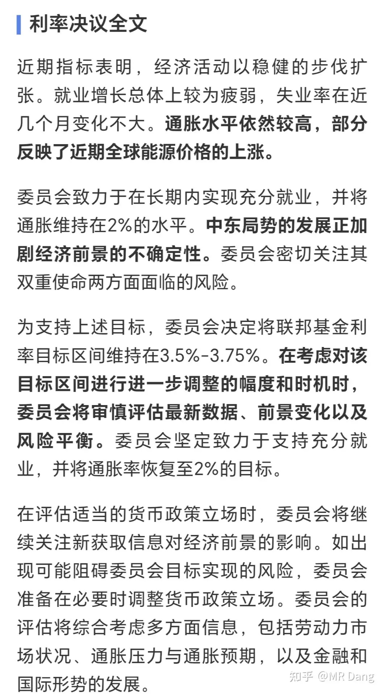

最后给出的基准利率区间保持不变，符合预期。

这里面有一个关键词是“进一步”。

就是第三段里的黑体字，“进一步调整”相关内容的表述，通常“进一步”的表述被视为暗示降息的措辞。

所以这次投票中，12票里有8票投了赞成，4票反对，4个反对票里，米兰是因为要降息，而另外3个人是反对把“进一步”写进声明，反对票创了30多年来新高。

鲍威尔还说了卸任后继续担任理事，这是在恶心懂王，意思你调查我，我就继续在这12个人里和你唱反调，你要是不调查我，我就自己走了。

这次议息虽然基本符合预期，但是因为投票的事，被普遍理解为偏向鹰派。

沃什的参议院投票也已13比11获得通过，之前反对的那个要退休的老小子被游说成功松口了，当然他的一项其他诉求也被满足了。

资本市场对释放的消息比较悲观，就先跌为敬了，鲍威尔又出来找补：

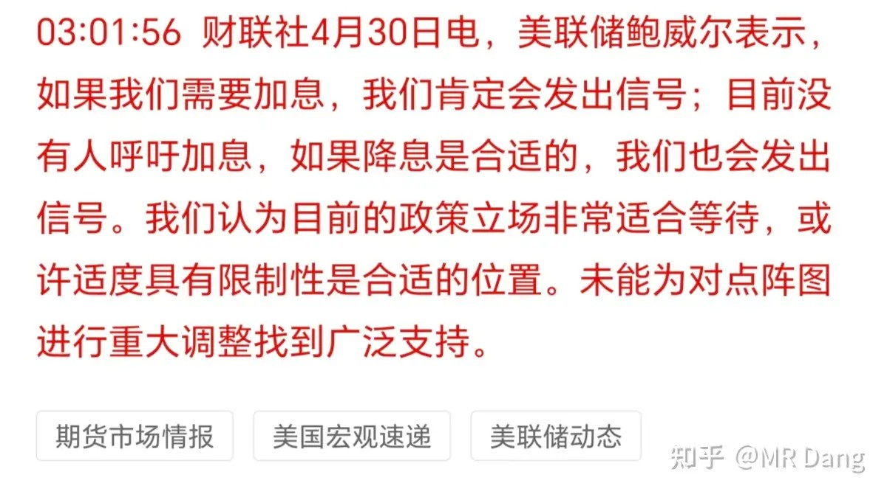

意思是要加息我会说，市场不要瞎猜。

EIA原油库存：

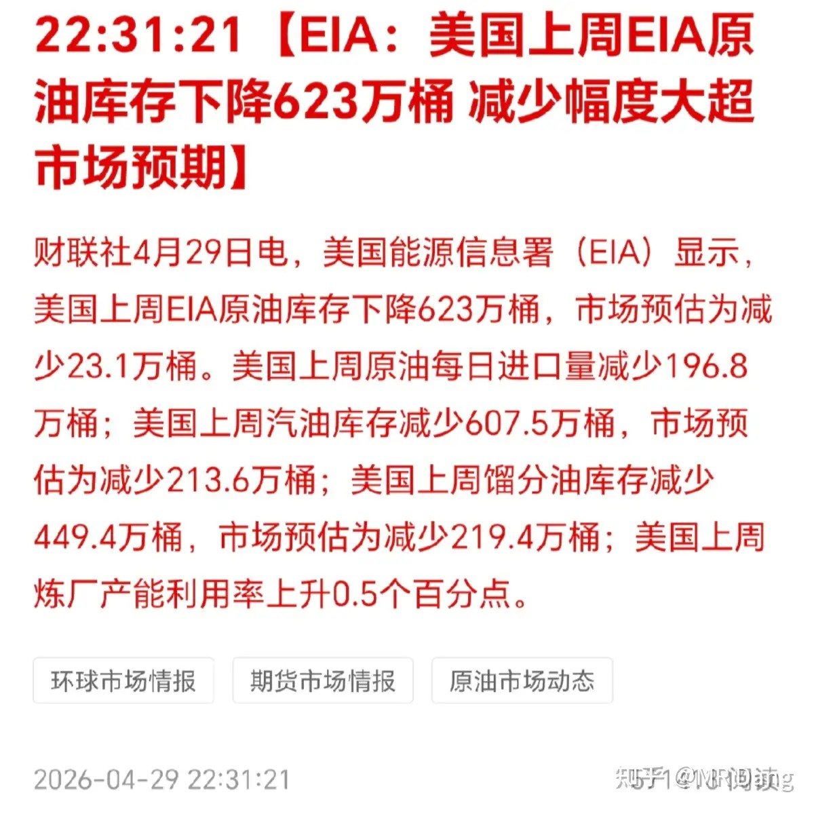

西大原油超预期减少，显示西大原油紧张加剧。

某家电龙头企业发布了2026一季报：

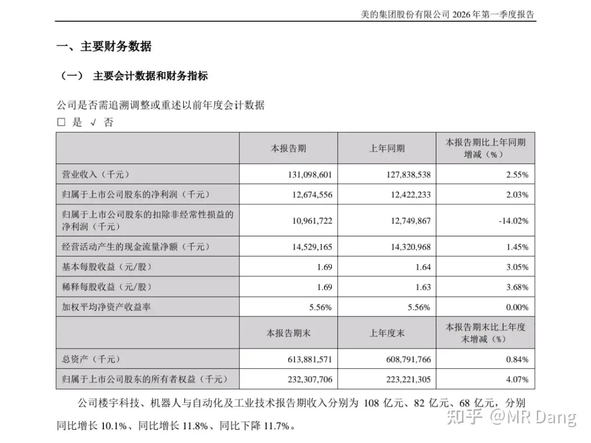

挺不错的，虽然汇兑损益影响了扣非，整体在高基数情况下能这样就很可以了。

另外还发了个公告：

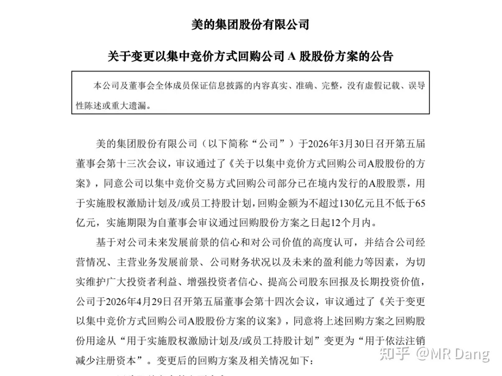

把之前回购的股份拿去注销，良心公司，希望资本市场有更多的企业进行学习。

宇宙第一行发布了2026年一季度业绩：

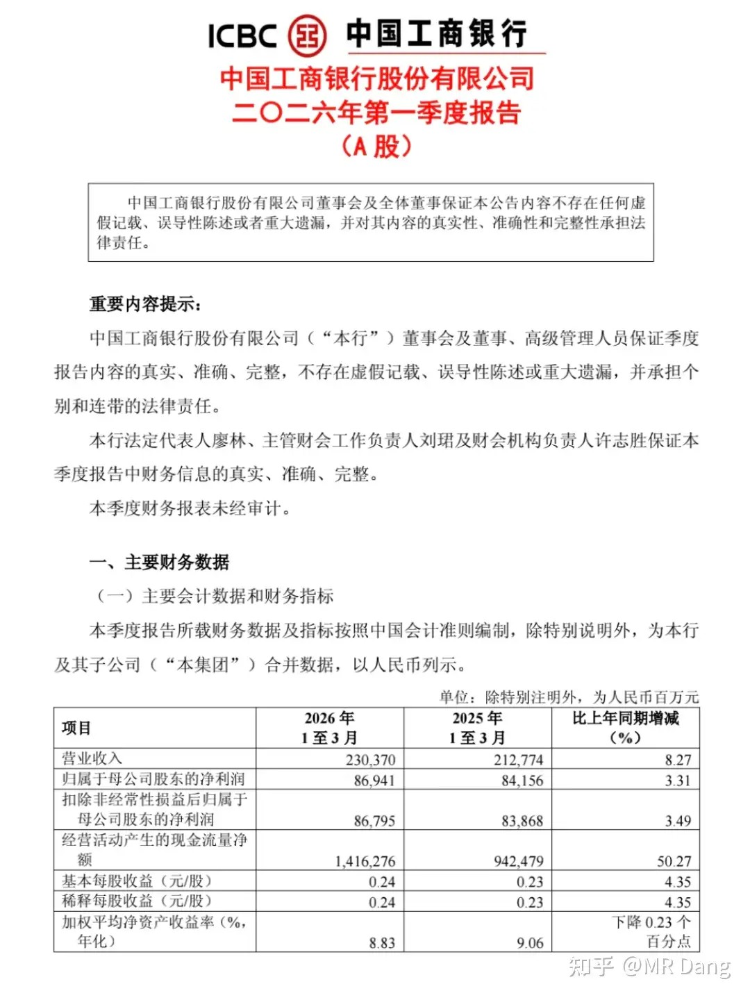

营收增长8％，归母增长3.3％。

太猛了，定海神针，大巧不工，这么大的体量还能这么稳。

另外几个大行也很猛，一个比一个亮眼，只剩赞叹了，宇宙行居然还是相对增速最低的那个。

四大行这么强就显得“好”银行的成色有点掉价啦，这个“好”的思想钢印不知道还要流传多久。

烂银行财报：

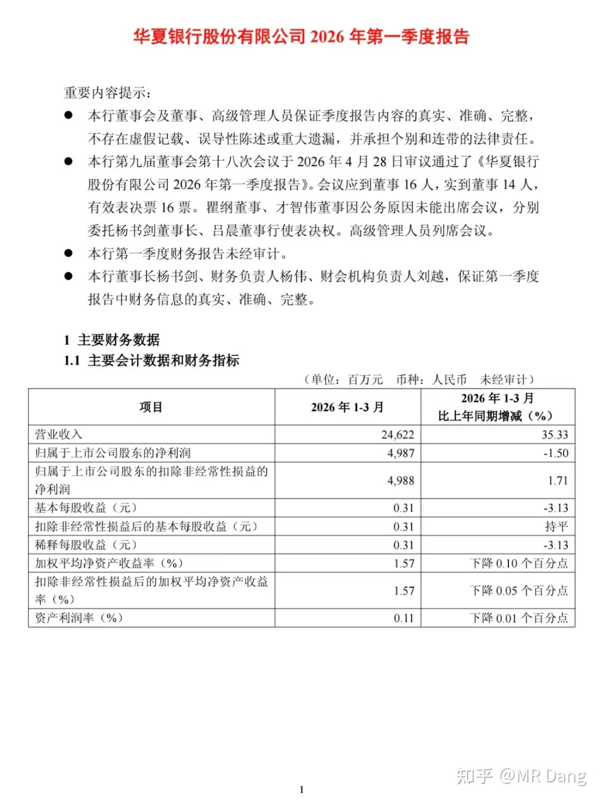

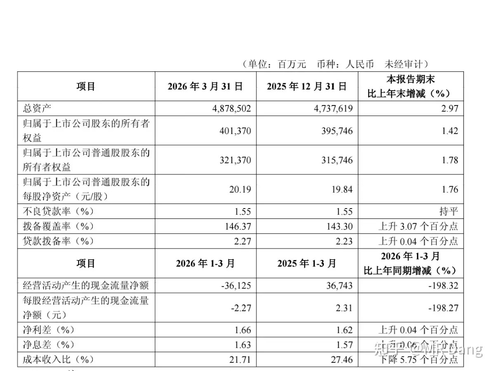

非常打脸的一份财报，几乎没一个数据在预期内。

首先是营收，增长35％，我以为看错了，反复检查了几遍，确实是35％。。。在银行里这属于很罕见的情况了，另一个同样罕见的是我们城市的银行。

当然这里有公允价值变动的因素在里面，不过即使把这个因素扣除，也是不错的。

其次是归母净利润，负1.5％，再次打脸。

接下来是净息差，环比改善6bp，又一次蒙圈了，仅次于三个高增速城商行。

拨备，提高了3个百分点，大行里唯一。

很难评价的一份财报，不过如果和好银行对标的话，除了归母净利润差点事，其他数据的边际改善都更明显。

新管理层的思路很不一样，开始夯实资产了，以后预测财报难度陡然提升了，需要跟上管理层的节奏。

至于二级市场表现就不好说了，息差率先企稳是事实，拨备上升是事实，归母负增长也是事实，就看市场更看好哪边了。

对我个人来说，没有特别的偏好，再好的银行，贵了也不喜欢，再烂的银行，便宜了都能考虑。

不管颜值如何，关了灯都一样，主要是价钱。

某啤酒企业发布了一季报：

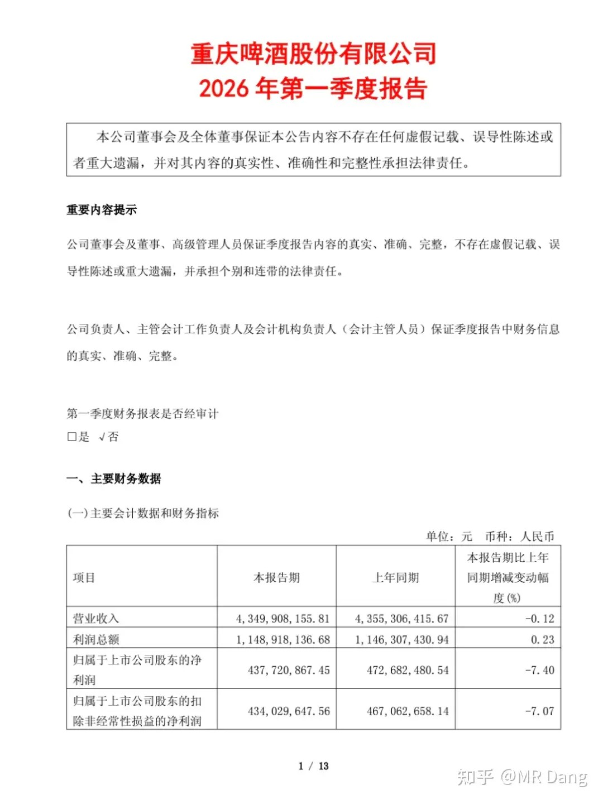

表现不佳，之前机构说一季度负8，我还想着说不定能好一点，现在只能说还是得相信机构对消费类的跟踪能力。

销售和管理费用增加的比较多，侵蚀了一部分利润，另外还有税收影响，抛去这些不谈的话，也能找补找补。

高端化还在发力，中端可能是度数太高，不符合现在审美。

高端化成了，那就还有未来，高端化如果成不了，也是个不错的烟蒂。

某明星半导体牛股：

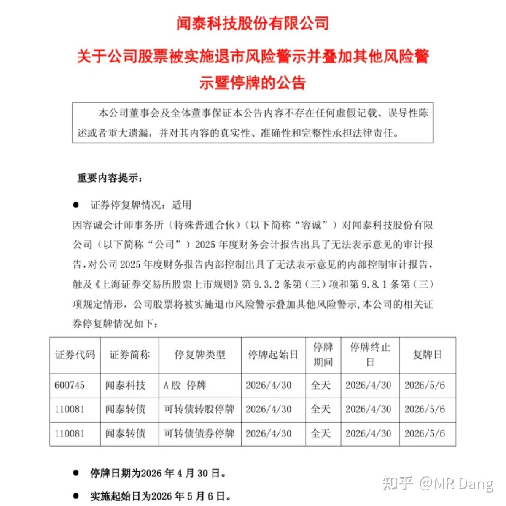

被出具了无法表示意见的审计报告，直接*st，并且关小黑屋一天，出来就是节后了。

对里面的投资者说就是灭顶之灾，深表同情。

无法表示意见的审计报告说人话就是可能连荷兰子公司大门都进不去。

大宗商品：

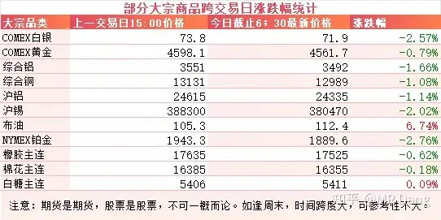

因为EIA数据，原油走强，涨幅近7个点。

又因为原油走强和美联储偏鹰派的立场，有色整体走弱。

白银和锡以及铂金等高弹性品种回调幅度较大，在两个点以上。

黄金和铜铝等在一个点左右。

农产品小幅震荡，幅度不大。

外围市场：

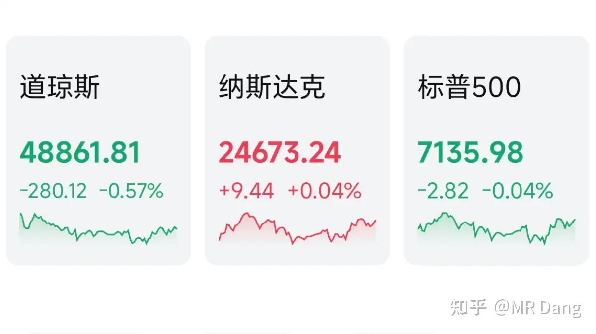

美三大股指涨跌不一，纳指微微红。闪迪，英特尔，希捷创新高，存储板块走强。

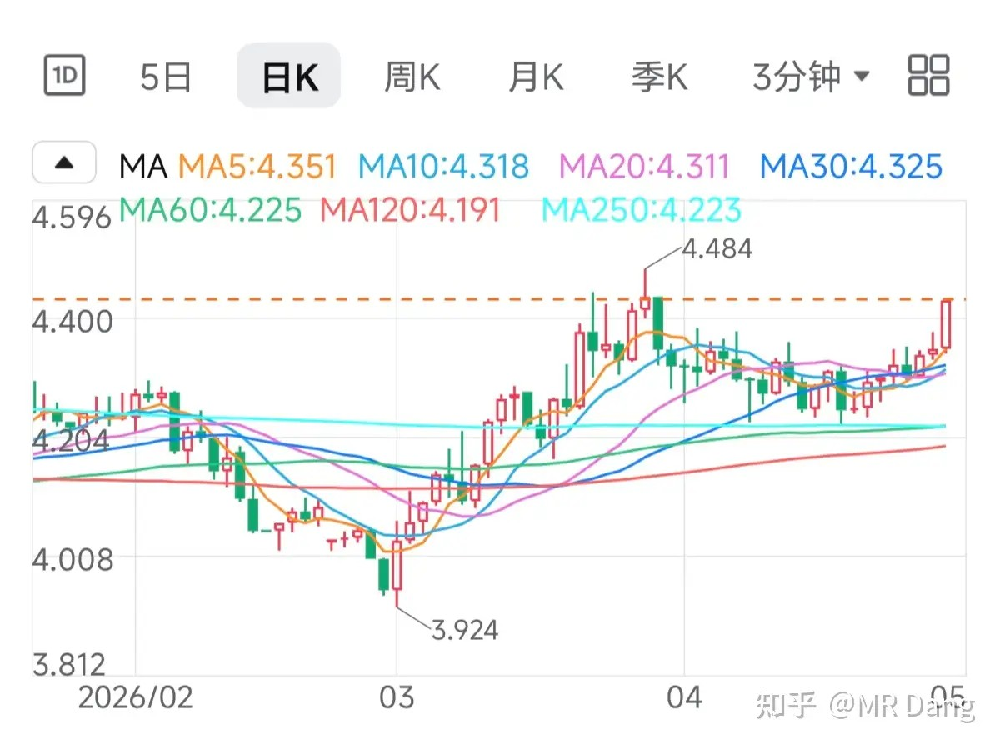

十年期国债收益率又提高了，提示风险。

昨天个人组合净值回血一个点，银行半个多点，资源两个半点，消费一个半，电网一个点，勉强跑赢指数。

非常满意，很超预期，要是能收盘了直接放假就好了，开心一个假期。

今天的话，比较特殊，本身情绪上承压。

同时也是节前最后一个交易日了，持股和持币可能面对的节后市场会是两重天。

我个人由于持仓结构的特殊性，没有这方面的困扰，但是很多和我不一样的投资者还是需要考虑其中的平衡的。

节后和节前，中间肯定不是连贯的，这之间外面要么出现利好，要么出现利空，作为投资者最好不要一厢情愿的去赌一个方向，而是为两边都留出余地，无论朝哪边波动都不至于太被动。

一个喜欢保护韭菜的博主，希望大家少少踩坑，多多赚钱！！！

> [!comment]- 点击展开评论
>
> | 用户 | 时间 | 内容 |
> | :--- | :--- | :--- |
> | 乌鱼子酱 | 14 小时前 | “不管颜值如何，关了灯都一样，主要是价钱。”拒绝苦难娱乐化，拒绝炒股色情化 |
> | &nbsp;&nbsp;&nbsp;&nbsp;啦啦啦 | 13 小时前 | 这和色情有什么关系 |
> | &nbsp;&nbsp;&nbsp;&nbsp;加州旅馆 | 11 小时前 | 老师，青海的湖今天出了季报，点评一下吧 |
> | 大苏 | 9 小时前 | 感谢宏桥和重啤 让我对知乎大V去魅了 |
> | yyyyzz | 12 小时前 | 绿桥是买过最差的一只股 |
> | 尘世中的修行 | 10 小时前 | 大佬，既然认可了你的观点也跟了，自负盈亏没什么，都正常，但是希望的是大佬如果不看好了，卖出的时候能不能给说一声，最起码对你信任你的粉丝有个交待，也算有始有终！不担心跟错，毕竟认可大佬的认知！担心的是被甩了还不知道及时止损的情况 |
> | 江澈 | 11 小时前 | 绿桥割肉了，最后悔的一支股，下跌无止境 |
> | 在下狐诌子 | 12 小时前 | 哈哈，绿桥已经破了3800的地点 |
> | &nbsp;&nbsp;&nbsp;&nbsp;yyyy | 12 小时前 | 被坑死了 |
> | 小特 | 11 小时前 | 认识党佬太迟，前期的肉是一点没吃上，后面上了的绿桥和啤酒一直亏 |
> | 曹星星帮主 | 13 小时前 | 宏桥水下20个点，中铝水下19个点 |
> | 钱包鼓鼓 | 13 小时前 | 每日打卡第45天美联储议息维持利率不变但4票反对创30年新高，被市场解读为偏鹰派，十年期美债收益率继续走高需警惕风险。西大原油超预期减少，显示西大原油紧张加剧。四大行一季报稳如磐石，宇宙行工商营收增8%归母增3.3%。招商与之对比较逊色。华夏虽然财报打脸，但又比招商边际改善明显，银行股好坏都看价钱，好公司不一定是好价格。美的回购注销回馈股东值得点赞。重庆一季报不及预期高端化是唯一出路，消费复苏没那么快别急抄底闻泰被出具无法表示意见审计报告直接ST节前最后一天别赌方向，为多空两边都留余地 |
> | Dsoul | 6 小时前 | 好银行6月分红除权后股息恐来到5.5%以上，那我还买鸡毛华夏 |

---

*本文件从MR Dang知乎页面转载*

---

**作者**: MR Dang
**链接**: https://www.zhihu.com/question/2032029575899763008/answer/2033087510625117044
**来源**: 知乎

*著作权归作者所有。商业转载请联系作者获得授权，非商业转载请注明出处。*

## 相关阅读

**每日行情评价系列：**
- [[20260429-如何评价2026年4月29日A股行情？|4月29日行情]] - 非洲零关税、原材料成本、聚酯纤维和财报季风险。
- [[20260428-如何评价2026年4月28日A股行情？|4月28日行情]] - 工业增加值、化纤修复、有色和电子设备制造业绩线索。
- [[20260427-如何评价2026年4月27日A股行情？|4月27日行情]] - DeepseekV4、昇腾适配、交易规则变化和有色波动。
- [[20260424-如何评价2026年4月24日A股行情？|4月24日行情]] - 审计赔偿、铝企一季报和财报风险控制。
- [[20260423-对于2026年4月23日A股市场行情，大家有什么预测和看法？|4月23日行情]] - 碳达峰、算力能效和工业耦合方向的政策线索。
- [[20260422-对于2026年4月22日A股市场行情，大家有什么预测和看法？|4月22日行情]] - 利率表态、通胀框架和市场敏感点的拆解。
- [[20260421-如何评价2026年4月21日A股行情？|4月21日行情]] - 厄尔尼诺、用电数据与一季报波动。

**利率、原油与宏观节奏：**
- [[20260422-对于2026年4月22日A股市场行情，大家有什么预测和看法？|利率表态]] - 和这篇的美联储议息、鹰鸽分歧放在一起看更完整。
- [[20260429-如何评价2026年4月29日A股行情？|原油与通胀]] - 阿联酋退出欧佩克、原油供给和通胀压力的前一日背景。
- [[20260420-这么看待4月20日的A股行情？|4月20日行情]] - 伊朗局势、油价波动和假期前风险偏好。
- [[20251024-怎么全面的分析一支股票？|系统分析框架]] - 把宏观、行业、公司和市场预期放在同一张图里看。

**财报、银行与风险控制：**
- [[20260404-如何分步骤快速看懂上市公司年报？|看懂年报]] - 年报和季报的阅读路径与重点抓取。
- [[20260401-读懂财报，看清基本面|读懂财报]] - 用基本面框架理解利润、拨备、现金流和估值预期。
- [[20251031-你是怎么计算股息率的？ 关注股息率的哪些点？|股息率计算]] - 银行和红利资产绕不开股息率口径。
- [[20251207-《地阶功法卷七》分红的可持续性与净利润的关系|分红持续性]] - 判断利润、现金流和分红能力是否匹配。
- [[20251029-新手投资者避坑指南之不要赌财报|不要赌财报]] - 业绩披露期和节前窗口，尤其适合回看风险控制。
