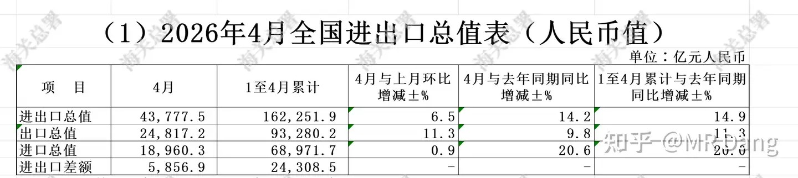
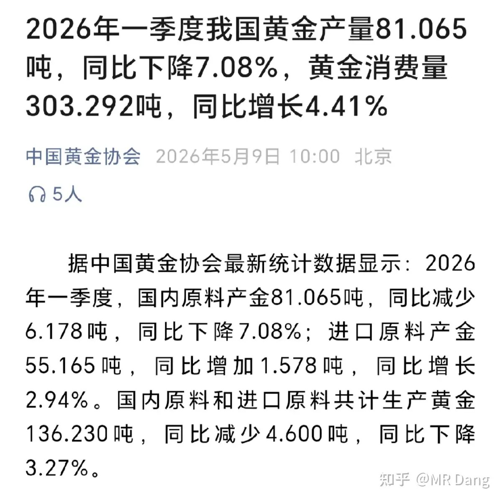
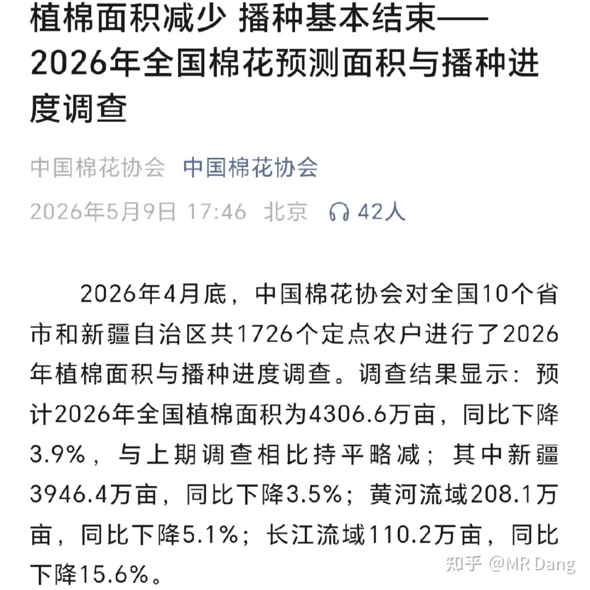
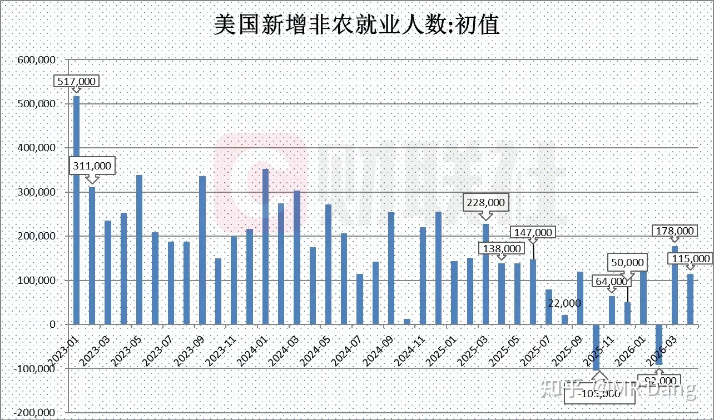
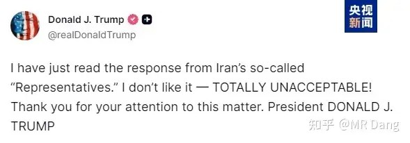
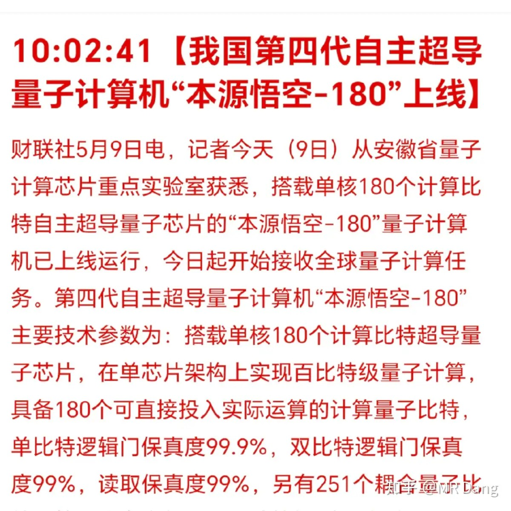
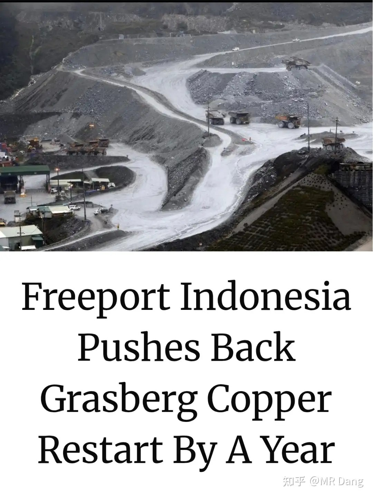
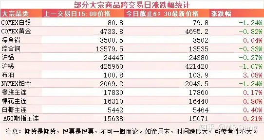
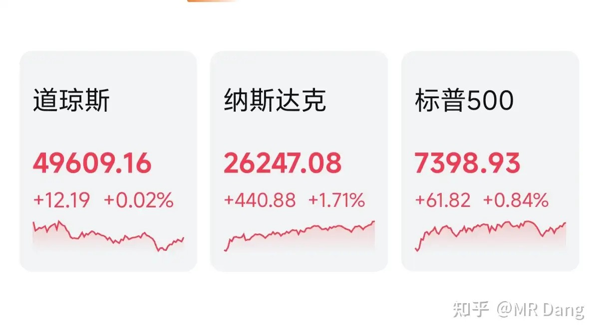

# 怎么看待2026年5月11日A股股市行情？

---

**发布时间**: 2026-05-11 07:31  |  **原文链接**: https://www.zhihu.com/question/2036095366660092489/answer/2037072285589321261  |  **点赞数**: 292 人赞同

**作者信息**: MR Dang​​知势榜经济与管理领域影响力榜答主

---

## 正文内容

海关总署公布了4月外贸数据：

进口单月环比增加0.9%，同比增长20.6%。

出口单月环比增长11.3%，同比增长9.8%。

很漂亮的一组数据，进出口数据都大幅高于预期，显示了强劲的经济活力，和之前汇率的走势也很好的吻合了。

出口结构上，传统行业的比重在下降，而半导体，汽车，稀土，肥料，船舶等附加值高的产品比重在上升，也显示出了咱们产业升级的成果。

进口结构上，大家最关注的原油每天进口920万桶左右，和正常情况下的进口数据有大概200多万桶的一个缺口。

黄金业：中国黄金协会发布了一季度数据

总产量136.23吨，减少4.6吨，同比下降3.27％。

产量降低的原因主要是安全检查和停产检修。

黄金消费量303吨多，整体是增加了，但是首饰金只有84吨，同比下降37％，投资金条202吨，同比增加46％。剩下的是工业用金。

黄金税收改革后，黄金首饰已经是纯奢侈消费品了，投资金更加亲民，基本上一些珠宝商的业绩也反应了这种趋势。

棉花业：

棉花协会发布了最新的植棉面积数据，4306.6万亩，之前市场预期今年的植棉面积在4100万亩左右。

这种超预期的供应可能对棉花价格形成压制。

西大公布了一份超预期的非农就业数据：

4月新增非农11.5万人，超过预期的6.2万人。

按道理来说，就业数据超预期，意味着美联储会更加关心通胀压力，减少降息预期，增加金银等贵金属的持有成本，对金银等属于利空。

伊美日常口水仗：

懂王称伊朗的回应完全不可接受。

上周新的《矿产资源法实施条例（草案）》审议通过，其中外界比较关注的锂钴镍铜铝等都被列入了36种战略金属，实行“准牌照”式管理。

条例特别强调了矿产资源安全。

这其中锂是比较特殊的一个，从伴生矿的地位变成了独立矿种，审批权限全部上收，品味高于一定数值的氧化锂必须按照锂矿办理，严格办证，不能再打别的擦边球（比如瓷土矿）。

这里的这个一定数值，按照以前的实践，是0.4％，但是目前没有白纸黑字的定论。

如果是0.4％的话，很多矿区的矿复产就遥遥无期了（比如宜春地区的），锂的供应端以后会收到更严格的管控。

锂的价格现在分歧很大，高盛之前看空理的研报广为流传，对今年下半年的锂价看淡。

那进了这36个战略金属目录，还有什么其他变化呢？

收储。

很多基本金属其实是有战略储备的，但是小金属的战略储备就没那么多，这一块相当于凭空多出来一部分需求，再加上小金属本身价格弹性就高，所以可能会对小金属价格形成一定支撑。

至于对企业的影响，增加了合规成本，企业就会面临成本压力，中小企业可能会出清加速，大企业抵抗风险能力更强。

量子计算机：

本源悟空——180这个名字，本源是厂商名，目前还没上市，正准备上。

后面的180代表单核180个量子比特。

国内的另一家企业的天衍——200也是同理，200代表了200个量子比特的参数。

仅看保真度，单比特逻辑门保真度已经算处于领先集团了，双比特逻辑门保真度距离谷歌和IBM差距还有点大。

上周五铜产业有一条消息刷屏：

Freeport宣布把Grasberg铜矿原定于2027年初的复产期限推迟到了2028年初，整整推迟一年。

这个铜矿可不是什么小角色，之前每年产能85万吨，位列全球第二，占全球供应的3.5％。

去年九月份的时候发生了泥浆事故，7名工人丧生，核心区域被严重破坏。

公司一直在试图恢复以前的产能。

截至目前30％的产能已经恢复，20％的产能正在恢复，计划今年下半年恢复。剩下50％的产能原来计划明年初的，现在跳票到2028年了。

这条消息出来后等于是直接砍掉了明年40万吨的供应预期，相当于全球总供应的1.5％左右，所以铜的期货价格包括铜的股票在盘中都有异动。

大宗商品：

受到伊美口水仗的影响，原油较上个交易日上涨3个点，有色类回调，幅度不大。

农产品有小幅度上涨，其中白糖一段时间以来表现较好。

外围市场：

上周五美三大股指收涨，纳指领涨，存储板块走势强劲，美光闪迪创新高。

另外其他明星科技股高通英伟达AMD等也创新高。

与之相对应的是中概股整体收跌。

上个交易日个人组合净值回血半个点，银行微红，资源半个，消费半个，算电两个。

还行吧，没有任何不知足，红的再少也是红。

今天盘前看到科技的热度，说不得又是泥塘里打滚的一天。

本周前瞻：

1，今天公布4月cpi，预期1％左右。

2，周二公布西大4月cpi，预期3.8％左右。

3，周四公布西大周初请失业金人数。

4，周五公布咱们这边的用电量数据。

5，本月存在懂王过来走红毯的可能，不过目前没有官方权威确认。

流传出的最新预测依据是西大的C17大飞机已经降落，可能是提前运送一些物资的。

6，沃什本周五上任，下个月的中旬是他的政策首秀，这哥们目前是金银克星，一张嘴黄金就下跌。

他的主要观点还有Ai可以提高生产效率，压低通胀。

而主流投行认为Ai让电子元器件涨价，从而拉高通胀。

一个喜欢保护韭菜的博主，希望大家少少踩坑，多多赚钱！！！

> [!comment]- 点击展开评论
>
> | 用户 | 时间 | 内容 |
> | :--- | :--- | :--- |
> | 我是一颗桃子吖 | 3 小时前 | 没招了哈哈，重仓老登股，绿了四天 |
> | &nbsp;&nbsp;&nbsp;&nbsp;小懒知行录 | 12 分钟前 | 重仓老登股今年还是绿的 |
> | 钱包鼓鼓 | 4 小时前 | 每日打卡第49天4月外贸数据大超预期，出口环比涨11.3%进口同比涨20.6%，出口结构转向半导体汽车稀土船舶等高端制造，产业升级信号明确黄金消费严重分化，首饰金同比暴跌37%投资金条暴增46%，税改后黄金首饰成奢侈品，老百姓转向买金条存钱植棉面积超市场预期200多万亩，棉花价格大概率承压。美国非农超预期加金银克星沃什周五上任，黄金白银短期承压，降息预期进一步缩减36种战略金属目录落地，锂从伴生矿变独立矿种审批权限上收，宜春矿区复产遥遥无期，小金属收储带来额外需求支撑全球第二大铜矿Grasberg复产推迟到2028年，直接砍掉明年40万吨供应预期，铜价盘中异动，供应收缩逻辑强化 |
> | 我是一颗桃子吖 | 3 小时前 | 送出一个礼物～ |
> | &nbsp;&nbsp;&nbsp;&nbsp;MR Dang | 3 小时前 | 谢谢 |
> | 在下狐诌子 | 2 小时前 | 绿桥打卡，今天依然是泪桥，维持了别人大涨我小涨，别人小跌我暴跌的优良传统 |
> | 轻风微微来 | 4 小时前 | 人越来越少了 |
> | 欣欣 | 2 小时前 | 铝还有出路吗？兄弟 |
> | &nbsp;&nbsp;&nbsp;&nbsp;在下狐诌子 | 2 小时前 | have bro have |
> | &nbsp;&nbsp;&nbsp;&nbsp;华子 | 27 分钟前 | 有的，有的，兄弟。 |
> | 薛定谔的猫 | 2 小时前 | D家军在绿桥集合，把绿桥价格给打上去，今天必定翻红！ |
> | 小虎新知 | 4 小时前 | 科技登太猛了 |
> | Hypnoszzz | 4 小时前 | 早经济形势数据上一片大好，但是个人体感上却 |
> | 南辰 | 4 小时前 | 没懂，这是利好锂矿股吗？有没有懂哥说一下 |
> | &nbsp;&nbsp;&nbsp;&nbsp;药不能停 | 3 小时前 | 锂矿都涨了多少了，高位利好就是利空 |
> | &nbsp;&nbsp;&nbsp;&nbsp;大大将军 | 2 小时前 | 逆天了 |

---

*本文件从MR Dang知乎页面转载*

---

**作者**: MR Dang
**链接**: https://www.zhihu.com/question/2036095366660092489/answer/2037072285589321261
**来源**: 知乎

*著作权归作者所有。商业转载请联系作者获得授权，非商业转载请注明出处。*

## 相关阅读

**每日行情评价系列：**
- [[20260508-如何评价2026年5月8日A股行情？|5月8日行情]] - 央行买金、人民币汇率、原油和电解铝库存的前一交易日背景。
- [[20260507-如何评价2026年5月7日A股行情？|5月7日行情]] - 美伊停火传闻、原油与有色、AI算力和追涨风险。
- [[20260506-如何评价2026年5月6日A股行情？|5月6日行情]] - 节后开盘、算电协同、伊朗局势和假期变量梳理。
- [[20260430-如何评价2026年4月30日A股行情？|4月30日行情]] - 美联储议息、原油库存、银行财报和节前风险控制。
- [[20260429-如何评价2026年4月29日A股行情？|4月29日行情]] - 非洲零关税、原材料成本、聚酯纤维和财报季风险。
- [[20260428-如何评价2026年4月28日A股行情？|4月28日行情]] - 工业增加值、化纤修复、有色和电子设备制造业绩线索。

**黄金、战略金属与资源线索：**
- [[20260422-紫金矿业一季报实现净利润 200.79 亿元，同比大幅增长 97.50%，如何解读「矿茅」的Q1财报|紫金财报]] - 对照黄金、铜价和资源股盈利兑现。
- [[20260508-如何评价2026年5月8日A股行情？|黄金与汇率]] - 央行买金、投资金条和汇率变化可以连起来看。
- [[20260427-如何评价2026年4月27日A股行情？|有色与科技]] - 有色波动、AI叙事和市场风格切换的前序观察。

**财报、估值与风险控制：**
- [[20260404-如何分步骤快速看懂上市公司年报？|看懂年报]] - 用财报框架拆解金属、银行和科技企业的基本面。
- [[20260401-读懂财报，看清基本面|读懂财报]] - 把外贸、价格、供给和利润落回基本面。
- [[20260424-如何评价2026年4月24日A股行情？|财报风险控制]] - 财报季、审计赔偿和仓位控制可以配合回看。
