# 怎么看待2026年5月12日A股行情？

---

**发布时间**: 2026-05-12 07:20  |  **原文链接**: https://www.zhihu.com/question/2036089013782713360/answer/2037431830387897866  |  **点赞数**: 454 人赞同

**作者信息**: MR Dang​​知势榜经济与管理领域影响力榜答主

---

## 正文内容

今天的头条是懂王访问已经官宣（其实是在昨天开盘前宣布的）：

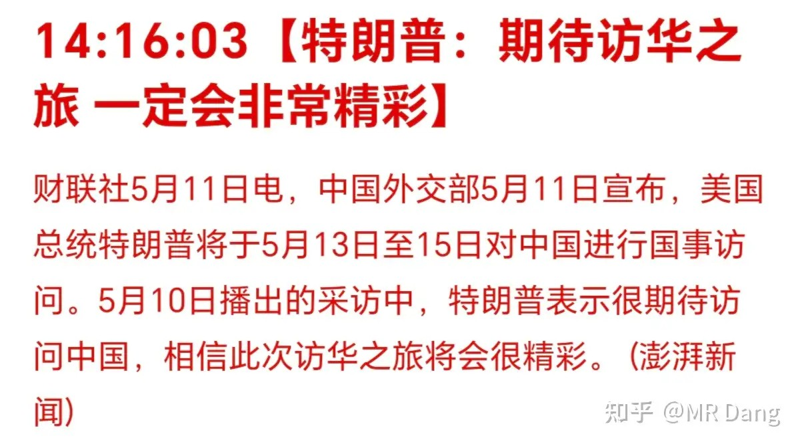

时间是5月13日到15日。

懂王以前是个商人，两边现在虽偶有不快，但西大依然是咱们贸易顺差的最大来源国。

2017年第一次来的时候懂王带的是波音，高盛，通用电气，雪佛兰，微软等，最后谈成了2535亿美元的订单。

这次据报道，受到邀请的企业有英伟达，苹果，高通，波音，埃克森美孚，黑石等，但是能谈成多少订单就不好说了。

毕竟懂王的信誉实在让人不敢恭维啊。

乐观点分析的话：

大豆咱们一季度自美进口数量340万吨，同比减少7成，以前全年都是3000多万吨，这块可能会是对面的核心诉求之一。

类似的农产品还有玉米，高粱，棉花，小麦等。

肉类的话就主要是猪肉，牛肉。

除了农产品领域，还有大飞机，医疗器械等，都是可能提出的领域。

如果谈成了，相当于增加供应，对这些商品的价格就会造成一定影响，相关国内企业的竞争压力会大一点，算是小利空。

相反的，稀土是那边有需求的东西，如果谈成了，对稀土是利好。

站在咱们的立场，想增加出口的商品有电车，锂电，家用电器，光伏等。

材料类的话，就是钢铁和铝，目前西大对咱们的铝有50％关税，希望咱们限产。

如果能谈出什么结果的话，对这些行业都算小利好。

另外还有一些对美国客户依赖度高的行业，像创新药，跨境电商，对两边的关系都比较敏感，如果有蜜月期的时候表现就会好一些。

不过以上这些都不是资本市场关注的重点，目前的热度都在半导体，这块儿才是聚光灯下的宠儿。

统计局公布了4月的CPI：同比增长1.2%小超预期

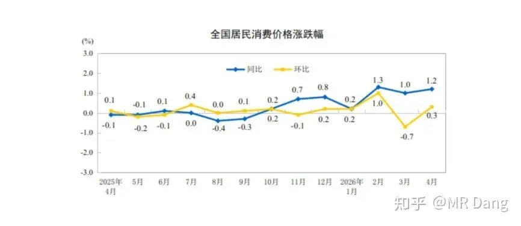

具体到商品结构上：

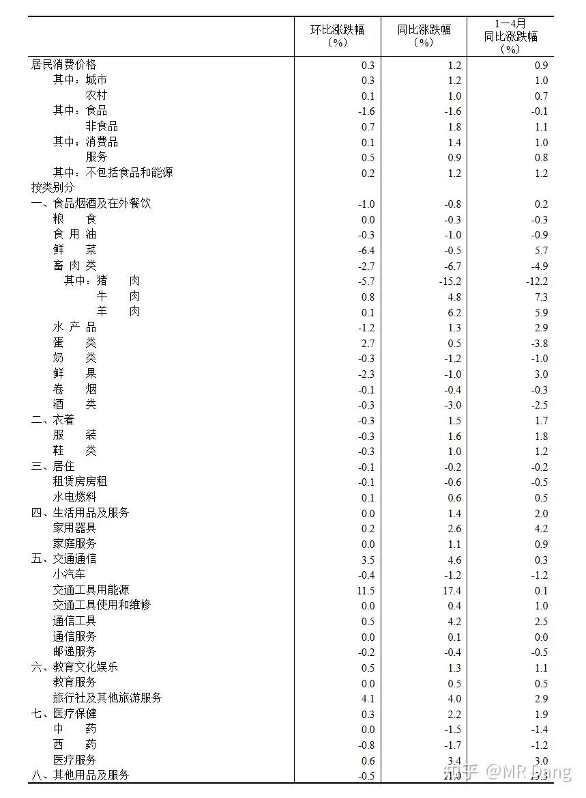

数据比较好看的只有蛋类和能源，其他消费品的环比数据都一般，显示出消费端还是有点不理想，消费板块还是挺难的。

4月PPI同比增长2.8%，小超预期。

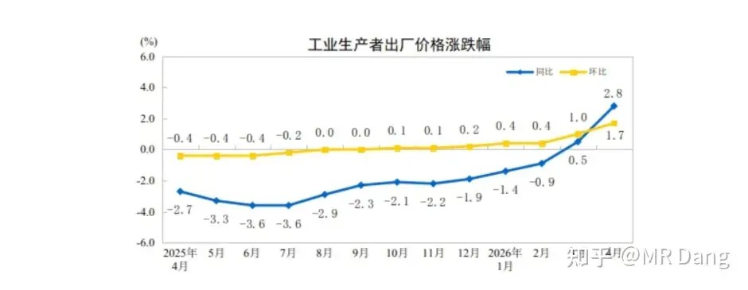

行业上：

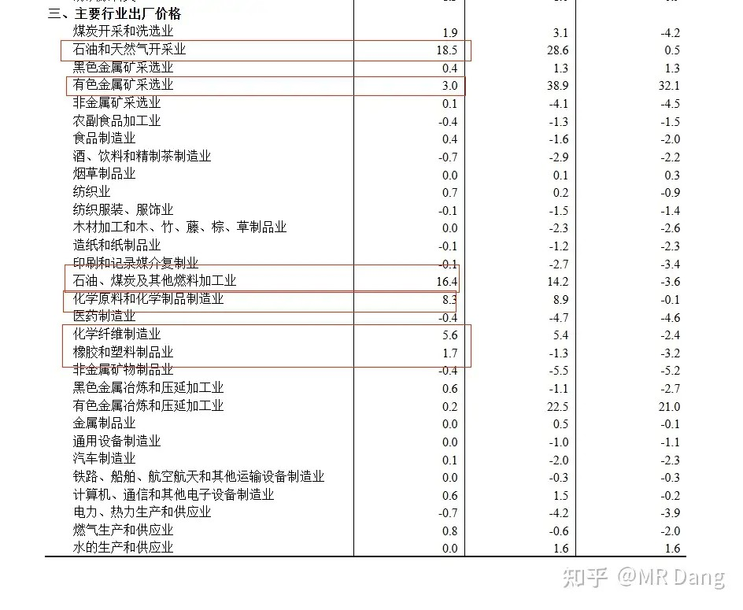

环比增长的以石油，化纤，化学原料，橡胶，塑料，有色等行业为主。

仅以统计局数据来看，CPI和PPI两端都受石油的影响比较大，属于结构性的输入通胀。

而良性一点的通胀应该是收入推动的，整体消费品价格的回升，目前距离这个点还任重而道远。

什么时候不算这些输入的能到2％，就说明整个消费好起来了，那个时候消费板块大概就能支愣起来了。

两融余额突破2.8万亿：

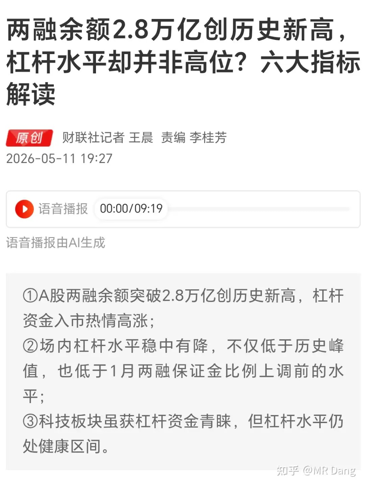

两融里融资是大头，融券是小部分。

经历过上次杠杆牛熊的老股民应该对这个都心有余悸。

现在杠杆资金都在跑步入场科技板块。

融资是把双刃剑，每次牛市里都有融资成就的暴富神话，当熊市来临的时候，融资也是最锋利的快刀。

央行发布了一季度的货币政策报告：

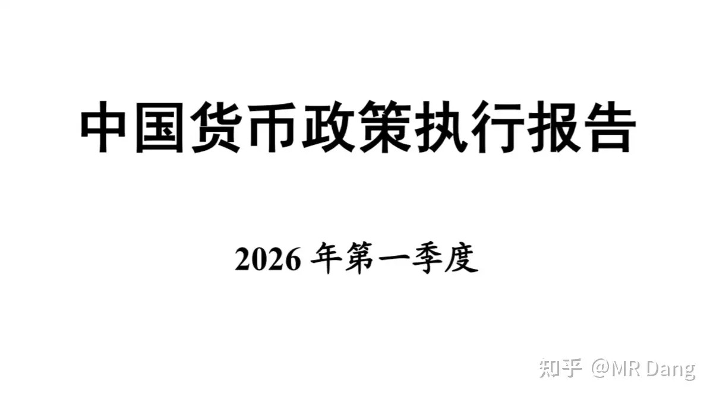

我比较关注的是有关银行业的表述：

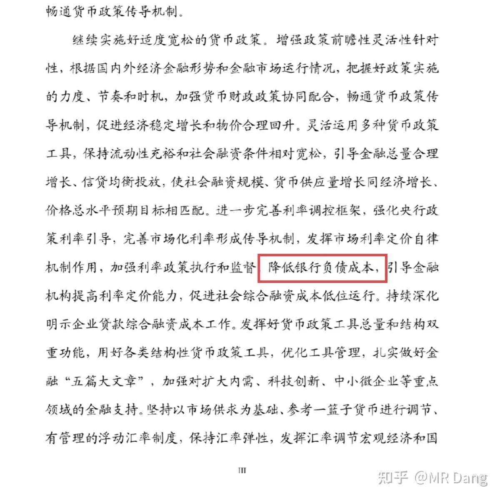

降低银行负债成本，这一句在去年Q4的报告里就有，但是后面一句“引导金融机构提高利率定价能力”，这个是今年Q1新增加的表述，整个一大段，只有这句话是新增加的。

我个人的理解是，如果金融机构提高了利率定价能力，总不能把净息差往下引导吧。

秘鲁发布能源危机紧急法令：

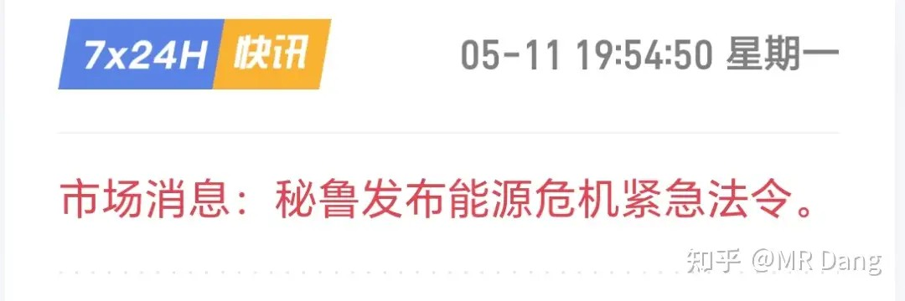

该法令是去年公布的紧急法令升级版，因为该国最大的炼厂持续亏损，发电量已经无法满足需要。

秘鲁把用电优先度划分成了5档，一档居民，二档交通，三档电信，四档商业，五档矿业等工业，前四档保证100％到60％的用电需求，最后一档的矿业剩多少供应多少，没剩就暂停。

这种紧急状况要维持90天，会对有色金属的供应端造成不小的扰动，因为秘鲁是有色资源大国。

秘鲁拥有接近全球22％的白银储量和18.5％的白银产量，全球第一，是影响最大的品种。

同时拥有10％的铜储量和12％的铜产量，全球第三，是影响次一点的品种。

和铜类似的还有锌，8.7％的储量占比和11.6％的产量占比，影响也不小。

锡和钼的产量占比也在10％以上。

铅和金也各有几个点的占比。

综合考虑，影响大小排序为：

银＞铜和锌＞锡和钼＞铅＞金

个别中资企业也在秘鲁拥有铜矿，可能也会有一定影响。

和秘鲁这样，对外石油依赖度高，电力能源基础建设薄弱，同时矿业还比较发达的国家还有南非（影响铂金），澳大利亚（影响锂和铁矿石），智利（影响铜）等。

一旦这三个国家中任意一个布了秘鲁的后尘，整个有色金属的价格都会受到很大的冲击。

大宗商品：

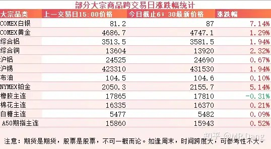

受上述秘鲁能源危机影响，有色整体走强，高弹性的白银领涨7个点，铂金5个点。

金铜铝锡等涨幅都有一两个点。

外围市场：

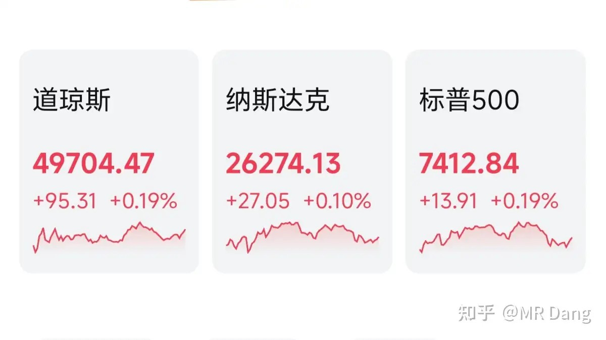

美三大股指收涨，道指领涨，板块风格上以白银为领头羊，存储也有不错的表现。

昨天个人组合净值微幅回撤，银行微绿，资源绿1个半，消费红半个，算电红1个半。

体验不太好，又是充当流动性血包的一天。

不患寡而患不均，这个时候亏不到哪里去，但是看着科技天天吃肉对投资者来说也是一种精神诱惑。

今天的话，有色商品表现强势，白银又当起了带头大哥，希望能回口血。

一个喜欢保护韭菜的博主，希望大家少少踩坑，多多赚钱！！！

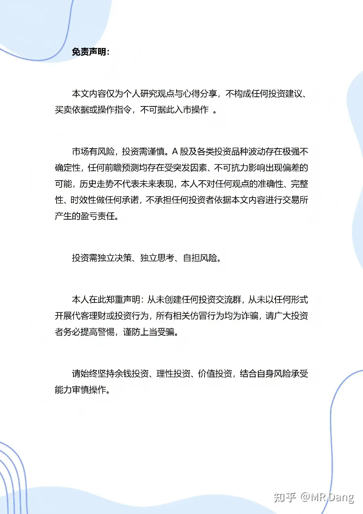

> [!comment]- 点击展开评论
>
> | 用户 | 时间 | 内容 |
> | :--- | :--- | :--- |
> | 如来熊掌 |  | 股票一天波动大几千，出门算开车公交电动车哪个划算 |
> | &nbsp;&nbsp;&nbsp;&nbsp;MR Dang |  | 哈哈，一样的 |
> | &nbsp;&nbsp;&nbsp;&nbsp;十六 | 22 小时前 | 佬的单位是万…… |
> | &nbsp;&nbsp;&nbsp;&nbsp;秋秋 | 21 小时前 | 天天盯着余额宝看生了几毛息，股票跌几千不看 |
> | 钱包鼓鼓 |  | 每日打卡第50天关注谈判，若农产品增加供给是利空国内相关企业，稀土是利好4月CPI同比1.2%超预期但消费端仍疲软，PPI同比2.8%也超预期但靠石油推着走，属于结构性输入型通胀，离消费真正复苏还远两融余额突码2.8万亿，杠杆资金跑步入场科技板块。经历过2015年杠杆牛的都知道这是双刃剑秘鲁能源危机引发全球有色供应担忧。白银影响最大（全球22%储量+18.5%产量），铜锌次之。南非、澳大利亚、智利有类似风险央行一季度货币政策新增引导金融机构提高利率定价能力表述，银行净息差有望改善 |
> | 到饭点了 | 23 小时前 | 为啥不做市场主线为了那点股息抗接近腰斩的跌幅真的值吗，时间成本也是成本呀 |
> | learner |  | 珍惜每一次紫金和宏桥上涨减仓的机会 |
> | &nbsp;&nbsp;&nbsp;&nbsp;不想丸辣 |  | 紫金今年废了 |
> | &nbsp;&nbsp;&nbsp;&nbsp;秋秋 | 21 小时前 | 我被套 |
> | &nbsp;&nbsp;&nbsp;&nbsp;pete | 19 小时前 | 紫金不可能废的，hq才有可能 |
> | 喀什噶尔的思念 | 14 小时前 | 问一下 这个Dang是不是21-22年喊大家买中概互联的那批人？ |
> | 薛定谔的猫 | 23 小时前 | D家军补仓终于把绿桥给打上去了，翻红啦！ |
> | 拜托了狒狒 |  | 嘿嘿，d大，我可能要当爸爸了 |
> | &nbsp;&nbsp;&nbsp;&nbsp;MR Dang |  | 哈哈，恭喜，千金还是。。 |
> | &nbsp;&nbsp;&nbsp;&nbsp;拜托了狒狒 |  | 十个月以后知道 |
> | &nbsp;&nbsp;&nbsp;&nbsp;MR Dang |  | 这么着急 |
> | &nbsp;&nbsp;&nbsp;&nbsp;安迪 |  | 让他成为股二代，从小培养价值投资 |
> | &nbsp;&nbsp;&nbsp;&nbsp;机械之道 |  | 每年压岁钱拿去买银行，等成年把这个账户转过去 |
> | 斯兮 |  | 直接在评论区等看绿桥 |
> | 感受世界的善意 | 20 小时前 | 生活中最喜欢绿色，自从炒股后，对绿色有种纠结的心态 |
> | &nbsp;&nbsp;&nbsp;&nbsp;感受世界的善意 | 18 小时前 | 还得是中国红 |
> | &nbsp;&nbsp;&nbsp;&nbsp;机械之道 | 19 小时前 | 给证监会写信建议接轨国际绿涨红跌吧，我也觉得难受 |
> | 胖啦虎不咬人 |  | 这兄弟也是圈不逢时，刚开圈就股灾。 |
> | &nbsp;&nbsp;&nbsp;&nbsp;一米阳光 |  | 并没有股灾，指数都创新高了。只是没有猜中板块而已。 |
> | &nbsp;&nbsp;&nbsp;&nbsp;江左镇乡绅 |  | 有没有可能就是在最火的时候开圈 |

---

*本文件从MR Dang知乎页面转载*

---

**作者**: MR Dang
**链接**: https://www.zhihu.com/question/2036089013782713360/answer/2037431830387897866
**来源**: 知乎

*著作权归作者所有。商业转载请联系作者获得授权，非商业转载请注明出处。*

## 相关阅读

**每日行情评价系列：**
- [[20260513-如何评价2026年5月13日A股行情？|5月13日行情]] - 懂王落地、美国CPI、沃什上任和金银深V的后续观察。
- [[20260511-怎么看待2026年5月11日A股股市行情？|5月11日行情]] - 外贸数据、战略金属目录、铜矿复产推迟和科技热度。
- [[20260508-如何评价2026年5月8日A股行情？|5月8日行情]] - 央行买金、汇率升值、原油和电解铝库存。
- [[20260507-如何评价2026年5月7日A股行情？|5月7日行情]] - 美伊停火传闻、原油与有色、AI算力和追涨风险。
- [[20260506-如何评价2026年5月6日A股行情？|5月6日行情]] - 节后开盘、算电协同、伊朗局势和假期变量梳理。
- [[20260430-如何评价2026年4月30日A股行情？|4月30日行情]] - 美联储议息、原油库存、银行财报和节前风险控制。
- [[20260429-如何评价2026年4月29日A股行情？|4月29日行情]] - 非洲零关税、原材料成本、聚酯纤维和财报季风险。

**通胀、资源与有色线索：**
- [[20260511-怎么看待2026年5月11日A股股市行情？|战略金属]] - 锂、铜、铝等战略金属目录和收储预期可对照阅读。
- [[20260422-紫金矿业一季报实现净利润 200.79 亿元，同比大幅增长 97.50%，如何解读「矿茅」的Q1财报|紫金财报]] - 对照铜、黄金和资源股盈利兑现。
- [[20260508-如何评价2026年5月8日A股行情？|黄金与汇率]] - 央行买金、人民币汇率和金属价格的前序背景。
- [[20260428-如何评价2026年4月28日A股行情？|工业与有色]] - 工业增加值、化纤修复、有色和电子设备制造线索。

**财报、杠杆与风险控制：**
- [[20260404-如何分步骤快速看懂上市公司年报？|看懂年报]] - 把宏观、价格和供给变化落到企业基本面。
- [[20260401-读懂财报，看清基本面|读懂财报]] - 用基本面框架理解利润、现金流和估值预期。
- [[20260424-如何评价2026年4月24日A股行情？|财报风险控制]] - 财报季、审计赔偿和仓位控制可以配合回看。
