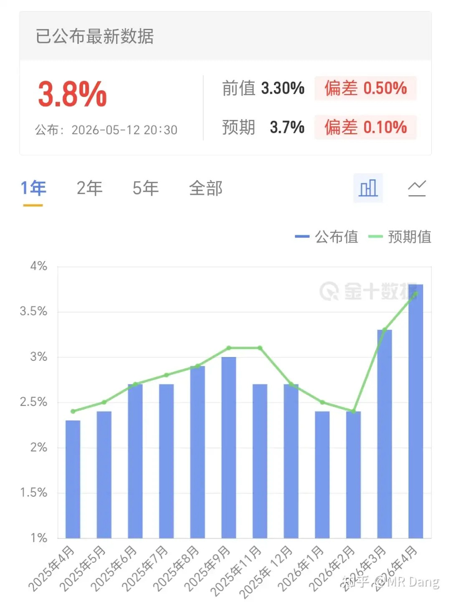
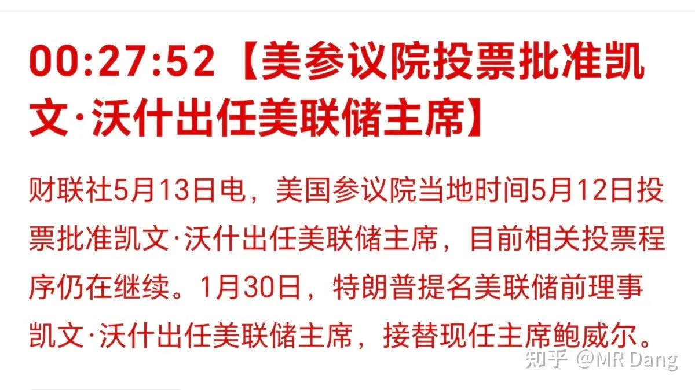
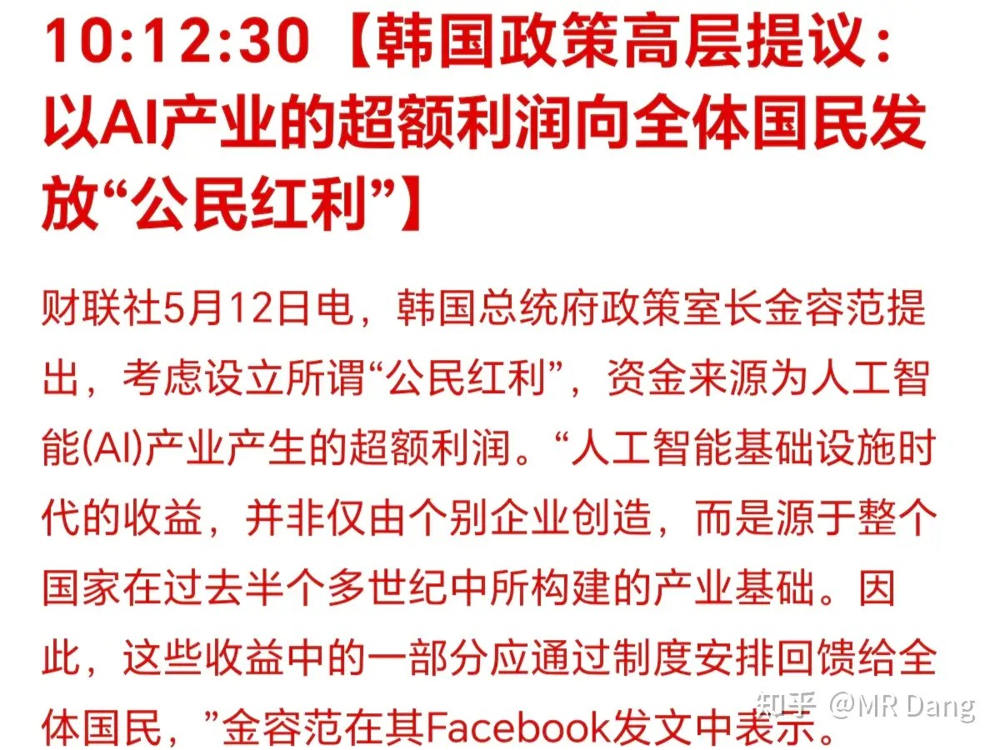
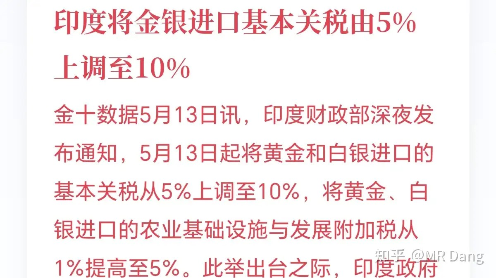
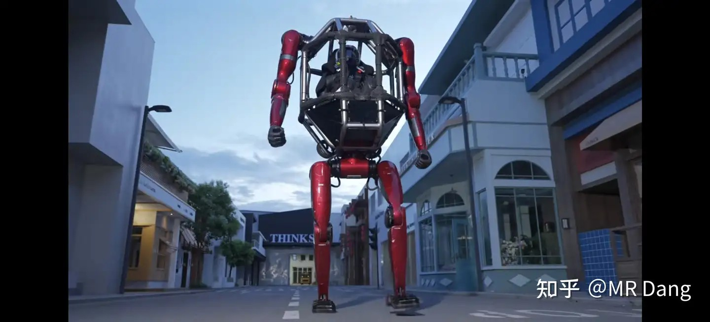
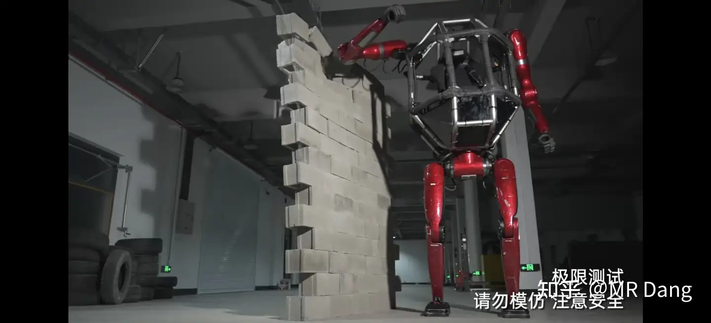
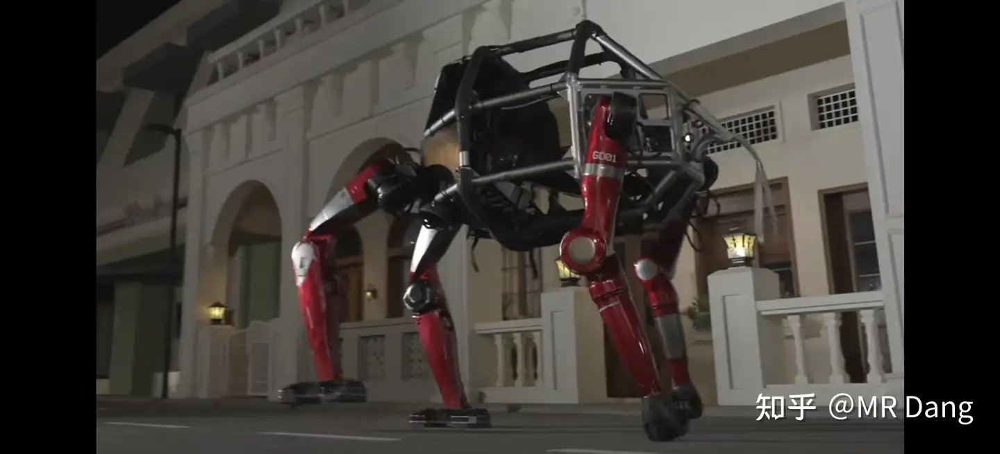
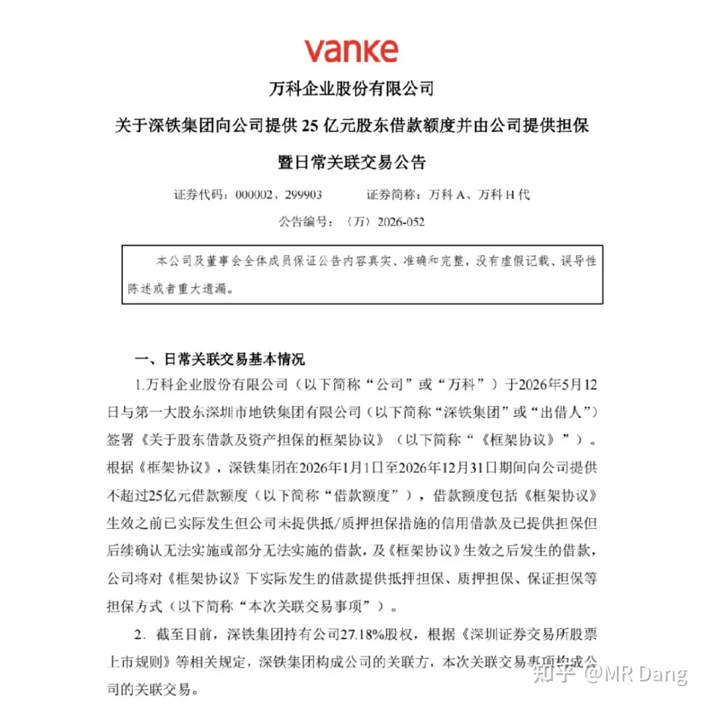
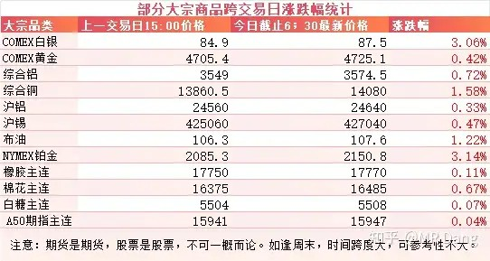
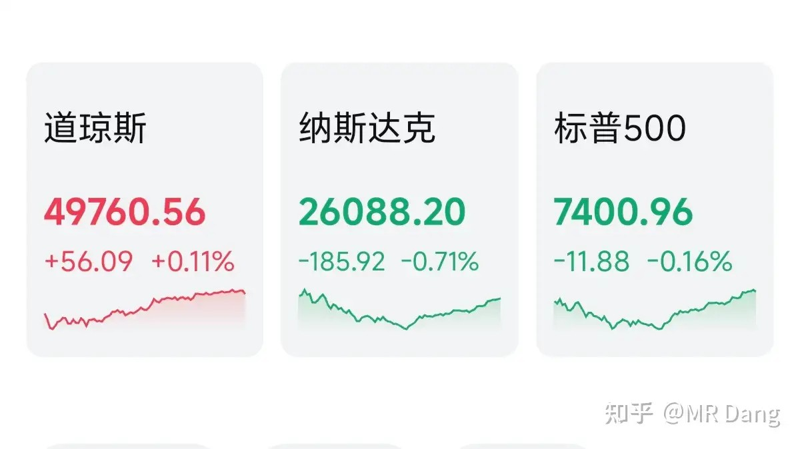

# 如何评价2026年5月13日A股行情？

---

**发布时间**: 2026-05-13 07:33  |  **原文链接**: https://www.zhihu.com/question/2037266352793199657/answer/2037797635009008643  |  **点赞数**: 327 人赞同

**作者信息**: MR Dang​​知势榜经济与管理领域影响力榜答主

---

## 正文内容

昨天晚上西大公布了四月CPI：

3.8％的数据比前值3.3％高不少，也比预期的3.7％高一些。

核心CPI的数据是2.8％，也比预期和前值高一些。

CPI高了说明通胀压力大，潜在的降息预期就会变小，不利于股市，金银等资产。

市场对这个利空消息消化的还挺快，昨天晚上基本走了个深v，到睁眼的时候，金银已经v回来了。

沃什上任：

有名的金银克星，只要出现他的名字，金银就落不下好，基本上宣布他上任的那会儿刚好就是金银一天之内的低点，

沃什老说ai能降通胀，结果上任的同一天，西大公布了一份3.8％的通胀数据，有点打脸。

今天懂王就要落地了。

美国访华代表团最终名单和之前有些出入，最大的变化是黄仁勋没来，换成了马斯克。

老黄可能是预感到先进的卡西大不让出口，落后的卡东大又不需要，所以干脆就放弃了。

这块儿算是利好国产替代吧。

这次可能外界比较关心的就是波音的飞机能谈多少架出来，2017年谈了300架，最后实际交付了80多架。

外界普遍预测这次最终能谈100到300架之间。

韩国准备向全民撒钱：

韩国这段时间以来真是国运来了，股市呼呼涨，两个存储巨头轮番表演，指数涨的比个股都凶，员工奖金发到影响团结，生育率都上来了，国民嗷嗷的生娃。

光两个存储的市值就增加了一万多亿美元，韩国只有5100多万人口，合在每个人头上光存储两兄弟就增加了两万美元市值。

现在又搞这一出，坐在直升机上撒钱，这样就不怕让国民丢了吃苦耐劳的优秀品质么？

感觉不利于奋斗，还是要三思而行啊。

印度提高金银关税：

印度是全球第二的黄金消费大国，仅次于东大，但是它本身不怎么产金，大部分靠进口。

同时它还是全球最大的精炼白银进口国，占全球精炼白银进口量的四分之一到五分之一。

追溯原因的话，一方面是文化影响，一方面是社会现实。

文化层面：印度认为黄金是财富女神拉克希米的化身，在重要的节日，比如排灯节，购买黄金就是一种积功德，有福报的行为，所以对黄金的喜爱是刻在骨子里的。

社会现实：印度的女性结婚的时候，黄金被认为是新娘唯一的绝对私人财产，有财产分割的作用。这方面的黄金需求占印度总需求的三到五成。很多人家从生了女儿开始就一直攒黄金。

宇树发布全球首款载人变形机器人：

可以像这样载人直立行走。

可以一击破坏看起来不怎么结实的墙壁

还可以像狗一样四肢着地行走。

售价390万起。

嗯。。。。

这玩意儿的定位是“民用交通工具”。

比较好奇哪个平头老百姓平时开这个上班。。。

人形机器人又开创了个新的细分赛道“人形机甲”。

宇树快点上市吧，我是真的想真金白银支持一波国产机器人。

某地产龙头：

深铁这真的是被套死了，过一段时间输一次血，亲妈也不过就这样了。

昔日的地产龙头沦为靠连续输血才能苟延残喘的企业，真是时代的眼泪。

大宗商品：

自美伊冲突以来，大宗商品一片红的情况还是比较罕见的。

特别是黄金白银，在盘后经历了一轮深V。

铜的表现比较突出，有点创新高的势头在里面了，希望能带带股票吧。

铜现在的故事一个是AI需求，另一是硫磺短缺影响供应，这个之前就在提，现在市场开始慢慢计价。

外围市场：

美三大股指涨跌不一，道指微涨，纳指和标普下跌。科技股回调，存储等前期热门板块调整，白银和铜等有色板块回暖，医药板块表现不错。

昨天个人组合净值回撤半个点，银行近一个点，资源半个多，消费半个多，算电红两个。

又是日常扣费的一天。

组合内部冰火两重天，电网自从电麻了以后支棱起来很长一段时间了，其他的三个部分都在缩水，所以电网的比例膨胀的很快，已经到了我的目标上限。

资源里铜好不容易红一些，还不够给铝补贴的。

现在感觉也没啥太大的期待，短期内应该就这样坐牢了，科技涨了被吸血，科技跌了被带崩，每天都是二选一。

最大的盼头就是掰着手指头等派息了，按照往年的规律还有一个多月，大概在六月下旬了。

既然跌了，就别涨了，等到我分红下来，希望有个好位置。

有点西天取经的感觉了，每天睁开眼就是看看今天又要渡什么劫。

股票涨涨跌跌的也管不了那么多，但是增加的股票数量做不了假，蛰伏等待下一次风险偏好的变化。

一个喜欢保护韭菜的博主，希望大家少少踩坑，多多赚钱！！！

---

*本文件从MR Dang知乎页面转载*

---

**作者**: MR Dang
**链接**: https://www.zhihu.com/question/2037266352793199657/answer/2037797635009008643
**来源**: 知乎

*著作权归作者所有。商业转载请联系作者获得授权，非商业转载请注明出处。*

## 相关阅读

**每日行情评价系列：**
- [[20260512-怎么看待2026年5月12日A股行情？|5月12日行情]] - 懂王访华官宣、国内CPI/PPI、两融和秘鲁能源危机。
- [[20260511-怎么看待2026年5月11日A股股市行情？|5月11日行情]] - 外贸数据、战略金属目录、铜矿复产推迟和科技热度。
- [[20260508-如何评价2026年5月8日A股行情？|5月8日行情]] - 央行买金、汇率升值、原油和电解铝库存。
- [[20260507-如何评价2026年5月7日A股行情？|5月7日行情]] - 美伊停火传闻、原油与有色、AI算力和追涨风险。
- [[20260506-如何评价2026年5月6日A股行情？|5月6日行情]] - 节后开盘、算电协同、伊朗局势和假期变量梳理。
- [[20260430-如何评价2026年4月30日A股行情？|4月30日行情]] - 美联储议息、原油库存、银行财报和节前风险控制。
- [[20260429-如何评价2026年4月29日A股行情？|4月29日行情]] - 非洲零关税、原材料成本、聚酯纤维和财报季风险。

**金银、铜与资源线索：**
- [[20260512-怎么看待2026年5月12日A股行情？|秘鲁能源危机]] - 白银、铜、锌等有色供应扰动的前一日背景。
- [[20260511-怎么看待2026年5月11日A股股市行情？|战略金属]] - 战略金属目录、收储预期和铜矿复产推迟。
- [[20260422-紫金矿业一季报实现净利润 200.79 亿元，同比大幅增长 97.50%，如何解读「矿茅」的Q1财报|紫金财报]] - 对照金铜价格和资源股盈利兑现。
- [[20260508-如何评价2026年5月8日A股行情？|黄金与汇率]] - 央行买金、投资金条和汇率变化可以连起来看。

**科技、估值与风险控制：**
- [[20260427-如何评价2026年4月27日A股行情？|AI与算力]] - DeepseekV4、昇腾适配和科技叙事的前序观察。
- [[20260423-对于2026年4月23日A股市场行情，大家有什么预测和看法？|算力能效]] - 算力能效、液冷材料和绿电直连方向。
- [[20260404-如何分步骤快速看懂上市公司年报？|看懂年报]] - 用财报框架拆解资源、科技和地产企业。
- [[20260401-读懂财报，看清基本面|读懂财报]] - 把宏观、价格、供给和利润落回基本面。
