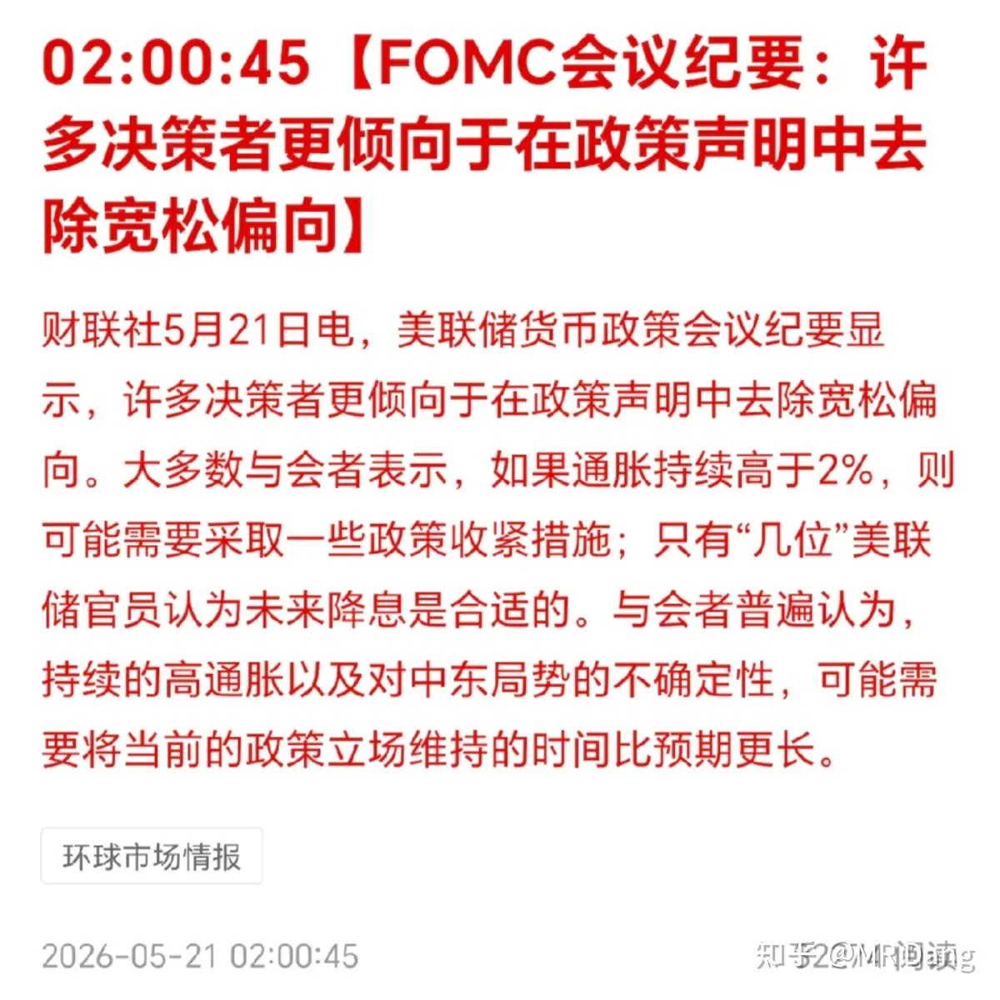
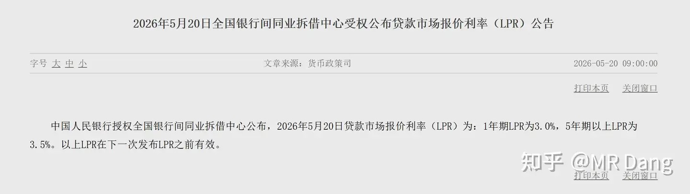
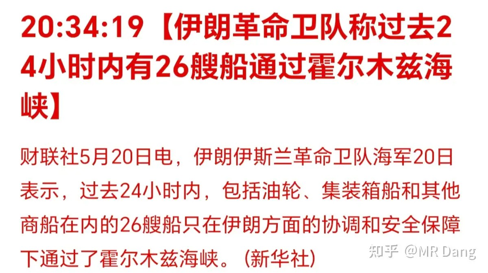
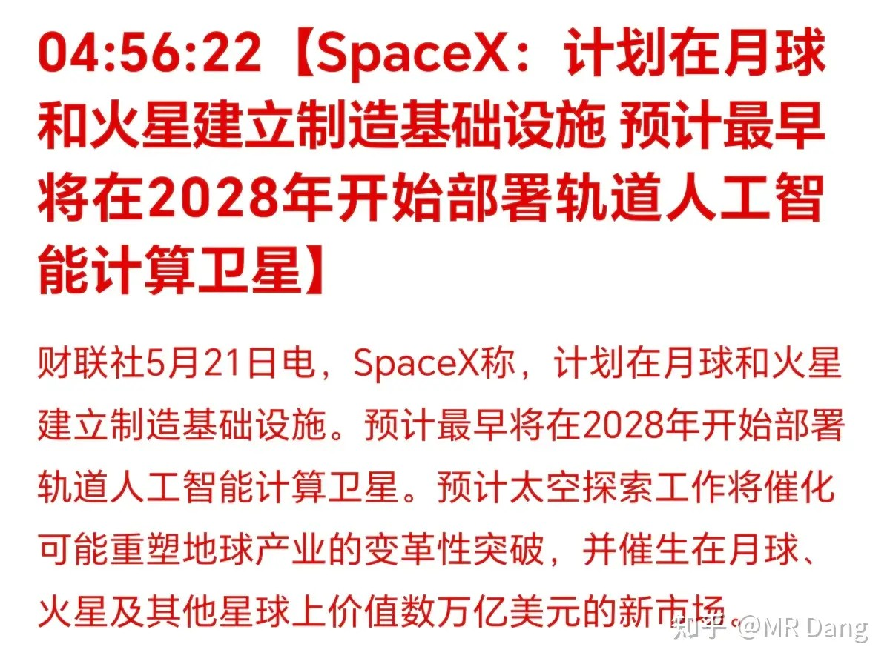
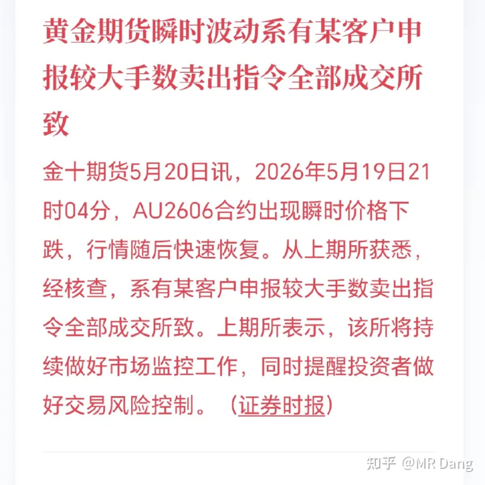
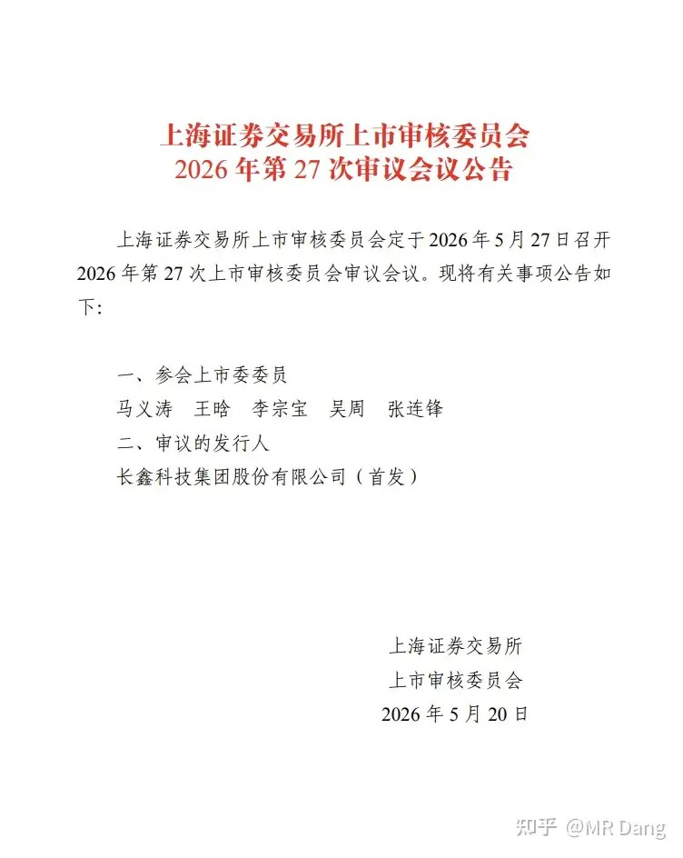
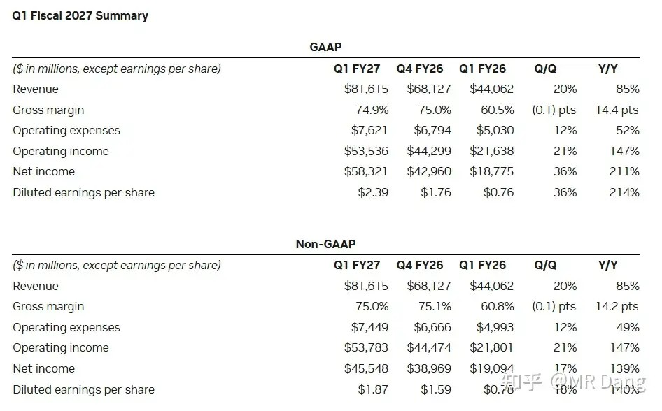
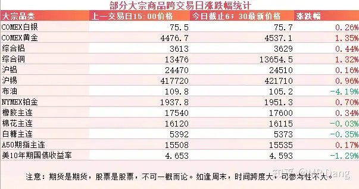
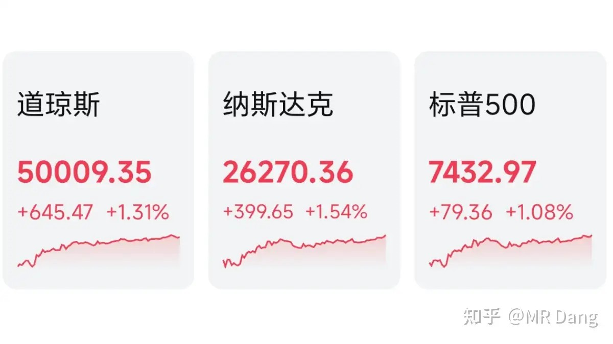

# 怎么看待2026年5月21日A股行情？

---

**发布时间**: 2026-05-21 07:23  |  **原文链接**: https://www.zhihu.com/question/2039608873754026421/answer/2040694225302509145  |  **点赞数**: 343 人赞同

**作者信息**: MR Dang​​知势榜经济与管理领域影响力榜答主

---

## 正文内容

头条给到美联储：

最新的FOMC会议纪要显示，整体政策取向从宽松偏向转为了中性偏鹰，只有几位认为未来降息是合适的。

原因还是通胀压力和中东局势的影响。

这本身不是一个对资本市场很友好的消息。

但是因为之前对这方面有所预期，甚至做好了加息的准备。

所以这份会议纪要反而让资本市场吃了一个定心丸——可能现在的利率水平会维持相当长一段时间。

昨天央行发布了最新的LPR报价，一年期3%，5年期3.5%，和之前持平，符合预期。

现在央行的手段多了，工具箱里塞满了工具，降准降息的频率低了，大部分时候采取的是其他更精准施策的手段，比如麻辣粉，酸辣粉，披萨蓝，再贷款，再贴现什么的。

美伊局势：

伊朗称过去的24小时内，有26艘船通过了海峡，这基本恢复了战前三分之一到四分之一的水平。

油价应声而下。

北边邻居昨天回家了，办事效率真高。

塞尔维亚打算5月24日到28日登门过访。

有关部门正式公布了《矿产资源法实施条例》，正式版本较之前的征求意见稿有些许重要变动，可能会对资本市场产生一定影响。

马斯克又画大饼：

马斯克可能是人类历史以来最成功的企业家，干成了很多推动人类文明进步的事业。

但是这不妨碍他经常画饼，这个在火星建立制造基础设施我就有点不太信，而在月球上的话，我个人是半信半疑。

感觉更像是为了提高上市估值而画了个饼。

昨天早报提及的黄金乌龙指有了后续，得到了交易所的确认：

我个人这么长时间交易以来，从来没有出现过乌龙指的事情，一是因为交易频率低，没太多犯错的机会。

二是因为以前在金融机构养成的习惯，每一笔交易，输入的时候会检查一遍，输入完再检查一遍，点击确认之前再检查一遍。

甚至旁边有家里人的时候会喊过来看一看，把后面的0数一数，没问题了再报出去。

这在金融机构里被称为现场授权。

另外选择报单的时候，我习惯选择“限价委托”，这个模式下，盯好对手盘的单量，选好价格，不容易出现大的纰漏。

长鑫ipo进展：

光速推进，已经到上会阶段了，接下来就是注册，路演，询价，公布上市时间了，别看好像还有很多流程，可能最后实际上市也就在7月中下旬差不多了。

这玩意儿体量大，意味着中签概率大，大家也都盯着点，打新也就手指动一动的事，送上门的肉，不吃白不吃。

英伟达公布了财报：

作为全球科技业的标杆，这份财报没毛病。

营收超预期。

指引也还行。

不过西大市场对达子的要求高，都在用放大镜看，只要有一点不符合预期的地方，就会在价格上有反应。

这一点，还是大A对科技股更宽容，美股不及也。

大宗商品：

受消息面影响，原油下挫四个点，美10年期国债收益率下行。

有色整体回暖，黄金，锡，铜都有大约一个点左右的涨幅。

农产品表现一般。

外围市场：

美三大股指走强，纳指领涨，板块上科技股，银行，有色，cpu都涨的不错。

昨天个人组合净值微红，银行红小半个，资源绿一个，算电红大半个，消费红半个。

挺满意的，手里没半导体，跑赢指数难度有些高了，偶尔有一个交易日能跑赢已经是万幸了，还要什么自行车。

现在行情转的跟电风扇一样，新热点一起来，旧热点立马就被推沟里去了，像电力前天还在彻底疯狂，昨天就被按到地上了。

有择时能力追热点的可以追一追，择时能力一般的投资者找一个好的方向蹲着也不错，就怕那种两边挨耳光的。

一个喜欢保护韭菜的博主，希望大家少少踩坑，多多赚钱！！！

> [!comment]- 点击展开评论
>
> | 用户 | 时间 | 内容 |
> | :--- | :--- | :--- |
> | 一壶浊酒 | 13 小时前 | 4月初全仓了半导体，昨天出的差不多了。 |
> | lion | 13 小时前 | 我黄油手过两次，把1万弄成10万，在资本市场连水花都溅不起。没能引起资本市场大幅波动，深感遗憾。 |
> | 钱包鼓鼓 | 13 小时前 | 每日打卡第54天美伊局势缓和，26艘船通过海峡，原油下挫4个点，有色回暖（黄金锡铜涨约1%），短期油价没支撑别碰长鑫IPO光速推进已到上会阶段，体量大中签概率高，预计7月中下旬上市，打新送上门到肉别错过FOMC偏鹰但已被市场消化，LPR持平符合预期，央行现在用精准工具替代降准降息，不会大水漫灌板块轮动像电风扇，电力前天涨停潮昨天直接按地上，没择时能力的蹲好一个方向别两边挨耳光英伟达财报营收超预期指引还行，但美股用放大镜看科技股不及预期就砸，不如大A对科技股宽容 |
> | 正静明虚 | 9 小时前 | 我记得之前说是交易的事尽量不让家人参与，今天怎么还让家人帮忙数下零 |
> | &nbsp;&nbsp;&nbsp;&nbsp;北方的河 | 4 小时前 | 你这就不对了，怎么能说出来呢 |
> | &nbsp;&nbsp;&nbsp;&nbsp;op666 | 4 小时前 | 笑死，人家想装一下，你非要打脸 |
> | &nbsp;&nbsp;&nbsp;&nbsp;绅士易殇 | 2 小时前 | 哈哈哈 |
> | 涛声依旧 | 4 小时前 | Dang大现在每天就是纯分享一些新闻热点事件吗？完全不分析大盘了 |
> | 高消费被限制人 | 13 小时前 | 党佬早，最近红利etf挨打太狠了，接下来怎么操作啊 |
> | &nbsp;&nbsp;&nbsp;&nbsp;玉书 | 12 小时前 | 看估值跟历史，可能要熬俩三个月左右 |
> | 如来熊掌 | 12 小时前 | 如果非要说这个月的情况，只能是devil may cry |
> | 在人间 | 5 小时前 | 麻了，麻了。每次亏的受不了就割肉抛了，看着行情好了，一进就不断下跌。亏麻了。。 |
> | 豪爷 | 12 小时前 | 昨天银行怎么能还是红的的？ |

---

*本文件从MR Dang知乎页面转载*

---

**作者**: MR Dang
**链接**: https://www.zhihu.com/question/2039608873754026421/answer/2040694225302509145
**来源**: 知乎

*著作权归作者所有。商业转载请联系作者获得授权，非商业转载请注明出处。*
