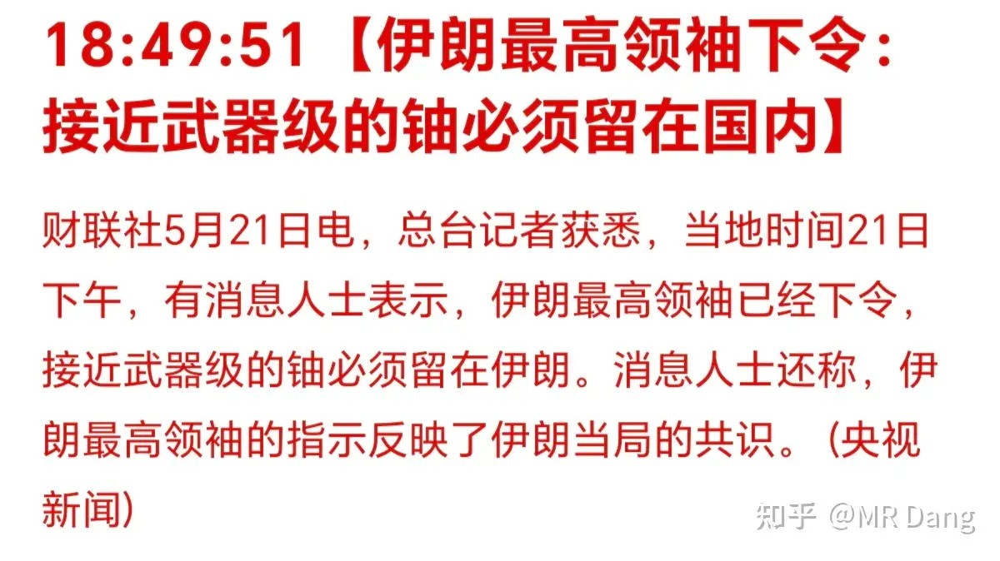
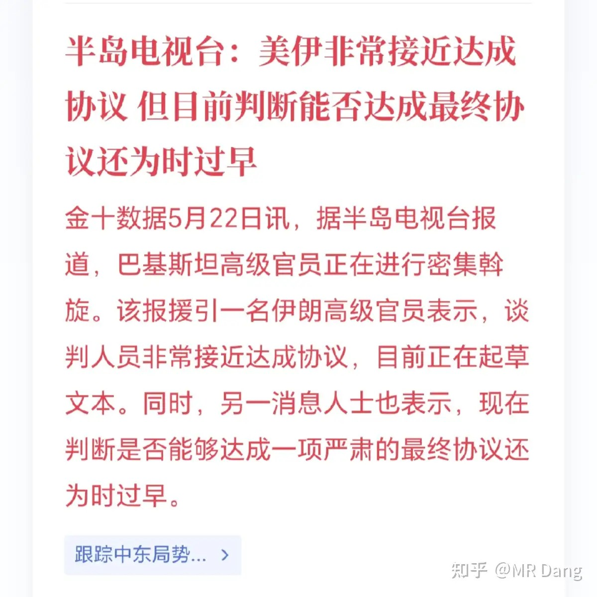
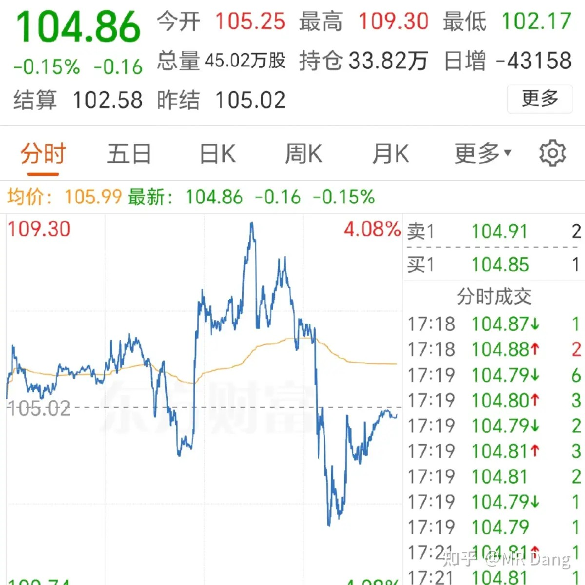
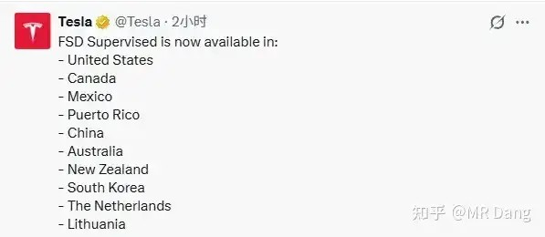
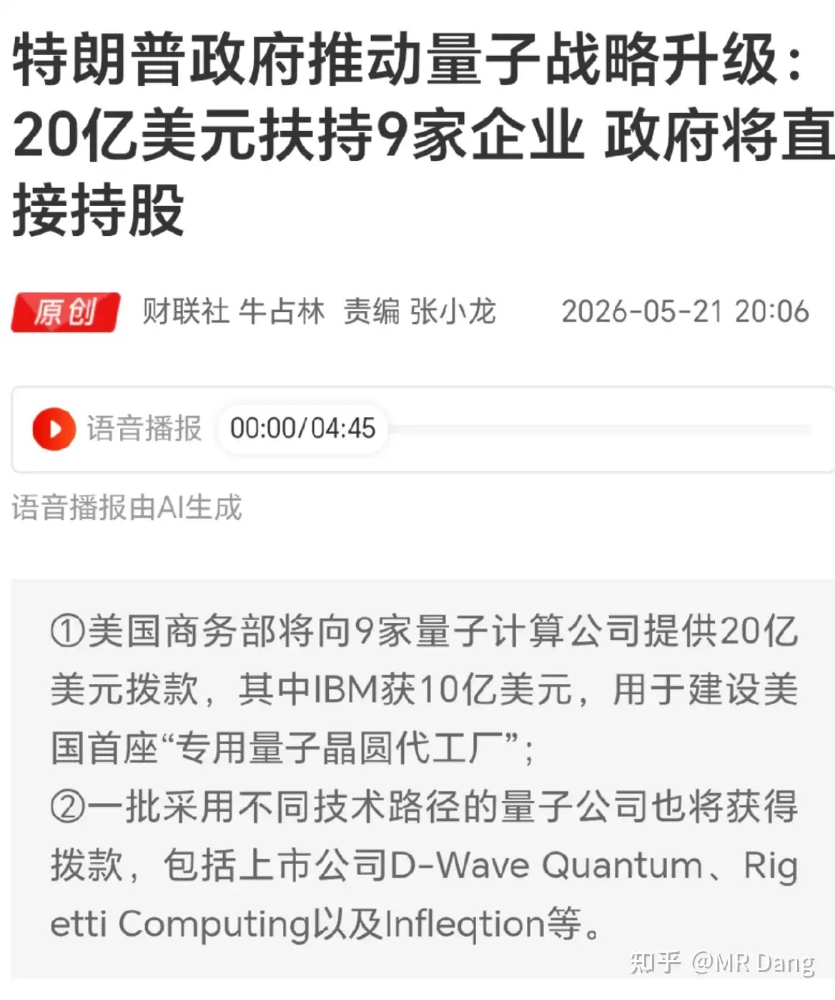
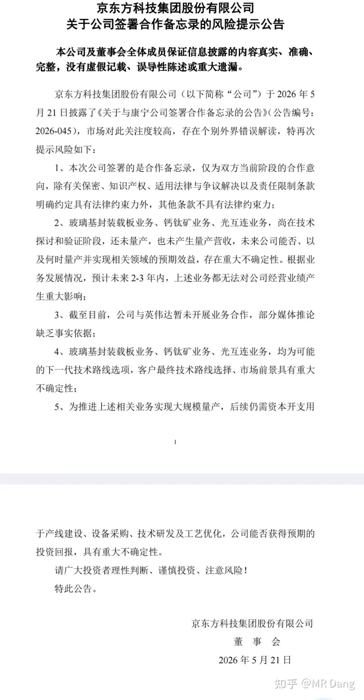
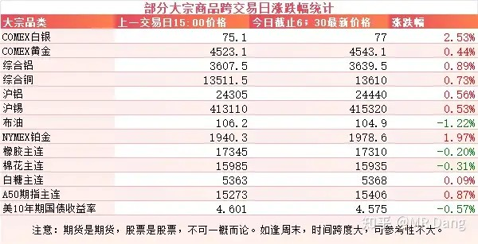
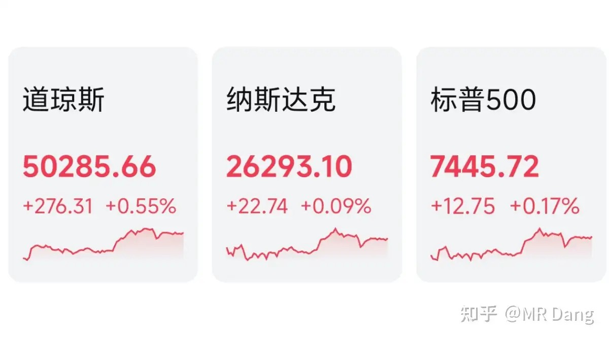
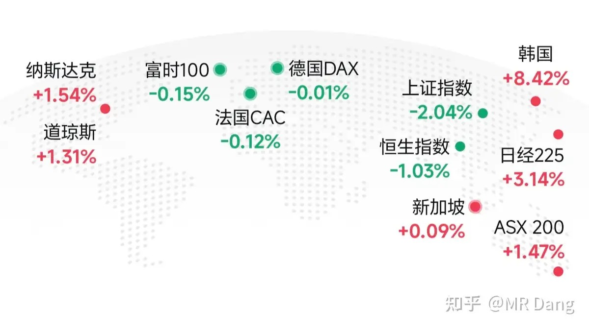

# 怎么看待2026年5月22日A股行情？

---

**发布时间**: 2026-05-22 07:21  |  **原文链接**: https://www.zhihu.com/question/2039608967576413346/answer/2041056016360535117  |  **点赞数**: 431 人赞同

**作者信息**: MR Dang​​知势榜经济与管理领域影响力榜答主

---

## 正文内容

很久没有把美伊局势放到头条了：

伊朗表示武器级的铀必须留在国内。

原油价格应声而起。

后面又有消息称马上达成协议：

原油价格直接跳水。

用语言描述可能说不清，贴一张原油走势图，大家就懂了：

好像对美伊比了个中指。

原油不是一般人玩的，速速远离，没有开天眼根本玩不了。

巴铁5月23日到26日过来做客。

恩。。。朋友多是好事。。。

有关部门通过了《人民银行法》草案，将提请审议。

结合之前的征求意见稿内容，有业内人士猜测最大的变化是可能加入数字人民币有关内容，加大金融违法处罚力度。

特斯拉FSD监督版昨天官宣入华：

叫监督版，但其实是满血版的，而不是阉割版本。

FSD在哪个地区都是这个监督版，需要有人坐在驾驶位上进行监督。

当然所谓的监督，其实就是告诉你，驾驶者负有监督的责任，全责，它只是个L2级别的辅助驾驶。

老马父子，这趟没白来，比皮衣黄的成果多多了。

哦，对了，这个FSD售价6.4万，或者也可以月租。

昨天大盘那个样子，FSD板块是少数几个涨幅比较大的板块了。

量子产业：

懂王之前扶持英特尔，把很多订单给了它，硬是把日落西山的英特尔给救了回来。

这次把救助目标朝向了IBM这些企业，IBM在量子领域是标杆企业，现在国内的量子企业还在以IBM几年前的产品为追赶目标。

不过在量子通信这一细分领域，国内有一家企业已经做到了全球顶尖。

懂王深得东大“集中力量办大事”的精髓，在关键领域搞西大版的国企路线。

京东方发布了风险提示公告：

和康宁签订的合作协议里，玻璃基封装载板属于ai产业链的一环，所以引起了估值的抬升。

这个风险提示公告也基本把市场关切的点进行了回应，剩下的就是资金的博弈了。

这家企业也是散户大本营，股东数量常年都是百万级的，每次一有消息，都能冲到热度榜第一。

大宗商品：

受消息面影响，原油震荡后回调，有色整体回暖，农产品表现不佳。

A50主连似乎预示着今天可能会有个好的开端。

外围市场：

美三大股指收红，道指领涨。

传统板块表现不错，科技股表现分化，存储走强，逆变器走强，英伟达在给出一份不错的财报后回调。

市场对达子确实要求挺严的，预期打的太满了。

另外还有个土耳其市场，有报道称土耳其的美债卖的差不多了，再加上土耳其国内一些斗争，土耳其股市收盘跌了六个点。

昨天个人组合净值回撤大半个，银行红半个，资源绿近一个，消费绿两个，算电绿近四个。

跟个等比数列一样。

上午笑嘻嘻，下午就笑不出来了，开始给算电还账，跳水跳得是如此丝滑。

甘蔗没有两头甜，之前算电涨的最好，现在回调一些也是应该的。

往好处想，起码跑赢指数了，少亏当赢。

至于科技是破新高涨到天上去，还是继续回调，我个人是不太感兴趣的，我赚不了科技股的钱，但是也不想被科技掏了口袋，等什么时候确实便宜了，才会考虑。

昨天还在说最好不要被两边打耳光，但是我猜肯定有割了老登追科技的投资者被打的两耳通红。

银行是红的，固然让人欣慰，但其实心底没什么雀跃可言。

大概还有一个多月就要分红了，能复投更多的股票数量才是我更在意的点。

涨了是面子，跌了才是里子。

最惨的是消费，吃肉的时候没有，挨打的时候全在。

也对，都套在股市里，谁有钱消费，逻辑闭环了。

至于大盘，昨天大A收盘时的画风是这样的：

周围洋溢着一片欢声笑语，想找个把大盘带崩的罪魁祸首，还不好找。

有小作文称是量化交易相关的监管消息带崩了指数。

不予置评，这种聊天截图不算置信度高的信源。

但是莫名其妙挨了一顿暴打，画风和其他市场差距也有点大，大家都憋了一肚子气。

总要有个情绪发泄口，所以这锅就先甩给量化好了。

一个喜欢保护韭菜的博主，希望大家少少踩坑，多多赚钱！！！

> [!comment]- 点击展开评论
>
> | 用户 | 时间 | 内容 |
> | :--- | :--- | :--- |
> | 小枫安 |  | 恭喜Dang老师知乎粉丝顺利突破15万！重温老师2026年2月1日发布的十万粉感言，此文如今点赞超六千，回想当初热度满盈，不过短短三月有余。自天阶功法问世至今，一路走来也仅半年时光。时局动荡叠加市场风格剧变，价值投资行情遇冷，外界对老师的评价也从全网盛赞变得褒贬不一，口碑起伏之间，非议与偏激言论接踵而至。于我内心而言，始终心怀感激。世间无人能次次精准踏中行情、稳抓强势标的，但老师分享的投资理念与实战心法，早已让我受益匪浅。历经舆论风波与市场起伏，我坚信还有大批沉默不语的朋友，始终默默相伴支持。价值投资本就是一条孤独前行的路，我亦不愿美化未曾走过的另一条路。过往十万粉感言字字走心，诸多疑惑与答案皆藏其中，感兴趣的朋友不妨回头细读。原本十分期待十五万粉专属感悟，得知老师已定下心绪，静待二十万粉再提笔撰文，在此衷心祝愿Dang老师2026年顺利冲刺二十万粉丝，坚守本心，持续分享真知与经验。最后愿老师初心不改，也祝愿所有同道挚友投资顺遂，行稳致远。 |
> | &nbsp;&nbsp;&nbsp;&nbsp;MR Dang |  | 感谢支持 |
> | 钱包鼓鼓 |  | 每日打卡第55天伊朗强硬表态让原油暴涨暴跌。特斯拉FSD监督版满血入华卖6.4万或者月租，FSD板块昨天逆势上涨是少数走强的板块。懂王转去扶持IBM搞量子产业，国内量子通信龙头全球领先值得留个心眼。京东方情绪博弈，注意风险。脆弱的市场里，交易越多出错概率越大，不要追涨杀跌两头挨打。 |
> | &nbsp;&nbsp;&nbsp;&nbsp;星河江枫入梦来 |  | 我的东方电qi一直跌，不知道如何自救了 |
> | zhengfar |  | 现在感觉就是财经新闻联播 |
> | 咕哒 |  | 或许只有这里没有那么极致的博弈 |
> | &nbsp;&nbsp;&nbsp;&nbsp;gf冰火岛 |  | 紫金也是散户大本营，虽然短期超跌了 |
> | &nbsp;&nbsp;&nbsp;&nbsp;sjj4j |  | 去年在纳指挣了二十个点就跑了，双创也跑了，后来在老登里把利润都亏回去了，怕高都是苦命人啊 |
> | &nbsp;&nbsp;&nbsp;&nbsp;wtmsny |  | 紫金稳定发挥 |
> | 热乎黏苞米 |  | 本月回撤5个点，回血都是跟大盘意思一下，一下跌就是从板块整体抽血，挨打之后痛定思痛，在大A，要做好被大势裹挟的准备，什么业绩，什么股息率，什么盈利，什么现金流，哪个信的多就割哪个，你看中的是企业赚钱能力，人家看中的是你的本金 |
> | 王志嵩 |  | 明天不会亏了 |
> | 春风吹又生 |  | 我3800点的时候还没亏这么多……躺平了，认清了，敬畏市场 |
> | &nbsp;&nbsp;&nbsp;&nbsp;会飞的鱼 |  | 俺也一样 |
> | 小尧 |  | 自从开始炒股，我的奶茶自由，xx自由都没了 |
> | 大脸猫 |  | 昨天的券商玩了个寂寞😔 |
> | 今晚回家吃饭 |  | 夏炒电的这个电是什么电 |
> | &nbsp;&nbsp;&nbsp;&nbsp;Godyi |  | 已经抄了一波了 |

---

*本文件从MR Dang知乎页面转载*

---

**作者**: MR Dang
**链接**: https://www.zhihu.com/question/2039608967576413346/answer/2041056016360535117
**来源**: 知乎

*著作权归作者所有。商业转载请联系作者获得授权，非商业转载请注明出处。*
