# 怎么看待2026年5月25日A股行情？

---

**发布时间**: 2026-05-25 07:35  |  **原文链接**: https://www.zhihu.com/question/2041055858767942338/answer/2042146798039458810  |  **点赞数**: 354 人赞同

**作者信息**: MR Dang​​知势榜经济与管理领域影响力榜答主

---

## 正文内容

这个周末，全是大事，得好好捋一捋。

对资本市场最震撼的消息就是有关部门出手，打击非法跨境券商：

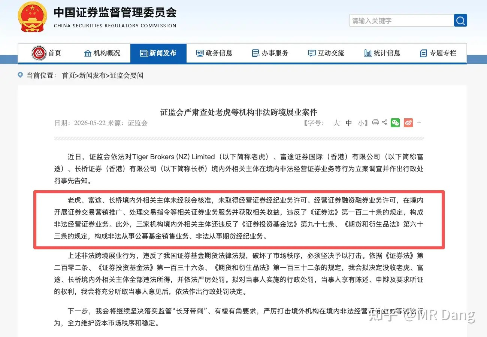

这三家是跨境券商里比较头部的。

之前其实敲打过，给过整改期限。

可能耳背没听进去吧，这下就被体面了。

怎么说呢，大家投资境外，还是要走合法渠道，咱们有QD2，有港股通。。。这么丰富的选择，如果都满足不了大家的要求，也可以看看咱们的大A，多么有活力的市场，不要老想着往外跑。

说到这里，其实这几个券商内地客户数占大概13%左右，可能推测相应的资金在10%到15%之间，大概是两百亿到三百亿美元这个范围。

到时候可能部分资金还是要回来的，利好大A，应该有个大几百亿到千亿级别的体量。

相对应的有个风险需要提醒下，只可以卖不可以买的规定，这个其实很多退通的股票，就是这待遇，而退通的股票最后大部分都跌的很惨。

港股如果有一些流动性不足，不在港股通里，并且内地资本持仓比例高的股票，是存在踩踏风险的，这种一般就不是十个点五个点的小打小闹了，很容易出现瀑布的场景。

目前落地的罚款只有二十多亿，这不是小数字，但比预期的要少的多，现在资本市场又有点缓过劲来了，对港股开盘有了点幻想。

还有个小插曲，这些券商的看空期权在消息公布前被突击买入，获利不菲，可能有好几个小目标。

择时相当精准。

沃什上周五宣布就任美联储主席：

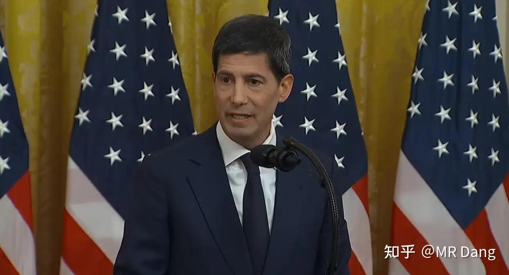

黄金克星正式上线。

这里解释一下为什么叫他黄金克星，因为他有一种理念，就是认为黄金涨的太多，就是美联储没干好，某种角度上把美元和黄金放在了对立面，所以一直推缩表。

美伊局势：

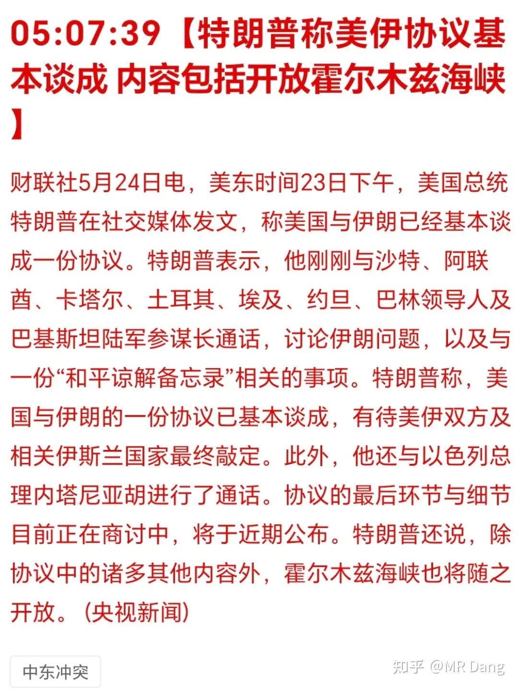

周末懂王称协议基本谈成，海峡要开放。

伊朗那边也进行了回应，认为懂王说的不完整，伊朗要对海峡进行“管理”。

可能还是想收钱吧。

市场现在不太关心伊朗怎么收费，关心的是到底能过多少船，只要过的船数量上去了，那点通行费在全球通胀里的贡献不值一提。

消息出来后，暗油价格一路跳水，似乎资本市场也认为这次可能是真的要放开了。

等了几个小时后，懂王又表示不着急谈成协议：

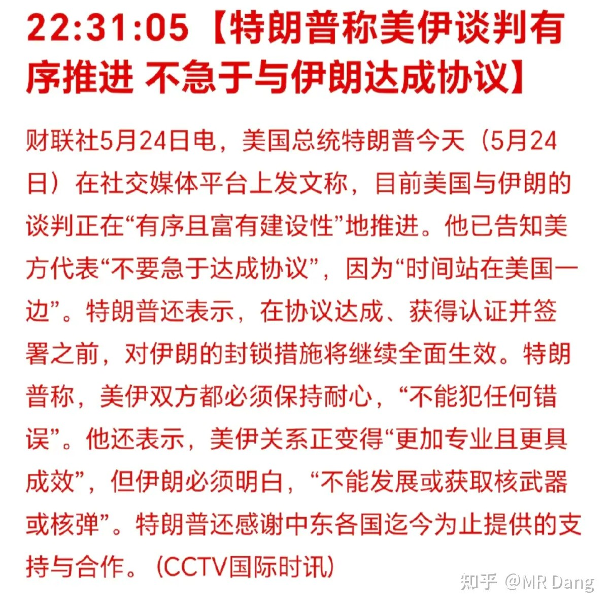

布伦特原油整体上从周五的104美元，来到了最新的96美元，大概回撤了七八个点左右。

央行今日开展6000亿麻辣粉操作：

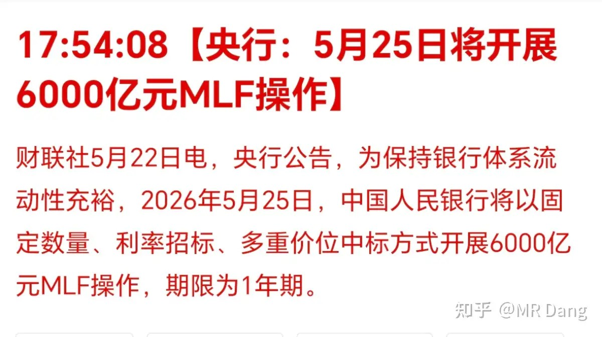

到期是5000亿，相当于净投放1000亿。

山西沁源发生了一些不好的事情，安全生产需要特别重视，目前的定性是企业重大违法：

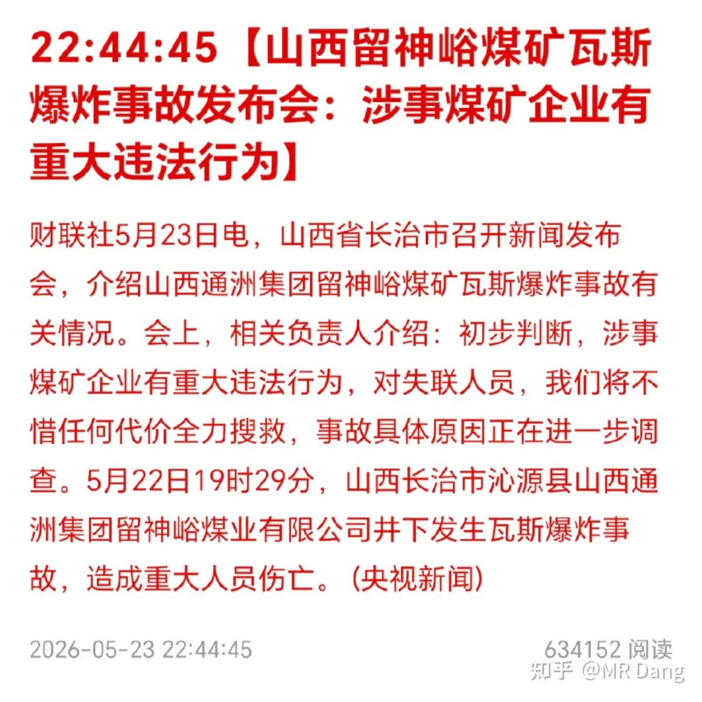

希望机器人可以快速迭代，低成本的应用在这类高危行业里，让普通人尽快的享受到科技带来的福利。

另外就是接下来六月是每年的安全生产月，刚好又碰到这事情，相关部门可能会狠抓这方面的。

山西是产煤大省，如果抓的紧了，供应端可能会偏紧。

最后还是希望企业重视安全生产，下矿的工人们都平平安安。

商业航天：

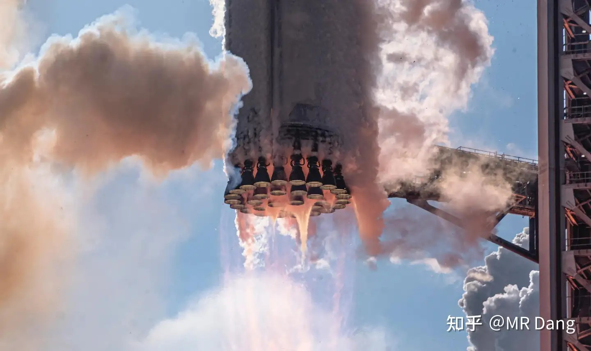

星舰第12次试飞基本成功，是V3版本的首秀。采用了猛禽3发动机，推力增加，自身减重，只有助推器点火出了点纰漏。

人类史上最大的IPO，需要一场声势最大的直播带货。

国内的神舟23也取得圆满成功：

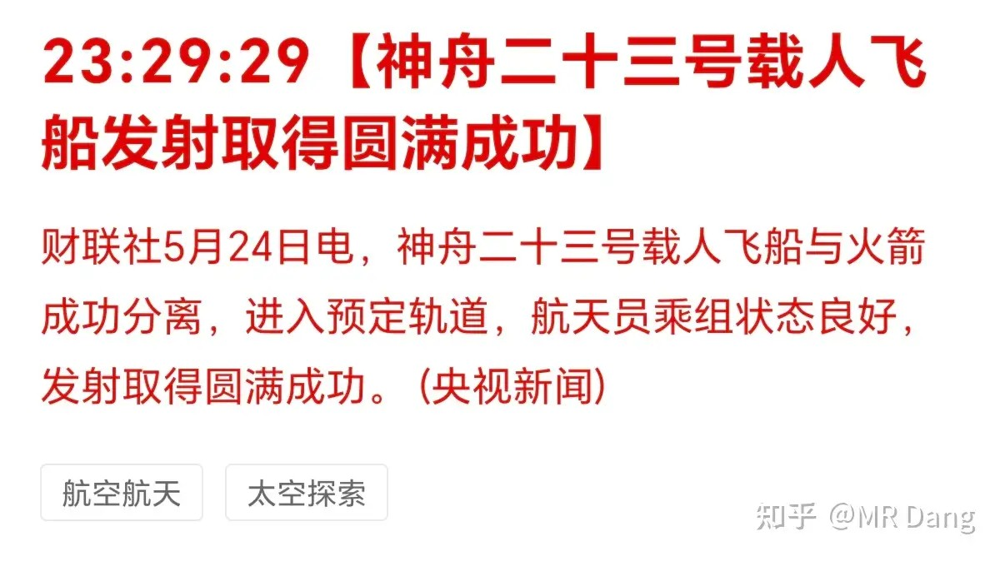

这是昨晚发射的，神舟23号的宇航员要在太空待很久，最长要一年。

气候预测：

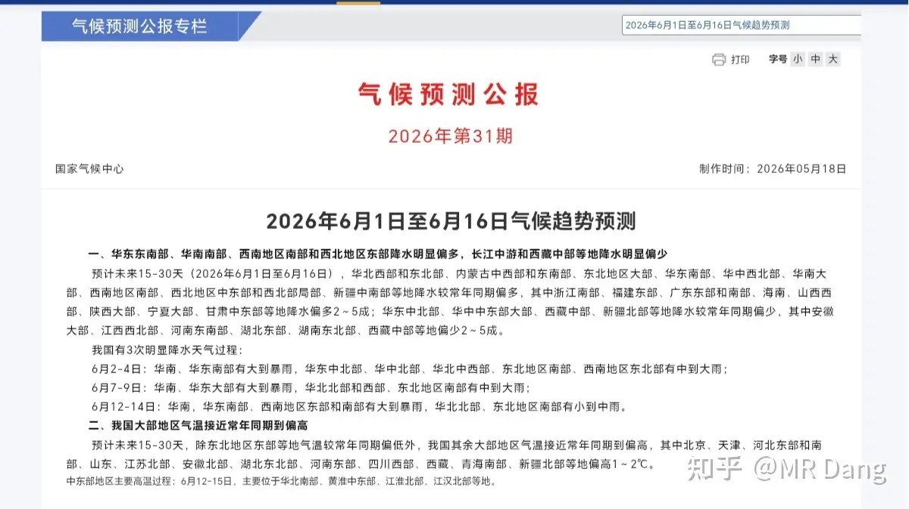

根据国家气候中心预测，六月份温度较往年偏高，这块可能影响用电量和制冷剂方面的需求，氟化工这块儿可能受益。

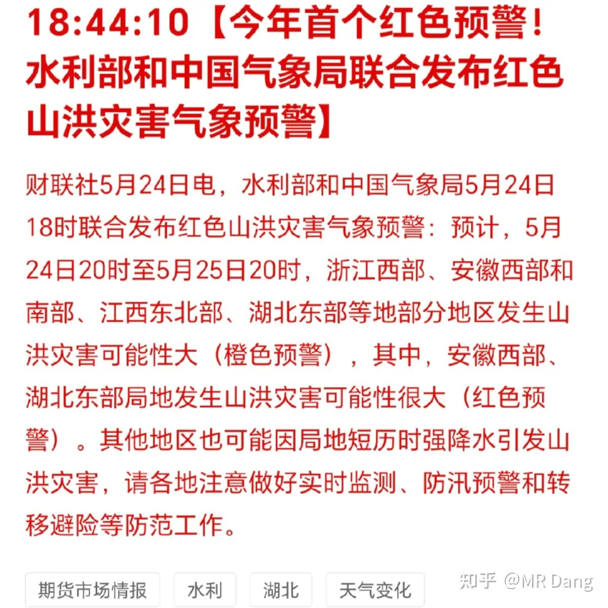

另外部分地区还发布了红色预警。

咱们这不是天气预报，具体的就不说了，但是这些反常的气候变化，说明厄尔尼诺的脚步正在逼近，这方面的交易可以考虑找找方向。

大宗商品：

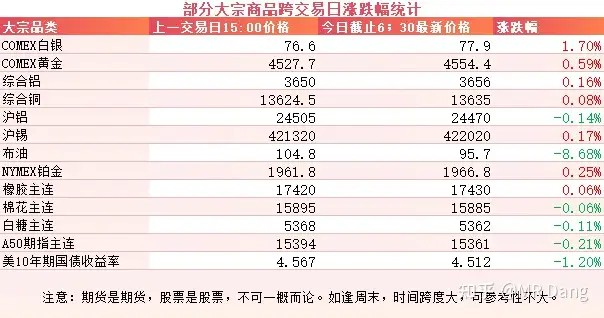

受消息面影响，原油大幅走弱，回撤8个多点。

白银涨幅近两个点，其他有色属于正常波动。

农产品表现较弱，美10年期国债收益率下破4.55的强弱分水岭。

外围市场：

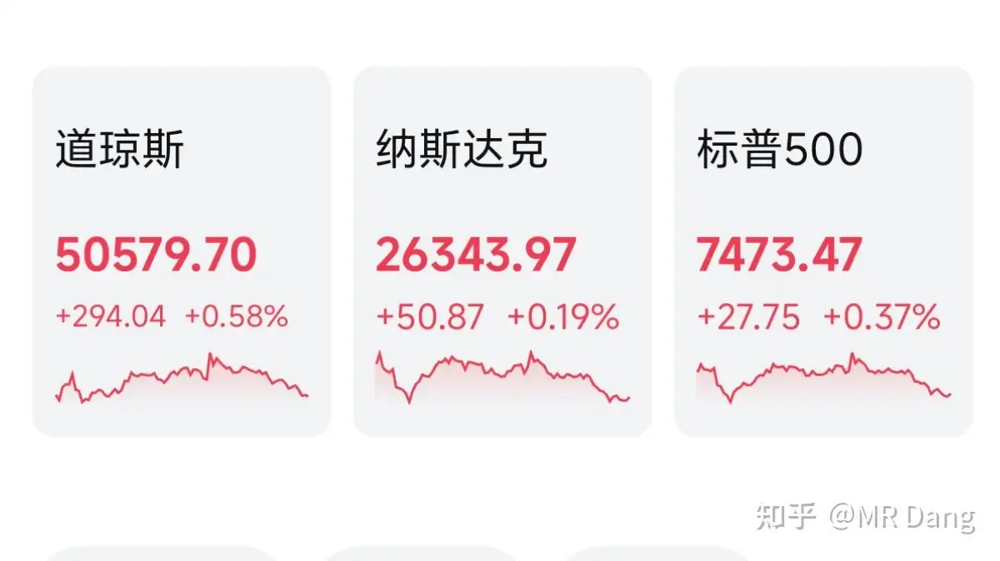

上周五美三大股指收红，道指领涨，传统行业表现比较好，量子概念走强。

被铁拳制裁的跨境券商跌了25%以上，中概股也跌了两三个点。

不过今天恒科的家人们并不会被扣费，因为今天港美股都休市。

上个交易日个人组合净值回血1个点，银行红大半个，消费绿大半个，资源红两个半，算电红两个半。

还行吧，不是很差，这种行情下满手老登可以跑赢大盘已经让人感到振奋了，总比挨打强。

本周前瞻：

1，今天公布4月的全国发电装机容量。

2，周四公布西大周初请失业金人数。

3，周四公布4月核心PCE数据，这个比较重要。

4，周日公布咱们这边的PMI指数。

5，周三公布工业企业利润数据，这个挺有指导意义的。

一个喜欢保护韭菜的博主，希望大家少少踩坑，多多赚钱！！！

> [!comment]- 点击展开评论
>
> | 用户 | 时间 | 内容 |
> | :--- | :--- | :--- |
> | Dangerous | 16 小时前 | 已经不聊股票，转型新闻博主了么，，评论区安静多了，， |
> | &nbsp;&nbsp;&nbsp;&nbsp;宇文华夏 | 11 小时前 | 粉丝都少了好多 |
> | &nbsp;&nbsp;&nbsp;&nbsp;屁兜 | 7 小时前 | 其实还是在划重点 |
> | 钱包鼓鼓 | 16 小时前 | 每日打卡第56天三家头部跨境券商周末被铁拳制裁，内地客户200-300亿美元可能回流A股，利好大A但港股流动性差的票小心瀑布踩踏沃什就任美联储主席，黄金克星上线，他认为黄金涨太多就是美联储失职美伊协议谈判，布伦特原油从104跌到96央行6000亿麻辣粉净投放1000亿山西事故叠加六月安全生产月，煤炭供应可能偏紧厄尔尼诺逼近六月气温偏高，氟化工制冷剂方向可以看看 |
> | &nbsp;&nbsp;&nbsp;&nbsp;吃着火锅唱着歌 | 15 小时前 | 港股休息据说是做佛事，阿美莉卡也开始信佛了？ |
> | &nbsp;&nbsp;&nbsp;&nbsp;乌鱼子酱 | 13 小时前 | 美股是因为今天是阵亡战士纪念日 |
> | &nbsp;&nbsp;&nbsp;&nbsp;把酒问留思 | 13 小时前 | 美国是阵亡将士纪念日，五月最后一个星期一；香港是周日顺延到周一，刚好在同一天 |
> | &nbsp;&nbsp;&nbsp;&nbsp;乱世豪情 | 3 小时前 | 为什么听网上有的博主说，老虎硬刚了，不知道是不是真的 |
> | 涛声依旧 | 7 小时前 | 开了小红圈已经赚饱了 |
> | lion | 16 小时前 | 玩美股的朋友，你麻麻喊你回家学技术 |
> | 看看 | 12 小时前 | 那些出海炒美股的资金，回来会买大A？表示怀疑。因为非主动回流的资金，可不会太傻 |
> | 穿越荒州的主角 | 12 小时前 | Dang,我关注的大佬都退网了，你要坚持住啊 |
> | 行者 | 15 小时前 | 道指最近涨挺好呀，难道真要上十万点 |
> | &nbsp;&nbsp;&nbsp;&nbsp;班班 | 11 小时前 | 那川普就真的是股神了 |
> | 边看日落边发呆 | 16 小时前 | 楼主，请问你选算电更偏向哪个业务？ |
> | &nbsp;&nbsp;&nbsp;&nbsp;千不钧 | 15 小时前 | 黄金克星是黄金克他还是他克黄金 |
> | 若星汉天空 | 14 小时前 | 利好机器人话说科技类的大摩的研报为什么不提下？ |

---

*本文件从MR Dang知乎页面转载*

---

**作者**: MR Dang
**链接**: https://www.zhihu.com/question/2041055858767942338/answer/2042146798039458810
**来源**: 知乎

*著作权归作者所有。商业转载请联系作者获得授权，非商业转载请注明出处。*
