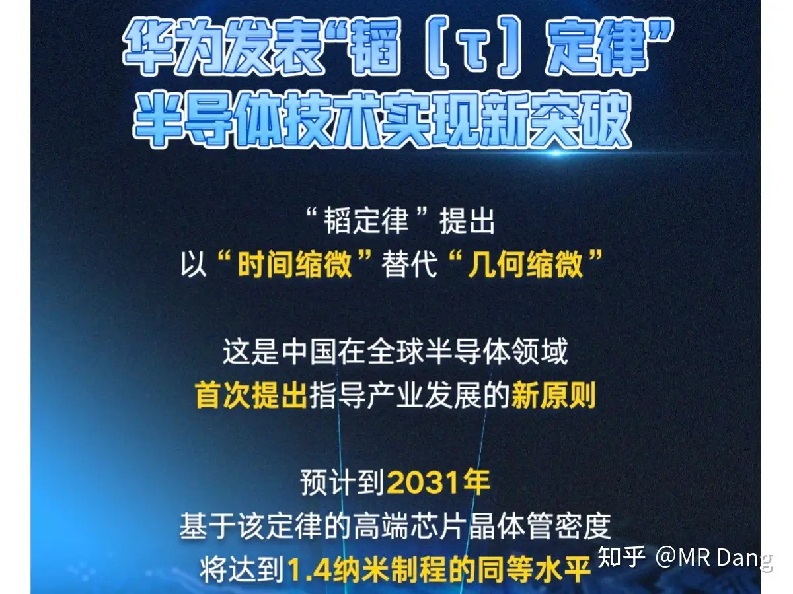
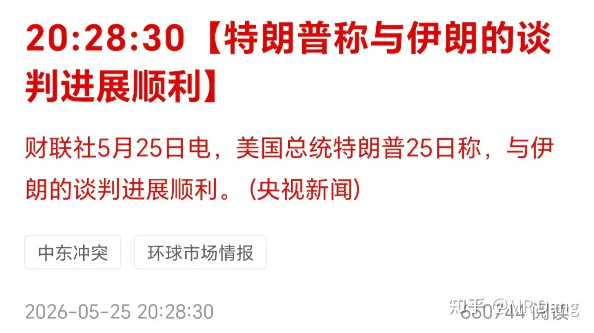
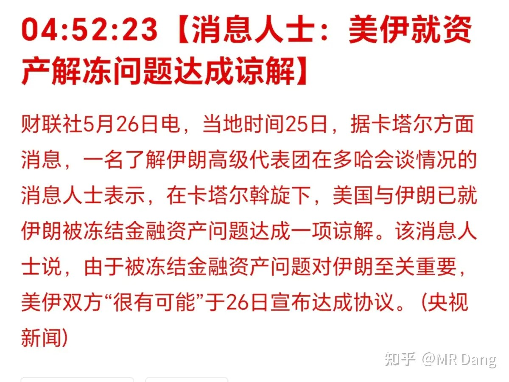
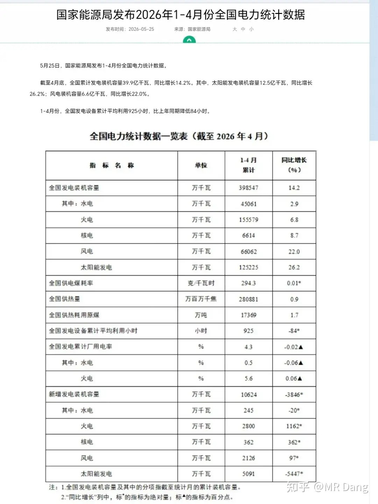
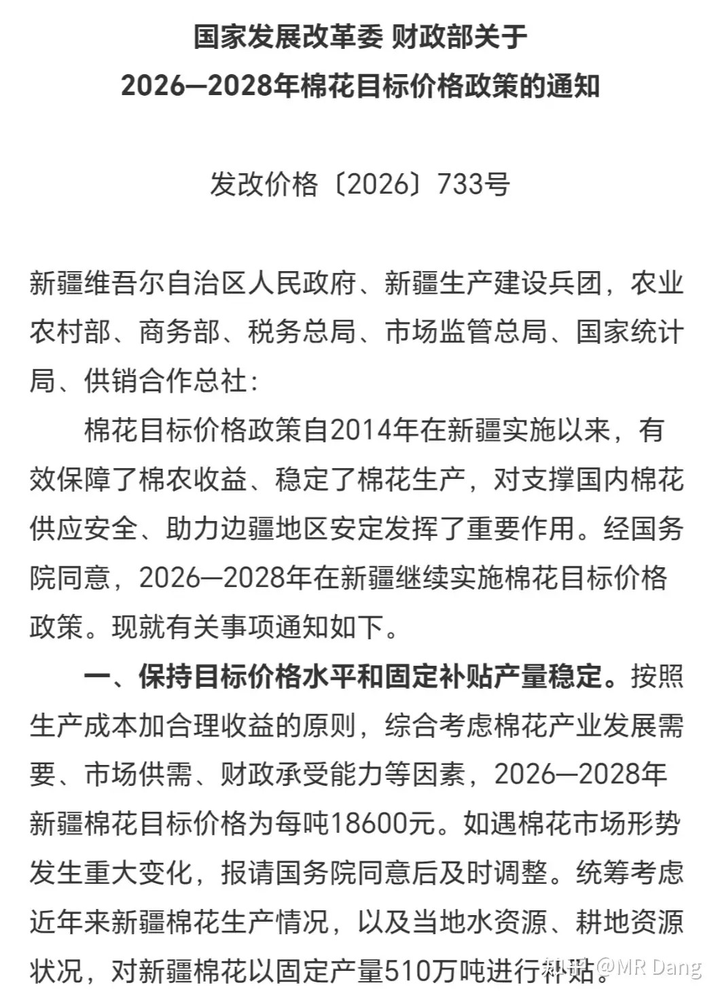
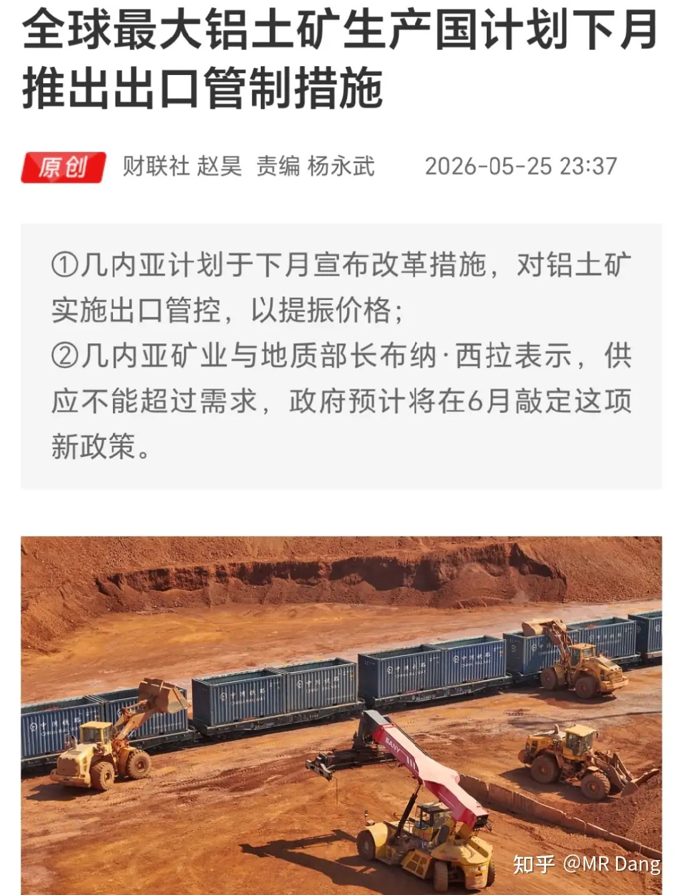
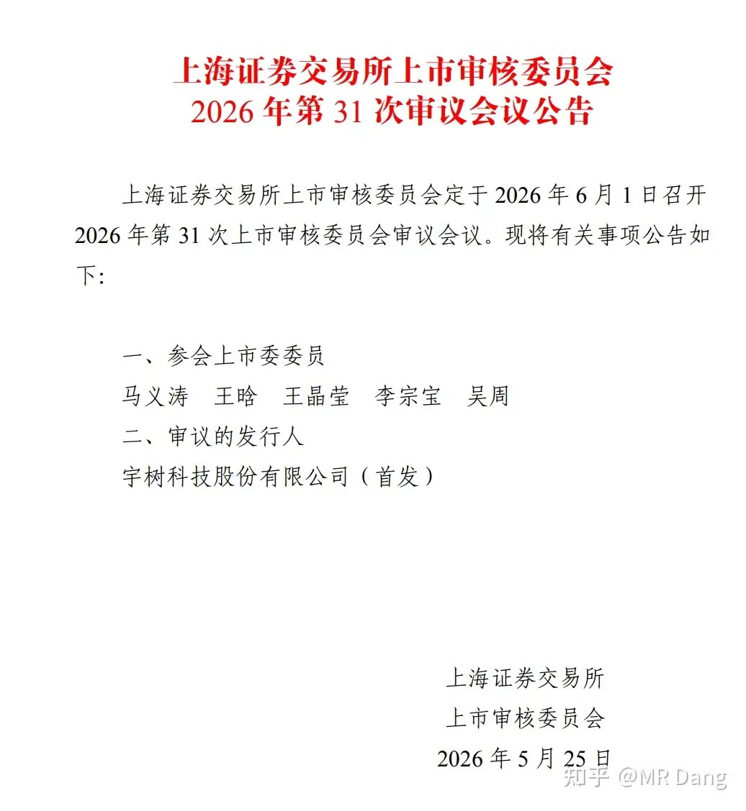
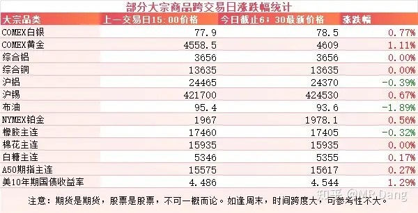
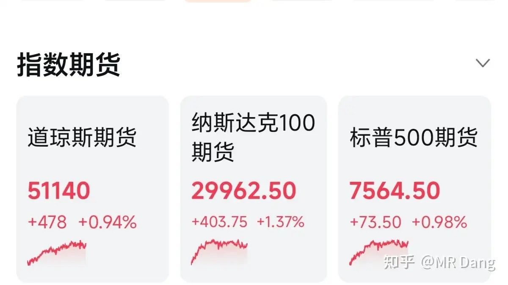
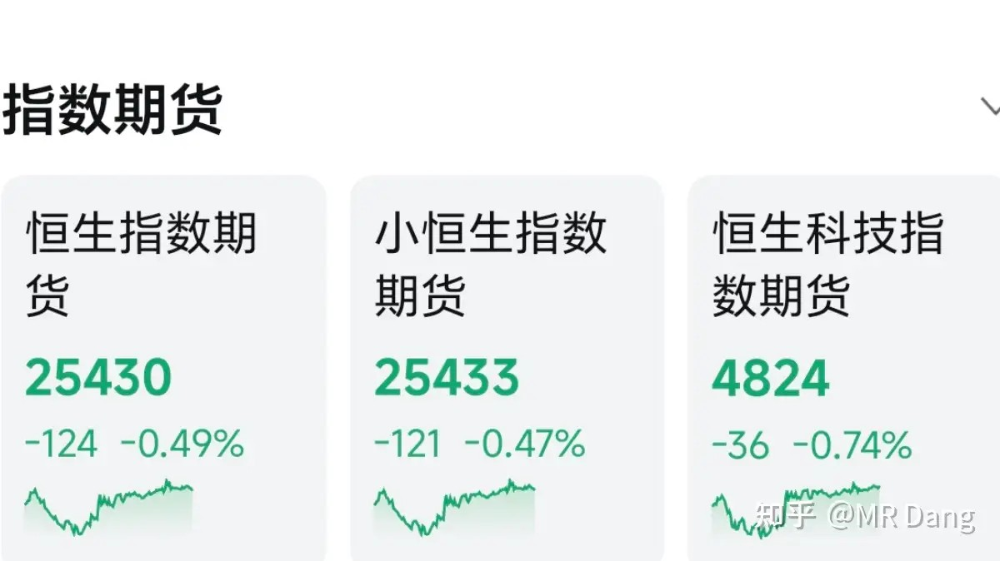

# 怎么看待2026年5月26日A股行情？

---

**发布时间**: 2026-05-26 07:33  |  **原文链接**: https://www.zhihu.com/question/2042146138694964665/answer/2042508662191691569  |  **点赞数**: 358 人赞同

**作者信息**: MR Dang​​知势榜经济与管理领域影响力榜答主

---

## 正文内容

这两天被韬定律刷屏了：

昨天盘前菊花厂发布了一项全新的半导体定律——韬定律。

我们熟知的摩尔定律已经逐渐开始有走到瓶颈的趋势，而韬定律则通过逻辑折叠和先进封装提升半导体的性能。

举个生活化的例子，把半导体性能比做一条高速公路一小时通过的车辆数量，摩尔定律就是把车道做的越窄越好，因为路面是一定的，车道窄了，车道数量就多，通过的车就越多。

但有个问题是，车道不能无限变窄，因为车辆本身不会变窄，车道窄到一定程度，就容易发生剐蹭。

而韬定律是在不增加车道数量的情况下，建设立交桥，拆除红绿灯，加上etc无感支付，改进整个交通系统，就算车道数量少一些，但是也可以在整体通行效率上达到先进的性能水平。

所以在韬定律叙事下，逻辑折叠相关的先进封装和EDA工具就成了新一轮的科技高地。

另外这个2031年达到1.4纳米制程同等水平的表述让人感到挺震撼。

1.4纳米制程几乎是摩尔定律的极限，英特尔的14A大概今年底能达到，三星明年，台积电大概到后年，假设这个2031年可以兑现，那就相当于差距缩小到五年内了。

而目前国内的7纳米大概是台积电2019年的水平，差了有7年左右。

在没有先进光刻机的情况下，差距还能逐步缩小，是一件挺不容易的事，韬定律是在逆境中被逼出来的，符合当前情况的最优解。

至于到底是商业噱头偏多，还是真正的物理定律，对资本市场来说，也不太重要，毕竟还有5年的朦胧期，中间可以发生太多事了。

美伊局势：

懂王现在每天重复谈的很好，但是还没签，如果签不了，就要继续开打这种车轱辘话。

原油价格是对这方面最好的观察窗口，按照最新的价格，市场似乎已经认为谈妥只是时间问题了。

另有消息人士称“很有可能”今天出协议：

能源局数据：

装机容量数据远超发电量数据，装机容量同比增长14.2%。

其中风电和光伏都是二十几的增速。

但是也有一个数字值得警惕，发电设备平均利用925小时，比去年同期降低了84个小时。

这说明现在装机有些过剩，电网还有点跟不上，储能配套也没有跟上。

所以电网，储能这些行业，需求还会增加。

而光伏，风电，可能还要再继续卷一卷，供应有点过剩。

棉花：

有关部门发布文件，对2026到2028新疆棉花的目标价格为18600元，补贴数量为510万吨。

这个基本上保持了政策的连续性，和以前的口径相同。

可能很多人对这个“目标价格”存在误解，认为目标价格就是要让棉花到这个价格。

其实不是的，目标价格是一种保底制度，简单的说，如果实际没卖到这个价，就按这个补贴差价，如果实际卖的比这个多，多了的归棉农。

所以这个政策看两点，一是目标价格的金额，而是补贴的数量。

这两点是核心，和以前相比完全没有变化。

不过后面的表述新增了“引导非优势区域逐步退出种植”。

铝土矿：

几内亚计划下个月改革，对铝土矿进行出口管控。

几内亚是全球最大的铝土矿出口国，占全球出口市场7成左右，如果进行出口管制，会推高氧化铝的成本。

一般来说，这种情况利好有大量出口配额的企业，特别是在几内亚建立了氧化铝厂的，会有适度宽松的优惠政策，比如赢联盟。

具体情况可以看到时候出来的细则，昨晚氧化铝期货已经先涨为敬了。

不过铝土矿是一个买方市场，供远大于求，一旦几内亚的铝土矿涨到失去价格优势，别的地方，比如巴西，澳大利亚，可能会补上这块儿的缺口。

宇树来了：

6月1上会，募资42亿。

希望大家都中签吧，不过如果二级市场炒的不高的话，我也是很有兴趣的，毕竟在机器人这个领域，宇树还是太权威了。

财务数据的话，今年上半年营收预计大概是11亿左右，扣非净利润在2.3亿到2.8亿之间。

大宗商品：

有色整体上属于正常波动，伦铝和铜没开盘，黄金重新站到4600美元上方。

原油回调。

农产品波动不大。

风平浪静的一天。

外围市场：

昨天美股休市，用期指代替下吧：

美三大股指期货涨了一个点左右，外围气氛还不错。

还有港股的：

港股期指看着也还行，不是特别差，不知道今天恒科能不能硬气一回。

昨天个人组合净值纳米红，银行没动，资源红半个，消费绿一个，算电红一个。

严重跑输指数，充当氛围组的一天。

行情挺极端的，指数涨了一个点，结果下跌的股票数量比上涨的还多。

创业板涨了两个多点，结果定睛一看，887家下跌，495加上涨。

拿的东西不一样，持仓体验就差很远。

现在整体就是碳基通缩，硅基通胀。而硅基之所以通胀，是大家相信硅基通胀以后可以更好的帮助碳基生活。

不知道硅基有了自主意识后，会不会也这么想。

现在趁着半导体狂热，市场上很多大股东已经开始减持了，另外巨无霸ipo也在加速推进，为了满足市场对半导体的需求也是煞费苦心，忍痛割爱。

一个喜欢保护韭菜的博主，希望大家少少踩坑，多多赚钱！！！

> [!comment]- 点击展开评论
>
> | 用户 | 时间 | 内容 |
> | :--- | :--- | :--- |
> | 钱包鼓鼓 |  | 每日打卡第57天华为发布韬定律用逻辑折叠加先进封装突破摩尔定律极限，半导体概念短线可跟但大股东在减持别上头发电利用小时降了84小时，电网储能需求会继续增长，但光伏风电供应过剩还没消化完几内亚计划管控铝土矿出口氧化铝期货已先涨，但买方市场下巴西澳大利亚随时补缺口别追涨宇树6月上会募资42亿，营收约11亿扣非净利2.3到2.8亿，打新可参与市场极度分化创业板涨2%但跌的比涨的多，碳基通缩硅基通胀框架下大股东趁半导体狂热减持，巨无霸IPO抽血 |
> | 一米阳光 |  | 我主账户两层仓位的半导体，放着没动，变成接近4成仓位了 |
> | 我是一颗桃子吖 |  | 送出一个礼物～ |
> | &nbsp;&nbsp;&nbsp;&nbsp;MR Dang |  | 桃子，我哭死，你是真爱啊 |
> | lovesummer |  | 我宣布D大指数从今天起止跌回升 |
> | 青峰 |  | 各种高科技狠活来刺激科技的老登股，其他板块的就干看着吧 |
> | Tisstic |  | 咋没人说绿桥了 |
> | &nbsp;&nbsp;&nbsp;&nbsp;Tisstic |  | 今天红了反倒没人说了 |
> | 热乎黏苞米 |  | 我看科技板块的很多人喊，一旦科技完了，牛市就结束了，我想说的是，买股票到底是投资还是投机？牛市结束了，股票全ST，钱都存银行吗？二级市场影响科技发展吗？不买科技不是不相信科技，而是现在科技不正常，难道会有人跑过来告诉你，明天科技才崩，你赶紧跑吗？非要挂在里面才行吗？如果认知提不上去，你跑了也早晚回来把钱掏出去。合理配置仓位，耐心等待，相信价值投资，相信资产创造价值，不断学习，提高 |
> | 爱吃大橙子 |  | 还是那句话，这波搞玻璃基板 |
> | 熹熹玚玚 |  | 评论好像又涨了 |
> | 推理阁 |  | 宏桥终于成红桥了！ |

---

*本文件从MR Dang知乎页面转载*

---

**作者**: MR Dang
**链接**: https://www.zhihu.com/question/2042146138694964665/answer/2042508662191691569
**来源**: 知乎

*著作权归作者所有。商业转载请联系作者获得授权，非商业转载请注明出处。*

## 相关阅读

**每日行情系列：**
- [[20260522-怎么看待2026年5月22日A股行情？|5月22日A股行情]] - 衔接跨境券商与外围风险的前一段市场背景。
- [[20260525-怎么看待2026年5月25日A股行情？|5月25日A股行情]] - 周末大事集中落地后的盘前梳理。
- [[20260527-对2026年5月27日A股市场行情，大家有什么看法？|5月27日A股行情]] - 延续半导体、资源与消费电子的分化观察。
- [[20260528-如何看待2026年5月28日A股行情？|5月28日A股行情]] - 从工业利润、长鑫IPO到市场兑现的后续记录。
- [[20260529-怎么看待2026年5月29日A股行情？|5月29日A股行情]] - 科技与老登板块风格拉扯的进一步展开。

**方法论与工具：**
- [[20260401-读懂财报，看清基本面|读懂财报，看清基本面]] - 回到基本面阅读框架，过滤行情噪音。
- [[20260404-如何分步骤快速看懂上市公司年报？|如何分步骤快速看懂上市公司年报？]] - 用年报拆解公司质量和风险。
- [[20260408-《价值投资功法》新书简介&自荐书|《价值投资功法》新书简介&自荐书]] - 理解 Dang 系列文章背后的投资框架。
- [[20260409-如何看待知乎 2025Q4 财报？知乎终于盈利了？|知乎2025Q4财报解读]] - 财报阅读和平台商业模式的案例。
- [[20260306-小红圈说明书|小红圈说明书]] - 了解更多长文与讨论的入口。
