# 对2026年5月27日A股市场行情，大家有什么看法？

---

**发布时间**: 2026-05-27 07:43  |  **原文链接**: https://www.zhihu.com/question/2042525839712150197/answer/2042873518677872756  |  **点赞数**: 331 人赞同

**作者信息**: MR Dang​​知势榜经济与管理领域影响力榜答主

---

## 正文内容

没什么太重要的事情，从NASA登月说起：

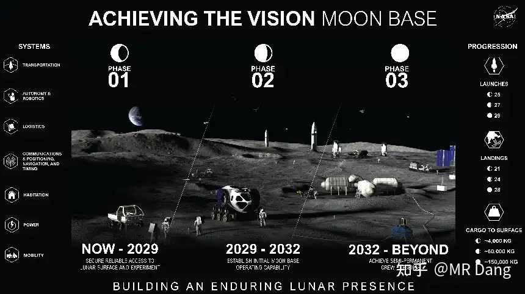

NASA发布了最新的登月计划，准备建立半永久的月球基地。

分为三步走，2029年之前实现初步技术验证，2029年到2032年部署模块化的居住舱，2032年以后建成基地。

和东大的类似计划相比，东大是打算2030年前载人登月，2035年基本建成。

所以假设两边都按计划来，西大大概领先两三年左右。

两边的选址都在南极，到了月亮上就是邻居。选在南极是因为那里有冰，资源丰富。

这个计划之前也有，现在最大的改变是把以前建设月球门户空间站的资源转向了，all in月球地面建设。

总投资大概两百亿美元，正好配合老马的商业航天上市。

这就像要办一场声势浩大的晚宴一样，在正式开始前要暖场，烘托气氛。

但是，天下没有免费的party，晚宴结束的时候，留在场子里的宾客就要买单了。

聪明的投资者可不会等到散场音乐响起来的时候才想起来退场。

美伊局势又生变数：

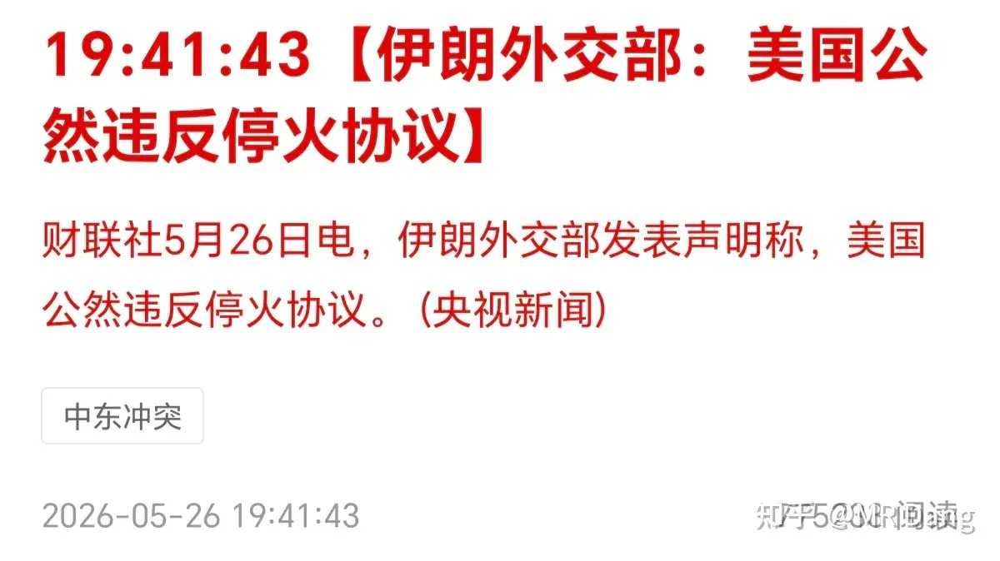

昨天大A盘前西大又把伊朗炸了。

不过西大说自己在“自卫反击”，不算破坏停火。

伊朗在晚间进行了回应，认为这个就是破坏停火。

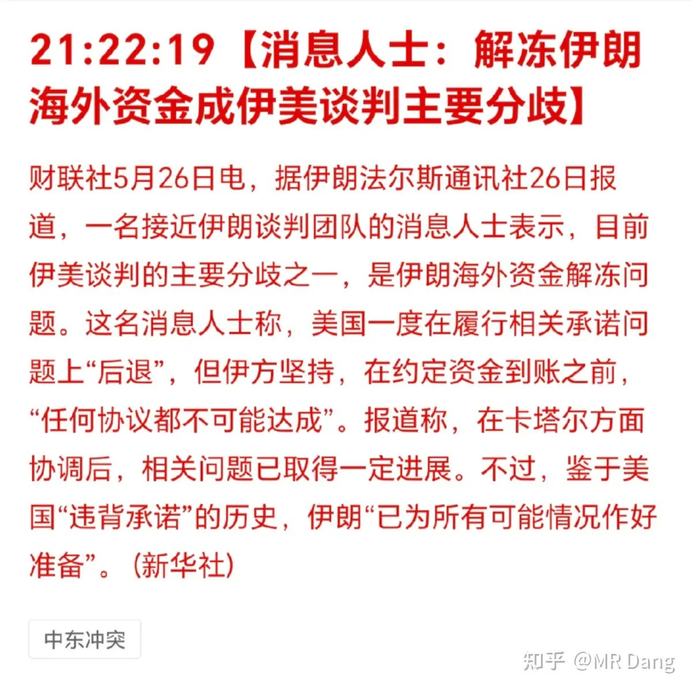

有消息称目前的主要分歧在钱什么时候到账上，伊朗不信任西大，坚持西大先打钱（解封的资产），再开海峡。

马来西亚对投资金条征收10%关税：

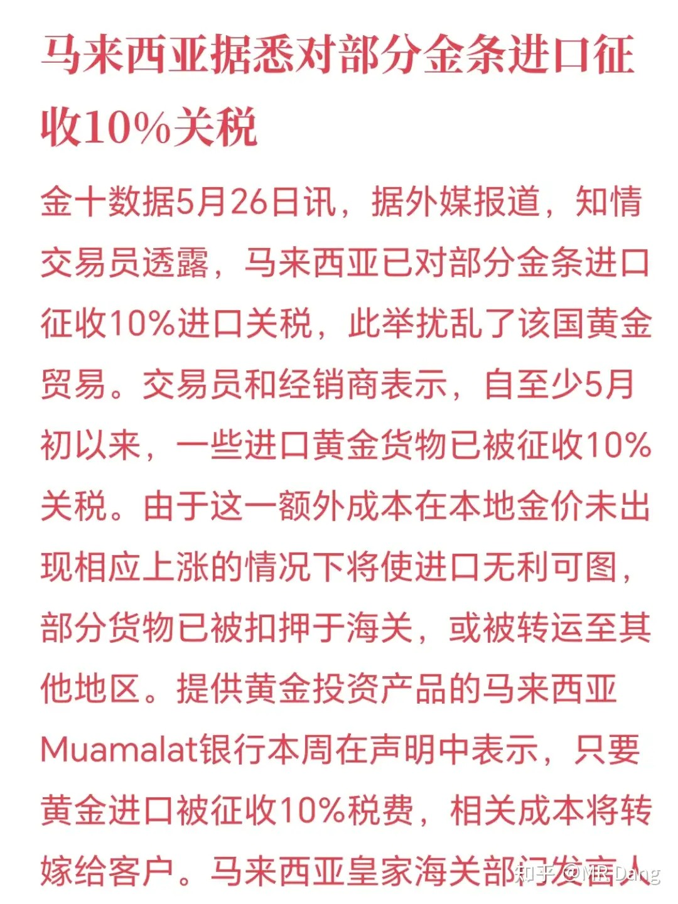

无论哪个国家，国民买投资黄金，就是做空本国货币。

当然买的人不一定会这么想，但是事实上会达到这个效果。

因为黄金就是信用货币的对立面。

同理，普通央行在世界货币体系里，就是普通参与者，而央行的央行，则是美联储。

其他央行买金，就是做空美元。

所以一般国家不会乐见本国国民疯狂买金，就像美联储也对其他央行买金的行为感到不爽一样。

一般这种新闻相当于减少黄金的需求，算是小小利空，马来西亚体量小，实质上没啥影响，更多的是情绪影响。

信通院发布了四月的手机销售数据：

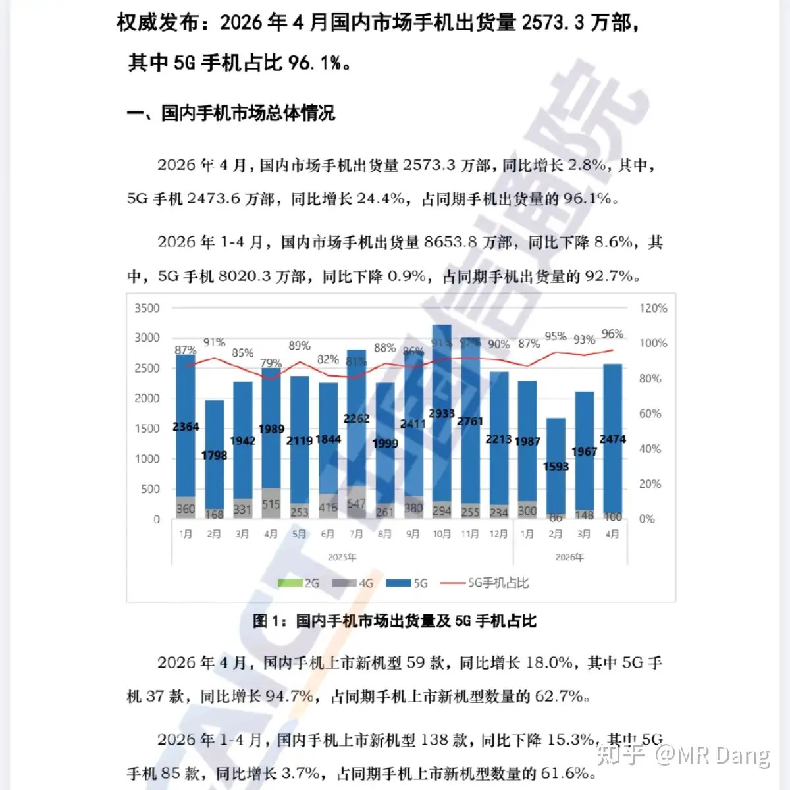

今年第一季度的数据很差，四月相对来说，数据相当不错的，总量是增长的，5G手机也是增长的。

要知道第一季度可是同比下跌的。

所以这可能提示消费电子行业可能有边际改善预期。

不过要提醒的是，因为ai导致存储价格上涨，今年手机厂家面临的困境是成本提升叠加销量下滑，属于困难模式，一个月的好转不代表处境的彻底改善，还是要继续观察618的情况的。

说到手机，刚好某手机厂商发布了一季报：

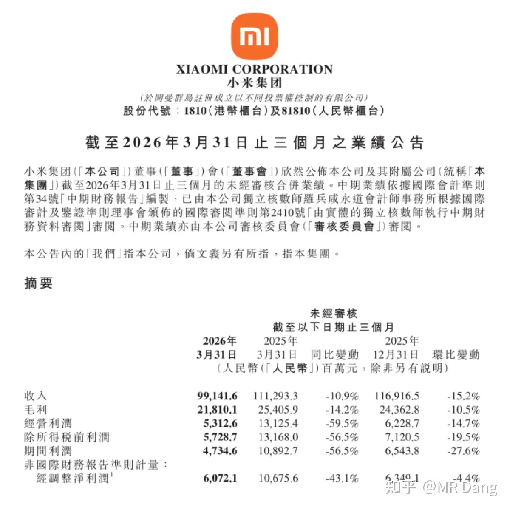

这个业绩，不理想。

营收下滑10%，净利下滑近6成。

一季度手机出货量下降了近两成，和信通院数据也基本对的上。

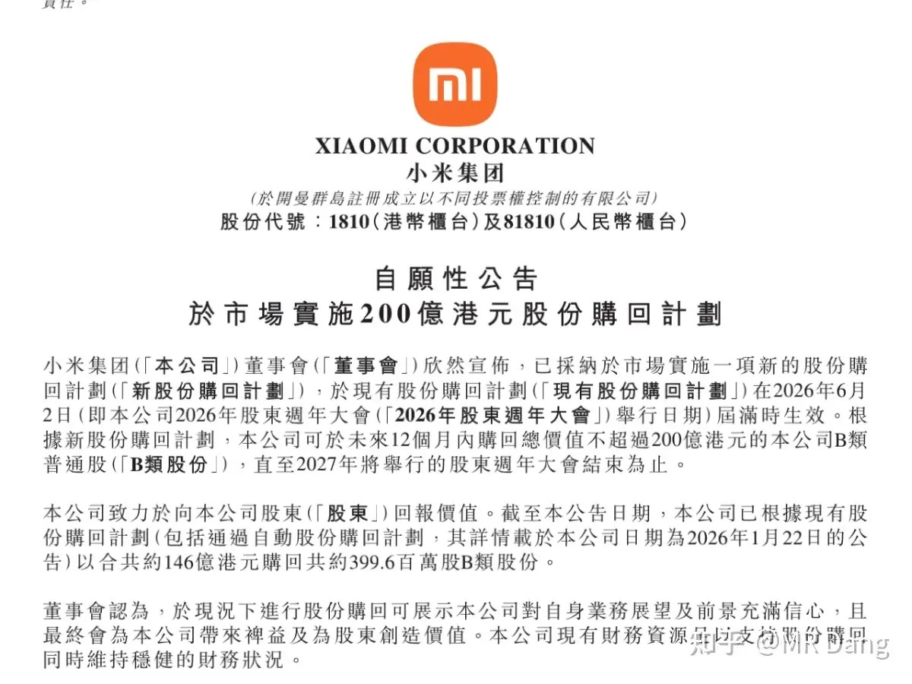

为了安抚市场情绪，该公司又抛出了一份不超过200亿的回购计划。

这个还是挺超预期的，就是不知道这个不超过200亿是怎么个不超过法，最后具体能落地多少。

我个人因为对电车和手机制造在中短期内的预期不乐观，所以是没有这两个行业的仓位的。

大宗商品：

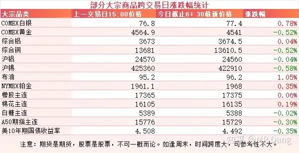

受消息面影响，有色分化，原油上涨。

昨天盘中伦铝创出阶段性新高，一度突破3700美元。

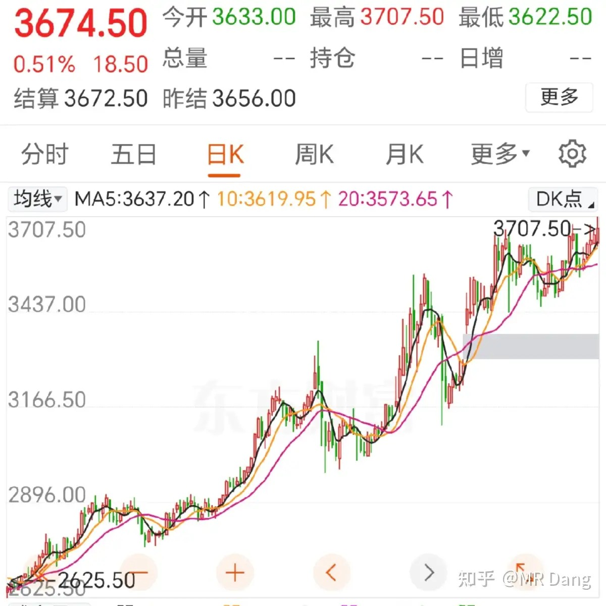

外围市场：

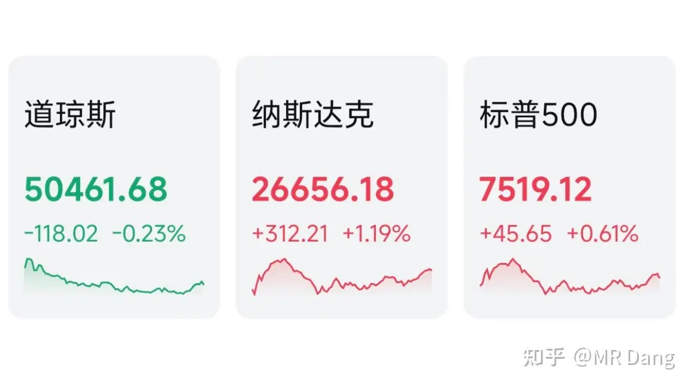

美三大股指涨跌不一，纳指领涨，道指回调。

板块上，存储走强，美光闪迪创新高，商业航天，银行也都表现不错。

昨天个人组合净值回血近一个点，银行没动，资源红五个半，消费红半个，算电绿了两个，电网绿了不少，让算力拉回来一些。

还可以，跑赢指数了起码。

被按在地上的老登终于抬起头喘了口大气。

至于这到底是风格的转换，还是中场休息，就不太好说了，一两天的行情看不出什么端倪。

一个喜欢保护韭菜的博主，希望大家少少踩坑，多多赚钱！！！

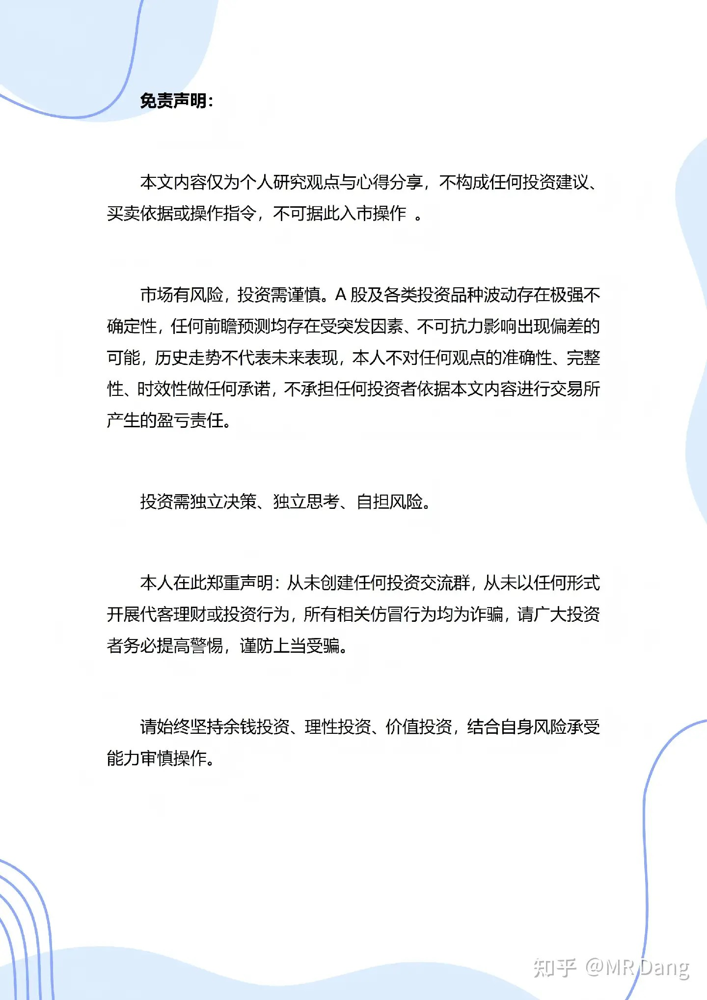

> [!comment]- 点击展开评论
>
> | 用户 | 时间 | 内容 |
> | :--- | :--- | :--- |
> | 一米阳光 |  | 犹记得2021年左右的时候，股票评论区都是年少不知白酒香，错把科技加满仓。短短几年，岁月如梭啊。 |
> | &nbsp;&nbsp;&nbsp;&nbsp;割肉帆 |  | 21年的评论区：天天涨酱香科技，能不能涨真科技啊？今天的评论区：怎么还涨科技啊？ |
> | 钱包鼓鼓 |  | 每日打卡第58天手机数据四月好转但大厂利润跌6成，消费电子别急存储板块逻辑硬但追高有风险伦铝新高突破3700，资源端在走强商业航天概念别贪，设好止盈美伊核心在钱，谈判落地难老登抬头但风格转换不确定，别做大的仓位调整 |
> | 勃斡旋 |  | 已经变成程序人了，主要精力已经变了。 |
> | &nbsp;&nbsp;&nbsp;&nbsp;大梦 |  | Dang大，我发现一个特点，有色里面的股票在连续阴跌到底部的时候会突然来个强反弹涨停，铜陵有色是这样的，贵研铂业也是如此，昨天的铝也是如此，这是为什么呀 |
> | &nbsp;&nbsp;&nbsp;&nbsp;最后的宿命 |  | 安抚韭菜 |
> | &nbsp;&nbsp;&nbsp;&nbsp;大梦 |  | 我已经通过这个吃了两个涨停了 |
> | 韭菜成长记 |  | HQ回调了  这我就安心了 |
> | 开心的张同学 |  | 好公司也需要好耐心来匹配。市场波动是常态，而非风险本身——真正的风险，是在价值尚未绽放之前就被迫离场。用闲置资金投资，给时间留出余地，让自己始终握有等待的权利。 |
> | hong hua |  | D大的算电是哪一支呀 |
> | Y.an |  | 雷布斯，不超过200亿，可能是一亿 |
> | &nbsp;&nbsp;&nbsp;&nbsp;魔刀千刃 |  | 一千万 |
> | hejzhb |  | 那我们央行一个月买十万两黄金算做空RMB吗？ |
> | &nbsp;&nbsp;&nbsp;&nbsp;MR Dang |  | 那是做空美元 |
> | &nbsp;&nbsp;&nbsp;&nbsp;qt不说话 |  | 不认真看，央行买是做空美元 |
> | &nbsp;&nbsp;&nbsp;&nbsp;IamBaymax |  | 央行买是做空本球主货币 |
> | &nbsp;&nbsp;&nbsp;&nbsp;joly |  | 认真看文 |
> | &nbsp;&nbsp;&nbsp;&nbsp;你的朋友佩德罗 |  | 你是用RMB买金，央行是用美元买金，能理解吗？ |
> | 十六 |  | 佬， |

---

*本文件从MR Dang知乎页面转载*

---

**作者**: MR Dang
**链接**: https://www.zhihu.com/question/2042525839712150197/answer/2042873518677872756
**来源**: 知乎

*著作权归作者所有。商业转载请联系作者获得授权，非商业转载请注明出处。*

## 相关阅读

**每日行情系列：**
- [[20260522-怎么看待2026年5月22日A股行情？|5月22日A股行情]] - 回看本轮行情前序的跨境券商与港股风险。
- [[20260525-怎么看待2026年5月25日A股行情？|5月25日A股行情]] - 周末消息、原油与安全生产主题的集中梳理。
- [[20260526-怎么看待2026年5月26日A股行情？|5月26日A股行情]] - 半导体韬定律、铝土矿和宇树IPO的前一日铺垫。
- [[20260528-如何看待2026年5月28日A股行情？|5月28日A股行情]] - 工业利润、长鑫IPO与资金兑现的后续观察。
- [[20260529-怎么看待2026年5月29日A股行情？|5月29日A股行情]] - 科技拥挤交易与老登基金压力的延伸。

**方法论与工具：**
- [[20260401-读懂财报，看清基本面|读懂财报，看清基本面]] - 在行情叙事之外回到财务事实。
- [[20260404-如何分步骤快速看懂上市公司年报？|如何分步骤快速看懂上市公司年报？]] - 适合配合文中的公司财务段落复盘。
- [[20260408-《价值投资功法》新书简介&自荐书|《价值投资功法》新书简介&自荐书]] - Dang 投资体系的总入口之一。
- [[20260422-紫金矿业一季报实现净利润 200.79 亿元，同比大幅增长 97.50%，如何解读「矿茅」的Q1财报|紫金矿业Q1财报解读]] - 资源股基本面分析的实战样本。
- [[20260306-小红圈说明书|小红圈说明书]] - 查看更多长文、评论和方法论补充。
