# 如何看待2026年5月28日A股行情？

---

**发布时间**: 2026-05-28 07:24  |  **原文链接**: https://www.zhihu.com/question/2042883538719135610/answer/2043231272990937613  |  **点赞数**: 385 人赞同

**作者信息**: MR Dang​​知势榜经济与管理领域影响力榜答主

---

## 正文内容

从统计局开始说起：

昨天统计局公布了规模以上企业的前4个月盈利情况。

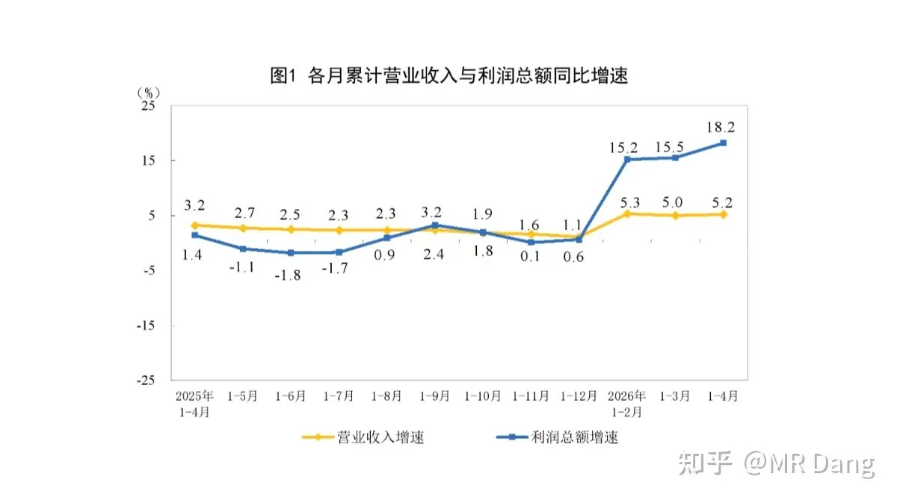

总体数据来看，营收增速放缓，但是盈利能力增强。

分行业情况：

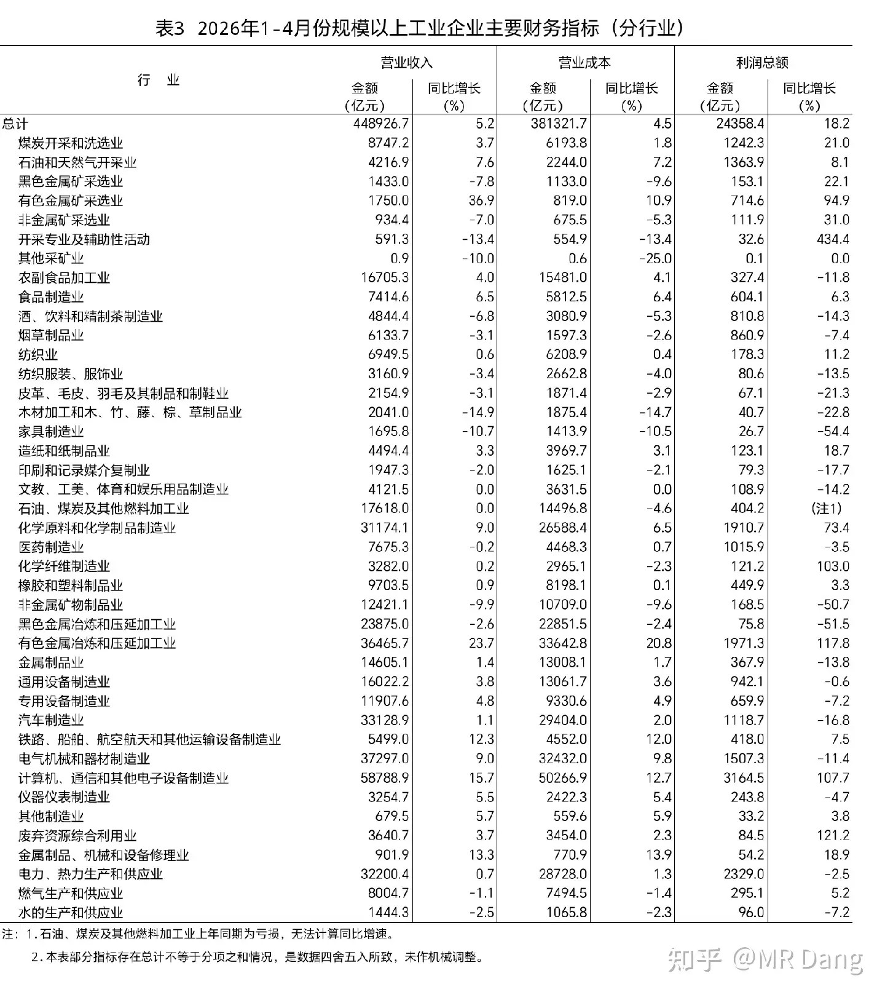

有几个行业表现都不错，四月单月数据明显好转。

香港金监局倒查三年：

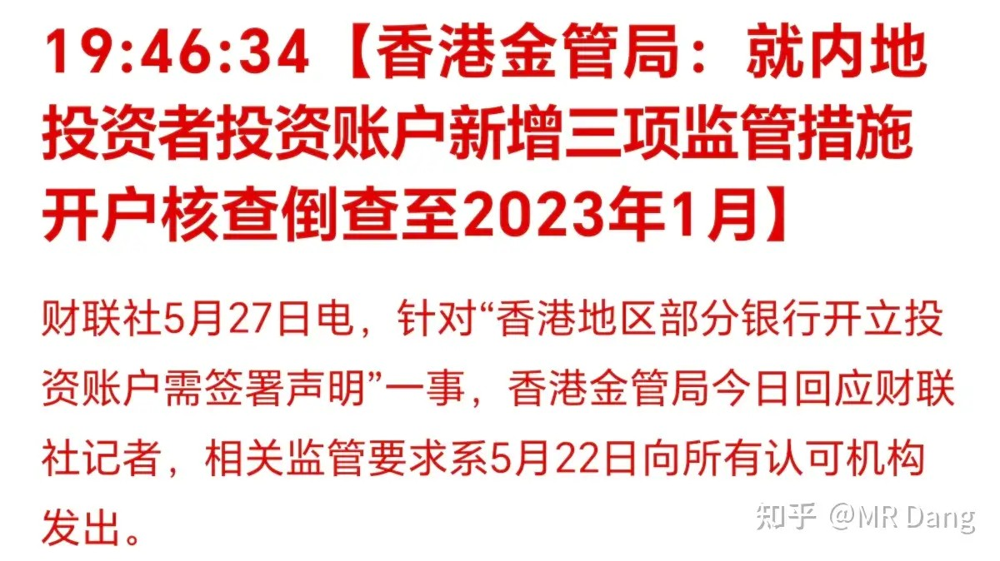

有一些开户的时候用的身份文件有问题的，账户里的钱是真的会被冻结的。

另外还有报道现在开银行卡也需要追查资金来源。

嗯，香港还是学到了内地的先进的资本市场管理理念。

美伊局势：

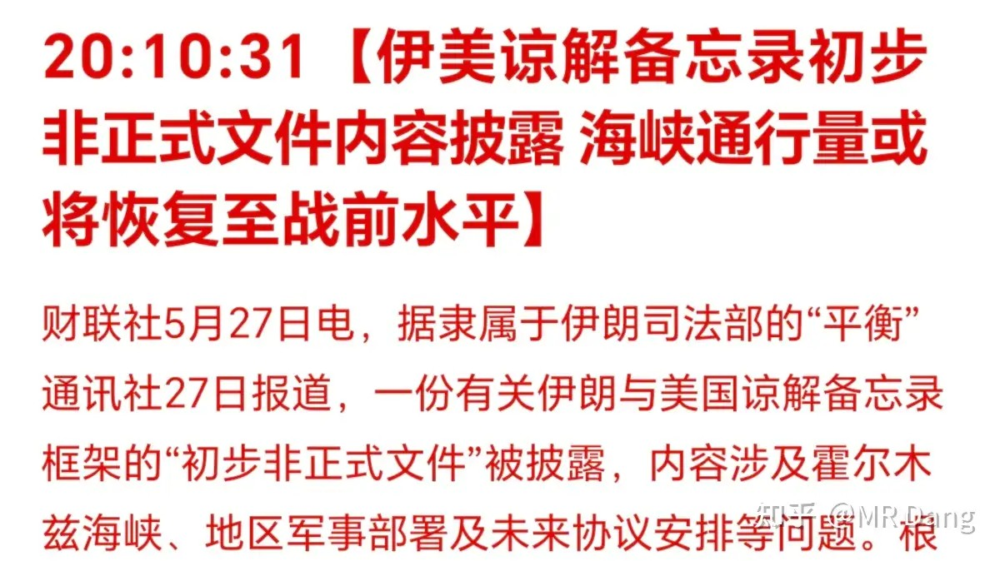

没仔细看，因为是非正式文件，可能还会涂涂改改。

懂王反正是不满意：

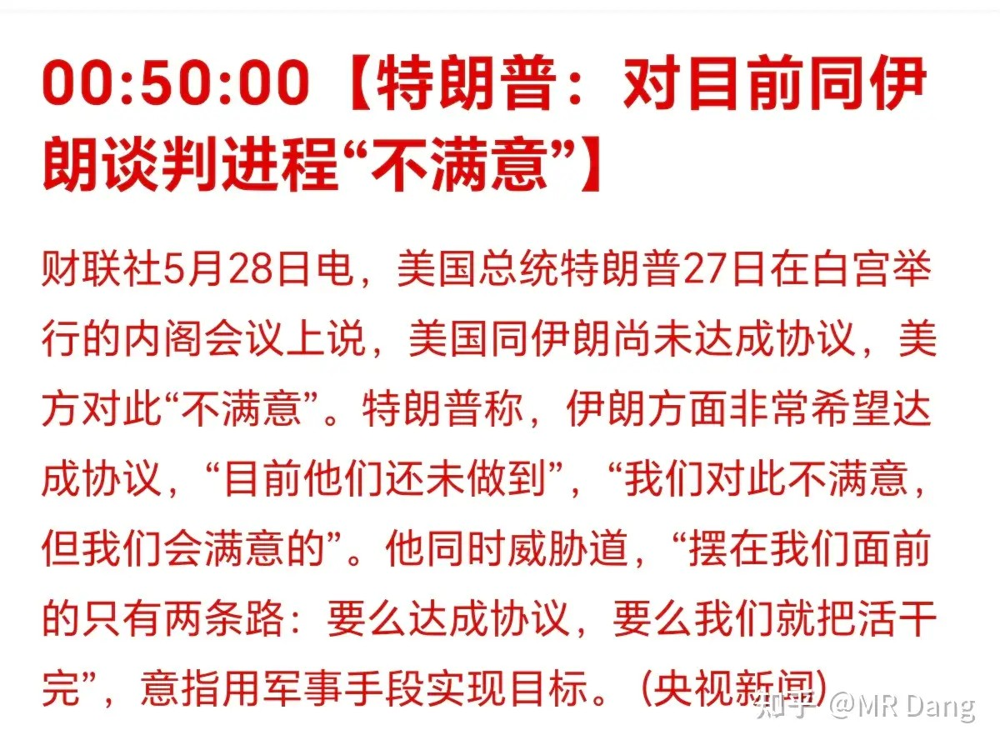

长鑫IPO进展：

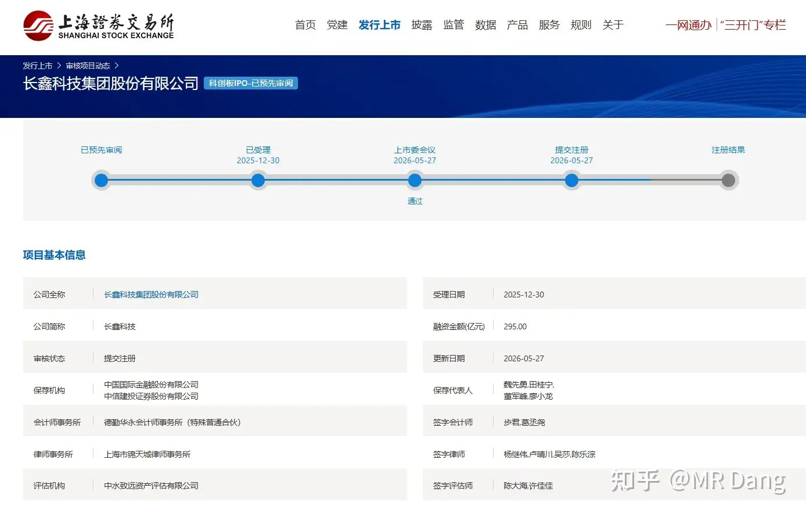

一路绿灯，长鑫ipo光速推进。

同一天上会加提交注册，我印象中前无古人。

大概算一下，注册正常需要10到20个工作日，极限情况下7个就够了。

发行定价需要10到15个工作日，极限情况下可以压低到5个。

挂牌上市需要5到7个工作日，极限情况下三四个就够了。

一切都按照最快的来，15个交易日，大概也就是6月下旬，就能和大家见面了，以解市场的相思之苦。

打新的都盯着点，错过拍大腿。

有个薅羊毛的事情：

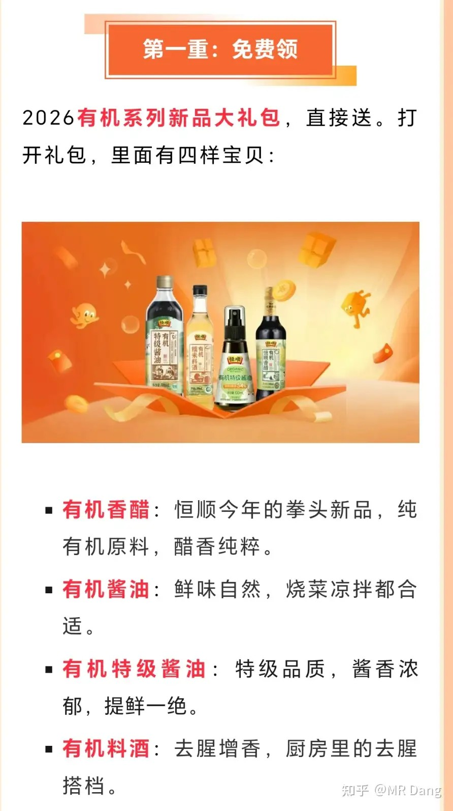

某醋业公司回馈股东，只需要持有100股就送4瓶调味料，宣称价值98，可能有些水分，打个五折可能也值个四五十。

我体验了下兑换的流程，没有什么套路，直接传信息，下单就行。

100股需要700多块钱，如果在活动期间收盘的时候买进去，第二天开盘就卖了，假设股票没有跌很多的话，可以赚点酱油和醋。

我自己目前浮亏三四块，换了四瓶有机调料，觉得性价比还行。

蚊子再小也是肉，不嫌麻烦的可以试一试，直接问ai攻略就行。

提醒一下，套利就套利，薅羊毛就薅羊毛，100股就够了。

别上头，最后变成投机，到时候买到天价调料。。。想想峨眉山上的猴子。。。

段永平成为泡泡玛特第二大股东：

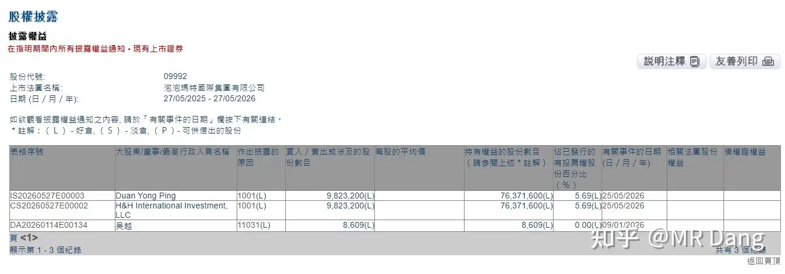

目前持股比例来到了5.69%，以后持股数量变动就要有一定的披露责任了。

这也算大型“真香”打脸现场了。

去年12月的时候，段曾公开表示“看不懂这家公司，不会去买他们家股票”。

今年3月泡泡玛特发布财报后，段表示要收回以前说的话。

4月表示用卖PUT的方式开始抄底。

两个星期前表示用神华换成了泡泡玛特。

现在正式举牌。

段的核心逻辑主要有看好王宁个人作为企业家的能力，看好泡泡玛特的盈利质量，他喜欢毛利高的东西，看好提供情绪价值的商业模式。

昨天还有个挺抽象的公告：

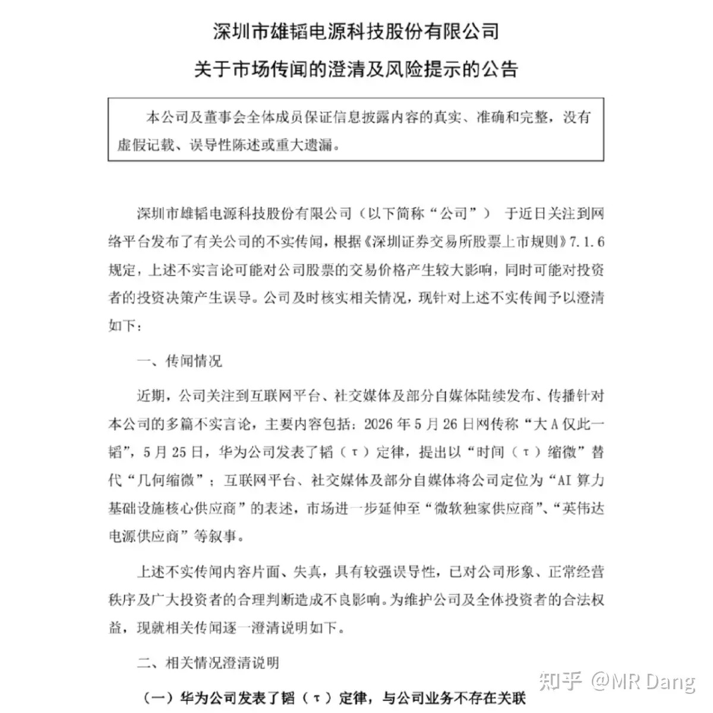

一家名字里带韬的公司，表示自家公司和菊花厂的韬定律没关系。

这家公司火急火燎的发这么有喜感的公告，是因为股价最近被炒的飞起，不得不赶紧出来澄清了。

这个抽象程度，只能说还得是大A，不愧是大A。

大宗商品：

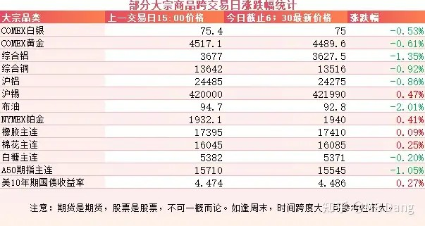

受消息面影响，原油回调，幅度是两个点。

不过有色也跟着回调了，大多数在半个点到一个点之间，这种情况在最近以来属于比较罕见的情况。

表现比较好的有铂和锡，但是涨幅也都不大。

A50期指走弱，似乎预示着今天开盘有点压力。

外围市场：

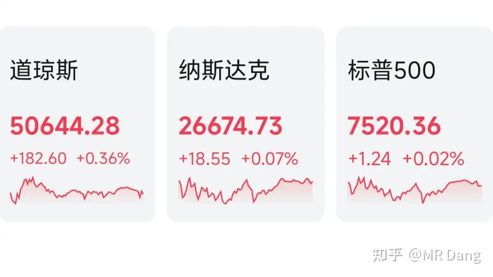

美三大股指收红，道指领涨，存储走强，传统行业也不错，汽车板块强势，中概股也涨了一个多点，蔚来涨了不少。

昨天个人组合净值回撤一个多，银行绿一个，资源绿三个半，消费绿一个多，算电红半个。

基本和指数持平，但是持仓体验挺差的，红利板块直接变成绿帽板块，哗啦啦全是绿的。

看一个是绿的，换一个再看还是绿的，一点开行情，眼镜片都开始反射绿色的光芒。

整个市场下跌的股票数量是上涨的四五倍，所以如果手里八成以上的股票都在跌，不要怀疑自己，恭喜你买到了正宗的大A。

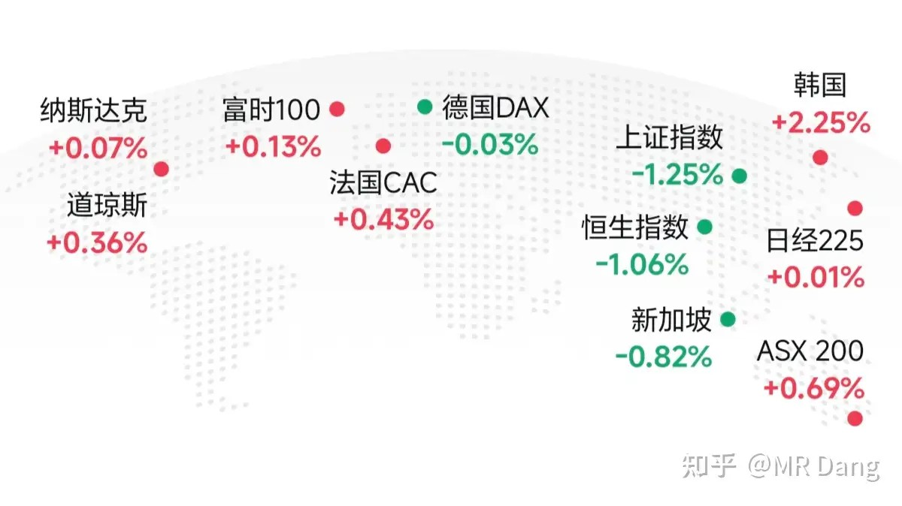

在大A投资还是挺锻炼能力的，这是其他市场无法比拟的优势。

一个喜欢保护韭菜的博主，希望大家少少踩坑，多多赚钱！！！

> [!comment]- 点击展开评论
>
> | 用户 | 时间 | 内容 |
> | :--- | :--- | :--- |
> | 热乎黏苞米 |  | 玩了大A之后，心态更平和了，从拿一个月到不得不拿十年 |
> | 今晚回家吃饭 |  | 昨天整理了反馈股东的好公司，还真是醋性价比优先，一定要给它写产品体验 |
> | &nbsp;&nbsp;&nbsp;&nbsp;当时只道是寻常 |  | 洽洽食品和五芳斋今年还有活动吗 |
> | &nbsp;&nbsp;&nbsp;&nbsp;今晚回家吃饭 |  | 那不知道 |
> | 花开未有期 |  | 大佬都开始打免费酱油了，看来行情是真的拉垮 |
> | &nbsp;&nbsp;&nbsp;&nbsp;MR Dang |  | 哈哈 |
> | &nbsp;&nbsp;&nbsp;&nbsp;请叫我右先生 |  | 这就是为什么消费不能碰的原因 |
> | &nbsp;&nbsp;&nbsp;&nbsp;春风 |  | 好好笑啊 |
> | 钱包鼓鼓 |  | 每日打卡第59天规模以上企业四月盈利数据好转，但市场跌多涨少，资金在兑现利润而非追涨长鑫IPO同天上会+提交注册创纪录，六月下旬挂牌，打新务必盯紧段永平五个月内从看不懂到举牌泡泡玛特，用神华换仓香港金监局倒查三年冻结问题账户，跨境资金口子继续收紧大宗商品全线回调，美伊局势不明朗，相关品种别碰 |
> | 钱多多孪生兄弟钱花光 |  | 我现在就留了一点电力ETF，就连电网设备也都清仓了！看不懂行情，所有人都在押注储存芯片cpo 两千多家公司最近股价比去年四月份还低 汪汪队都在减持 不敢玩  先退了 |
> | TWH |  | 我炒股的目的就是为了锻炼自己的心理素质，从患得患失到波澜不惊， |
> | &nbsp;&nbsp;&nbsp;&nbsp;晴空万里 |  | 咱们彼此彼此 |
> | &nbsp;&nbsp;&nbsp;&nbsp;等待和希望 |  | 我和你不一样，我除了练心理素质，还练技术 |
> | 王飞 |  | 券商这事属于中美同时行动严查，肯定不会轻轻放下 |
> | &nbsp;&nbsp;&nbsp;&nbsp;蔓草 |  | 说明这可能是交易之一，挨中美双打 |
> | 北国神风 |  | 羊毛这个，撸货群里前几天就有发的 |
> | &nbsp;&nbsp;&nbsp;&nbsp;MR Dang |  | 啥玩意儿？撸贷群。。 |
> | &nbsp;&nbsp;&nbsp;&nbsp;MR Dang |  | 哈哈哈。真看错了 |
> | 如来熊掌 |  | 中午补打卡，我这名字太不吉利，被熊掌把脸扇肿了 |

---

*本文件从MR Dang知乎页面转载*

---

**作者**: MR Dang
**链接**: https://www.zhihu.com/question/2042883538719135610/answer/2043231272990937613
**来源**: 知乎

*著作权归作者所有。商业转载请联系作者获得授权，非商业转载请注明出处。*

## 相关阅读

**每日行情系列：**
- [[20260522-怎么看待2026年5月22日A股行情？|5月22日A股行情]] - 对照此前跨境资金和港股风险的市场线索。
- [[20260525-怎么看待2026年5月25日A股行情？|5月25日A股行情]] - 周末宏观与产业消息集中落地的记录。
- [[20260526-怎么看待2026年5月26日A股行情？|5月26日A股行情]] - 半导体热度、资源和机器人线索的前置观察。
- [[20260527-对2026年5月27日A股市场行情，大家有什么看法？|5月27日A股行情]] - 消费电子、资源与商业航天的前一日记录。
- [[20260529-怎么看待2026年5月29日A股行情？|5月29日A股行情]] - 继续追踪科技拥挤交易和基金风格漂移。

**方法论与工具：**
- [[20260401-读懂财报，看清基本面|读懂财报，看清基本面]] - 阅读工业利润和公司公告时的底层框架。
- [[20260404-如何分步骤快速看懂上市公司年报？|如何分步骤快速看懂上市公司年报？]] - 帮助把盈利数据落到公司层面。
- [[20260408-《价值投资功法》新书简介&自荐书|《价值投资功法》新书简介&自荐书]] - 理解价值投资功法的主线脉络。
- [[20260409-如何看待知乎 2025Q4 财报？知乎终于盈利了？|知乎2025Q4财报解读]] - 用平台财报练习盈利质量判断。
- [[20260306-小红圈说明书|小红圈说明书]] - 进入更多 Dang 长文和讨论。
