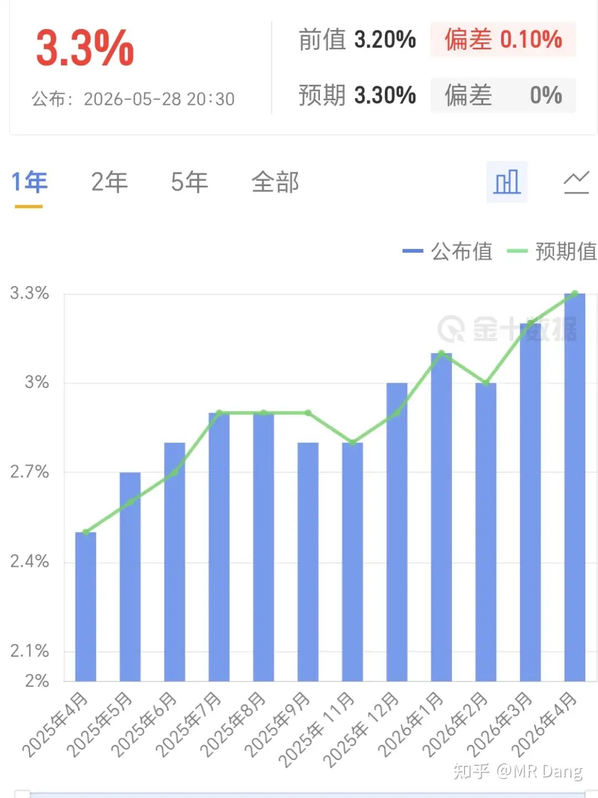
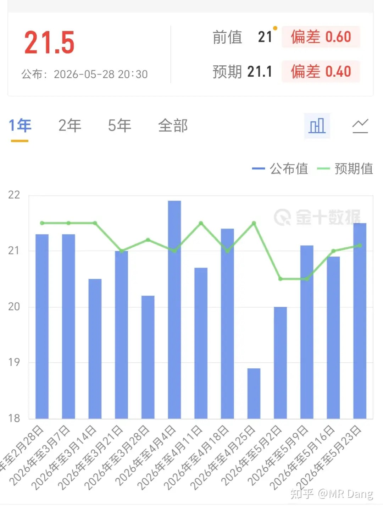
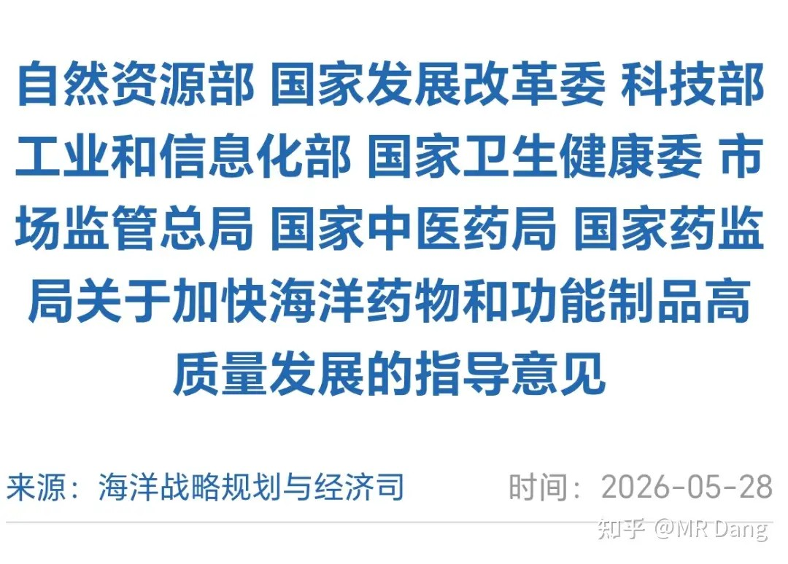
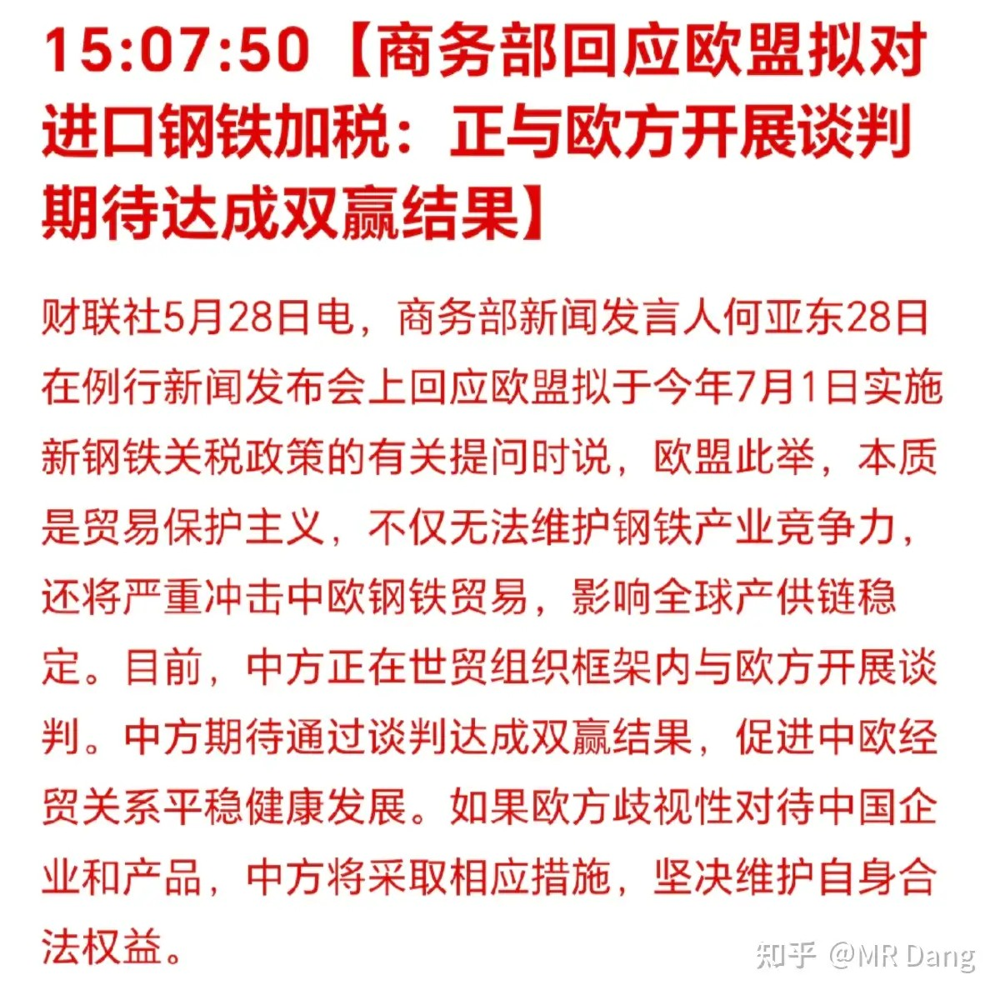
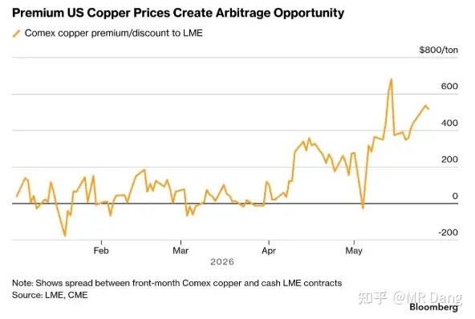
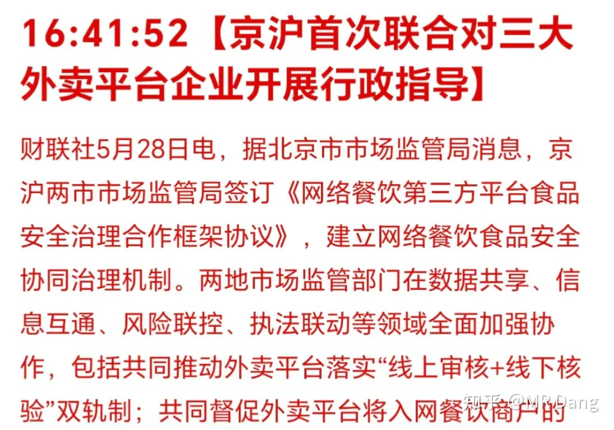
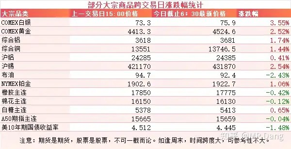
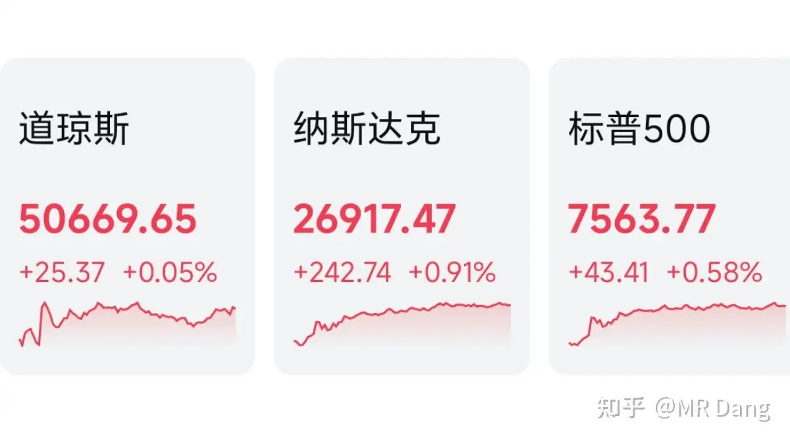
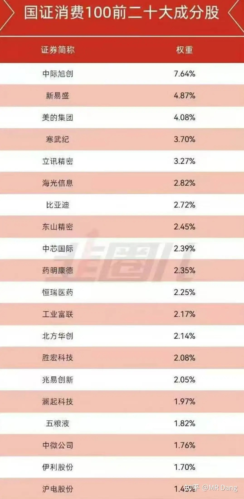

# 怎么看待2026年5月29日A股行情？

---

**发布时间**: 2026-05-29 07:30  |  **原文链接**: https://www.zhihu.com/question/2042146502986953353/answer/2043595013226070895  |  **点赞数**: 354 人赞同

**作者信息**: MR Dang​​知势榜经济与管理领域影响力榜答主

---

## 正文内容

西大发布了核心PCE数据：

3.3%符合市场预期。

同时公布了周初请失业金人数，21.5万人。

前值21万人，预期21.1万人，不及预期。

这个数据显示就业市场可能比较疲软，不利于美联储加息。

数据公布后，有色表现不错。

八部门发布有关海洋药物的公告：

这是国内首次开发海洋生物的政策意见。

提出了到2030年1300亿产业增加值的目标。

具体有四个细分方向，海洋药物，海洋保健品，海洋生物材料，海洋生物制造。

海洋药物这个方向可以找一些海洋来源的创新药，特别是管线已经推进到二期三期的，可能加快进度。

不过这个方向不确定性太大了。

海洋保健品的话，就是磷虾油，鱼油，海藻什么的，感觉不是很好的商业模式。

海洋生物材料，可能指的是医用敷料之类的，这个我也很陌生。

海洋生物制造，可能是一些来源于海洋生物的生物酶之类的。

提法都是很好的，但是落实到投资上感觉有点无处下手，需要再琢磨琢磨。

东大回应钢铁加税：

在无人问津的角落里，钢铁今年可没少跌。

这个行业要想好起来，要向铝学起来，产能卡死，而且把产能从现在往下调。

还得进一步向上争夺话语权，铁矿石这块儿提高议价能力。

还需要房地产的需求起来。

这三个条件，每一个都不容易，都不是旦夕之间可以解决的难题。

伦铜和美铜差价变大，有不少资金正在伦铜买入现货的同时开空美铜仓单进行跨市场套利。

外卖行业迎来联合指导：

好事，作为消费者会更放心一些。

可能会增加外卖企业的一些合规成本吧。

大宗商品：

受消息面和西大经济数据影响，市场对通胀压力担忧有所缓解，原油走弱，有色整体走强。

黄金和白银上涨两三个点，铝，铜，锡也纷纷走强，有一两个点的涨幅。

至于是什么消息，反正就是伊美那点欲拒还迎的把戏，不看也罢。

外围市场：

美三大股指收红，纳指领涨，不过领涨板块从ai硬件变成了ai软件，另外有色，医药也都表现不错。

中概股表现不佳。

昨天个人组合净值回撤一个多，银行绿一个半，资源绿两个，消费绿一个半，算电红两个。

严重跑输指数。

现在板块间分化很严重，我的算电科技含量不算很高，但已经和其他老登板块持仓的体验迥异，给人一种只要拿在手里就能天天涨的错觉。

有点威逼利诱的意思在里面。

老登这边严刑拷打。

科技那边如火如荼。

老登投资者，要么硬着头皮经受各种精神折磨，最后得到一点点可能的奖励。

要么就直接叛逃，立马得到可观的回报。

在这种极限二选一的情况下，最难受的其实还不是散户，而是那些坚守老登的基金经理。

老登板块的基金经理的精神压力比散户大的多，眼睁睁看着基民赎回份额，管理的规模越来越小。

自己的收入还和考核挂钩，考核的业绩比较基准一直在上涨，而自己的业绩就像老登股一样，三天饿两顿。

他们的位置决定了他们不能像散户一样静待花开，所以越来越多的老登板块基金开始涌入科技板块。

这是某消费基金的持仓前20。

另外某著名的白酒基金，现在净值走势也开始科技化了。

有点讽刺啊，以前白酒接了最后一棒的是这帮基民。

如果这轮科技也接到了最后一棒，那也是一种缘分了。

另外最近一些科技战略基金开始密集减持，科技高管也开始密集买房。

啧啧啧

一个喜欢保护韭菜的博主，希望大家少少踩坑，多多赚钱！！！

> [!comment]- 点击展开评论
>
> | 用户 | 时间 | 内容 |
> | :--- | :--- | :--- |
> | 永好 |  | Mr Dang 能坚持每日更新输出，我竟然不能坚持每日阅读学习😂 |
> | 钱包鼓鼓 |  | 每日打卡第60天核心PCE 3.3%符合预期，周初请失业金21.5万超预期走弱老登基金经理被赎回压力逼到集体叛逃进科技，消费基金持仓全面科技化，或许是2021年末赛道股见顶前的剧本重演科技战略基金密集减持叠加高管套现买房，产业资本在高位出货 |
> | 乌鱼子酱 |  | 基金经理的压力大不大看景顺长城的刘彦春就知道了，死猪不怕开水烫的程度堪比一直在磨底的猪周期 |
> | &nbsp;&nbsp;&nbsp;&nbsp;安静 |  | 他的风格就是这样吧，趴着挺好的，时间拉长，比乱接盘的不要强太多，买基金的钱，又不是急用钱，放着啊。只要基金经理足够理智，能力够，根本就不会亏，我13年还是14，忘了，也是在高位买了谢治宇的基金，后来回撤严重，就放着了，几年后就涨回来了。 |
> | &nbsp;&nbsp;&nbsp;&nbsp;momo7752 |  | 张坤亏5年了 |
> | &nbsp;&nbsp;&nbsp;&nbsp;安静 | 21 小时前 | 张坤不算吧，他就白酒，个人感觉他和葛兰水平差不多，不如谢治宇和刘彦春 |
> | 顶级玩家 |  | 大妈心碎了 |
> | &nbsp;&nbsp;&nbsp;&nbsp;三哥数签签 | 18 小时前 | 在AI的帮助下，还真让我找出来了，包钢股份 |
> | &nbsp;&nbsp;&nbsp;&nbsp;Lion |  | 哪个股啊 |
> | 何人不起故园情 |  | 有色是昙花一现还是真的上升预期了 |
> | &nbsp;&nbsp;&nbsp;&nbsp;念瘾 |  | 有色周期已经过了，等科技带崩股市估计有色也要陪着下葬 |
> | Mr.帅 |  | Dang佬，最近外面噪音比较大，您可一定要在知乎更新呀，精神食粮 |
> | 鹿佑 |  | 老登小登这词真是太贴切了吧。老登又倔又嘴硬，小登敢冒险又有希望。 |
> | &nbsp;&nbsp;&nbsp;&nbsp;MR Dang |  | 别骂了 |
> | &nbsp;&nbsp;&nbsp;&nbsp;鹿佑 |  | 诶，我又想到一个，小登老登都像是5 6点钟的太阳。 |
> | 土豆沫儿 |  | 消费基金大幅切换到科技不算违规吗 |
> | 干饭闪电狼 |  | 希望今天能大红 |
> | zscYHF |  | 人在深圳，已经亏麻 |
> | &nbsp;&nbsp;&nbsp;&nbsp;cathy | 20 小时前 | +1 |
> | &nbsp;&nbsp;&nbsp;&nbsp;zscYHF | 15 小时前 | 加油，会回来的 |

---

*本文件从MR Dang知乎页面转载*

---

**作者**: MR Dang
**链接**: https://www.zhihu.com/question/2042146502986953353/answer/2043595013226070895
**来源**: 知乎

*著作权归作者所有。商业转载请联系作者获得授权，非商业转载请注明出处。*

## 相关阅读

**每日行情系列：**
- [[20260522-怎么看待2026年5月22日A股行情？|5月22日A股行情]] - 回看本轮跨境券商与港股风险叙事的前情。
- [[20260525-怎么看待2026年5月25日A股行情？|5月25日A股行情]] - 周末宏观、原油和安全生产线索的集中梳理。
- [[20260526-怎么看待2026年5月26日A股行情？|5月26日A股行情]] - 半导体热度和市场分化的起点观察。
- [[20260527-对2026年5月27日A股市场行情，大家有什么看法？|5月27日A股行情]] - 资源、消费电子和商业航天的中段记录。
- [[20260528-如何看待2026年5月28日A股行情？|5月28日A股行情]] - 工业利润、长鑫IPO和资金兑现的前一日铺垫。

**方法论与工具：**
- [[20260401-读懂财报，看清基本面|读懂财报，看清基本面]] - 在风格漂移和热点切换中回到基本面。
- [[20260404-如何分步骤快速看懂上市公司年报？|如何分步骤快速看懂上市公司年报？]] - 用年报视角校验基金持仓和公司质量。
- [[20260408-《价值投资功法》新书简介&自荐书|《价值投资功法》新书简介&自荐书]] - 阅读 Dang 投资方法论的主入口。
- [[20260422-紫金矿业一季报实现净利润 200.79 亿元，同比大幅增长 97.50%，如何解读「矿茅」的Q1财报|紫金矿业Q1财报解读]] - 资源股盈利质量分析的案例。
- [[20260306-小红圈说明书|小红圈说明书]] - 查看更多长文和补充讨论。
