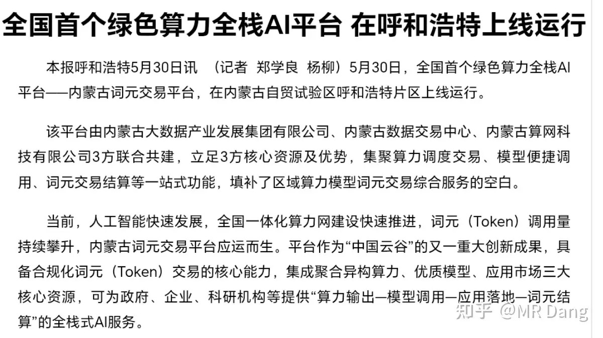
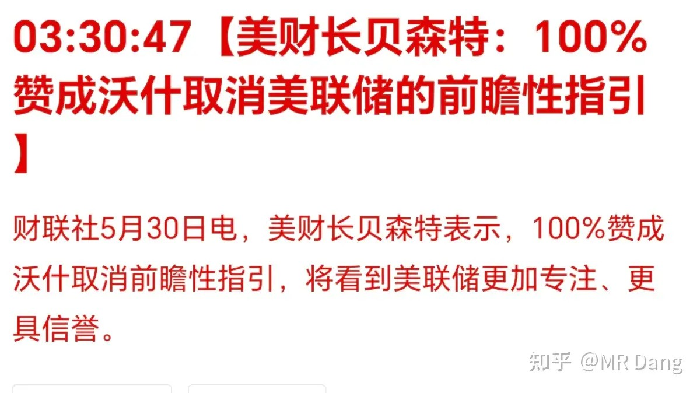
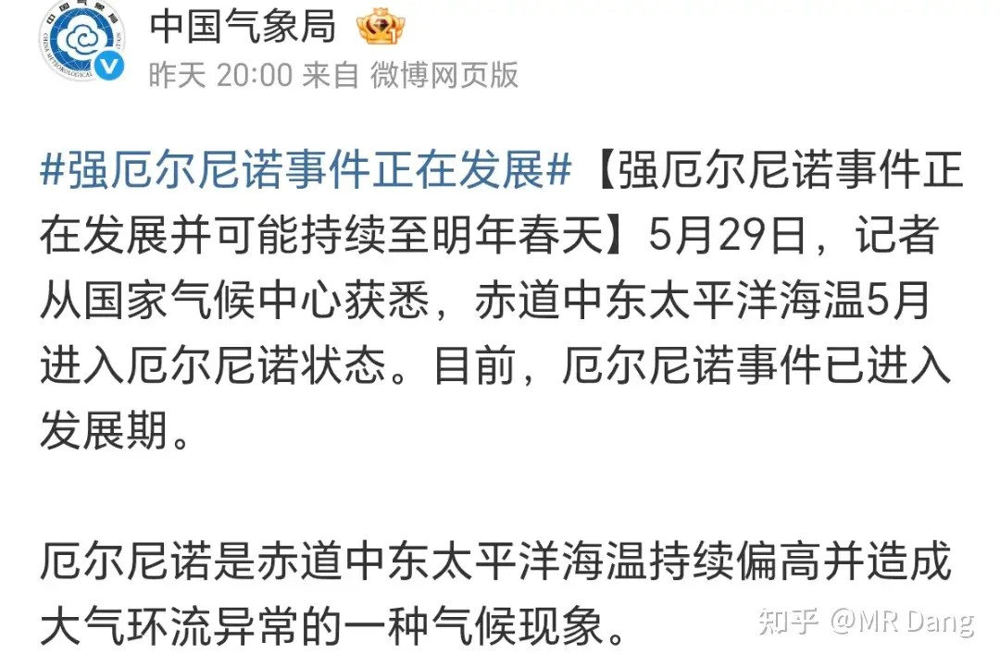
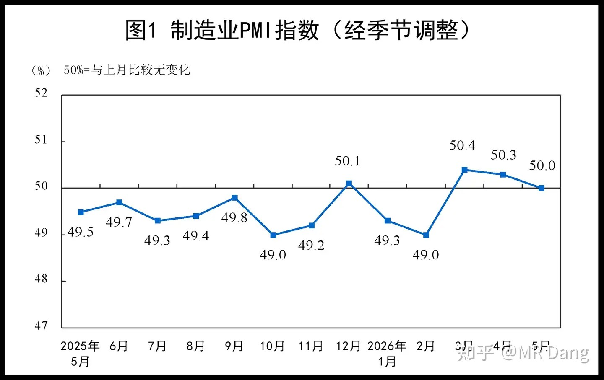
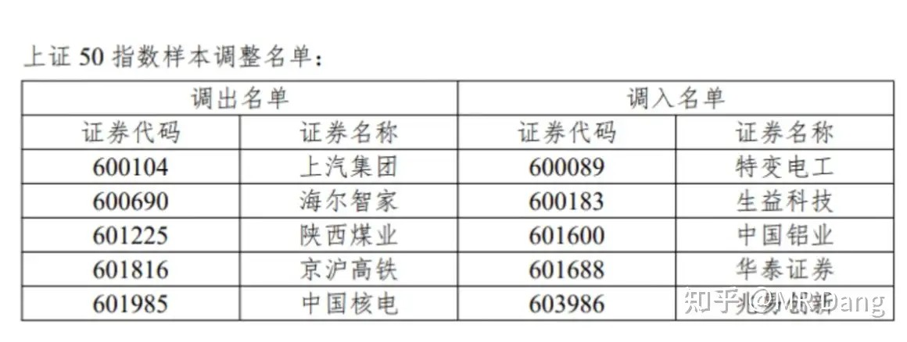
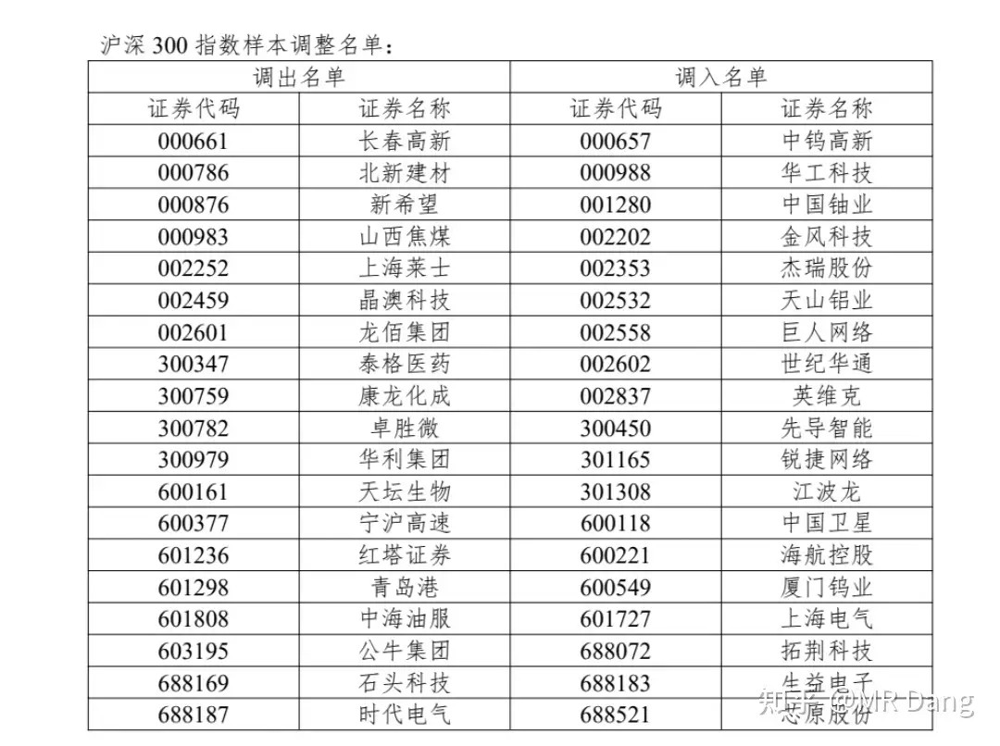
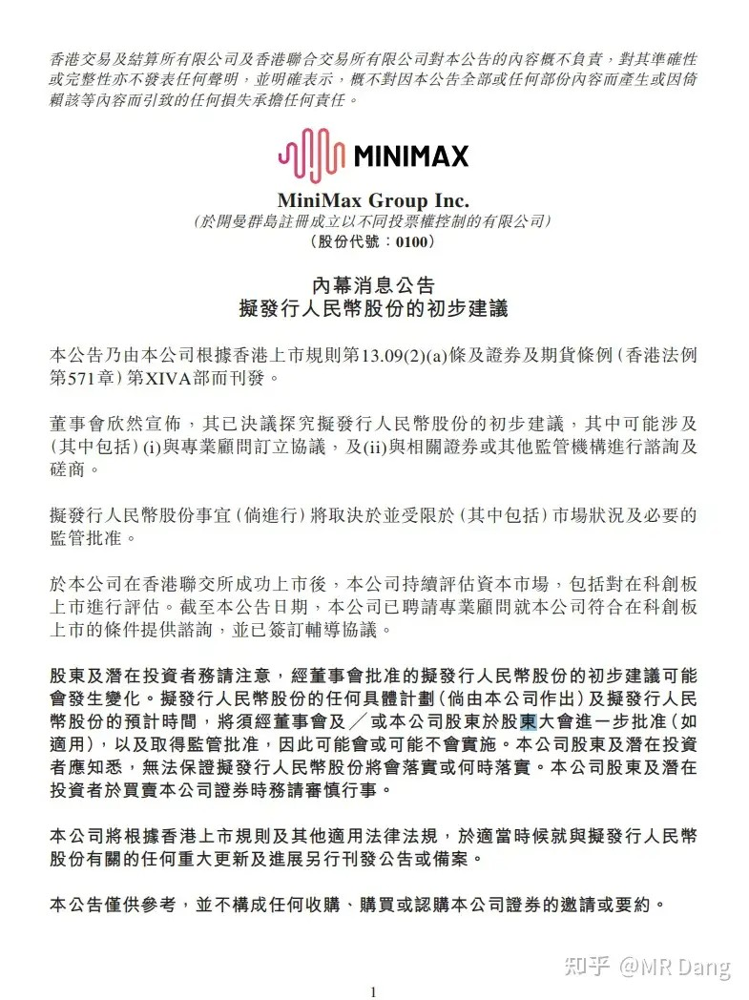
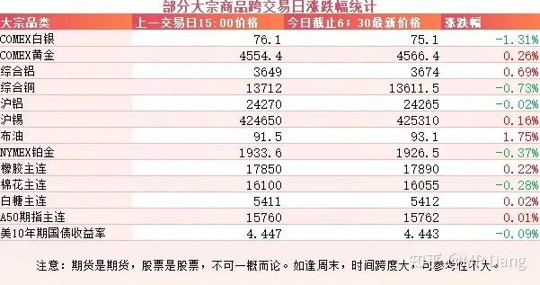
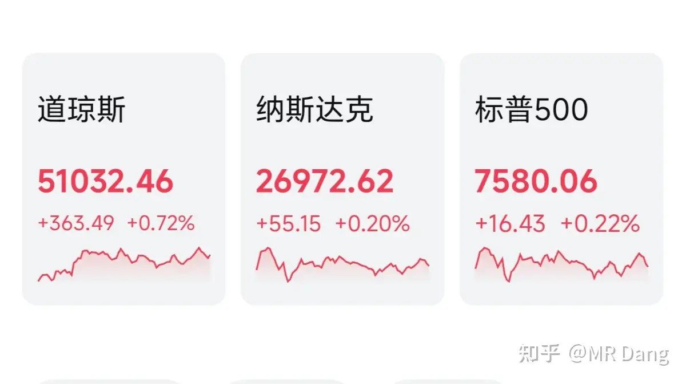

# 对2026年6月1日A股市场行情，大家有什么看法？

---

**发布时间**: 2026-06-01 07:25  |  **原文链接**: https://www.zhihu.com/question/2043613019150841250/answer/2044680969051956253  |  **点赞数**: 392 人赞同

**作者信息**: MR Dang​​知势榜经济与管理领域影响力榜答主

---

## 正文内容

头条还是给到算力吧：

全国第一个绿色算力全栈AI平台在内蒙古上线。

为什么是内蒙古呢？还是因为能源优势，电多，当地的电力股最近涨的挺多的。

贝森特和沃什就取消美联储前瞻性指引达成共识：

所谓前瞻性指引，就是美联储每次表态的时候，会说接下来是要降息还是加息，一年内还有几次降息这样类似的表述，包括点阵图这样的工具。

举个例子，就像开车的时候，导航会告诉你前方3公里右转，请提前进入右转车道。

这样的好处是，开车的时候有个预期，可以提前规划。

坏处是，假设这三公里内发生了什么意外，比如前面路堵了或者交通事故了，来不及躲闪。

沃什要做的就是取消这个导航，随时以目前的交通状况去判断到底是直行还是右转。不再提前变道，司机就要打起十二分精神，随时存在变道的可能性。

如果真的取消了前瞻性指引，那西大的经济数据，比如非农，比如失业，比如通胀，影响程度会大大增加。

美联储看到经济过热，可能随时加息，或者看到经济不景气，也可能随时降息。

不过美联储也不是沃什一个人说了算，这事推进起来可能没那么容易。

厄尔尼诺基本得到气象局确认：

相关的投资方向主要是电力，制冷剂，农产品，有色。

PMI指数发布：

制造业50.0，刚好处于临界线，比预期稍微低一些，显示制造业景气度一般。

上周五收盘后，指数发生了一些调整。

比较重要的有沪深300和上证50：

上证50调入的基本上都是Ai相关的，从上游工业金属，到覆铜板，电网，存储之类的，再外加一个券商。

而调出的就是一些老登板块。

上证50今年经常跑不赢其他指数，现在加入了这几员大将，也许表现能更好一些。

沪深300也是差不多的理念，调出的板块里创新药占比比较多，另外还有一些传统制造业，比较老登。

调入的则是有色，Ai相关，以科技和资源为主。

两个指数调仓的结构也反应了我们的经济发展正在进行快速的产业升级。

Minimax来大A上市：

MINIMAX的管理有点草台班子的，公告里自家公司代码都敲错了，五位数的00100打成了四位数0100

另有消息称智谱也要来大A，两边都快马加鞭，牟足了劲满足投资者的期盼。

为什么这么多科技公司都热衷于来大A上市呢？

主要是因为A股市场相对其他资本市场有很多得天独厚的优势。

比如估值高，A股市场动不动就能给出百倍pe甚至千倍pe的估值，其他市场远不及也。

比如承载力强，其他市场面对这种连续巨无霸ipo，除了美股以外，几乎没有任何市场能扛得住，但是A股就可以。

比如对上市企业更宽容，我们这个市场深知科技是第一生产力，所以不要求高科技企业对投资者有什么现金回报，也不要求回购，甚至不要求一定能盈利，显示了我们市场更高的包容度。

优点实在太多了，企业都以在A股上市为荣，也就不奇怪了。

大宗商品：

受消息面影响，原油有所反弹，有色有点分化，但是整体波动幅度不大。

农产品表现一般。

外围市场：

上个交易日美三大股指收红，道指领涨。

板块上也非常极端，软件领涨，银行也还行，其他大多数板块表现不佳。

上个交易日个人组合净值红了两个多点，银行两个多，消费三个多，资源微红，算电四个点。

对我来说算是回了一口大血，非常满意，毕竟指数表现不佳，能有这种表现还挺惊喜的。

也不知道怎么搞的，明明是做多大A，持仓体验简直就像是做空指数一样。

我个人其实不反感科技，我只是本能的抗拒估值贵的东西，恰好现在科技估值高，所以这段时间一直对科技谨慎，时不时的发发牢骚。

这轮科技行情其实还有个隐患。

就是二次分配的问题。

如果只看财富流动方向的话，这轮科技牛，财富是从基民，股民流向了科技从业者，战投基金。

但问题是科技不是一个靠人数堆起来的行业，它是一个精英为主的行业。

所以财富集中度其实是上升的。

这对消费不是好消息。

苏杭地区的豪宅销售火爆，就是这些科技新贵的钱已经多到没地方容纳了。

一万个散户成就一个科技新贵，科技新贵买一套豪宅享受去了。如果把这一万零一个人看成一个整体，总体消费能力是明显下降的。

为什么呢。。。因为豪宅的价值主要是地皮，兜兜转转这些钱又转回土地财政了。

本周前瞻：

1，今天黄仁勋有一个重要的有关Rubin架构的演讲，可能随便一个对产业的表态，就会造成相关科技产业链的震动。

另外达子还会推出一个整合了ARM的面向pc消费端的芯片N1X，x86系统迎来强劲对手。

2，西大周三公布ADP就业人数

3，西大周四公布周初请失业金人数

4，西大周五公布5月失业率和非农数据。

5，周日公布咱们这边的外汇储备。

6，本月的不确定性显著增加，巨无霸扎堆上市。

从后视镜来看，以往类似情况对流动性影响挺大，大家谨慎为妙。

一个喜欢保护韭菜的博主，希望大家少少踩坑，多多赚钱！！！

> [!comment]- 点击展开评论
>
> | 用户 | 时间 | 内容 |
> | :--- | :--- | :--- |
> | 将离 |  | 比如对上市企业更宽容，我们这个市场深知科技是第一生产力，所以不要求高科技企业对投资者有什么现金回报，也不要求回购，甚至不要求一定能盈利，显示了我们市场更高的包容度。优点实在太多了，企业都以在A股上市为荣，也就不奇怪了。这...太会说话了哈哈哈哈哈 |
> | &nbsp;&nbsp;&nbsp;&nbsp;珍惜未来 |  | 散户多，梦想多 |
> | &nbsp;&nbsp;&nbsp;&nbsp;stranding |  | 正话反着说 |
> | &nbsp;&nbsp;&nbsp;&nbsp;Wellful |  | 这就是汉语言的博大精深之处呀 |
> | &nbsp;&nbsp;&nbsp;&nbsp;我是一颗桃子吖 |  | 打这段话的时候d哥自己笑了没有 |
> | 钱包鼓鼓 |  | 每日打卡第61天内蒙古上线全国首个绿色算力AI平台，厄尔尼诺获气象局确认，上证50和沪深300调入AI股、调出老登股美联储贝森特和沃什要取消前瞻性指引，本周非农等数据扎堆公布，加上巨无霸IPO密集上市，流动性风险和市场波动都会显著放大MiniMax和智谱争相来A股上市，A股估值高承载力强对企业宽容，但这些优势是散户撑起来的，科技公司圈钱散户接盘这轮科技牛的财富流向是散户流向科技精英，科技新贵买豪宅钱回土地财政，整体消费能力下降，消费板块长期逻辑被压制PMI刚好50.0临界线比预期低，制造业半死不活和科技火热形成鲜明对比 |
> | &nbsp;&nbsp;&nbsp;&nbsp;moo vander |  | 简洁扼要 爱了 |
> | 慕之 |  | 我桥没有调入 |
> | 如来熊掌 |  | 今天是各位宝贝的节日，虽然家里孩子不小了还是叫宝贝叫习惯了 |
> | 得鹿梦鱼 |  | 一个个巨头来大 a 上市不得把流动性都抽干啊，看样子老登股还得跌 |
> | reckless |  | 港股代码几乎都是0开头 所以少打一个也可以理解 比如我们口头讲阿里港股一般是9988 不会讲09988 不过书面还是得严谨一点 |
> | 铭硕 |  | 为啥没人考虑电力，电力涨好久了 |
> | uuz |  | 评论越来越少了 |
> | &nbsp;&nbsp;&nbsp;&nbsp;Outlaws | 2 小时前 | 控评越来越严重了 |
> | 普通人没故事 |  | 同志们今天的铝是怎么回事。 |
> | &nbsp;&nbsp;&nbsp;&nbsp;四岁 |  | 只有绿桥吧，开盘吓尿了 |

---

*本文件从MR Dang知乎页面转载*

---

**作者**: MR Dang
**链接**: https://www.zhihu.com/question/2043613019150841250/answer/2044680969051956253
**来源**: 知乎

*著作权归作者所有。商业转载请联系作者获得授权，非商业转载请注明出处。*

## 相关阅读

**每日行情系列：**
- [[20260526-怎么看待2026年5月26日A股行情？|5月26日A股行情]] - 回看半导体热度、资源和机器人线索的前序铺垫。
- [[20260527-对2026年5月27日A股市场行情，大家有什么看法？|5月27日A股行情]] - 对照资源、消费电子与商业航天的市场分化。
- [[20260528-如何看待2026年5月28日A股行情？|5月28日A股行情]] - 工业利润、长鑫IPO与资金兑现的后续观察。
- [[20260529-怎么看待2026年5月29日A股行情？|5月29日A股行情]] - 科技拥挤交易和老登基金压力的延伸记录。
- [[20260602-如何看待2026年6月2号的A股行情？|6月2日A股行情]] - 继续追踪伊美局势、科技风格与恒科边际变化。

**方法论与工具：**
- [[20260401-读懂财报，看清基本面|读懂财报，看清基本面]] - 在热点行情中回到公司基本面。
- [[20260404-如何分步骤快速看懂上市公司年报？|如何分步骤快速看懂上市公司年报？]] - 用年报框架过滤概念叙事。
- [[20260408-《价值投资功法》新书简介&自荐书|《价值投资功法》新书简介&自荐书]] - Dang 投资体系和价值投资功法入口。
- [[20260422-紫金矿业一季报实现净利润 200.79 亿元，同比大幅增长 97.50%，如何解读「矿茅」的Q1财报|紫金矿业Q1财报解读]] - 资源股财报与周期判断的案例。
- [[20260306-小红圈说明书|小红圈说明书]] - 查看更多长文和补充讨论。
