# 如何看待2026年6月2号的A股行情？

---

**发布时间**: 2026-06-02 07:26  |  **原文链接**: https://www.zhihu.com/question/2043746333698287574/answer/2045043668722128337  |  **点赞数**: 336 人赞同

**作者信息**: MR Dang​​知势榜经济与管理领域影响力榜答主

---

## 正文内容

伊朗局势生变：

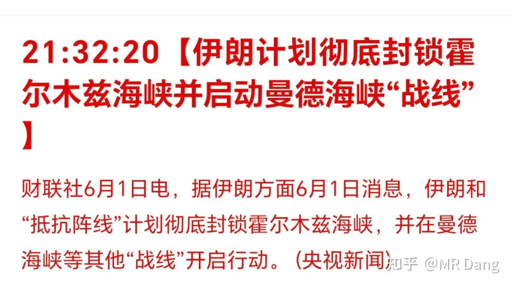

有报道称谈判破裂，伊朗计划彻底封锁霍尔木兹海峡。

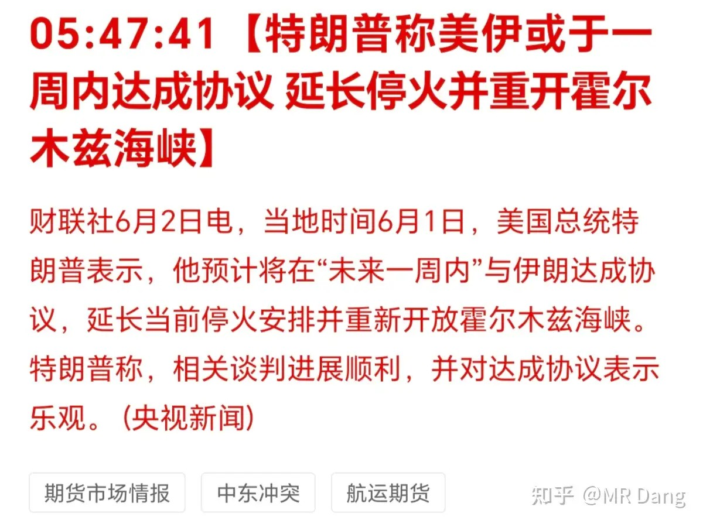

懂王却说谈判正“快速推进”，一周内达成协议。

主要是最近以色列又开始打伊朗小弟了，伊朗也没什么太好的办法，只能又用封闭海峡这招去给懂王施压。

算力又有新动向：

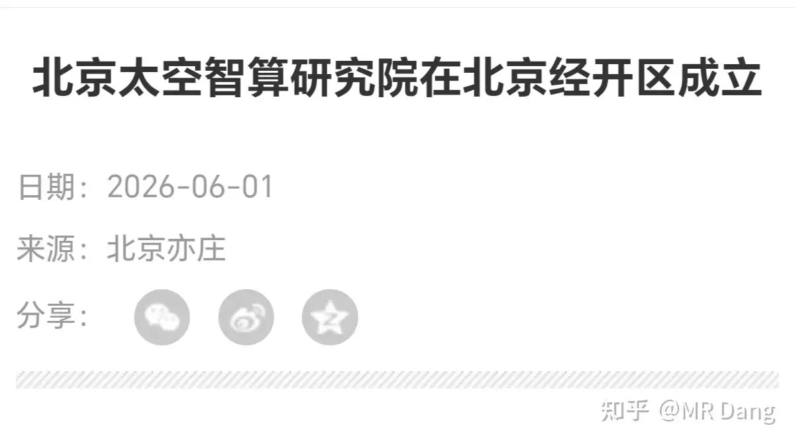

太空智算研究院正式成立。

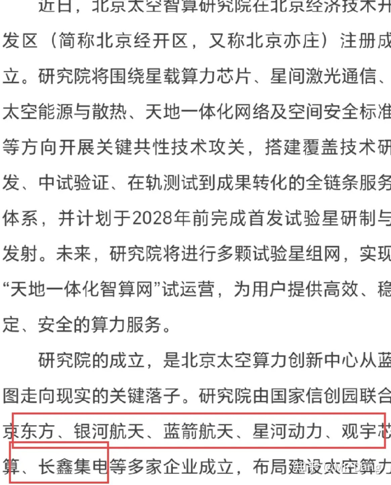

据报道，该机构计划于2028年前发射首个实验卫星。

报道同时公布了几家参与组建该机构的企业。

之前传的沸沸扬扬的基金风格漂移有了后续：

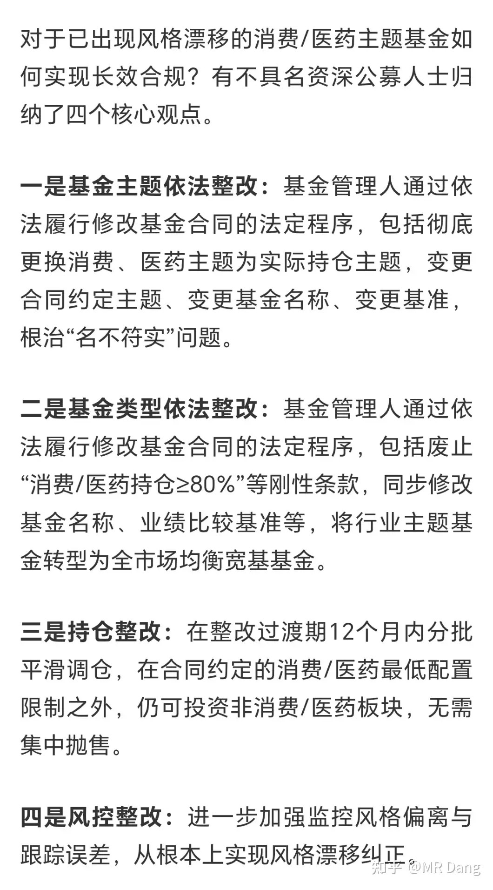

所谓的风格漂移，就是消费/医药基金，持仓满手的科技，半导体，cpo。

整改方向。。。改主题，改名字，改持仓，改基准。

不过有个前提，走依法法定程序。

改基准的程序可能简单一些，公告+备案就行了。

改主题就难一些，要开持有人大会，还要在监管备案。

还有一个平滑调仓，最简单，自己买回原来的主题，而且给了一个相对较长的过渡期，不容易引起踩踏，就是考验基金经理的择时水平。

一般来说，可能基金经理选择平滑调仓这个选项的占比会比较高。

不过这帮基民是真的惨，有个别运气不好的，在白酒消费里挨了好几年的毒打，刚换到科技，肉是一口没吃上，这两天净挨打了。

银行业：

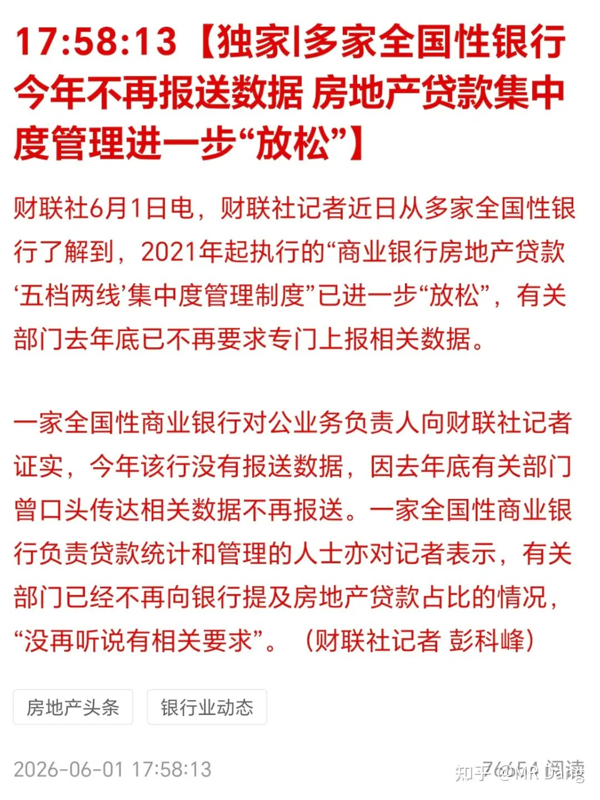

有消息称银行业房地产贷款集中度管理放松，不再要求专门上报数据。

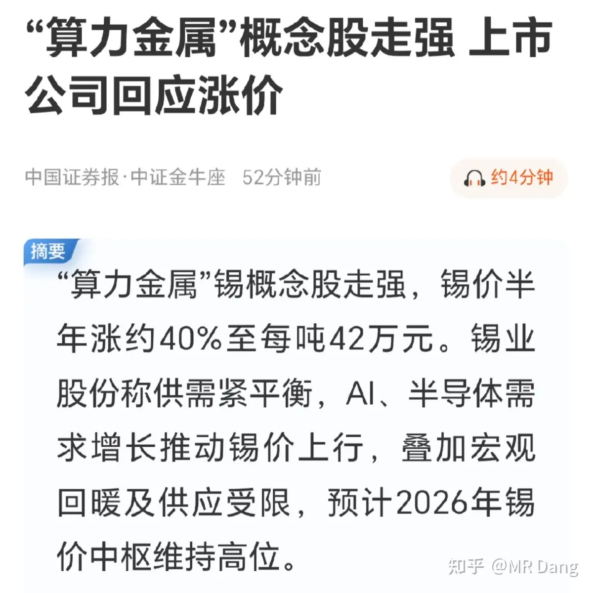

锡最近有了个新的名字——“算力金属”。

从昨天开始，很多主流权威媒体争相报道。

有点奇怪的是，锡其实涨了好长一段时间了，最近也没什么突发利好，就莫名其妙的多了个“算力金属”的外号，各种概念也如雨后春笋一般冒出来。

我是很看好锡，也很看好锡在消费电子和科技领域的需求。

但是目前来说，算力，包括Ai领域的锡需求其实只占总需求的很小一部分，锡的主要逻辑还是储采比，基本面没有发生什么大的变化。

把锡称作算力金属，多少有点蹭概念了。

机器人：

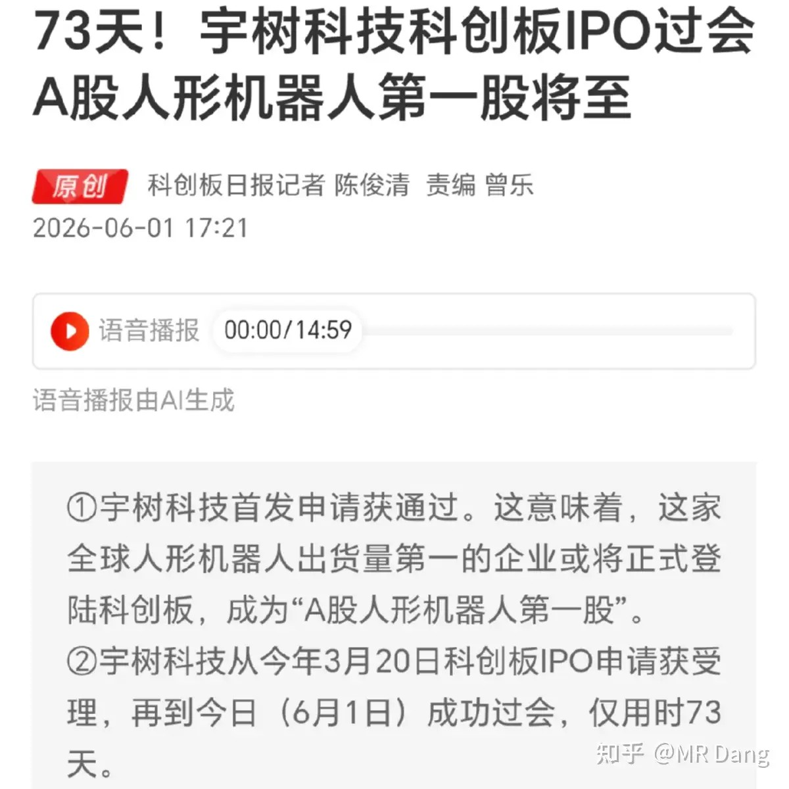

宇树也在光速过会，最早这个月，最晚下个月应该能见到。

监管问的宇树几个问题，宇树都回答了，比如今年上半年，利润可能下滑，特斯拉机器人带来竞争压力，另外宇树的机器人看重“身体”，看重“小脑”，但是“大脑”的发育有些落后。

也就是机器人的运动能力和平衡能力好，但是具身大模型还差点事，没有开展大规模的真实数据采集。

智谱来A上市：

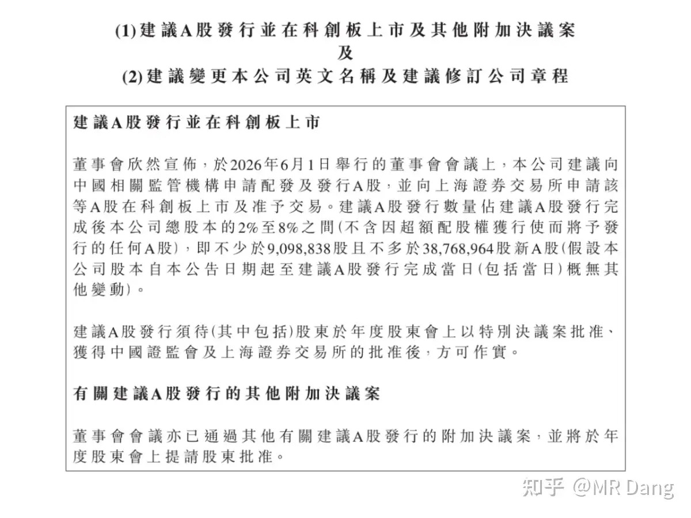

这个昨天就说了，现在发了正式公告。

智谱现在港股估值六千多亿港币，大概排第十二名，比他市值低的有中石化，港交所，美团。

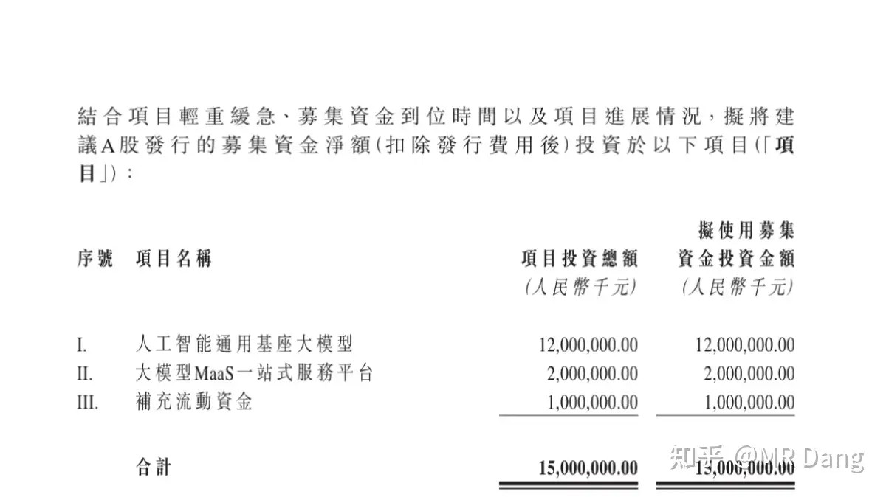

这次来大A，目前是打算先募集个150亿塞塞牙缝。

不过有一说一，智谱的大模型确实顶，GLM-5.1现在在全球范围内大概是坐8望7的水平。

追觅融资新消息：

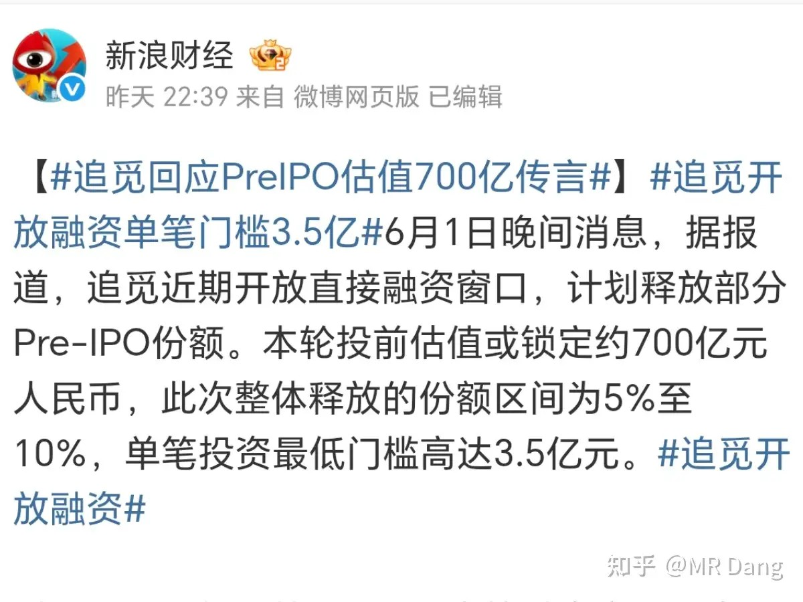

创投圈这两天比较火的一个消息，追觅开了Pre-IPO，估值700亿，3.5亿门槛。

要真是这个估值，还真不算太贵，到了大A怎么也得千亿估值打底，转手就是50%以上的收益。

按照这个进度，可能今年下半年或者明年初就能在A股和大家见面了。

这些公司生怕来的慢了，让散户享受不到公司发展的红利，真是有心了。

黄马甲：

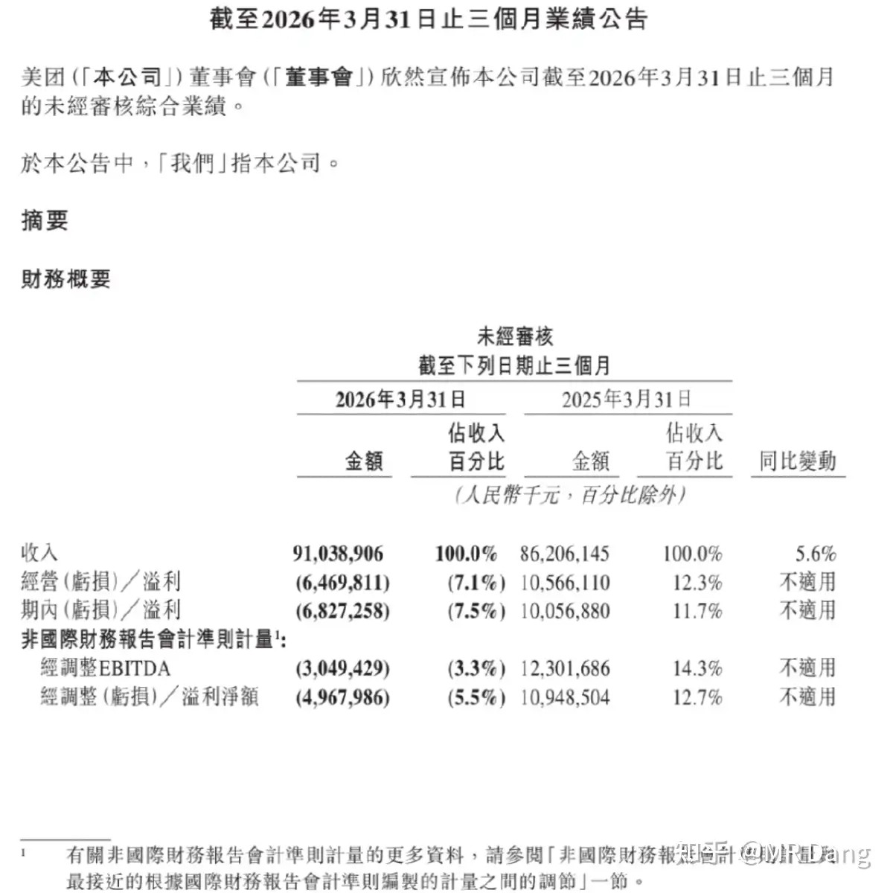

美团发布了一季报。

即使我对它没什么正面评价，但就这份财报来说，比市场预期好很多。

尽管还在亏损，环比上个季度已经好很多了，边际改善明显。

恒科的家人们也许天就快亮了。

大宗商品：

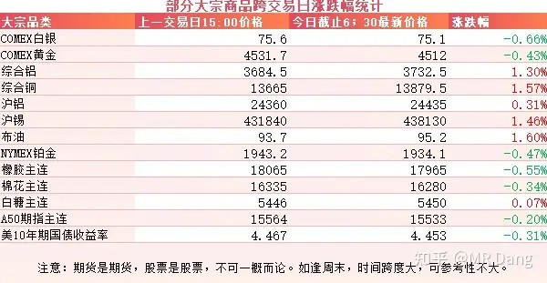

受伊美局势紧张影响，原油价格有所反弹，涨幅一个多点。

有色整体分化，贵金属走弱，工业金属走强，伦铝创四年以来新高，铜锡也纷纷走强。

农产品夜盘表现一般，但是昨天整体表现可以。

外围市场：

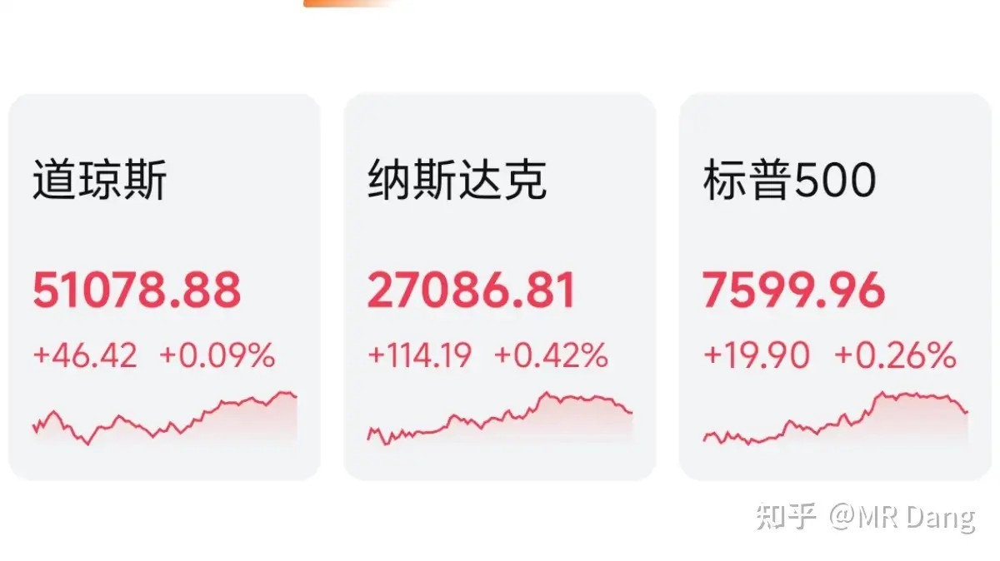

美三大股指收红，纳指领涨。

板块上Ai软件和硬件都表现不错，存储走强，传统行业里只有油气和医疗设备等少数行业还行，其他行业表现不佳。

昨天个人组合净值回血一个点，银行红两个多，资源勉强打平，重仓的哼哈二将在拉稀，轻仓的资源反而涨了很多。消费回光返照，也红了两个多，算电一共绿了近四个，电网还可以，算力遭遇滑铁卢，被一棍子打懵了。

又是充当大盘反指的一天，难道对老股民来说，慢熊才是舒适区间么？

会不会有点黑色幽默了。

一个喜欢保护韭菜的博主，希望大家少少踩坑，多多赚钱！！！

> [!comment]- 点击展开评论
>
> | 用户 | 时间 | 内容 |
> | :--- | :--- | :--- |
> | 钱包鼓鼓 |  | 每日打卡第62天伊朗又拿封锁霍尔木兹海峡当谈判筹码，懂王反手说一周内达成协议基金风格漂移整改落地，消费基民刚换到科技就挨打，平滑调仓会渐进抛售科技股买回消费锡被硬造算力金属外号，主流媒体集中报道但基本面没变，典型蹭概念前兆别追高宇树机器人过会但大脑跟不上身体，具身大模型和真实数据采集都落后，硬件卷完拼软件智谱来A股公告，港股估值六千多亿，GLM-5.1全球坐8望7，智谱的编码套餐现在还是天天秒无，但估值比中石化港交所都高 |
> | &nbsp;&nbsp;&nbsp;&nbsp;yzhd |  | 建国也是太不容易了，被比比摆了一道（也不完全是)，本来以为赚翻了， 哪能料到，凭空造牌多了，连自己都得苦笑，市场虽然不敢信 又不敢不信 美国看来痿大是一定的了 |
> | 纳瓦那 |  | 绿桥真的绝了，别的铝都涨它不涨，这是为什么啊 |
> | 瑞文 |  | 我要怎样才能写出这样的文章 |
> | 啦啦啦 |  | 大A现在跟什么都没有关系，完全看国家队跟大主力的脸色！国家队不减持大主力感觉位置低了想进场就会长，反之就会跌 |
> | YgMS |  | 同大盘反指道中人 |
> | 法家君子 |  | 默默支持 |
> | 掰漫 |  | 从这一刻起，历史发生了剧变 |
> | yueseyouran |  | 感谢老师分享 |
> | 微甜 |  | 这些公司生怕来得慢了！！ |
> | wangxa0 |  | 老师才是不容易，多跟老师学习 |

---

*本文件从MR Dang知乎页面转载*

---

**作者**: MR Dang
**链接**: https://www.zhihu.com/question/2043746333698287574/answer/2045043668722128337
**来源**: 知乎

*著作权归作者所有。商业转载请联系作者获得授权，非商业转载请注明出处。*

## 相关阅读

**每日行情系列：**
- [[20260528-如何看待2026年5月28日A股行情？|5月28日A股行情]] - 对照工业利润、长鑫IPO与市场兑现压力。
- [[20260529-怎么看待2026年5月29日A股行情？|5月29日A股行情]] - 回看科技与老登板块风格拉扯的前情。
- [[20260601-对2026年6月1日A股市场行情，大家有什么看法？|6月1日A股行情]] - 本周开篇，绿色算力、PMI和流动性压力的集中梳理。
- [[20260603-怎么看待2026年6月3日的A股趋势？|6月3日A股趋势]] - 后续跟踪农业规划、电力算力和市场中位数表现。
- [[20260604-如何看待 2026 年 6月 4日 A 股行情走势？|6月4日A股行情走势]] - 继续观察中欧贸易摩擦、科技回调和市场跷跷板。

**方法论与工具：**
- [[20260401-读懂财报，看清基本面|读懂财报，看清基本面]] - 看财报和边际改善时的基础框架。
- [[20260404-如何分步骤快速看懂上市公司年报？|如何分步骤快速看懂上市公司年报？]] - 帮助拆解公司质量、盈利和风险。
- [[20260408-《价值投资功法》新书简介&自荐书|《价值投资功法》新书简介&自荐书]] - 阅读 Dang 方法论的主入口之一。
- [[20260409-如何看待知乎 2025Q4 财报？知乎终于盈利了？|知乎2025Q4财报解读]] - 用平台财报练习盈利质量判断。
- [[20260306-小红圈说明书|小红圈说明书]] - 进入更多长文与讨论补充。
