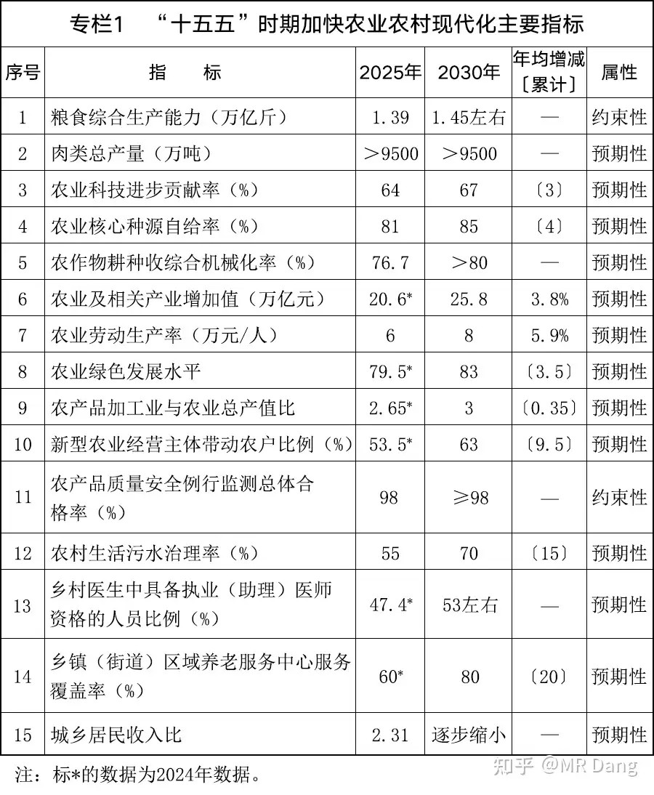
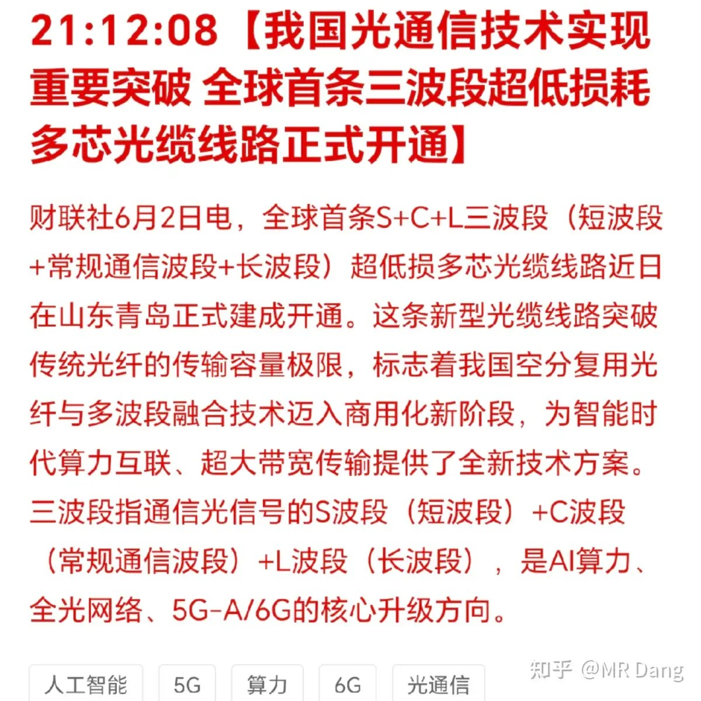
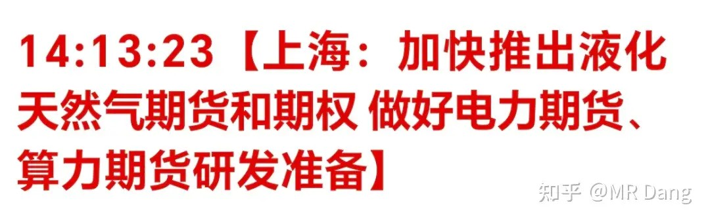
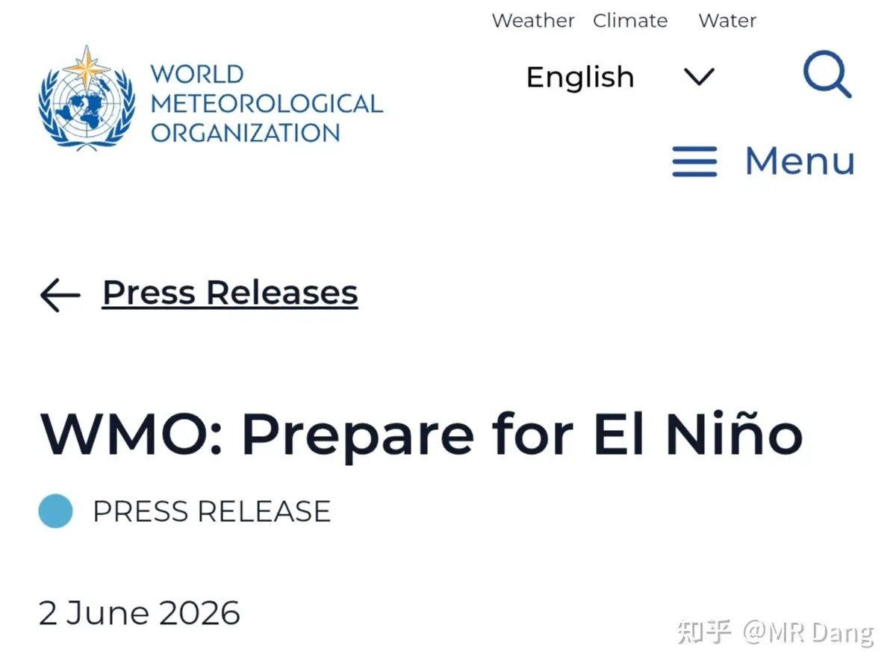
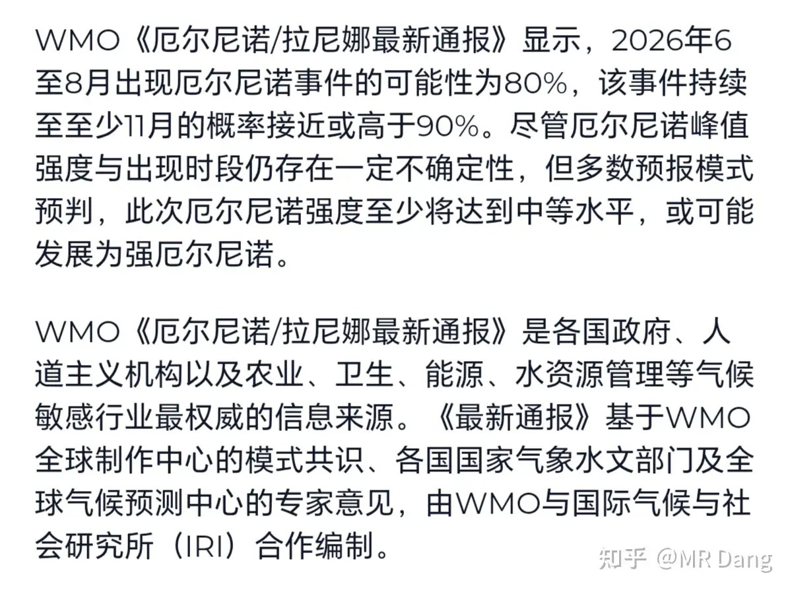
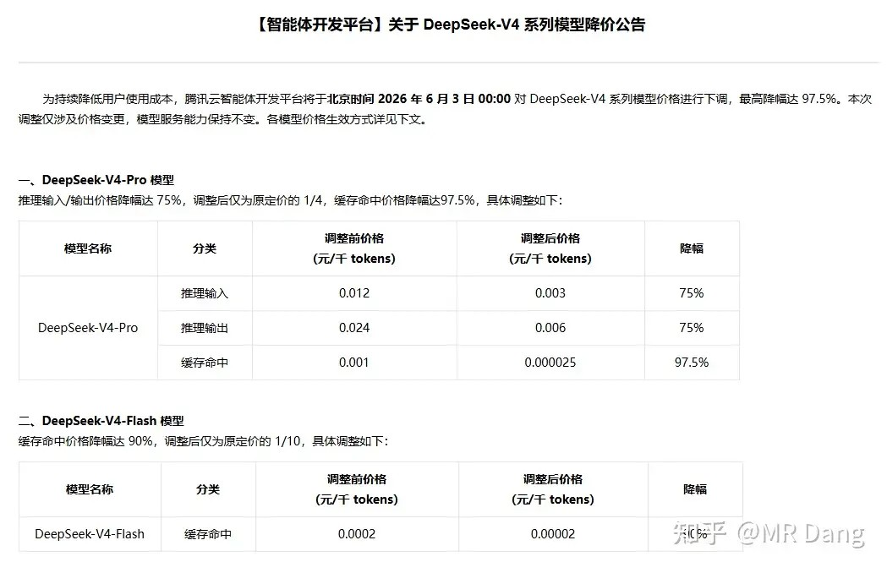
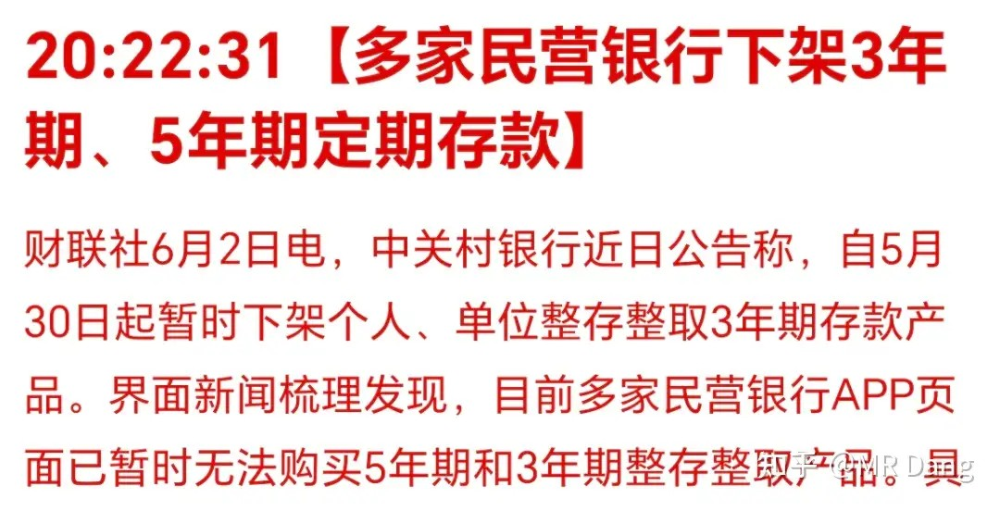
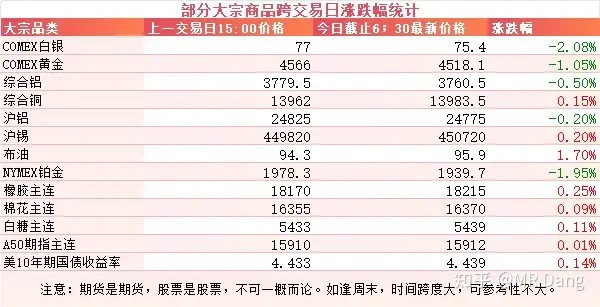
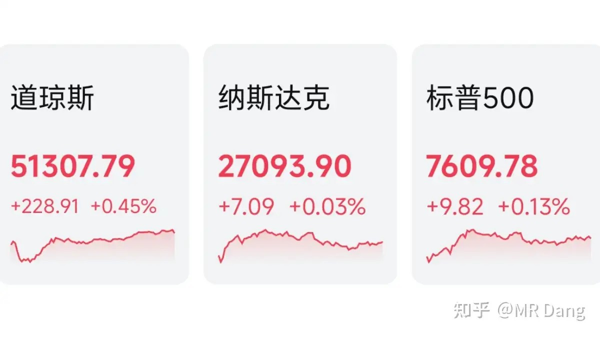

# 怎么看待2026年6月3日的A股趋势？

---

**发布时间**: 2026-06-03 07:30  |  **原文链接**: https://www.zhihu.com/question/2044795315602069082/answer/2045407066433515606  |  **点赞数**: 319 人赞同

**作者信息**: MR Dang​​知势榜经济与管理领域影响力榜答主

---

## 正文内容

头条给到农业十五五规划：

文字性的东西，大家找原文看，看权威渠道发布的文件。

我这里主要贴一张指标的表格。

从边际变化来看，有两个指标是未来发展的重点。

第一个指标是农村生活污水治理率，要从55%提高到70%。

这个我真的举双手赞同，没在西部农村地区生活过的读者可能想象不到2026年的今天，很多农村地区连地下排污管道都没有，很多生活污水还在自家门前排放，全靠蒸发。

这个方向主要是两部分，一部分是分散式的一体化污水处理设备，这个大概能占到五六成左右。

还有一部分是集中式处理，这个主要依赖PE和HDPE排污管道的搭建。

第二个指标是区域养老服务中心覆盖率，从60%提高到80%。

这里就是一些运维方面的机会，还有一些配套的设施，比如适老化改造，助餐服务什么的。

需要提醒的是，以上两个指标是预期性，而非约束性指标，所以存在一定的不确定性。

光通信重要突破：

这个技术是很早之前就报道过的，相比目前市面上的光纤，单条光纤的总容量提升了四五倍以上，而且传输损耗接近物理极限，非常适配当下的Ai需求。

不过相应的成本也提高了很多，无论是制造成本还是运维成本，还需要一系列专用的配套设施。

相关涉事企业热度挺高，昨天已经涨停，如果这会儿才想着参与也不知是福还是祸。

电力算力期货：

市场上一直有相关消息，现在以文件的形式进行了确认。

这是个好东西，玩的好了感觉可以玩出花来。

比如做空电力，做多算力，就相当于开了个虚拟算力租赁厂。

做空电力，做多铝，就相当于开了个虚拟电解铝厂。

做多电力，做空原油，就相当于开了个虚拟燃油发电厂。

做多电力，做空天然气，就相当于开了个虚拟燃气发电厂。

这两个都是未来世界的重要基础设施，出了期货以后可以配合各行各业进行套保，非常有意义的一件事情。

厄尔尼诺得到WMO确认：

在昨天的一份世界气象组织WMO的通报中显示，6月到8月出现概率为80%，持续到11月概率为90%，强度最低也是中等水平。

腾讯云宣布对Deepseek-V4降价：

这个降幅挺狠的，感觉大模型之间的竞争，有点奶茶大战的感觉了。

现在昇腾系列的成本低，h200的词元成本高。

所以适配昇腾的Deepseek国产组合，最大优势在于成本，这也是打价格战的底气所在。

与此同时，有消息称豆包可能推出付费版。

银行业：

有消息称多家民营银行下架3年5年定期存款。

主要还是净息差压力大，而且长期来看利率下行。

我个人一般不是看看重投资的公司是国企还是民企。

但是银行是个例外，这个行业还是非常依赖这个身份的，民营的银行总觉得让人不太放心，无论是投资还是存钱。

大宗商品：

原油有所反弹，上涨两个点。

贵金属走弱，金银分别回调一两个点，工业金属涨跌互现。

农产品走强，橡胶再次站上1.8万的关口。

外围市场：

美三大股指收红，道指领涨，科技的话，半导体硬件比较好，软件都在跌。

传统行业里银行，农业也表现不错。

昨天个人组合净值回血半个点，银行大半个点，资源红三个多点，消费绿近一个，算电绿两个。

算力犯了个错误，有一个很久之前就该止盈的东西因为贪心没有止盈，这两天结结实实被市场教育了。

想了想还是把大部分换成其他的，只留下利润奔跑，平衡一下风格。

昨天指数虽然是涨的，但是下跌的股票数量远超上涨的，市场中位数跌了接近1.45%。

所以如果自己的持仓绿多红少，那不用怀疑自己，很多投资者也是一样的情况。

一个喜欢保护韭菜的博主，希望大家少少踩坑，多多赚钱！！！

> [!comment]- 点击展开评论
>
> | 用户 | 时间 | 内容 |
> | :--- | :--- | :--- |
> | 钱包鼓鼓 |  | 每日打卡第63天农业十五五规划落地，农村污水治理率和养老覆盖率两个指标值得关注，但都是预期性指标，落地存在不确定性光通信技术突破容量提升四五倍，但相关企业昨天已涨停，今天追进去大概率接盘电力算力期货正式确认文件落地，可以组合套保覆盖各行各业厄尔尼诺获WMO确认，6到8月概率80%，农产品走强有气候基本面支撑指数涨但市场中位数跌1.45%，大部分散户在亏钱，追热点风险极大 |
> | &nbsp;&nbsp;&nbsp;&nbsp;小鸡毛毛 |  | 光又涨停咯 |
> | &nbsp;&nbsp;&nbsp;&nbsp;若星汉天空 |  | cpo涨到你不得不信 |
> | 热乎黏苞米 |  | 以前是各个板块轮动，现在是在这张硅板上轮动 |
> | LukyNine |  | 今天储能、通信、AI、半导体几个ETF这走势几乎一模一样 |
> | &nbsp;&nbsp;&nbsp;&nbsp;青峰 | 21 小时前 | 天天发套，要么制造恐慌，不卖，一股不卖 |
> | 爱吃大橙子 |  | 农业只是一日游，玻璃基板才是这轮的主线 |
> | XXHJP |  | 又到了科技抱团涨，其他板块被引走的行情了。 |
> | 009 | 18 小时前 | 农村不需要排污管道，与其花费时间建设，不如再拖个十年八年，很多地方就要裁村并镇了 |
> | LetItBe |  | 乡党 |

---

*本文件从MR Dang知乎页面转载*

---

**作者**: MR Dang
**链接**: https://www.zhihu.com/question/2044795315602069082/answer/2045407066433515606
**来源**: 知乎

*著作权归作者所有。商业转载请联系作者获得授权，非商业转载请注明出处。*

## 相关阅读

**每日行情系列：**
- [[20260529-怎么看待2026年5月29日A股行情？|5月29日A股行情]] - 科技拥挤、基金风格漂移和老登压力的前情。
- [[20260601-对2026年6月1日A股市场行情，大家有什么看法？|6月1日A股行情]] - 本周开篇的绿色算力、非农和巨无霸IPO观察。
- [[20260602-如何看待2026年6月2号的A股行情？|6月2日A股行情]] - 伊美局势、风格漂移整改和机器人上市的前一日记录。
- [[20260604-如何看待 2026 年 6月 4日 A 股行情走势？|6月4日A股行情走势]] - 中欧贸易摩擦、短剧治理和市场分化的后续。
- [[20260526-怎么看待2026年5月26日A股行情？|5月26日A股行情]] - 回看半导体与资源线索如何延续到本周。

**方法论与工具：**
- [[20260401-读懂财报，看清基本面|读懂财报，看清基本面]] - 在农业、银行和科技叙事中回到基本面。
- [[20260404-如何分步骤快速看懂上市公司年报？|如何分步骤快速看懂上市公司年报？]] - 用年报视角校验公司质量。
- [[20260408-《价值投资功法》新书简介&自荐书|《价值投资功法》新书简介&自荐书]] - Dang 投资方法论的总入口。
- [[20260422-紫金矿业一季报实现净利润 200.79 亿元，同比大幅增长 97.50%，如何解读「矿茅」的Q1财报|紫金矿业Q1财报解读]] - 资源股基本面和周期位置的案例。
- [[20260306-小红圈说明书|小红圈说明书]] - 查看更多长文、评论和方法论补充。
