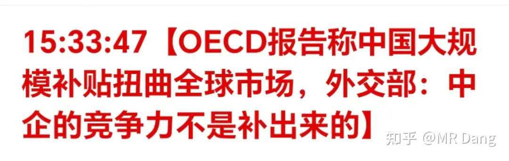
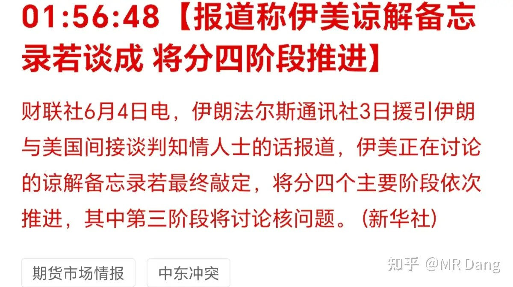
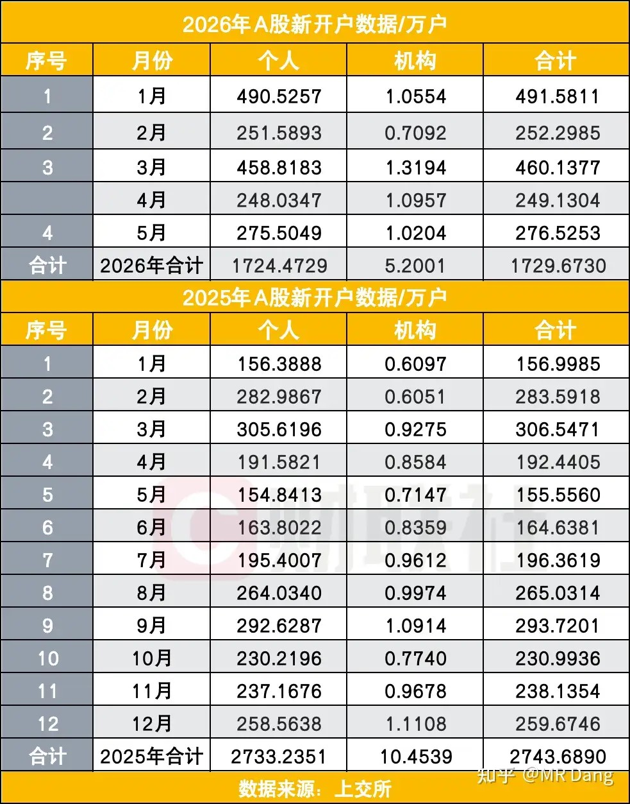
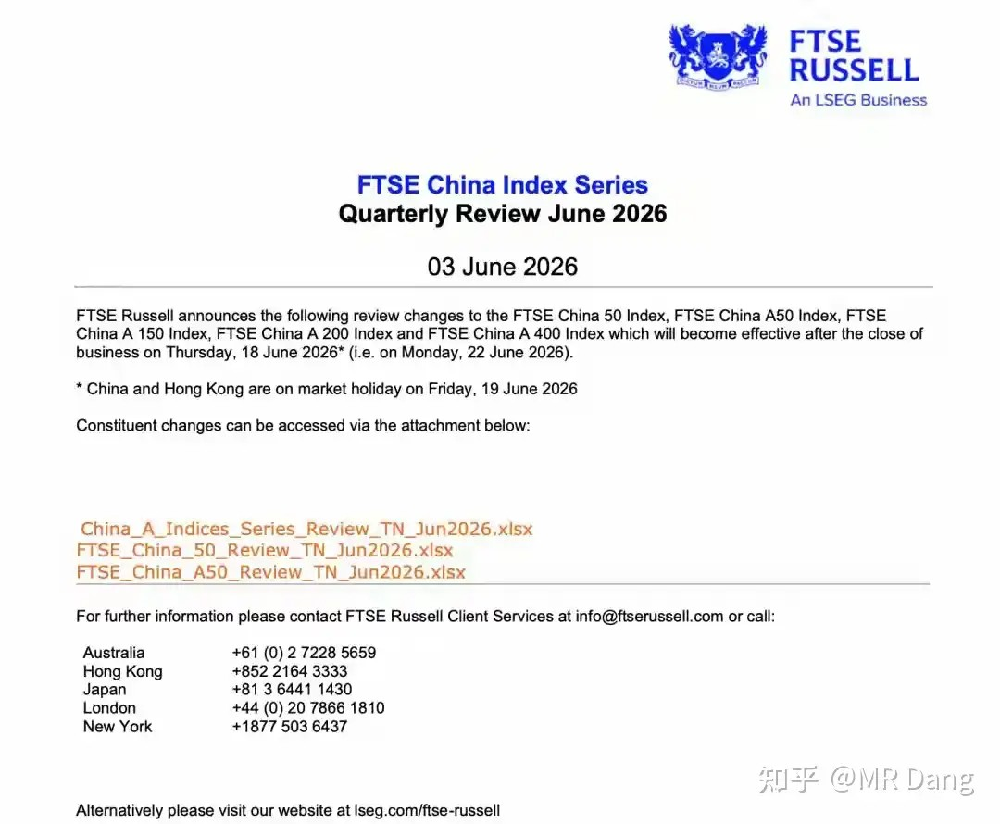
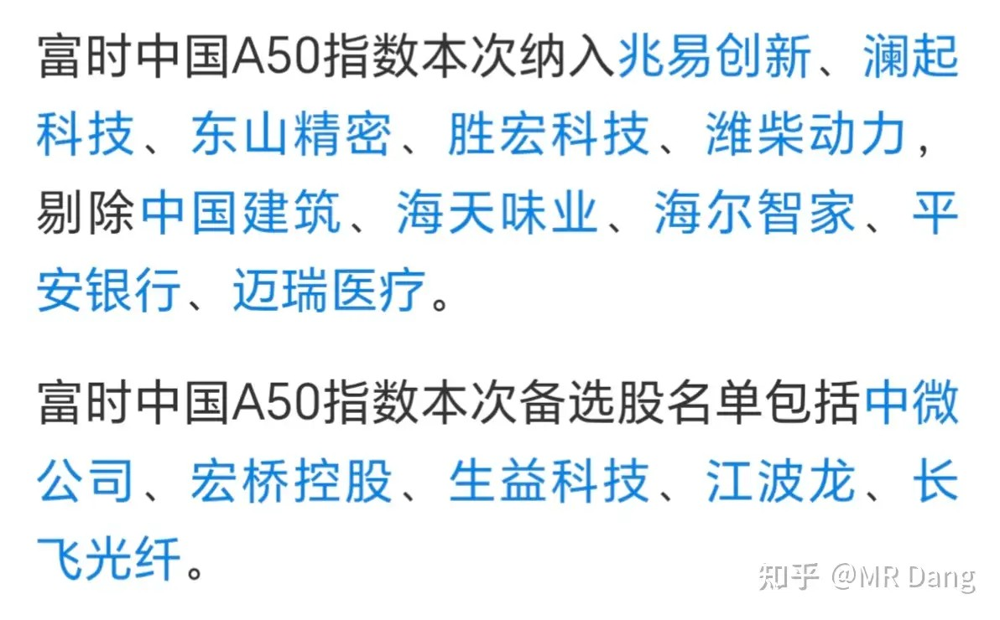
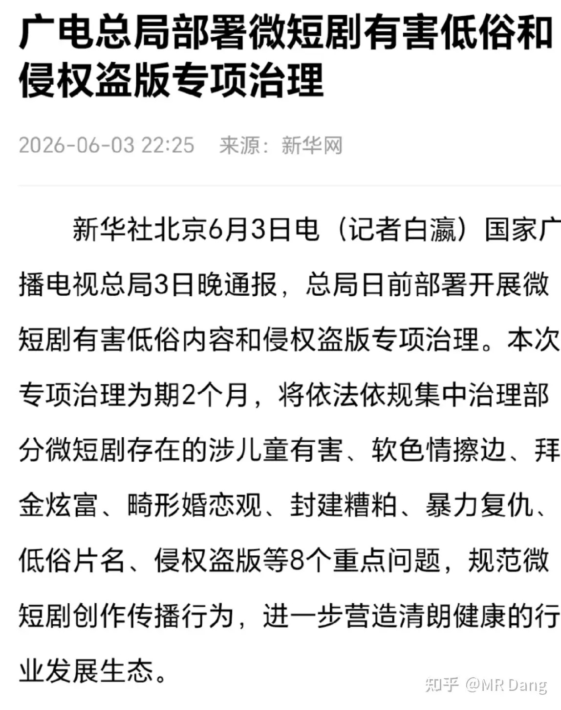
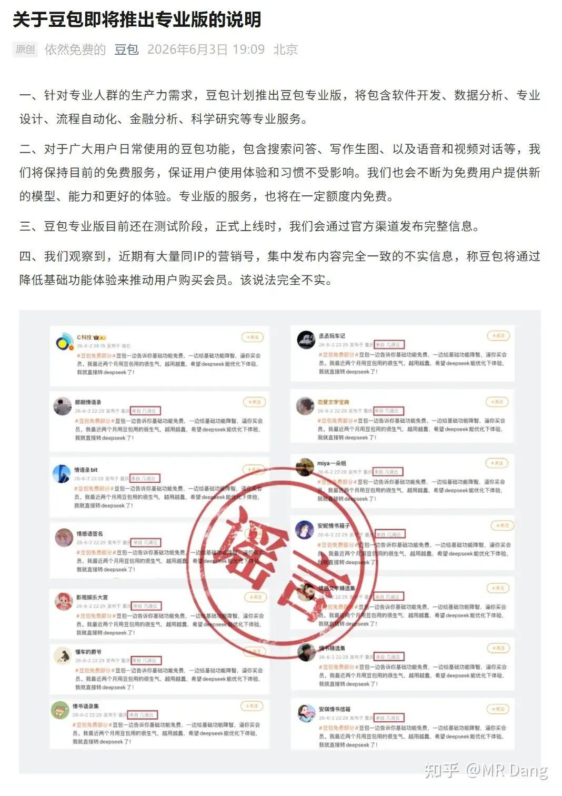
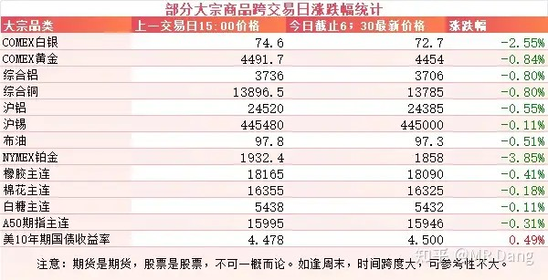
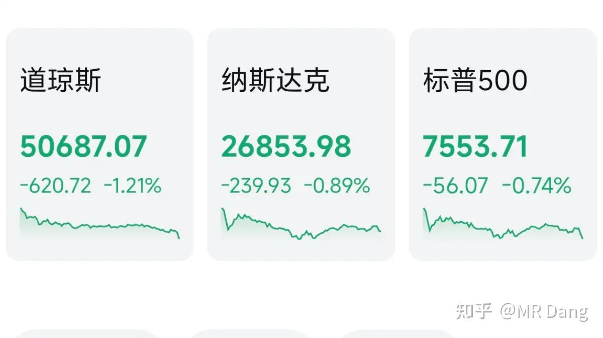
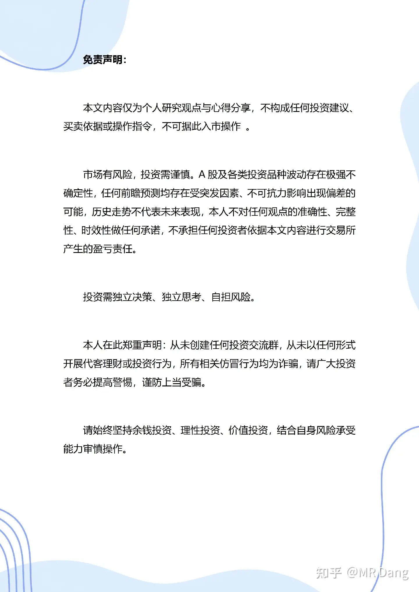

# 如何看待 2026 年 6月 4日 A 股行情走势？

---

**发布时间**: 2026-06-04 07:28  |  **原文链接**: https://www.zhihu.com/question/2045384172961891500/answer/2045768810456690871  |  **点赞数**: 300 人赞同

**作者信息**: MR Dang​​知势榜经济与管理领域影响力榜答主

---

## 正文内容

目光投向中欧贸易：

最近中欧贸易摩擦有点抬头的趋势。

OECD相当于欧洲的嘴替，发了个报告，污蔑中国大规模补贴扭曲全球市场，最后产能过剩。

还有小作文称欧公子打算找东大在贸易上较量一番。

欧公子的心态完全可以理解，以前中欧之间的贸易以互补为主，东大生产低端商品，欧洲生产高附加值的商品，我记得以前经常听到几十亿双袜子换一架飞机这种账本。

但是现在中国产业升级，中欧之间的好多产业已经重叠，比如汽车，光伏，新能源，质优价廉，把欧洲打的很难受。

2019年欧洲对华贸易逆差1600多亿欧元，而去年这一数字已经达到了3600多亿欧元，每天十亿欧。

欧洲生产的大部分东西我们都有，还更便宜，他们生产不了的东西我们也有。

当然欧洲也有小部分我们生产不了的东西，但是他们因为各种小心思又不卖给我们，所以这个贸易逆差一直缩小不了。

至于这个对投资的影响的话，目前来看还是在打嘴仗，因为欧洲和西大不一样，内部也不是铁板一块，做出决策的时间成本会高一些。

假设商量好了以后有了实质性的动作，提高贸易壁垒，那对电动汽车，光伏，风电，都是比较大的利空。

资本市场不喜欢不确定性，最好还是和气生财，不然我怕大A买单啊。。。

美伊局势：

昨天大A盘前，两边又打起来了，但是嘴上都说着自卫，停火没结束什么的。

消息人士透漏可能会分成四阶段，第三阶段讨论弃核。

懂王天天喊着进展顺利，接近达成，就是没下文。

昨天公布了今年大A五月的开户数据：

单月新入市275万个人，同比去年增加了很多，但是比今年一月和三月还是少了很多。

虽然没做什么统计，不过我个人猜测可能这些新投资者会更偏爱科技板块。

散户火急火燎的来开户，大概率不会是为了来给坑里的老登搭把手的。

按照数据来看，其实券商业绩真的会挺好，开户的投资者多，ipo多，成交额多，印花税多，甚至可能自营盘都不错。

啥都好，就是表现不好。

富时中国A50指数调整：

纳入的是一些高科技，剔除的是一些老登。

然后选了五个备胎，下次调整可能会纳入，一堆科技企业里面混入了一个奇怪的东西。

富时中国A50每三个月调整一次，下次就是九月份了。

富时中国A50和上证50不一样，选的是沪深两市的前50名具有代表性的企业，所以深市的也会被纳入，国际影响力相对来说更大一些。

短剧市场：

有关部门出手进行短剧领域两个月的专项治理。

八大重点问题确实比较严重。

我家小孩从来不被允许看手机，短剧就更不用说了，但是他们的同学里有一些爱看的，和其他小朋友玩闹的时候就会下意识的传播。

上次我接他们的时候，忘记是说到哪一茬了，孩子嘴里一直说着短剧里不好的台词，我一着急就对他们进行了爱的抚摸。

他们立马就被感化了，在家里再也没说过类似的话。

短剧市场是个劣币驱逐良币的市场，越没下限，越猎奇，看的人反而越多，因为爽。

爽的多了，人的阈值就提高了，一些正儿八经做优质内容的，反而没什么人看了，因为不够爽。

所以把这些劣币扫清以后，可能利好一些头部正规的短剧企业。

不过提醒一点，做内容现在不是个好的生意模式，随时面临来自Ai的降维打击。

豆包付费版：

豆包称目前普通用户的功能不受影响，完全免费。

专业版收费，但是也有一定免费额度。

专业版里有一个金融分析的功能我还挺感兴趣的，因为目前的Ai在金融分析上的数据幻觉很严重。

主要是抓取的某些数据来源于同花顺，雪球，东财里的用户帖子，会被一些散户yy的数据干扰。

大宗商品：

比较罕见，除了美债收益率，绿油油一片。

可能中欧贸易，伊美摩擦还是给资本市场蒙上了一层阴影。

外围市场：

美三大股指收绿，道指领跌。

板块上存储领涨，其他热门科技类板块回调。

老马的space x目标是募集资金750亿美元，发行价135美元，目标估值1.77万亿美元。

有些投行把计算器按冒烟，也只给出零头的估值，也就是大几千亿美元的估值。

买这个不能盯着计算器，只能望着火星，买的是未来和梦想。

昨天个人组合净值回撤大半个点，银行绿一个，资源绿一个，消费绿一个半，算电红两个半。

还是原来的配方，还是熟悉的味道，手里的老登绿的还挺均匀，也没有拖后腿的，大家都是后腿。

三大股指都是红的，其中一千七百多家上涨，还有另外三千七百多家待涨。

好好的一个市场，硬是被玩成了跷跷板。

一个喜欢保护韭菜的博主，希望大家少少踩坑，多多赚钱！！！

> [!comment]- 点击展开评论
>
> | 用户 | 时间 | 内容 |
> | :--- | :--- | :--- |
> | 一米阳光 | 7 小时前 | 2年投资经验才能买科创板。新开户只能买老登 |
> | 孔工 | 7 小时前 | 对孩子教育的那个，没有用的，因为大环境大家都看，你家孩子到时会被孤立的；而且你对他严厉教训后，只会导致他以后在你面前不表现；父母孩子都难 |
> | 阅知悦 | 4 小时前 | 吃人不吐骨头 |
> | 钱包鼓鼓 | 7 小时前 | 每日打卡第64天，熟悉的感觉又回来了中欧贸易摩擦升温，OECD报告加小作文造势，欧洲对华逆差扩大到每天十亿欧美伊局势反复拉锯又打起来了，叠加中欧阴影大宗商品全线走绿，短期情绪面承压五月开户275万新散户偏爱科技，券商业绩基本面没问题但股价不买账，富时A50调仓剔除老登纳入科技短剧市场被治理两个月利好头部正规企业，但AI降维打击是长期风险三大股指红但三千七百多家待涨，分化行情大部分人亏钱，控制仓位别追高 |
> | &nbsp;&nbsp;&nbsp;&nbsp;ziol | 5 小时前 | 下跌就下跌，为什么要用待涨这种词来欺骗自己 |
> | &nbsp;&nbsp;&nbsp;&nbsp;花泥 | 5 小时前 | 负增长 |
> | 一尔 | 5 小时前 | 天天自动扣款，   我这是造的什么孽哦 |
> | 鲍大师傅 | 7 小时前 | 新开户的买不了大科技的，我都买不了 |
> | 两江的雨季 | 2 小时前 | 人家哪里污蔑了，咱们搞产业化本来就打的低价倾销的牌。 |
> | 小虎新知 | 7 小时前 | 农药茅台最近难受死了 |
> | &nbsp;&nbsp;&nbsp;&nbsp;神通大将军亲兵 | 3 小时前 | 茅台哪有这种跌法的。。。 |
> | 若星汉天空 | 6 小时前 | 我都奈何桥还能回本吗？ |
> | &nbsp;&nbsp;&nbsp;&nbsp;风清云 | 1 小时前 | 纯给空头送燃料 |
> | &nbsp;&nbsp;&nbsp;&nbsp;花月必胜 | 1 小时前 | 涨到前高得涨50%，这几天最火的科技股都没几个这个涨幅的，你说回本得多久吧 |
> | &nbsp;&nbsp;&nbsp;&nbsp;yyyy | 52 分钟前 | 被他坑死了，看到天天发表情更气了，一点儿担当都没 |
> | &nbsp;&nbsp;&nbsp;&nbsp;7391125 | 16 分钟前 | 里面50000名散户还想回本吗，一辈子拉不起来了 |
> | 肤浅的左耳 | 1 小时前 | 股神 |

---

*本文件从MR Dang知乎页面转载*

---

**作者**: MR Dang
**链接**: https://www.zhihu.com/question/2045384172961891500/answer/2045768810456690871
**来源**: 知乎

*著作权归作者所有。商业转载请联系作者获得授权，非商业转载请注明出处。*

## 相关阅读

**每日行情系列：**
- [[20260529-怎么看待2026年5月29日A股行情？|5月29日A股行情]] - 回看科技拥挤交易和老登基金压力的前情。
- [[20260601-对2026年6月1日A股市场行情，大家有什么看法？|6月1日A股行情]] - 本周开篇，绿色算力、PMI与流动性压力的集中记录。
- [[20260602-如何看待2026年6月2号的A股行情？|6月2日A股行情]] - 伊美局势、基金风格漂移和恒科边际改善的延续。
- [[20260603-怎么看待2026年6月3日的A股趋势？|6月3日A股趋势]] - 农业规划、电力算力和市场中位数分化的前一日观察。
- [[20260528-如何看待2026年5月28日A股行情？|5月28日A股行情]] - 对照工业利润、长鑫IPO和资金兑现压力。

**方法论与工具：**
- [[20260401-读懂财报，看清基本面|读懂财报，看清基本面]] - 在贸易摩擦和热点波动中保持基本面锚点。
- [[20260404-如何分步骤快速看懂上市公司年报？|如何分步骤快速看懂上市公司年报？]] - 帮助识别公司质地和财务风险。
- [[20260408-《价值投资功法》新书简介&自荐书|《价值投资功法》新书简介&自荐书]] - 回到 Dang 价值投资体系的主线。
- [[20260409-如何看待知乎 2025Q4 财报？知乎终于盈利了？|知乎2025Q4财报解读]] - 观察平台商业模式和盈利质量的案例。
- [[20260306-小红圈说明书|小红圈说明书]] - 进入更多 Dang 长文和讨论补充。
