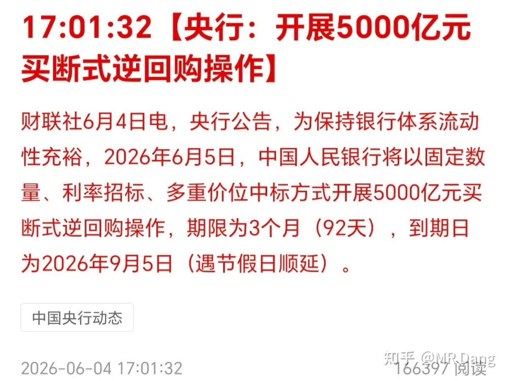
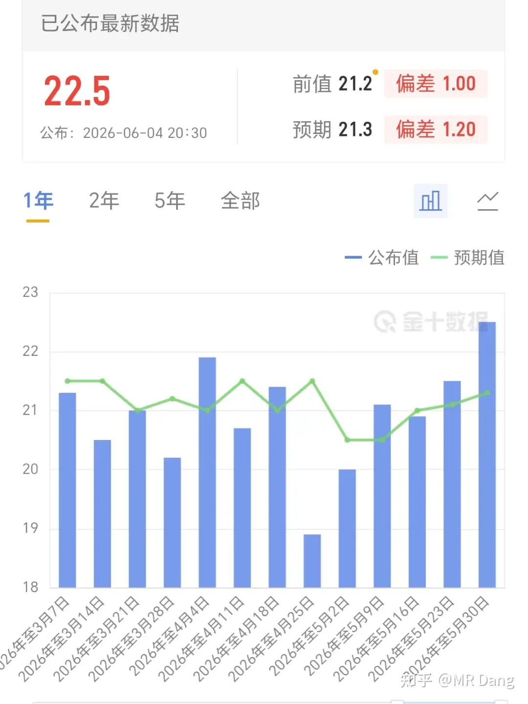
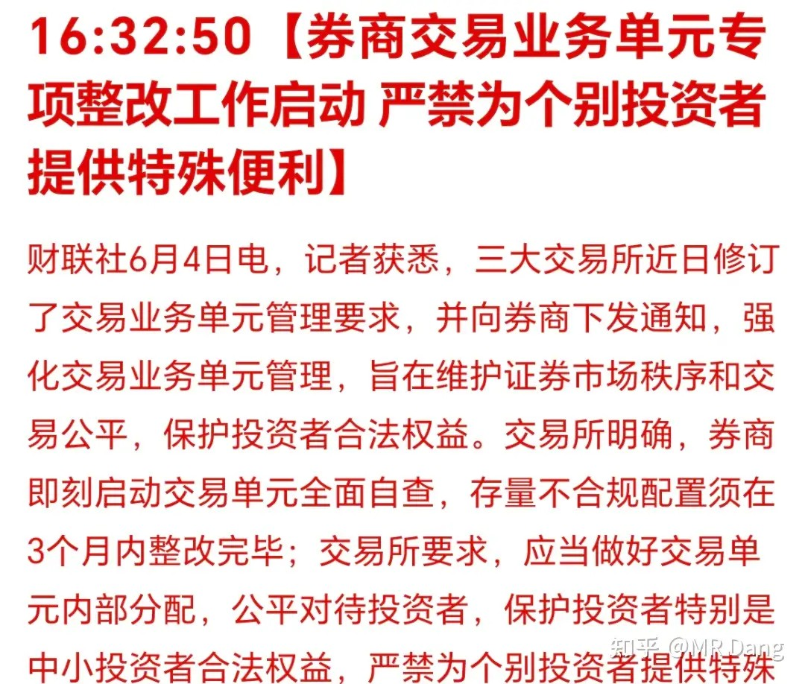
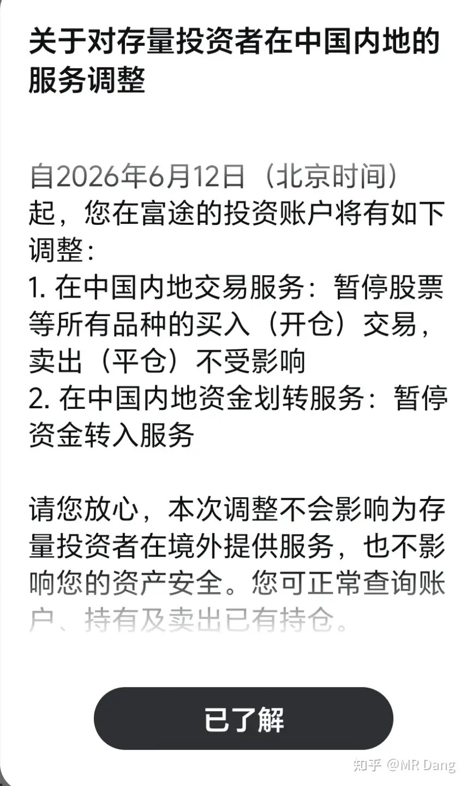
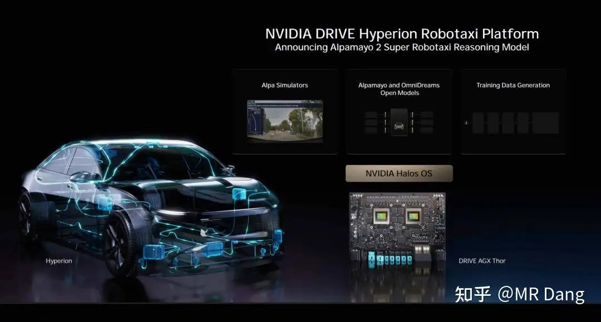
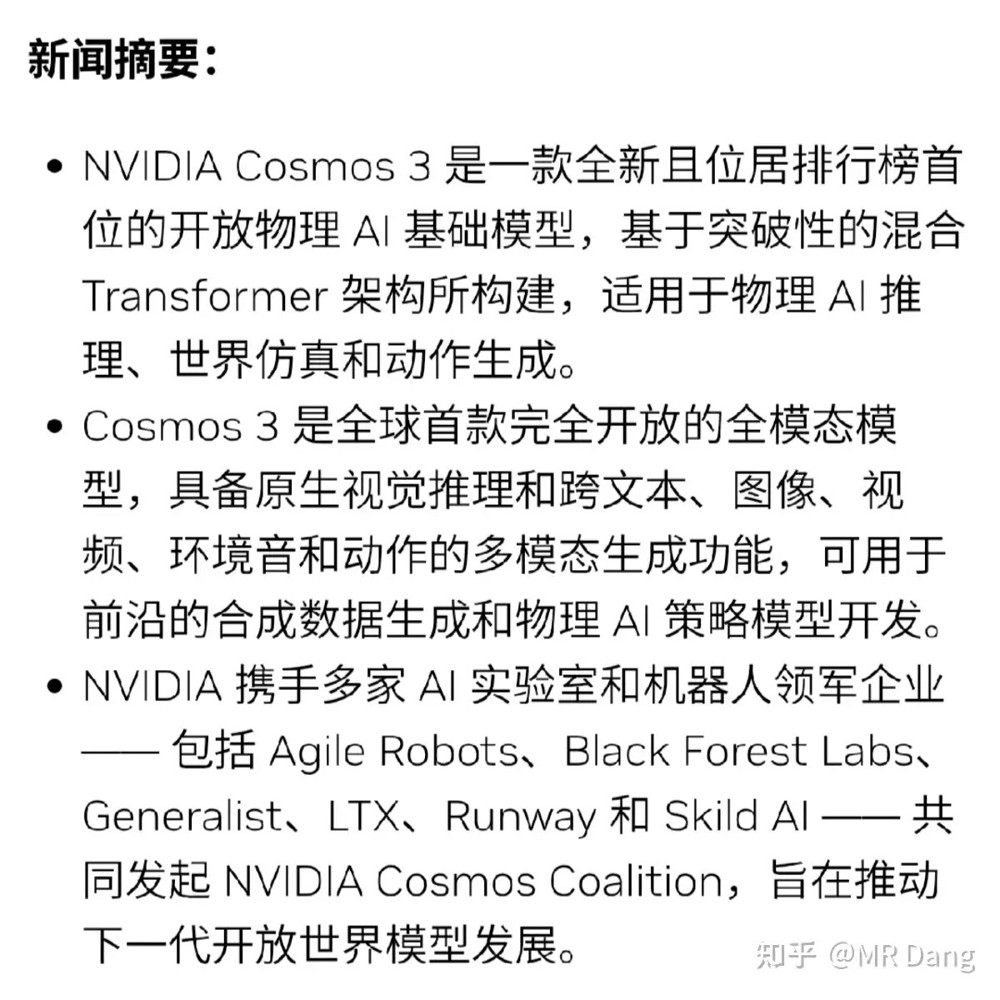
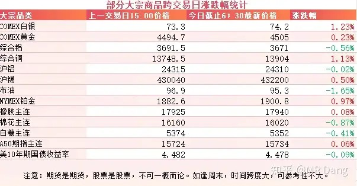
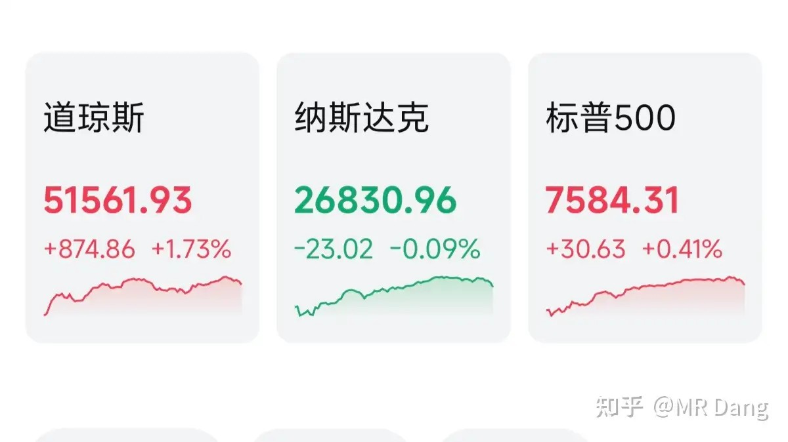

# 怎么看待2026年6月5日A股行情？

---

**发布时间**: 2026-06-05 07:40  |  **原文链接**: https://www.zhihu.com/question/2043775868686881633/answer/2046134397527647112  |  **点赞数**: 474 人赞同

**作者信息**: MR Dang | 独立投资人，《价值投资功法》作者，小红圈同名，无其他小号。

---

## 正文内容

没啥太重要的事，从央行5000亿买断式逆回购说起：

到期大概有8000亿，相当于净回笼一些流动性。

现在市场上流动性是够的，问题是钱在空转。

传统实体经济回报率低，实体投资意愿不是很强。

央行也注意到这点了，所以现在是不着急投放流动性，催着银行赶紧加大放贷力度。

西大发布周初请失业金人数：

22.5万人的数据创下二月以来新高，超过预期值1.2万人。

疲软的就业数据不利于美联储加息，对金银和资本市场属于利好。

某平台整治：

这个定性目前是非法诱导跨境投资。

就是一些什么教你美股开户，跨境投资的内容。

没必要，真没必要。

投资还是要投国内的正规市场，即使想参与美股什么的，也要通过正规途径。

通过不正规的途径投资，收益率绝对跟不上我们这样在正规市场投资的投资者。

券商业整治：

其实就是一些VIP通道，两类人使用的比较多，一类是量化，一类是打板的大户。

前者的费用我不太清楚，后者的话，几年前报价是小几十万一年，大概是20万到50万之间。

买了以后最显著的功能是挂单的时候可以排在前面，一些明摆着可以连续涨停的股票有可能早买早享受，还有碰到黑天鹅的时候能跑的快一些。

因为我没体验过，所以也只是听那些用过的大户分享用后感言。

我个人认为这种通道对资本市场的公平肯定是有影响的，但是要和那些开天眼，莫名其妙三五个涨停以后甩出一个重磅利好的比起来，也不算什么特别开挂的手段。

后者已经让人见怪不怪了。

富途：

另外两家前两天也发了类似的公告。

时间都选在了6月12日，这个日子我没记错的话。。。这不是老马上市的日子么？

感觉美股接下来一个星期有好戏看了，space x想割内地韭菜，不存在的。

只能卖，不能买。

现在比较让人好奇的点在于这个内地是怎么定义的。

比如外国人到内地旅游，能不能正常使用？

或者相反的，留学生到了国外能不能正常使用？

算了，和我也没关系，我只沉迷A股无法自拔。

以上三条新闻需要连起来看，这是一套组合拳，全方位保护国内中小投资者不被外面的泡沫和里面的量化收割，中小投资者的春天到啦。

物理Ai：

达子又发布了一个新的开放世界基础模型Cosmos3，一个模型既能在机器人上跑，也能在自动驾驶里跑。

根据英伟达官网介绍：

六家创始企业里有一家中国企业，叫Agile Robots，思灵机器人。

我看了他家在某音的宣传视频，人形机器人侧重于灵巧手领域，工业机器人侧重于机械臂领域。

但是没看出来产品有什么过人之处，也可能是我眼拙，没看出其中的科技含量。

大宗商品：

受消息面影响，原油有所回调，有色整体偏乐观，但是波动幅度都不大。

农产品相对走弱，美债收益率在4.55强弱分水岭以下。

外围市场：

美三大股指涨跌互现，道指领涨，创历史新高，纳指回调。

板块上科技受挫，传统行业遍地开花。

科技主要是博通发布的财报不及预期，本身业绩还行，但是对未来业绩的指引不及市场预期，引发了市场对科技增速的担忧。

另外在无人问津的角落里，大饼创了近期新低。

风险偏好高的始终就是那么些人，当涨不过科技股的时候，那些曾经追逐刺激的资金就会抛弃它。

昨天的面太宽了，个人组合净值绿了两个多点，银行近两个点，资源四个，消费一个多，算电也一个点。

透过指头缝瞄本日盈亏的时候，脑子里响起的是“不敢睁开眼，希望是我的错觉”。

1300多家上涨，另外四千多家待涨。

整挺好。

有一个加了很多年的老登群已经快骂力竭了。

这个老登群其实都是专业投资者，还有一些在职的基金经理，再加一些业内人士。

说出来可能很多人不信，在这个群里今年亏20%的已经是中位数水平，就这还是在一级市场参与过科技股以后的收益率。

他们之前研究电研究的很深，各种数据如数家珍。

但几乎都是只赚了十几个点甚至几个点就跑了，因为基本面不支持他们继续拿。

拿了很久没赚钱，然后转身投入其他老登的板块，被一顿暴打。

我在群里几年没说过话了，不过经常看他们讨论老登板块，互倒苦水。

这几天他们讨论时出现最多的词就是新低，个股新低，净值新低。

聊天记录基本上就是一行国粹加一行新低，下面再接上几行国粹进行补充。

一个喜欢保护韭菜的博主，希望大家少少踩坑，多多赚钱！！！

> [!comment]- 点击展开评论
>
> | 用户 | 时间 | 内容 |
> | :--- | :--- | :--- |
> | 怡公子 |  | 极端行情下，还在日更的博主不多了，且看且珍惜 |
> | 古之饿来 |  | 这么说我0.3%的收益率也不是太菜 |
> | &nbsp;&nbsp;&nbsp;&nbsp;MR Dang |  | 很不错了 |
> | &nbsp;&nbsp;&nbsp;&nbsp;吃着火锅唱着歌 |  | 我-3.5的收益率也超过专业投资人中位数了 |
> | &nbsp;&nbsp;&nbsp;&nbsp;小特 |  | 我今年-13%。宏桥和啤酒贡献了一大半 |
> | &nbsp;&nbsp;&nbsp;&nbsp;铝洲牧 |  | 我都-13% |
> | 高丽刺客 |  | Dang大最近的帖子，人味回来了，骂骂捏捏好 |
> | &nbsp;&nbsp;&nbsp;&nbsp;MR Dang |  | 哈哈 |
> | 等亿会儿就去学习 |  | 只要能打到长鑫，我一定和大A和解 |
> | &nbsp;&nbsp;&nbsp;&nbsp;第二个号 |  | 打到就是几十个w啊 |
> | &nbsp;&nbsp;&nbsp;&nbsp;玉书 |  | 我打了这么久，连新债都没中过 |
> | &nbsp;&nbsp;&nbsp;&nbsp;凌风御凡 |  | 是不是预计可能7月份上市 |
> | &nbsp;&nbsp;&nbsp;&nbsp;不收钱发帖 |  | 大部分抽签的资格都没有 |
> | 没什么大不了的 |  | 同花顺绿桥的评论区没法评论了都 |
> | &nbsp;&nbsp;&nbsp;&nbsp;颗粒状 |  | 咋回事啊 |
> | &nbsp;&nbsp;&nbsp;&nbsp;即建立睦邻 |  | 跌爆了 |
> | &nbsp;&nbsp;&nbsp;&nbsp;即建立睦邻 |  | 没涨过,跌的不比st少 |
> | &nbsp;&nbsp;&nbsp;&nbsp;咸鱼 |  | 我发了几条都看不到 |
> | &nbsp;&nbsp;&nbsp;&nbsp;大胖 |  | 很多都无法评论了，我持仓的几个都是 |
> | 钱包鼓鼓 |  | 每日打卡第65天央行5000亿买断式逆回购到期8000亿，净回笼流动性，钱在空转催银行放贷跨境投资平台被定性非法诱导、券商业整治VIP通道、富途限制内地用户英伟达Cosmos3物理AI模型发布，但国内创始企业思灵机器人看不出过人之处大饼创近期新低 |
> | &nbsp;&nbsp;&nbsp;&nbsp;鲍师傅的慢牛小馆 |  | 今天的点评处处都隐含深意 |
> | 岑知渊 |  | 持有绿桥 宝丰天天挨打已经被打的麻木了 |
> | &nbsp;&nbsp;&nbsp;&nbsp;机械之道 |  | 宝丰说点个人见解，按照以前天一的逻辑，宝丰24到16之间是合理价值，但那时候油价长期在70左右徘徊，目前油价一直在90以上的高位，且预期今年年内都是，至少不会比以前低，那么很合理，宝丰收益是必然更高，煤上涨是利空，但是我觉得影响可控，简单按照涨幅算，20～28就是宝丰目前的合理价格，目前24建仓，20重仓，中间可以做做波段。不要指望和科技一样急涨急跌，目前必然是在这个区间震荡，我紫金也遵循30买入33以上卖出，绿桥是真没办法，一直跌很难T，亏损大家都很难受但是目前资金不在这里，除了熬没有别的办法了。 |
> | &nbsp;&nbsp;&nbsp;&nbsp;机械之道 |  | 乐观一点，京东方那么多散户都能被拉起来，耐心等待就好。 |
> | &nbsp;&nbsp;&nbsp;&nbsp;云端 |  | 宏桥肯定到15左右，27年股本解禁，准备看烟花 |
> | &nbsp;&nbsp;&nbsp;&nbsp;XXHJP |  | 宏桥今年按80%比例分红，股息率都9%左右了。按65%比例分红，股息率也有7%到8%。 |
> | 颗粒状 |  | 绿桥腰斩能止跌吗 |
> | lily |  | 两个礼拜把我今年的利润吃干抹净 |
> | Melody Chan |  | 被威胁了你就眨眨眼 |

---

*本文件从MR Dang知乎页面转载*

---

**作者**: MR Dang
**链接**: https://www.zhihu.com/question/2043775868686881633/answer/2046134397527647112
**来源**: 知乎

*著作权归作者所有。商业转载请联系作者获得授权，非商业转载请注明出处。*
