# 如何看待2026年6月8日A股市场行情？

---

**发布时间**: 2026-06-08 07:27  |  **原文链接**: https://www.zhihu.com/question/2043720546509227305/answer/2047218101268243457  |  **点赞数**: 329 人赞同

**作者信息**: MR Dang | 独立投资人，《价值投资功法》作者，小红圈同名，无其他小号。

---

## 正文内容

周末最大的新闻是上周五盘后发的非农数据：

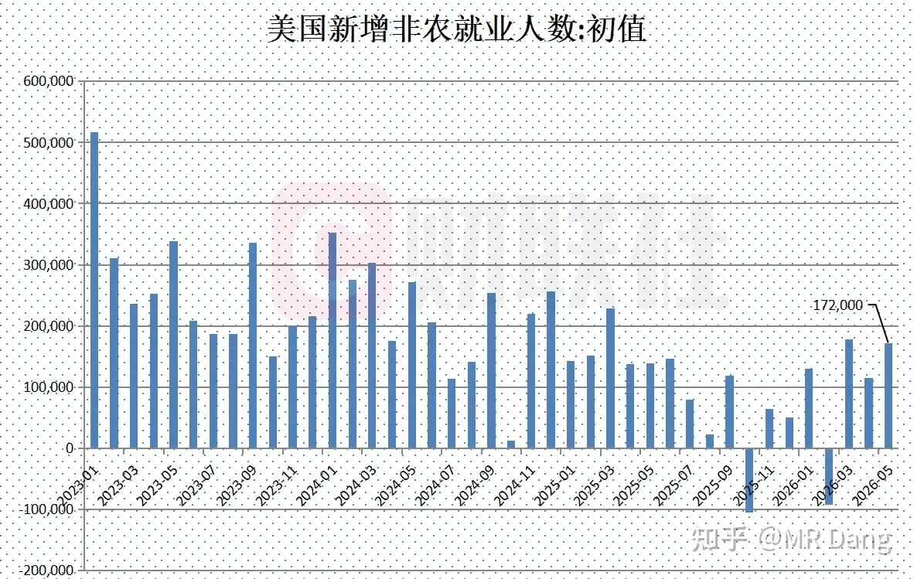

5月增加了17.2万人，远超市场预期的8.8万人，也比前值11.5万人要多。

这是沃什担任美联储主席后的第一份非农数据，强劲的就业数据表明经济过热，相应的会带来加息预期，对贵金属和资本市场都不是好消息。

尽管沃什的表态一直是降息+缩表，但是也有其他美联储官员表态加息：

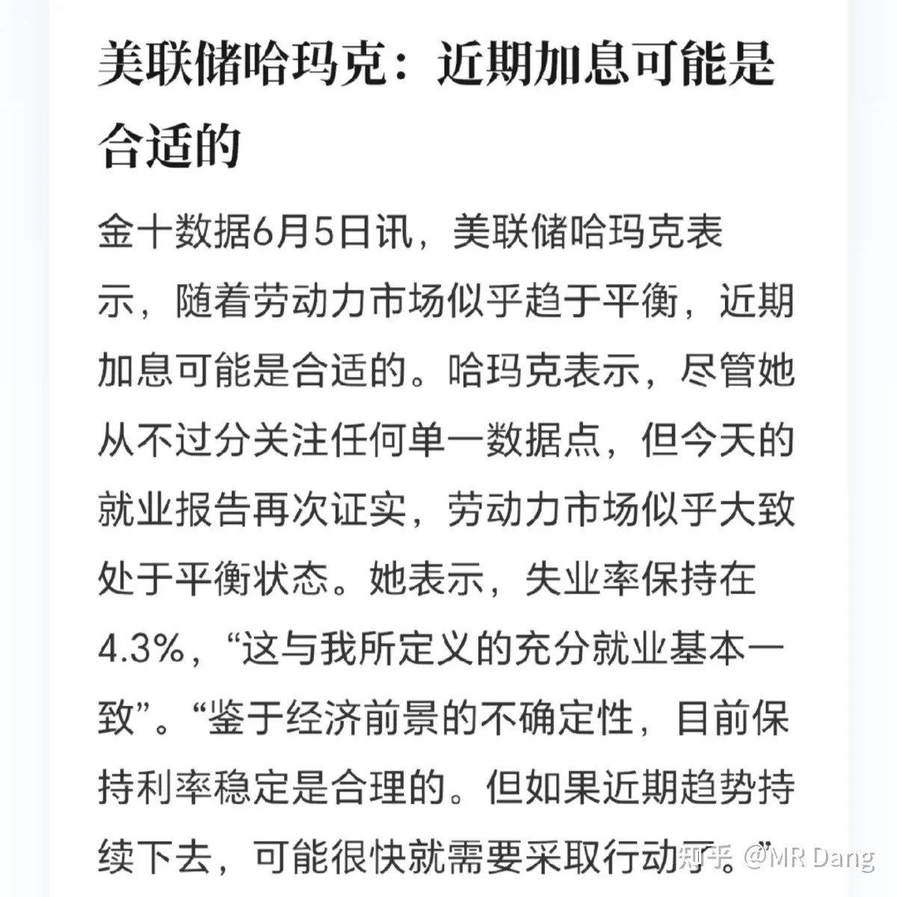

美联储加息的担忧彻底引发了资本市场和有色等大宗的回调。

根据一些场外预测数据，6月份加息的概率不足5%，但明年上半年之前有一次加息的概率显著增大。

央行继续大幅增持黄金：

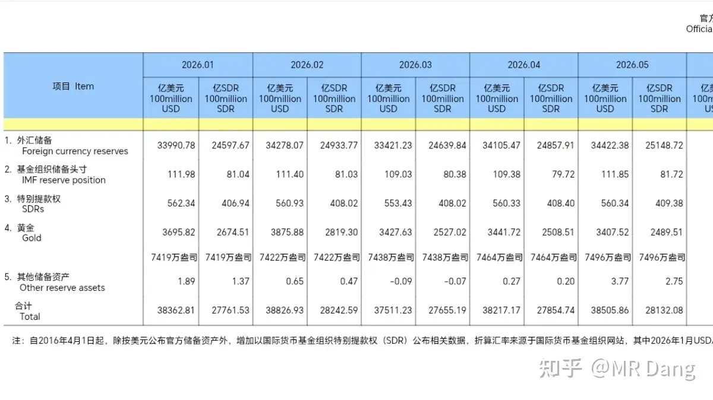

5月央行增持32万盎司黄金，买金速度越来越快。

央行和普通投资者的思维方式是不一样的，不在乎金价涨跌，需要的是稳步增加黄金储备。

普通投资者如果想学习央行的买金节奏，需要做好长持的准备和金本位的思维模式。

而大部分人是做不到这一点的。

伊美局势：

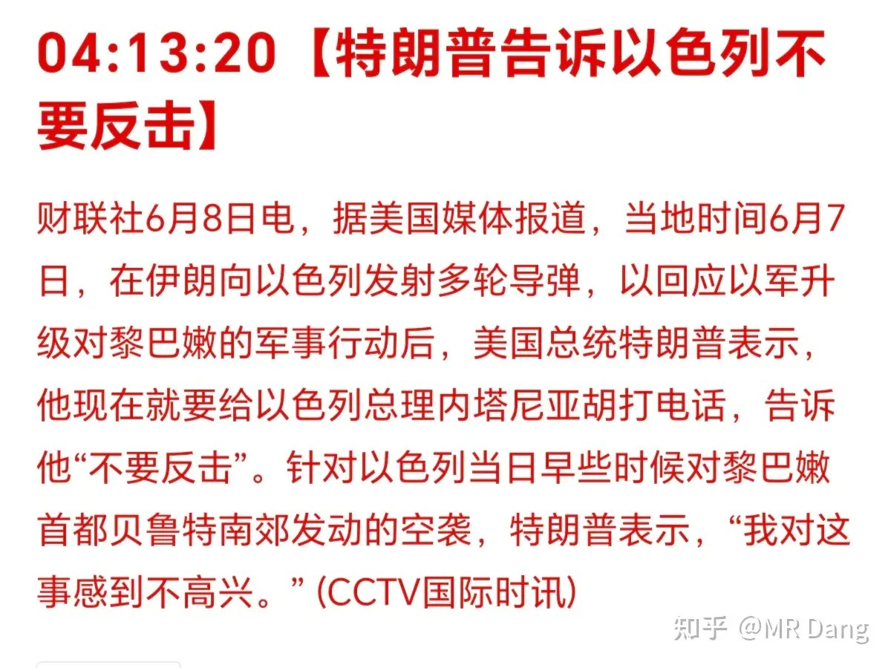

伊朗又卡在大A开盘前给以色列放了个烟花庆祝庆祝，懂王表示不开心。

知情人士又有新料：

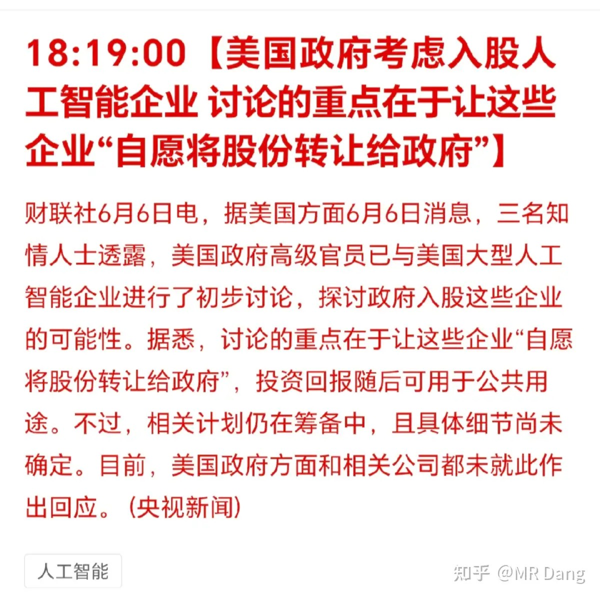

三名知情人士透漏科技企业准备“自愿转让”股份给西大。

这难道是美债危机的最后解决方案？

美债也就是40万亿美元，美股可有70多万亿呢。

额，这当然是说笑的，不过薅羊毛薅个几十亿上百亿市值的股票也不是没可能。

具体的消息是OPENAI的奥特曼格局了一下，主动找上门的。

这给其他科技企业开始上压力了。

私募管理：

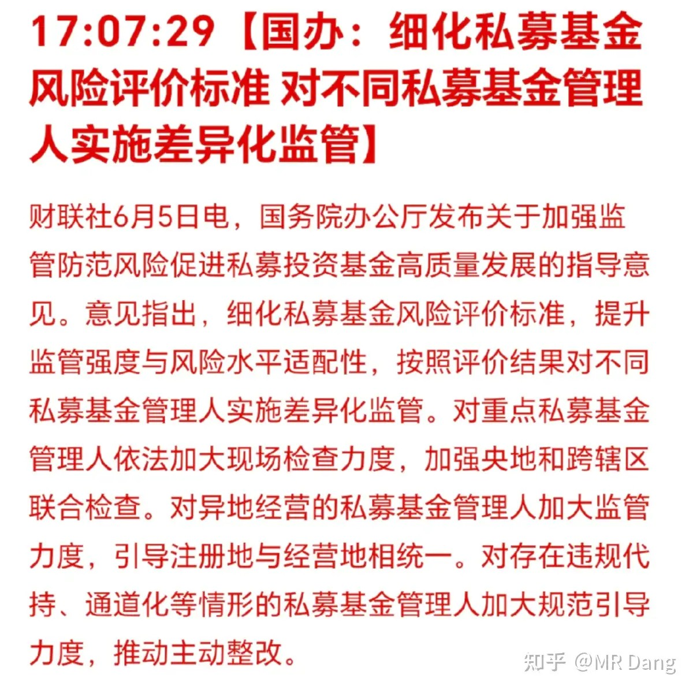

这个主要是要看主动整改措施，有没有清退的，如果有清退的，规模有多大，可能短期对流动性来说有一些压力。

但是对中长期的的金融行业发展肯定是有益的好举措。

深圳又出地王：

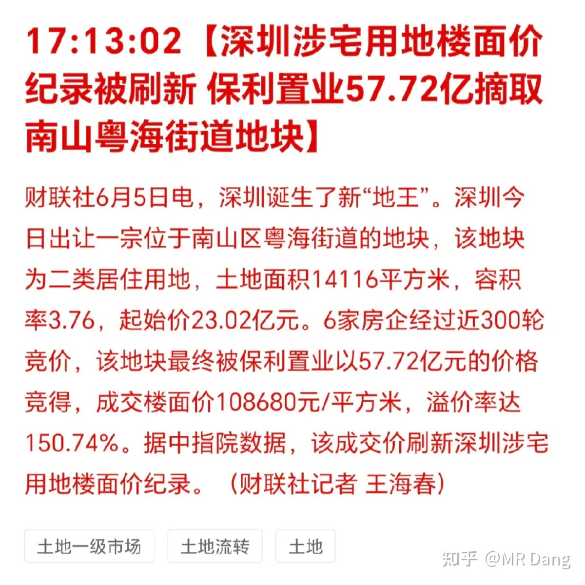

近期一些科技公司扎堆的城市频出地王。

这轮科技牛让一小部分相关从业者快速实现了财务自由，对豪宅的需求增长显著，特别是距离科技公司近的区域。

这些城市的财政状况将会明显好转。

公积金新变化：

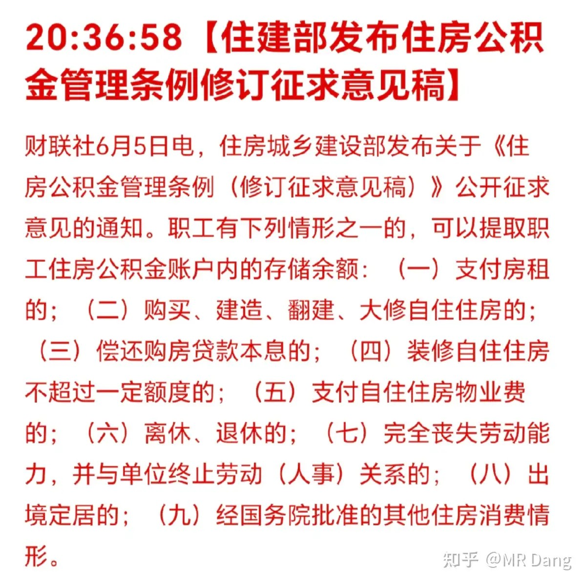

这和大部分人都有关，新的征求意见稿主要是增加了两方面的内容，一是自住住房装修，二是自住住房物业费。

理论上利好家装产业链上下游的行业，以及物业公司。

但话又说回来了，这些行业都是苦生意，这么点小利好，很难实质性改变行业处境。

算力底座：

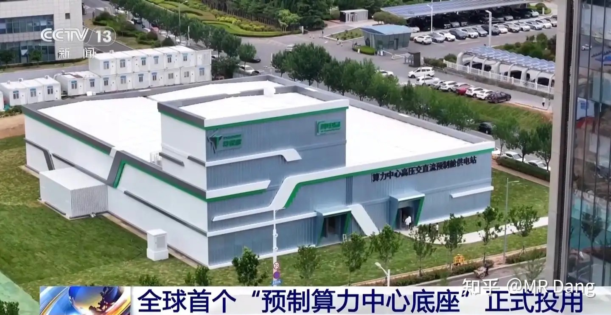

某上市公司的全球首个预制算力中心底座正式投用。

这个主要是解决了工期的痛点，传统的UPS算力供电中心建设工期大概需要12到18个月，而这个算力底座的建设工期只需要五个月。

相关公司目前价格在高位，想去参与的话掂量掂量，风险真挺大。

某扫地机器人公司被摸排业务：

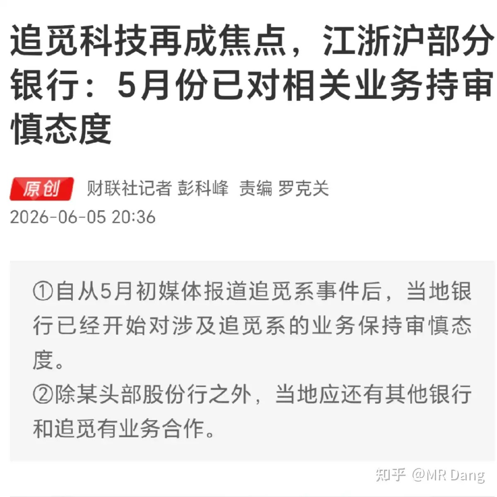

这家扫地机器人公司有个企业文化，就是“赛马机制”，实控人相关联的公司有很多。

做了很多赛道，一个行业一个行业的试，有几百个行业的业务，传言资金来源包括地方银行和地方衙门。

这其实也是因为实体经济投资回报率低，而地方又有投资任务，两方面一拍即合，促成了很多合作项目。

不过最近有些媒体爆出项目落地不及预期，有相关涉事方开始摸排资金情况。

周末还有个八卦，某pcb公司老板电梯门事件发酵。

女主爆料是因为嫌弃那么大老板只给她花了几十万。

有券商分析师称说明老板身体好，干劲足，财务管理的比较严格，属于利好。

哈哈哈，还得是专业的分析师，这词我怎么都想不出来的。

大宗商品：

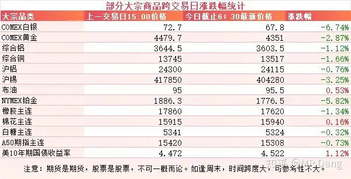

受非农数据的影响，有色整体承压。

白银回调近7个点，铂金6个点，黄金3个点，锡3个点，铜铝等工业金属一个点左右。

农产品表现也不佳。

A50期指似乎预示着今天开盘会有点小压力。

美债收益率逼近4.55的强弱分水岭。

外围市场：

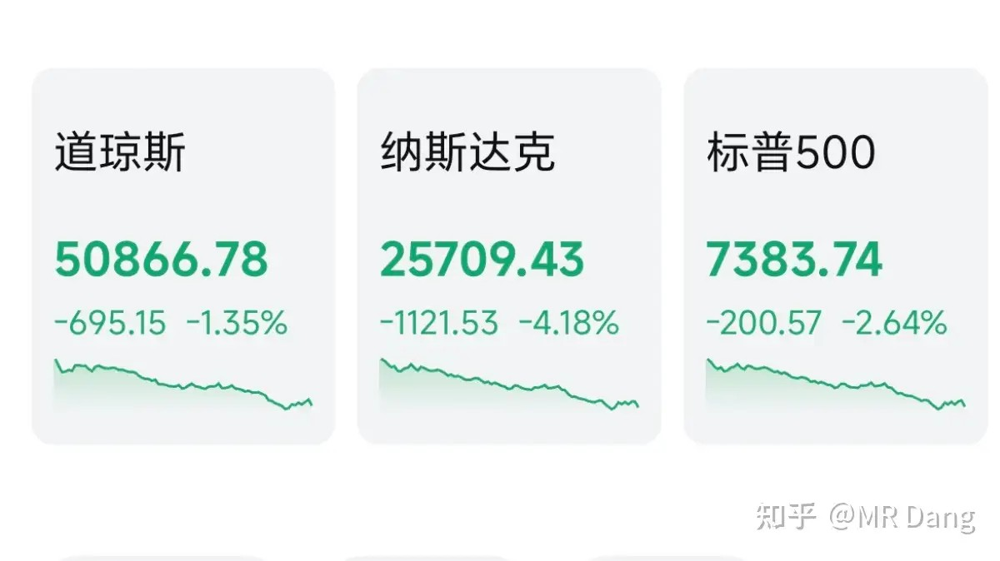

美三大股指回调，纳指领跌。

科技股回撤比较大，前期大热的Ai硬件，存储回调都挺多的。

个别老登板块表现尚可，比如药品，食品。

上个交易日个人组合净值纳米绿，银行红一个半，资源绿三个，消费绿近半个，算电绿两个。

资源这轮回撤，其他的利润垫还算厚，但是在铝上已经把之前赚的全吐回去了，前后打平，A股赚钱A股花，一分别想带回家。

钱没赚到，不过体验很差，被恶心到了，所以血亏。

至于市场整体环境的话，我一直对六月份的行情都比较担忧。

因为一眼看过去没什么好消息，国内外资本市场都在高位，各种巨无霸上市，还有世界杯魔咒，伊美还挤牙膏一样的出各种事情，现在又来个加息升温，基本上DEBUFF集齐了。

以前经常说小亏当赢，就看这几天能不能满足我赢的愿望了。

建议谈不上，但是最近想买的，一定一定三思而行，无论是想补还是想打野或者是想布局的。

我个人打算把算力租赁这个方向的清了，算电变回电网，然后找个机会超配银行板块做个防守。

有色的话，其实整体受情绪影响，估计会承压。

但是工业金属相对贵金属来说，对加息没有那么敏感，因为工业金属的持有时间成本低很多，最后还是要回归供需关系。

所以持有贵金属的，除非和央行一样都是只盯着数量，不管价格的长期主义者，否则还是考虑一下万一加息还要不要继续持有。

以上说的是商品，股票更多的是受到情绪影响，有色一般来说都归类为一个板块，情绪来的时候分的是没那么清的。

本周前瞻：

1，周二公布咱们这边的贸易账。

2，周三公布西大CPI，前值3.8%，预期4.2%

3，周三公布东大CPI，前值1.2%，预期1.3%

4，周五space x上市。

5，世界杯本周开幕。

6，本周恒科的家人们迎来了真正的科技，智谱和MINIMAX从今天起纳入恒科指数。

这个时间点选的实在有趣啊。

一个喜欢保护韭菜的博主，希望大家少少踩坑，多多赚钱！！！

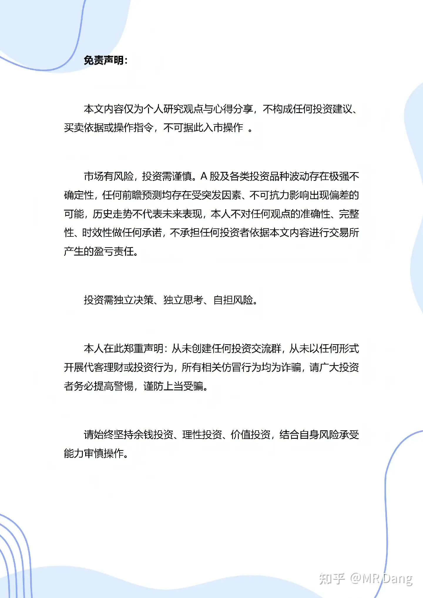

> [!comment]- 点击展开评论
>
> | 用户 | 时间 | 内容 |
> | :--- | :--- | :--- |
> | lily |  | 以前巴不得天天开盘，最讨厌周六日，现在一开盘就不敢看，稳定自动扣费 |
> | &nbsp;&nbsp;&nbsp;&nbsp;MR Dang |  | 真实了 |
> | &nbsp;&nbsp;&nbsp;&nbsp;尼尔雅童 |  | 哈哈我也是 也不知道咋操作 就扔着在那里了 |
> | &nbsp;&nbsp;&nbsp;&nbsp;lily |  | 又是抱头挨揍的一天 |
> | Mitsui |  | 看了下大D的某王系列基本全回年初之前价格了 |
> | 颗粒状 |  | 绿桥腰斩了 |
> | &nbsp;&nbsp;&nbsp;&nbsp;许个愿吧 |  | 中铝1/3 |
> | &nbsp;&nbsp;&nbsp;&nbsp;够日的沙泥泉佳 |  | 割肉低吸cpo吧 |
> | 樱桃老王子 |  | 我记得有一次我在评论区说宏桥是好公司，但是20多的宏桥可能不是好价格，有人还骂我。 |
> | &nbsp;&nbsp;&nbsp;&nbsp;Mitsui |  | 正常，我说双环6块贵了五块买比较好的时候也有很多鱼粉喷我 |
> | &nbsp;&nbsp;&nbsp;&nbsp;奔雷手 |  | 现在双环四块七，是不是无脑入哈哈哈 |
> | &nbsp;&nbsp;&nbsp;&nbsp;Mitsui |  | 我觉得可以入了 |
> | &nbsp;&nbsp;&nbsp;&nbsp;Mitsui |  | 按鱼的逻辑这个价格得卖房子买了 |
> | &nbsp;&nbsp;&nbsp;&nbsp;奔雷手 |  | 谨慎。明天到四块五。 |
> | momo |  | 绿桥腰斩了 |
> | &nbsp;&nbsp;&nbsp;&nbsp;极音 |  | 到16.6正好腰斩 |
> | Sleeve |  | 我得道歉我上次说国光问题不大.... |
> | 头上有犄角 |  | 不怕你们笑话，南山已经跌41个点了 |
> | 钱包鼓鼓 |  | 每日打卡第66天非农5月新增17.2万人远超预期8.8万，明年上半年加息概率显著增大，白银跌近7%黄金跌3%，A50期指预示开盘承压。央行5月增持32万盎司黄金，买金速度加快某算力底座投用建设工期缩短到5个月，但相关公司价格在高位风险大。扫地机器人公司因赛马机制被摸排资金。深圳科技区频出地王。六月DEBUFF集齐建议三思而行。 |
> | 清汤挂面 |  | dang大，刚我给您发了私信，也不知道您能不能看到。今天中午我看到圈子里有人被删评，就说了一下，然后就被拉黑了，现在我在圈子里的发言只有我自己能看到，希望您看到能给我拉出来。 |
> | &nbsp;&nbsp;&nbsp;&nbsp;很倾城 |  | 还说等下连知乎都给你拉黑 |
> | &nbsp;&nbsp;&nbsp;&nbsp;清汤挂面 |  | 我也没说什么过分的话呀… |
> | &nbsp;&nbsp;&nbsp;&nbsp;enlp |  | 可能是误拉的，每天评论区求一下就行了，管理员看到应该会拉出来 |
> | &nbsp;&nbsp;&nbsp;&nbsp;清汤挂面 |  | 已经出来了 |
> | &nbsp;&nbsp;&nbsp;&nbsp;够日的沙泥泉佳 |  | 赶紧退钱跑路吧 |
> | 樱桃老王子 |  | 国光这种老登都20多个点了 |

---

*本文件从MR Dang知乎页面转载*

---

**作者**: MR Dang
**链接**: https://www.zhihu.com/question/2043720546509227305/answer/2047218101268243457
**来源**: 知乎

*著作权归作者所有。商业转载请联系作者获得授权，非商业转载请注明出处。*
