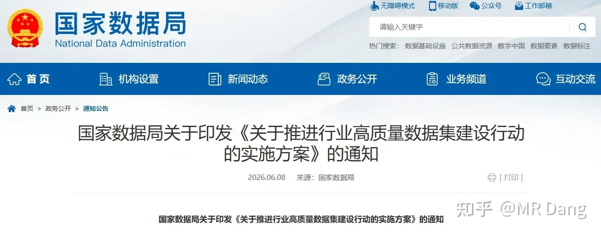
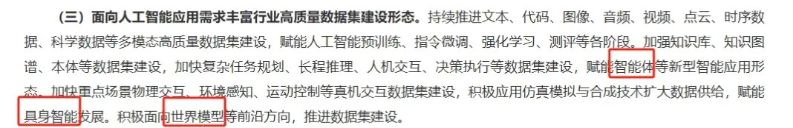
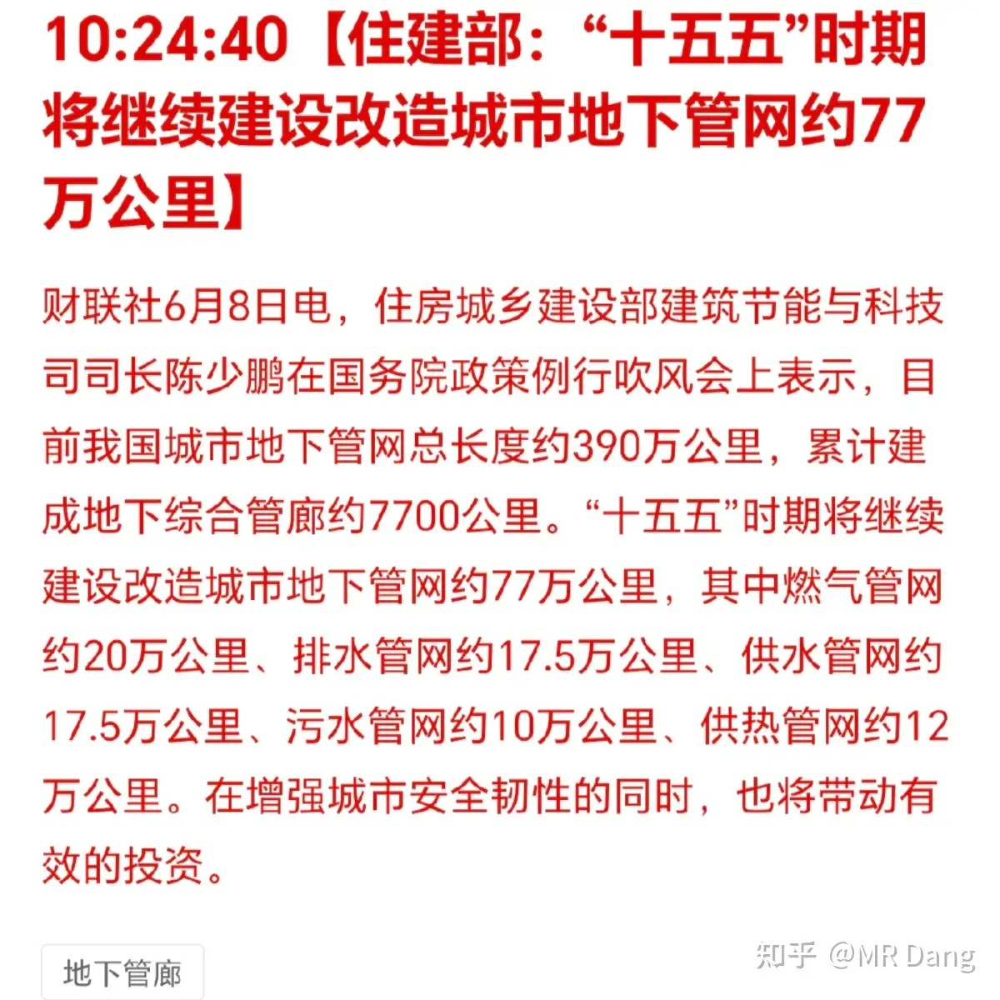
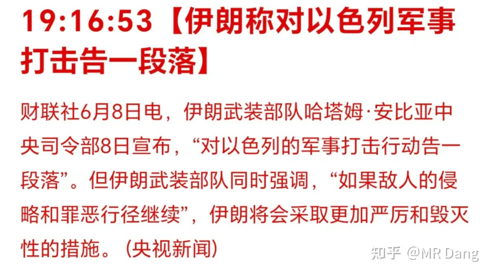
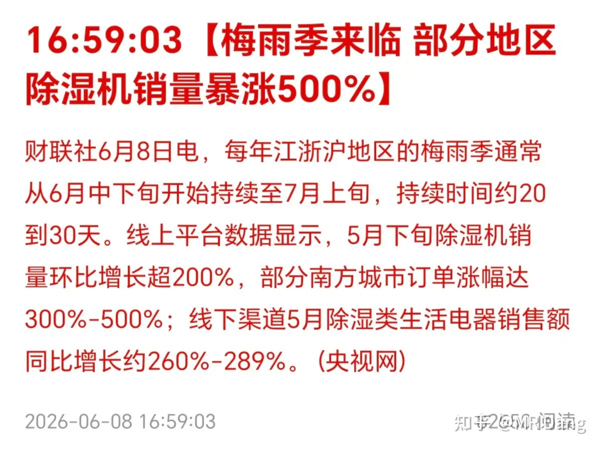
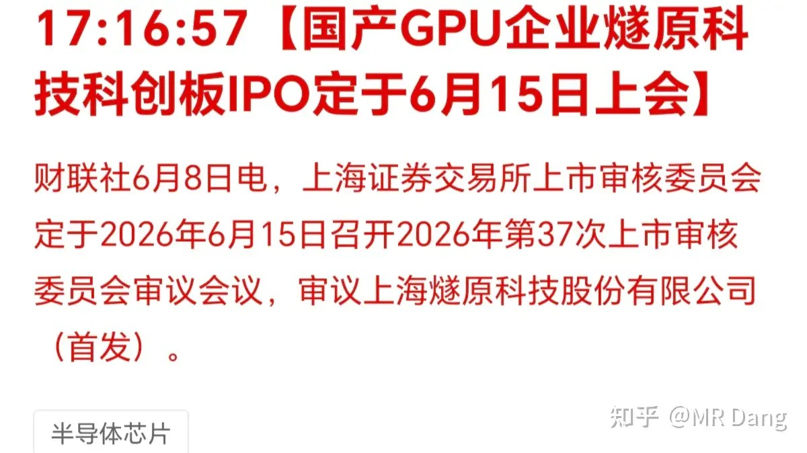
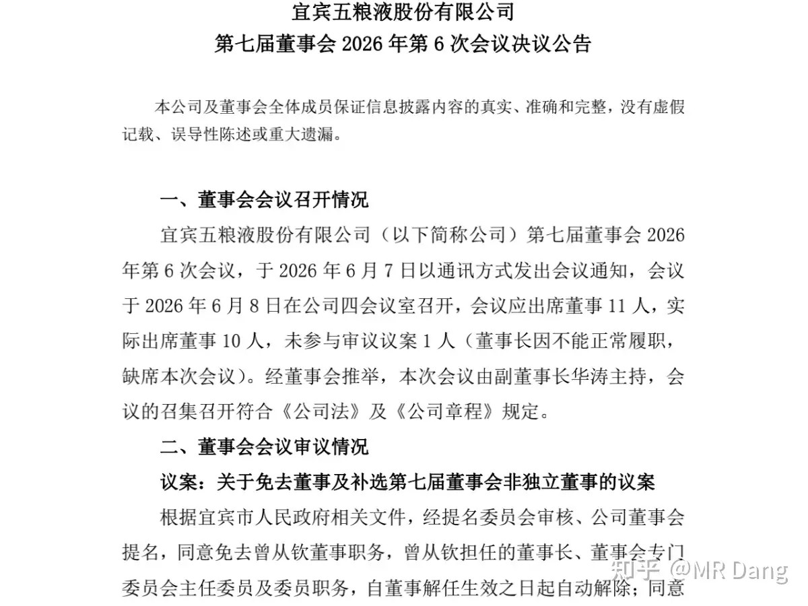
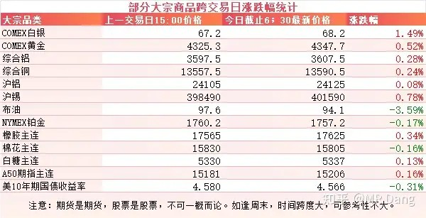
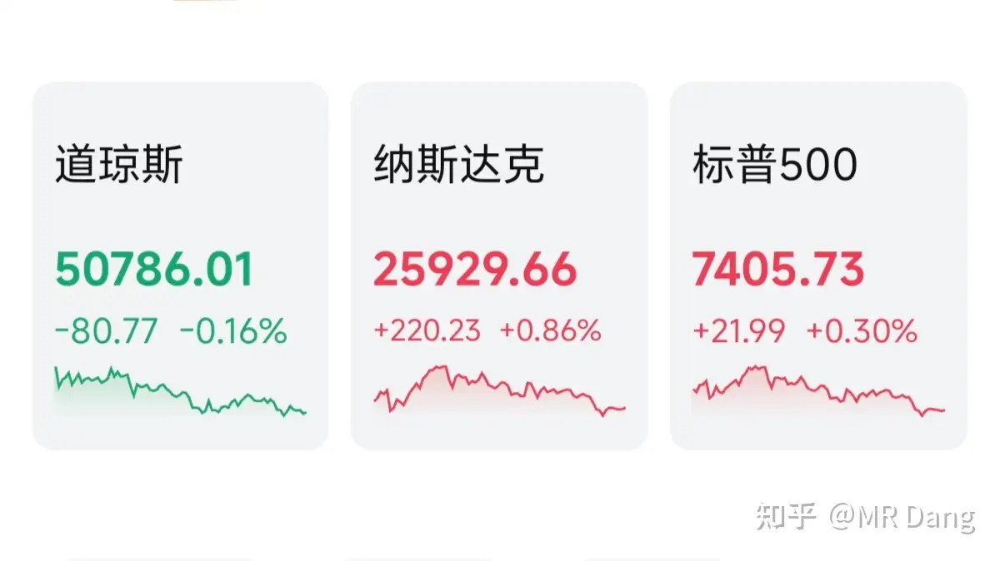

# 怎么看待2026年6月9日A股行情？

---

**发布时间**: 2026-06-09 07:40  |  **原文链接**: https://www.zhihu.com/question/2046291655288943059/answer/2047583841058132921  |  **点赞数**: 232 人赞同

**作者信息**: MR Dang | 独立投资人，《价值投资功法》作者，小红圈同名，无其他小号。

---

## 正文内容

头条给到数据局：

国家数据局发布了一个文件，主要是针对高质量数据的建设行动。

对前沿领域也做了一些部署，点名了世界模型这个细分领域，利好物理仿真之类的行业。

现在Ai模型的训练，高质量的数据也成为了制约的瓶颈，所以数据的采集和标注也都是受益环节。

地下管网：

目前总长度，地下管网已经有390万公里了。

十五五期间建设改造77万公里，这个数据甚至比十四五期间已经完成的84万公里少一些。

另外还公布了各类地下管网的数量，其中燃气管网约20万公里，比较超预期。

燃气管网的话，主要是三个方向，一个是球墨铸铁的主管道，还有pe燃气管，另外就是智慧燃气检测，最后一个也是铲子股思维。

这类五年规划的事情，预期兑现的非常慢，不适合短期投机。

美伊局势：

伊朗打完停手了，又变成了回合制游戏，到以色列的回合了。

从原油价格来看，市场反应还是比较克制的。

除湿机热销：

有媒体报道部分地区梅雨季来临，除湿机销量暴涨。

这种家电类突然需求增加的，一般来说也都没有太多的投资机会，因为没什么门槛，而且也没什么持续性。

我记得之前有一次是报道给欧洲出口电热毯的出口数量暴涨，很多投资者去投机，最后都挂树上了。

国产GPU也来上市了：

半导体上市其实也是个挺看运气的事，现在大A的科技是在太热了，都争着抢着来上市。

至于国产GPU，客观的说和西大差距还有点大，确实需要好好发展发展。

这次上市的这家是GPU四小龙之一，主要做云端AI芯片，邃思4.0可能就在今年发布，传言部分技术指标对标英伟达H200。

到时候卡在上市的时候来一场酣畅淋漓的发布会，啧啧啧。

本次募资目标是60亿，其他的三家已经上市了。

希望大家都中签吧。

某酒企发布公告：

董事长被换了，也不是很意外，毕竟改财报的操作实在有些过于离谱了，股价已经跌的没眼看了。

大宗商品：

受伊美局势影响，原油回调，幅度是三个点。

有色整体回暖，但是幅度不是很明显。

农产品表现一般。

10年期美债处于4.55分水岭上方。

外围市场：

美三大股指涨跌不一，纳指领涨，存储反弹。

昨天个人组合净值回撤近一个半，银行绿半个，资源绿四个，消费绿近一个，电网绿三个。

算力租赁算是彻底清了，利润垫又缩水一大截，但好歹是逃掉了，同样是回撤，估值高的东西拿着一点都不踏实，估值低的起码还睡得着觉。

以前总觉得没有一点高科技的东西，就和时代彻底脱节了。现在想通了，老登就该躲在老登板块里瑟瑟发抖，电网已经是我能接受的最大尺度了。

另一边的有色现在仓位占比越来越低了，硬是自己跌的权重下降了。

上周是黑色星期四和黑色星期五，昨天又来了个黑色星期一，直接连续黑三天，连喘口气的时间都不给。

总体比指数还能强一些。

但是要说服自己这点伤不算疼，多少有点自欺欺人了，很多板块已经回调的数字也不是小数字了，像有色已经跌出了股灾里的几分风采。

整体大环境上901家上涨，另外4591家待涨，如果随便买一个，亏的概率很大。

一个喜欢保护韭菜的博主，希望大家少少踩坑，多多赚钱！！！

> [!comment]- 点击展开评论
>
> | 用户 | 时间 | 内容 |
> | :--- | :--- | :--- |
> | 滴滴滴 |  | 绿桥对比高点已经腰斩了 |
> | &nbsp;&nbsp;&nbsp;&nbsp;哈哈哈 |  | 宏桥 |
> | &nbsp;&nbsp;&nbsp;&nbsp;华Dee |  | 绿桥是什么 |
> | 抽筋馒头 |  | 最大的乐趣就是看绿桥跳水了因为我早就止损了。 |
> | &nbsp;&nbsp;&nbsp;&nbsp;一米阳光 |  | 我还没止损 |
> | &nbsp;&nbsp;&nbsp;&nbsp;鹭起 |  | 更大的乐趣是在科技里看绿桥跳水 |
> | &nbsp;&nbsp;&nbsp;&nbsp;那一抹夕阳 |  | 科技也不安全 |
> | 雨田君子 |  | 昨天割肉跑了，好疼，大家什么仓位？ |
> | 简单 |  | 紫金，绿桥，啤酒，三座大山 |
> | &nbsp;&nbsp;&nbsp;&nbsp;天天5 |  | 啤酒还好吧 |
> | &nbsp;&nbsp;&nbsp;&nbsp;若星汉天空 |  | 资金做波段还行30以为接33出，最离谱的就奈何桥了 |
> | 南辰 |  | d老师投资的资金体量大概是多少？被隔壁那个搞怕了 |
> | 蛮王石头人 |  | 大佬早，今天早上吃绵阳米粉+卤蛋 |
> | &nbsp;&nbsp;&nbsp;&nbsp;时光 |  | 同绵阳 |
> | &nbsp;&nbsp;&nbsp;&nbsp;无忧不忧 |  | 倒是提醒我了，想吃绵阳米粉了 |
> | 白日流星 |  | 绿桥越跌越兴奋 |
> | &nbsp;&nbsp;&nbsp;&nbsp;今天不打工 |  | 那是跌的还不够深 |
> | &nbsp;&nbsp;&nbsp;&nbsp;浪里小白马 |  | 能不能一步到位跌到13，我直接all in进去等翻倍了 |
> | &nbsp;&nbsp;&nbsp;&nbsp;白日流星 |  | 因为我25亏25个点跑了，随便他跌了 |
> | &nbsp;&nbsp;&nbsp;&nbsp;坛九 |  | 你猜Duang为什么不给你小红花 |
> | &nbsp;&nbsp;&nbsp;&nbsp;够日的沙泥泉佳 |  | 哈哈哈哈哈韭菜是这样的，等到个位数吧 |
> | 摇摇晃摇 |  | 我也想问绿桥咋办 不是电解铝吗 |
> | &nbsp;&nbsp;&nbsp;&nbsp;摇摇晃摇 |  | 不说仓位 买的时候喊 跌成这样了就走是吗 |
> | &nbsp;&nbsp;&nbsp;&nbsp;咕哒 |  | 他都说有色清了很多，你还死守干嘛 |
> | 小风聊家居 |  | 感觉现在每天早上讲的信息好像越来越少了，错觉吗 |
> | 少侠饮杜康否 |  | 这段时间不好做 |
> | &nbsp;&nbsp;&nbsp;&nbsp;大梦 |  | 这个月是真的痛苦，我的电力的利润全部吐回去了还亏了 |

---

*本文件从MR Dang知乎页面转载*

---

**作者**: MR Dang
**链接**: https://www.zhihu.com/question/2046291655288943059/answer/2047583841058132921
**来源**: 知乎

*著作权归作者所有。商业转载请联系作者获得授权，非商业转载请注明出处。*
