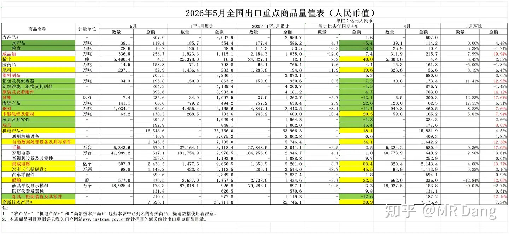
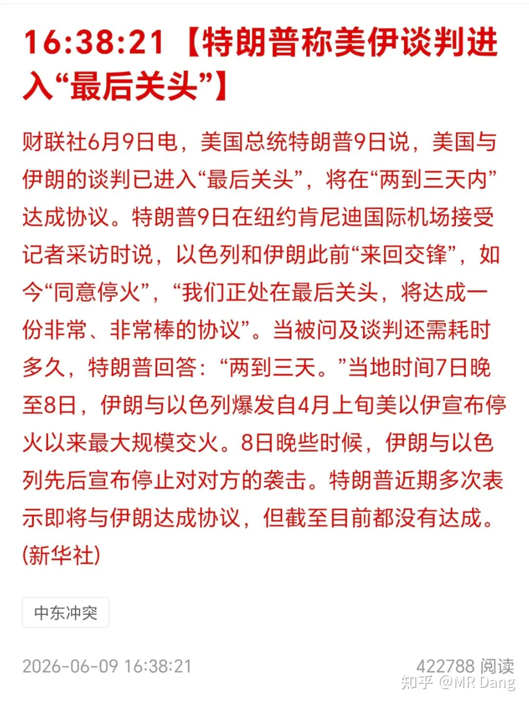
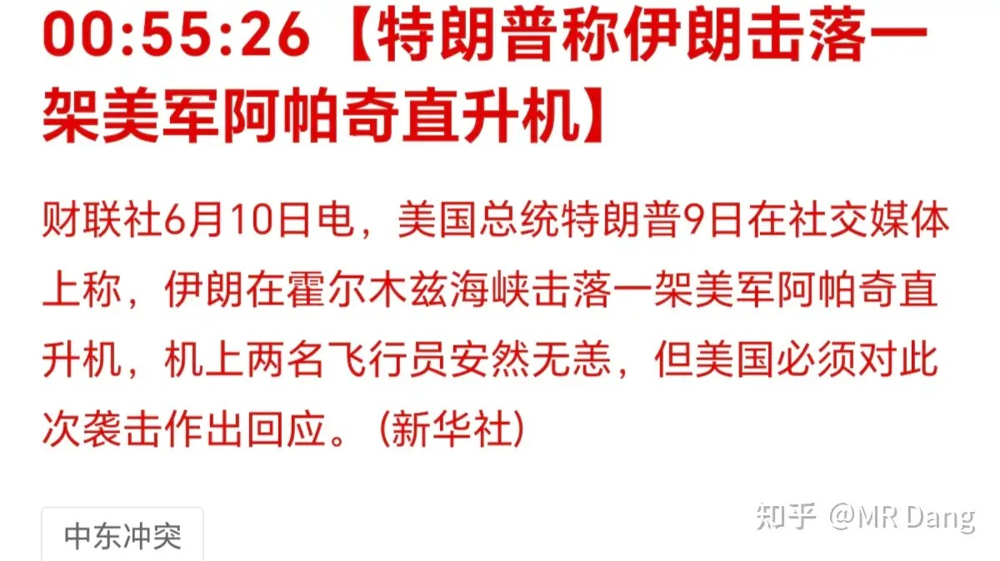
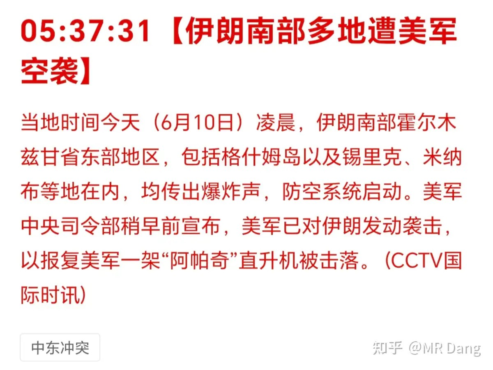
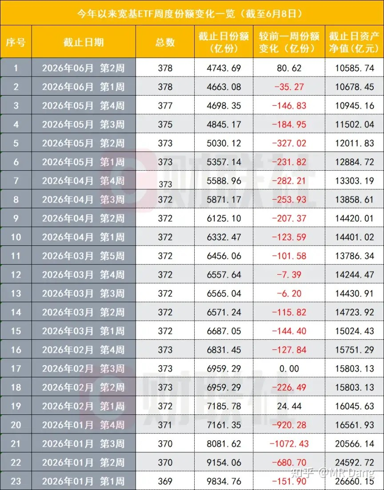
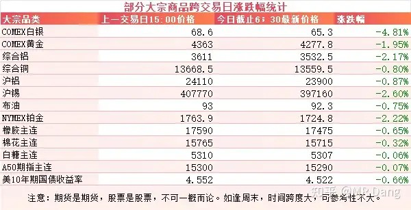
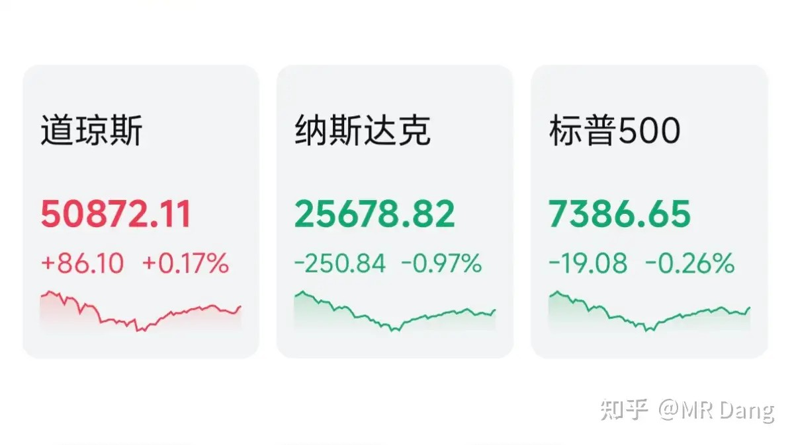

# 如何看待2026年6月10号的a股走势？

---

**发布时间**: 2026-06-10 07:31  |  **原文链接**: https://www.zhihu.com/question/2047304908106371408/answer/2047943962787427354  |  **点赞数**: 271 人赞同

**作者信息**: MR Dang | 独立投资人，《价值投资功法》作者，小红圈同名，无其他小号。

---

## 正文内容

昨天有关部门发布了前5月的贸易账本，包含各行各业的进出口数据。

当然对投资影响比较大的还是出口数据，所以要重点分析。

这个表格是我自己做的一些加工。

在有关部门给出的5月数据上，加上了4月的数据，然后算出了5月单月的环比改善情况，用来看边际变化。

环比改善超过均值的用红字表示。

同比数据比较好的用黄底表示。

同比数据差的用绿底表示。

所以，黄底红字的行业，就是同环比都在变好的行业，属于出口景气度最高的行业。

这样的行业一共有四个，分别是铝，自动数据处理设备，集成电路和船舶。

绿底红字的行业，就是出口困境反转的行业，虽然前五个月数据不佳，但是5月在慢慢变好。

这样的行业一共有5个，分别是服装，鞋靴，钢材，玩具和灯具。

都是一些传统的制造业。

美伊局势：

懂王又称进入最后关头了，又是两三天，这是懂王第37次做出类似表态。

当然我没那么闲，去统计，是媒体统计的。

结果到了晚上就等来：

伊朗击落一架阿帕奇直升机。

而现在最新情况：

西大把伊朗炸了，又赶在大A开盘前干起来了。

宽基ETF开始净流入：

代表科技的科创50这些是净流出的，而宽基是净流入的。

宽基 ETF的边际变量，一般不会来自普通参与者，普遍被视为某神秘资金的动向。

格局这块确实拉满了，4000点以下开始呵护市场，4200点以上把珍贵的筹码忍痛割爱。

大宗商品：

这颜色似乎不需要解说了。

原油现在很奇怪，按道理来说，打起来了应该会支棱起来，现在明显钝化了。

外围市场：

美三大股指涨跌不一，道指领涨。

板块上银行等传统行业表现较好，科技股回调。

另外体育，博彩板块表现强势。

这是个很有意思的信号。

原油回调的同时，有色也在回调，科技股也在回调。

说明有一个其他的资产正在快速的吸取场内流动性。

再考虑到体育等板块的崛起，叠加马上要开赛的日程安排，世界杯魔咒好像要开始发力了。

科技股涨的再快，也不可能有一场球赛就翻几倍来的快。

昨天个人组合净值回血一个多点，银行一个半不到，资源微红，消费绿1个，电网红近4个，目前银行板块处于超配状态，打算至少保持到分红结束，等分红下来去别的地方看能不能捡到便宜。

整体和大盘指数基本持平，就是消费在无人问津的角落里已经拖后腿很久了。

圈里写了一些不怎么正能量的话，就不贴了，影响科技的团结。

一个喜欢保护韭菜的博主，希望大家少少踩坑，多多赚钱！！！

> [!comment]- 点击展开评论
>
> | 用户 | 时间 | 内容 |
> | :--- | :--- | :--- |
> | 两江的雨季 | 23 小时前 | 十个亿全仓亨通光电，目前市值已翻倍，等这波行情结束后，本人准备把盈利捐出来给广大失业的知乎B友吃顿好的拉动内需 |
> | 在人间 |  | 铝都腰斩了，还有反弹？长路漫漫呀 |
> | 钱包鼓鼓 |  | 每日打卡第68天前五个月出口数据出炉，同环比双升的行业有四个：铝、自动数据处理设备、集成电路、船舶美伊又在大A开盘前动手，原油钝化回调三个点资金从科技和大宗商品撤退涌向体育博彩板块宽基ETF净流入科技类净流出 |
> | 颗粒状 |  | 腰斩了，跌麻了 |
> | 风轩云冕 | 22 小时前 | 泪桥28今年有希望回本吗 |
> | &nbsp;&nbsp;&nbsp;&nbsp;曹星星帮主 | 21 小时前 | 做梦，明年就不分红了还吃股息呢 |
> | 乐观向上的小肖同学 | 18 小时前 | 如何看待绿桥 |
> | 独立寒秋湘江北去 |  | 昨天回半个点  今天绿五个点起步 |
> | 木子一 |  | 装死，看不到就没有跌 |
> | 猩猩点灯 |  | 现在准备建仓宏桥可以么？ |
> | 冷面王 |  | 授人以渔不如授人以鱼 |

---

*本文件从MR Dang知乎页面转载*

---

**作者**: MR Dang
**链接**: https://www.zhihu.com/question/2047304908106371408/answer/2047943962787427354
**来源**: 知乎

*著作权归作者所有。商业转载请联系作者获得授权，非商业转载请注明出处。*
