# 怎么看待2026年6月11日A股走势?

---

**发布时间**: 2026-06-11 07:19  |  **原文链接**: https://www.zhihu.com/question/2047637421580347037/answer/2048303440770643208  |  **点赞数**: 302 人赞同

**作者信息**: MR Dang | 独立投资人，《价值投资功法》作者，小红圈同名，无其他小号。

---

## 正文内容

还是从统计局说起，昨天发布了CPI数据：

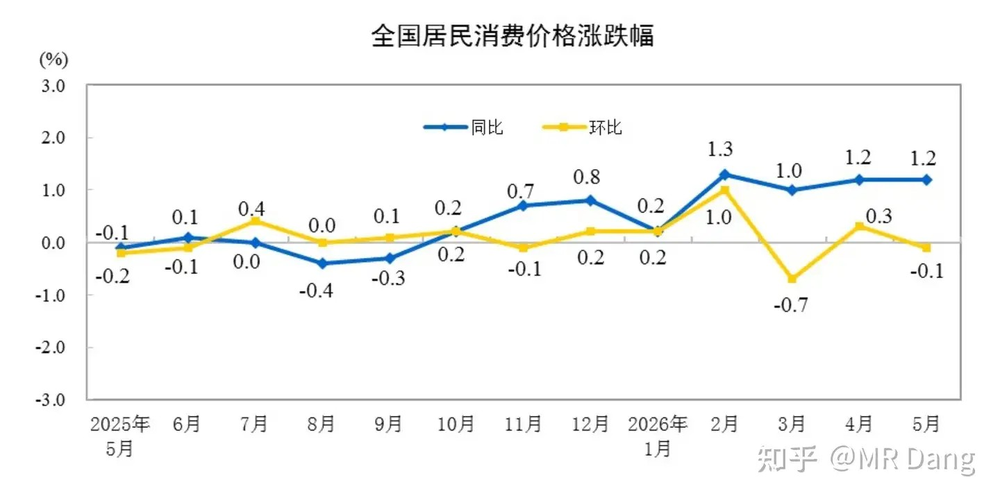

同比增长1.2，环比负增长0.1。

数据符合预期，具体分行业：

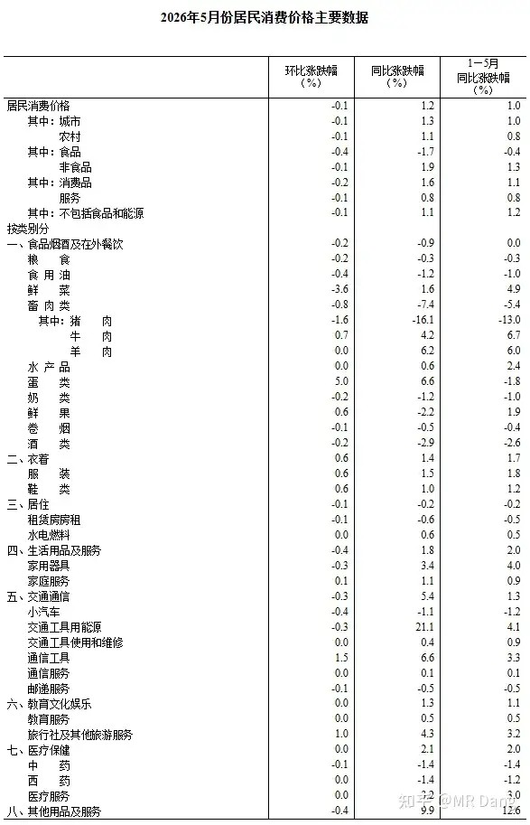

想找一个出彩的行业，找了又找，能力有限，没找出来。

相对来说，牛肉鸡蛋价格还行。

另外通信工具，也就是手机涨价了，这个很早就说过，存储涨太多，传导出来的。

旅游也还可以，同环比都是增长的。

现在世界主要分硅基阵营和碳基阵营。

碳基阵营的钱整体在往硅基阵营移动。

所以留在碳基阵营里的钱就少了，和碳基有关的一切都在变得物美价廉。

相对的，和硅基阵营有关的生产资料都在涨价。

这个逻辑很好理解，简单粗暴。

如果一样资源，碳硅两用，硅基用的多了，价格就涨了，慢慢的就会把通胀拉起来，比如存储就是这样传导到手机的。

两边不是隔离开的，只是现在资金往硅基流动，以后早晚还会流回来，这也是消费板块表现这么差，我还抱着不撒手的原因。

另外还有一个数据，大家可以关注下，就是住房的房租。

这个数据代表了房产的真实供需关系，是房价的前瞻性指标，类似于股票里的股息一样，股息少了，锚定股息率的股票就容易跌。

房租跌了，意味着房子的内在价值降低了，就容易压制房价。

目前这个数据不是很乐观，单月同比负增长0.6，增速比前几个月快一些。

西大CPI：

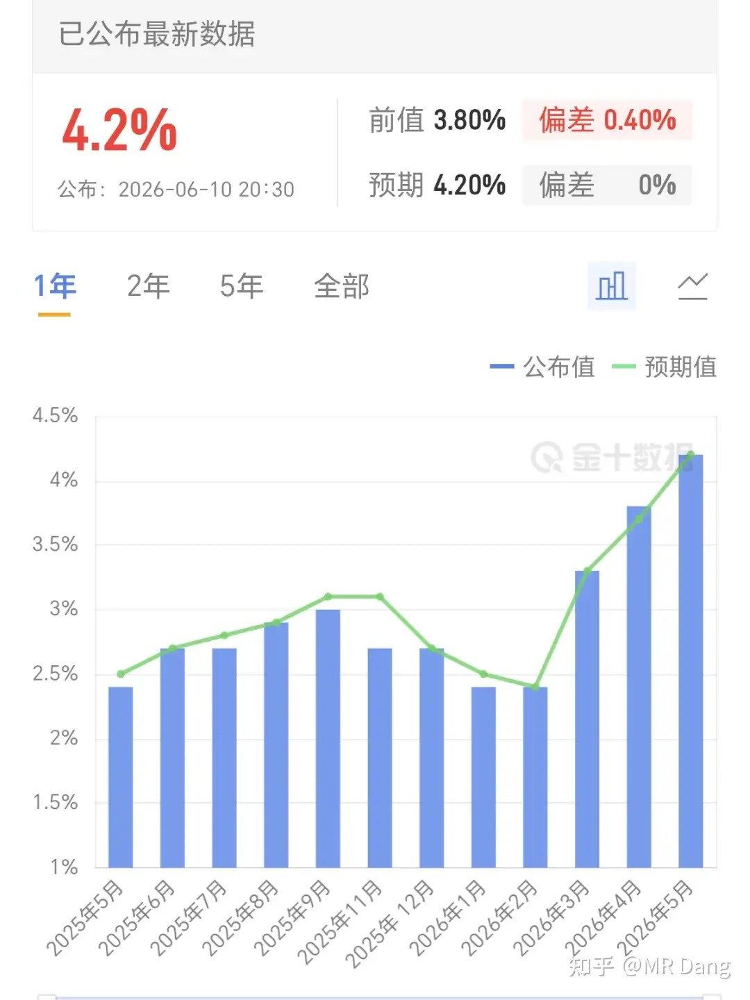

4.2%符合预期，前值3.8%。

好一点的地方，确实没有比预期更高，完全符合市场预期。

但是，毕竟也来到了4.2%，未来的通胀压力还是挺大的。

核心CPI是2.9%，也符合预期。

所谓的核心CPI就是剔除了能源和食品以后的CPI，相对来说，反应的是内生的通胀趋势。

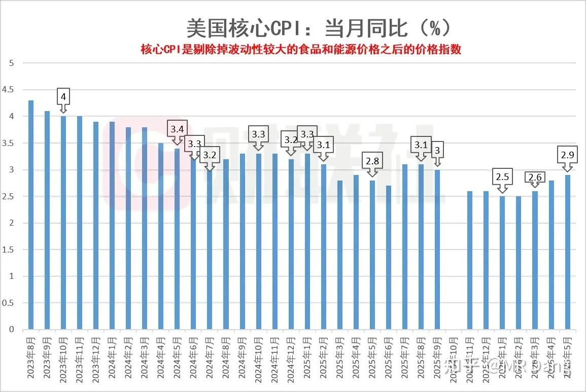

现在场内押注今年年内有一次加息的概率大概是四成左右。

说到这里，经常会有博主拿两边的CPI进行对比，1.2% Vs 4.2%。

但是两边的CPI计算逻辑是不一样的，比如东大的食品饮料权重29.5%，而西大只有14.5%。

居住上东大只占cpi权重的22.1%，而西大足足有44.5%，占了一小半。

所以西大的CPI和租金正相关性很大，相应的，和房子相关性也很大，这个不知道算不算冷知识，因为很少看到有博主科普这个。

香港证监会表态：

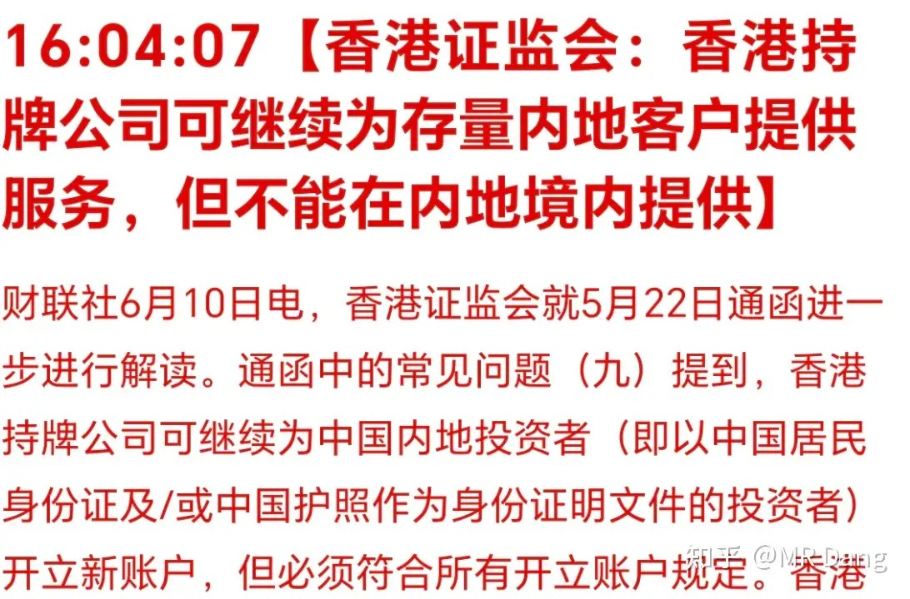

可以继续为存量内地客户提供服务，但不能在内地境内提供。

大家反复理解这句话。

美伊局势：

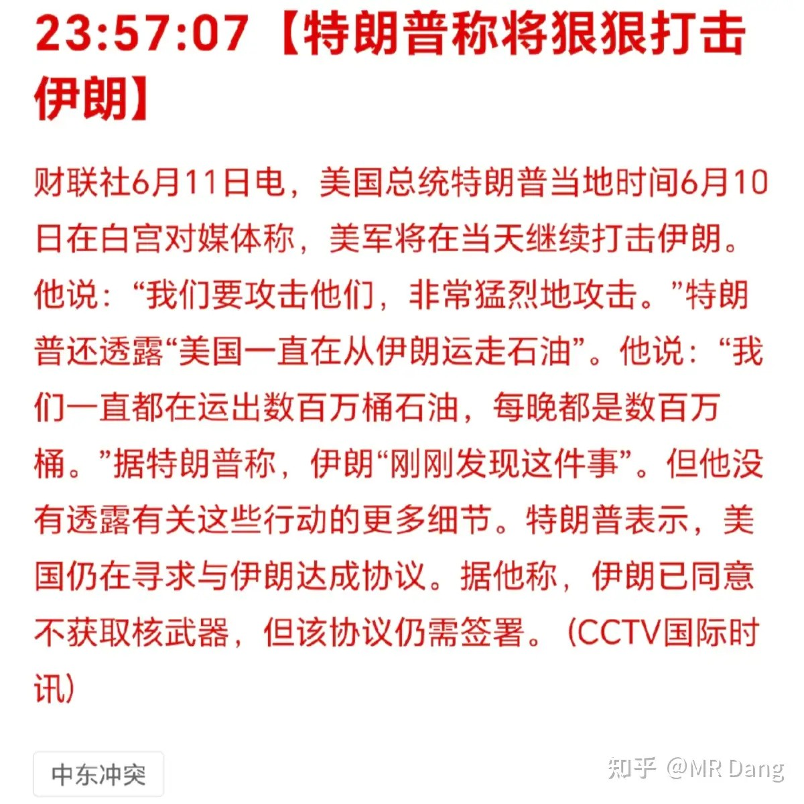

懂王称要狠狠攻击伊朗。

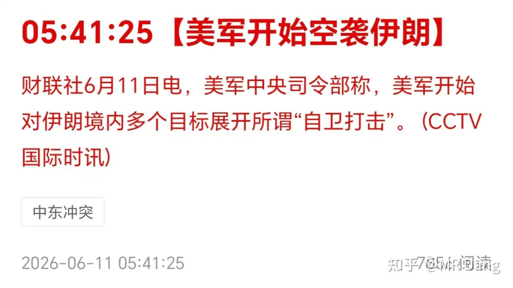

每天大A开盘前例行自卫。

易中天里的易要去港上市：

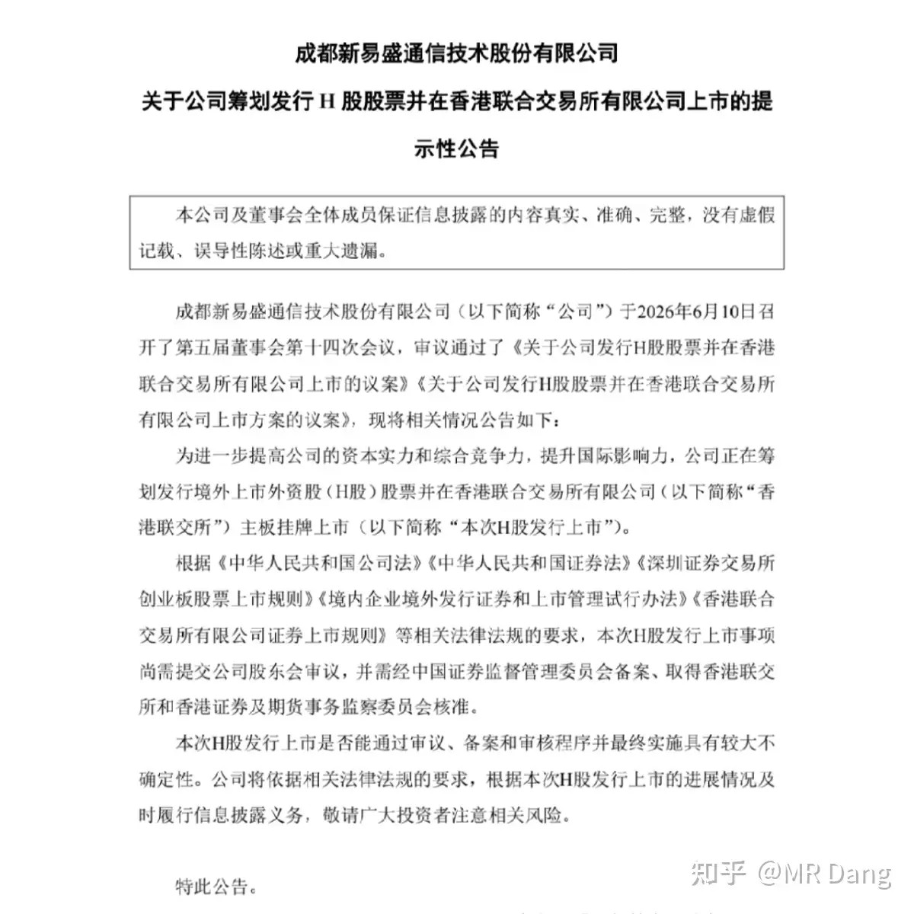

港股的投资者终于也迎来了真正的光。

至于一般这种本身在A股已经上市的公司，去港上市，或者本身已经在港上市的公司来A股上市。

对原有股东来说都不算什么利好消息，因为只看股票的供需关系，相当于增加了股票的供应。

易中天里的中被列入1260H清单：

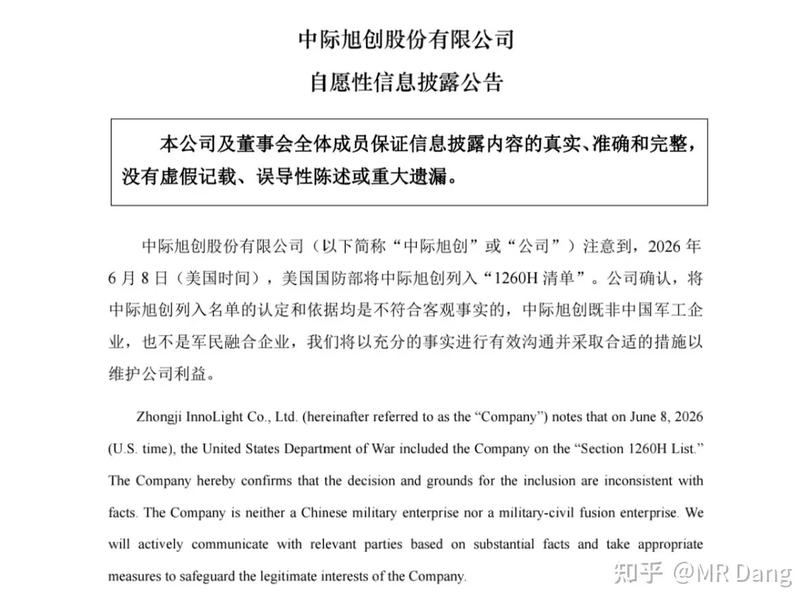

被列入这个1260H清单后，不允许西大的军方直接采购，其他没什么影响。

像比亚迪，药明康德，阿里巴巴什么的也被列入了。

最早一批被列入的还有大疆，但是大疆的东西确实太好用了，就有媒体发现西大去市场上租二手大疆用，租金是新品售价的两三倍，这样就不算“直接采购”了。

大宗商品：

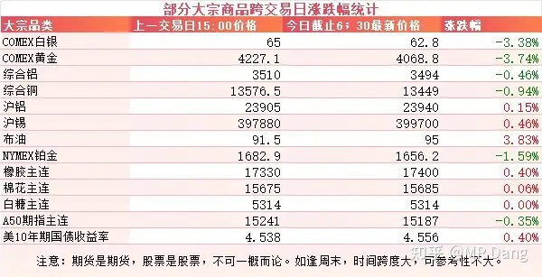

受消息面影响，原油反弹，涨了近4个点。

有色的话，贵金属重挫，白银黄金都跌了三四个点，黄金都快到4000美元了。

工业金属相对来说涨跌互现，相对平稳。

农产品没什么动静。

美10年期国债收益率又到了4.55上方。

外围市场：

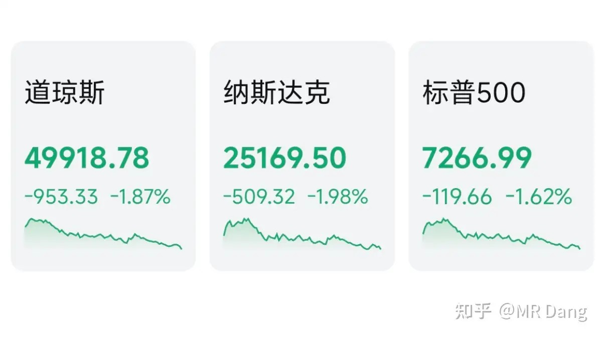

美三大股指回调，纳指领跌。

热门科技股普遍回调，消费板块走强，可口可乐创新高。

另外博彩板块延续强势。

中概股表现一般，可能恒科的家人们今天要承压了。

昨天个人组合净值回血小半个，银行红近一个，资源绿一个半，消费红了三个半，电网绿了两个半。

不看指数的话，还以为闻到了小牛淡淡的香味，比预想中要好太多了。

消费这个下水道里的老登又爬出来晒太阳了。

现在很多被套牢的老登怎么看科技呢，我可以形容一下。

老登都在下水道里。

旁边就是科技的高楼，每天越盖越高，看着很危险。

老登既想让科技这楼不要挡住自己唯一的下水道井口，影响自己晒太阳。

又怕科技这楼万一垮了砸到自己的下水道。

最好是呼啦一下倒旁边去，最好不过了。

一个喜欢保护韭菜的博主，希望大家少少踩坑，多多赚钱！！！

> [!comment]- 点击展开评论
>
> | 用户 | 时间 | 内容 |
> | :--- | :--- | :--- |
> | 浪里小白马 |  | 继续等待绿桥砸到15以下 |
> | 一尔 |  | 各位股友，你们还好不？ 我已开通自动扣费功能一个月了。 |
> | &nbsp;&nbsp;&nbsp;&nbsp;nier |  | 我也是 四十多万没了 |
> | &nbsp;&nbsp;&nbsp;&nbsp;一尔 | 23 小时前 | 你不一样，你以前挣了，我是一直都没挣，5-6月更是。 |
> | 余幼时即嗜学 |  | 绿桥是整个板块，跌的最多的，也不知道当初怎么就看上它了。 |
> | 鹿佑 |  | 这不完了吗这不 |
> | 天涯之夜 |  | 评论区怎么这么友好？不好听的都被删除了么 |
> | 钱包鼓鼓 |  | 每日打卡第69天CPI同比1.2%环比负0.1%，找不出出彩行业房租单月同比跌0.6%增速加快美CPI 4.2%核心2.9%均符合预期银行继续吃股息不动，黄金别抄底，美伊开盘前搞事已免疫 |
> | 颗粒状 |  | 绿桥基本上是铝股里表现最差的了 |
> | &nbsp;&nbsp;&nbsp;&nbsp;许个愿吧 |  | 中铝也不遑多让了，跌了近40% |
> | 不收钱发帖 |  | 好痛。。。天天挨打，到这里喊一声。 |
> | 如来熊掌 |  | 最近这个走势，我是无所谓啦，但是我的一个朋友被大A弄的有点破防了 |
> | &nbsp;&nbsp;&nbsp;&nbsp;MR Dang |  | 摘了墨镜 |
> | &nbsp;&nbsp;&nbsp;&nbsp;潇夏 |  | 摘了墨镜 |
> | 随意随行 |  | 绿桥打五折了 |
> | &nbsp;&nbsp;&nbsp;&nbsp;随意随行 | 23 小时前 | 居然还有腿 |
> | &nbsp;&nbsp;&nbsp;&nbsp;再问 |  | 腿都被打折了 |

---

*本文件从MR Dang知乎页面转载*

---

**作者**: MR Dang
**链接**: https://www.zhihu.com/question/2047637421580347037/answer/2048303440770643208
**来源**: 知乎

*著作权归作者所有。商业转载请联系作者获得授权，非商业转载请注明出处。*
