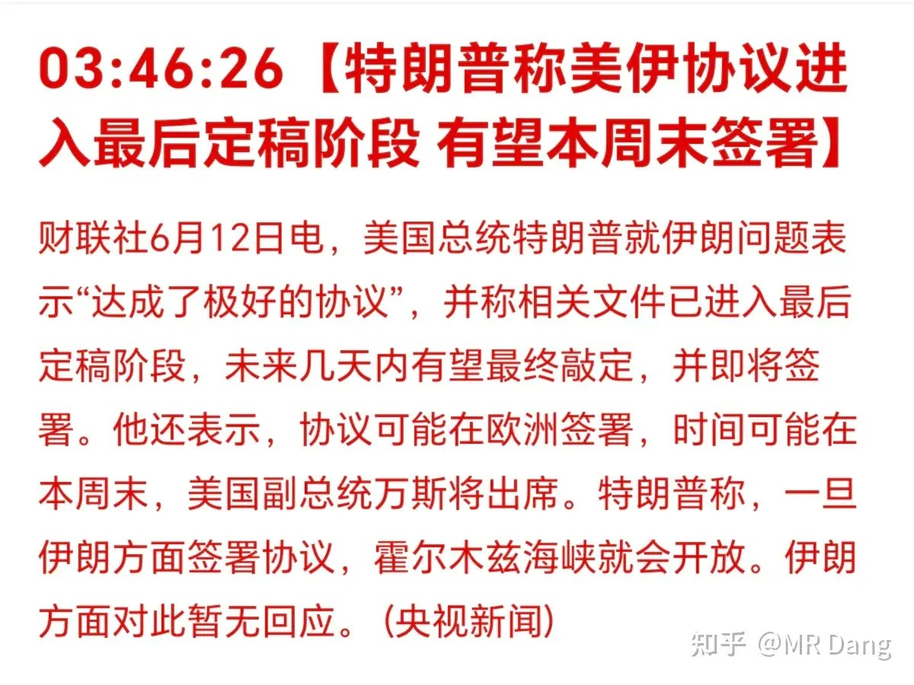
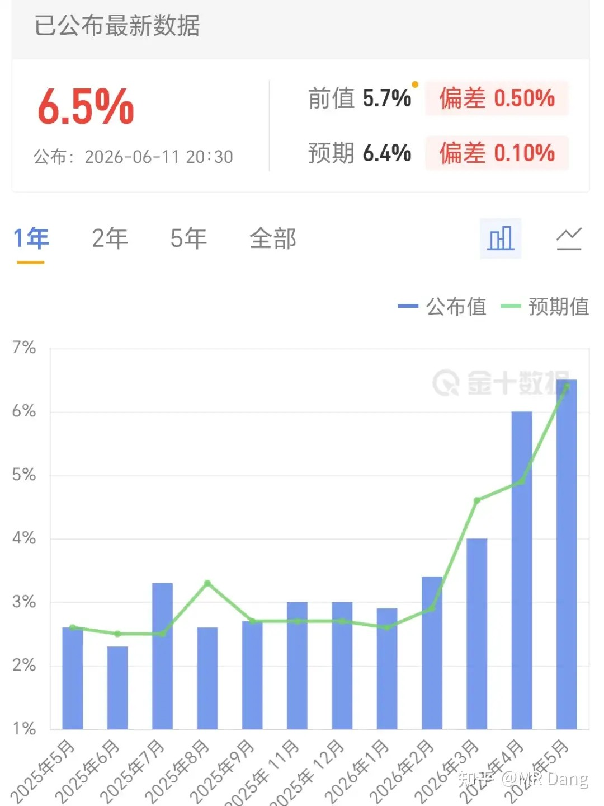
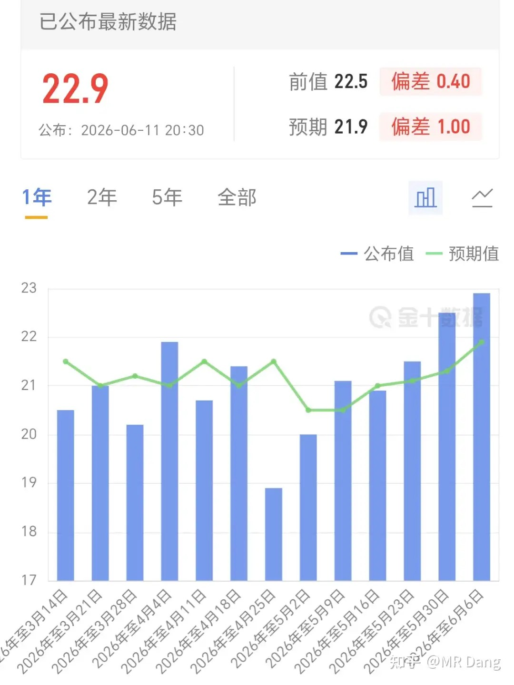
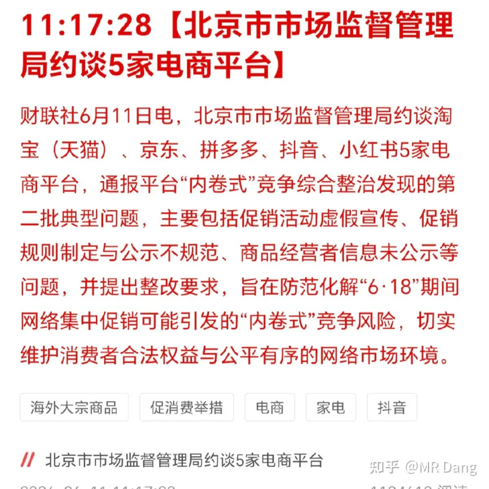
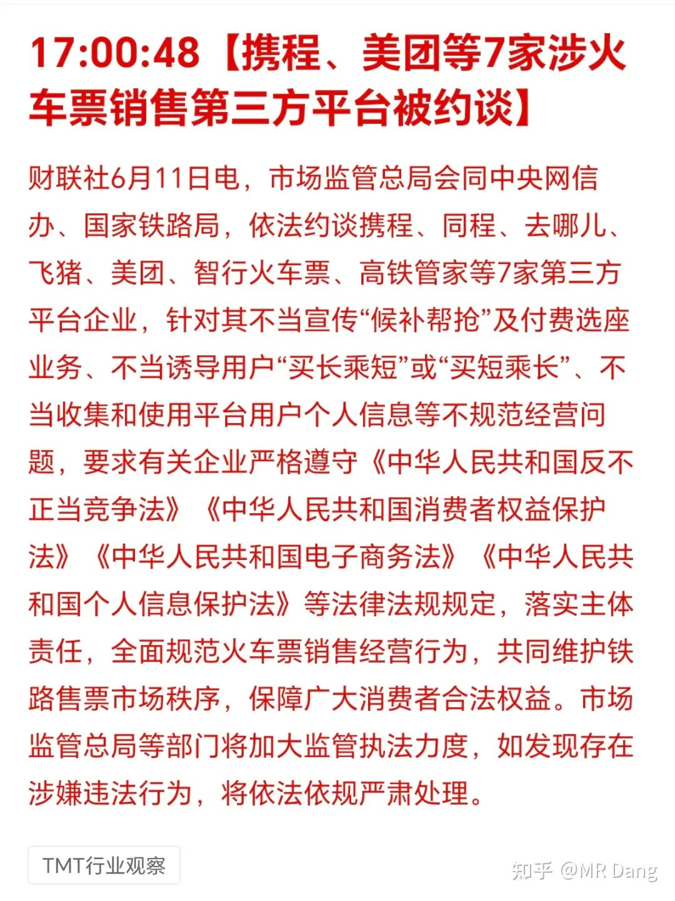
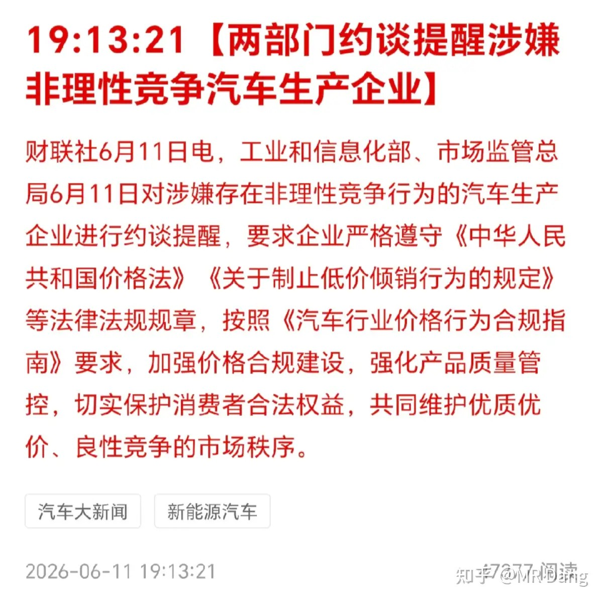
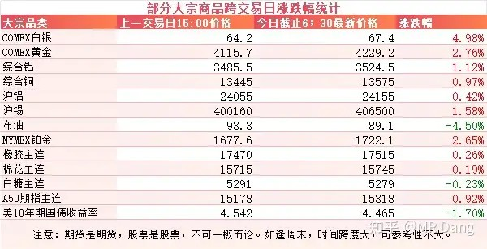
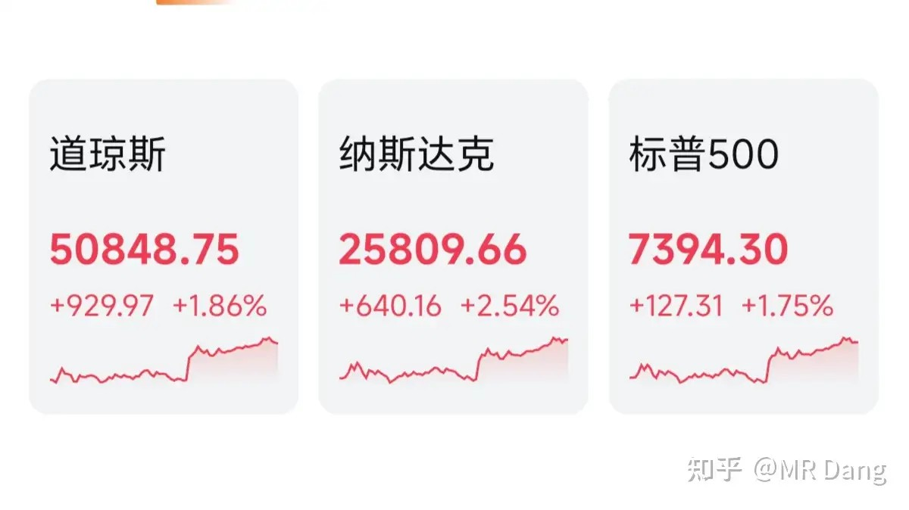

# 怎么看待2026年6月12日A股行情？

---

**发布时间**: 2026-06-12 07:26  |  **原文链接**: https://www.zhihu.com/question/2046291827901387860/answer/2048667452750483745  |  **点赞数**: 217 人赞同

**作者信息**: MR Dang | 独立投资人，《价值投资功法》作者，小红圈同名，无其他小号。

---

## 正文内容

美伊局势又有进展：

这是懂王第38次做出类似表态，不过这次说的好像有鼻子有眼的，市场还是选择了相信一半。

消息公布后原油跳水，有色反弹，10年期美债收益率下降。

西大公布了PPI：

6.5%的数据比预期值6.4%高一些。

不过有4.2%的CPI数据在前面，这点利空也不算什么。

西大同时公布了周初请失业金申领人数：

22.9万人的数据，比前值22.5万人要多，比预期的21.9万人也多。

失业人数多对金银等贵金属和股票来说算小利好，因为会降低加息预期。

到这里，就会出现一个非常有意思的疑问，上次公布的非农就业不是非常强劲么，怎么今天公布的失业人数也这么多，两个数据为什么会自相矛盾？

这里有几种可能：

1，非农就业是按照企业和机构领取工资单的人数统计的，所以统计对象是“岗位”，而不是人口。

失业金申领人数是数“人头”的，直接对应每个人。

所以如果一个人身兼数职的情况增加，可能会出现非农就业数据爆表，但是失业人口反而增加的现象。

2，非农不包含农业行业，也不包含自己给自己当老板这种个体户，而失业金申领是包含这些的，所以口径不同，如果发生结构性的失业，也可能造成类似数据。

3，世界杯来了，临时用工增加，临时用工是纳入非农就业统计的，同时满足一些不严格的要求也可以申领失业金。

4，统计误差。

昨天几家电商平台被约谈：

主要还是给618打预防针。

我看到新闻的第一时间就打开恒科看了下，果不其然，创新低了。

不一定有必然联系，但是雪上加霜是有可能的。

携程美团等7家公司被约谈：

这个主要是规范火车票的销售经营行为。

晚上两部门约谈车企：

一家人就是要整整齐齐，这些企业要是约谈的时候坐一起，基本可以把恒科指数成分凑个七七八八了。

约谈其实不算什么利空，相关行业内卷确实太严重了，影响了正常的经济秩序。

特别是牵扯到消费的，竞争到最后都是打价格战，企业盈利能力被严重削弱，小股东也要买单。

大宗商品：

受消息面影响，原油重挫，回调四五个点。

有色集体反弹，贵金属反弹较多，工业金属也有不错的表现。

农产品表现一般。

10年期美债收益率重回4.55分水岭下方，跌幅不小。

A50期指似乎预示着今天大A会有个开门红。

外围市场：

美三大股指走强，纳指领涨。

板块上存储之类的热门概念表现不错，其他行业也普遍有所表现。

今晚美股space x正式亮相，700亿美元不是小数目了，即使对美股来说也是这样。

另外世界杯开踢了，也会吸引一部分流动性。

目前西班牙，法国是头号热门球队。

就法国那个纸面实力，如果只看基本面的话，我个人感觉是球队里基本面最好的。

但是基本面和股价涨跌不一定有必然联系，就和法国也未必能夺冠一样。

昨天个人组合净值回撤半个点，银行不到半个，资源微红约等于没红，消费绿一个，电网一个半。

也就化工类的强一些，其他都不怎么样。

这种小回调已经司空见惯了，所以没什么感觉。

昨天虽然指数没怎么跌，但是市场中位数回调了一个半点左右，所以如果自己的持仓也亏了这么多，那没什么令人沮丧的，这只是市场平均水平。

一个喜欢保护韭菜的博主，希望大家少少踩坑，多多赚钱！！！

> [!comment]- 点击展开评论
>
> | 用户 | 时间 | 内容 |
> | :--- | :--- | :--- |
> | 知乎甪户 | 14 小时前 | 大d 现在外面都在夸你呢 |
> | 揸fit路人 | 14 小时前 | 恒科的家人们有福了 |
> | &nbsp;&nbsp;&nbsp;&nbsp;裙起而攻之 | 14 小时前 | 啥意思 |
> | &nbsp;&nbsp;&nbsp;&nbsp;乌鱼子酱 | 13 小时前 | 看美股表现，今天恒科应该还可以吧 |
> | &nbsp;&nbsp;&nbsp;&nbsp;我是一颗桃子吖 | 11 小时前 | 我发现这种的，不如就只买龙头 |
> | 簌簌 | 13 小时前 | 今日打卡今年洗心革面不买球了，否则要承受A股球场双重暴击 |
> | 如来熊掌 | 13 小时前 | 美伊消息现在是信不了一点 |
> | 钱包鼓鼓 | 14 小时前 | 每日打卡第70天懂王第38次喊美伊要成了，市场半信半疑，原油跳水四五个点，有色反弹，美债收益率重回4.55下方美PPI 6.5%比预期高0.1但有4.2% CPI兜着不算大事，失业金申领22.9万人超预期和非农打架，非农可能注了水电商携程美团车企排队被约谈，恒科雪上加霜A50期指暗示开门红，外围美股走强纳指领涨 |
> | &nbsp;&nbsp;&nbsp;&nbsp;大梦 | 9 小时前 | Dang大，我比较看好中铝，但是中铝要去上证50了，长期看还建议拿嘛 |
> | 铁王座 | 10 小时前 | 懂王开始编细节了，没办法，强大的美军实力加上胡扯的懂王 |
> | 若星汉天空 | 13 小时前 | 我的桥啊，18都没撑住，还有未来吗？机构看长期29，是不是13才能建仓 |
> | &nbsp;&nbsp;&nbsp;&nbsp;端木黄昏 | 6 小时前 | 若是13我直接半仓入 |
> | &nbsp;&nbsp;&nbsp;&nbsp;端木黄昏 | 6 小时前 | 跌到13最保守的股息率估算都能到11% |
> | &nbsp;&nbsp;&nbsp;&nbsp;浮萍一棵树 | 4 小时前 | 股息得看利润，去年因为金属涨价所以股息率高 |
> | 蛮王石头人 | 12 小时前 | 搞的自由现金流etf、红利低波100etf、恒生红利低波etf，很久没看，昨天看了下，好家伙，不仅把去年、今年的利润全部都跌没了，还亏两千！ |
> | &nbsp;&nbsp;&nbsp;&nbsp;咕噜 | 12 小时前 | 自由现金流etf是啥 |
> | &nbsp;&nbsp;&nbsp;&nbsp;行走的西红柿 | 12 小时前 | 跟踪国证自由现金流的呗 |
> | 鲍大师傅 | 14 小时前 | 价值投资天天挨打 |
> | 愚人杰AI生活 | 11 小时前 | 希望不是就这么一天 |

---

*本文件从MR Dang知乎页面转载*

---

**作者**: MR Dang
**链接**: https://www.zhihu.com/question/2046291827901387860/answer/2048667452750483745
**来源**: 知乎

*著作权归作者所有。商业转载请联系作者获得授权，非商业转载请注明出处。*
