# 如何看待2026年6月15日A股行情？

---

**发布时间**: 2026-06-15 07:35  |  **原文链接**: https://www.zhihu.com/question/2048500197261682126/answer/2049756986426800018  |  **点赞数**: 267 人赞同

**作者信息**: MR Dang | 独立投资人，《价值投资功法》作者，小红圈同名，无其他小号。

---

## 正文内容

先从央行的金融数据说起吧：

央行原文地址

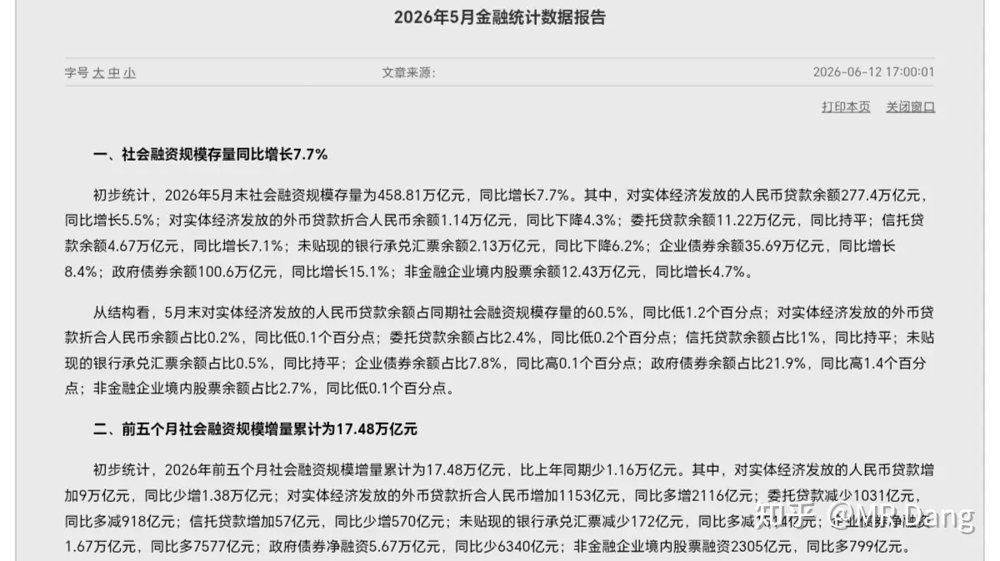

很多投资者不爱看这些枯燥的数据，觉得对投资没啥用，其实这些数据恰恰才是最确定性的判断依据。

第一段话讲社融，整体增长7.7%，而前四个月是7.8%，所以五月延续了四月增长放缓的态势。

实体发放贷款增速5.5%，前四个月增速是5.6%，五月实体发放贷款这一块也是比较保守的。

政府债券占比继续提升，从四月的21.7%提升到了21.9%。

整个社融数据延续了四月的态势，比较保守，政府举债相对积极。

第二段话讲社融增量，前五个月减少1.16万亿，前四个月是比同期少8930亿，五月份相对来说，比四月的减少速度放缓了。

对实体经济贷款同比少增1.38万亿，前四个月是少增1.29万亿，所以五月有边际改善趋势，这是好消息。

第三段话讲M2和M1，五月末的数据是同比增加8.6%和5.5%，增速剪刀差是3.1%，比四月末的增速剪刀差3.6%明显收窄。

另外前4个月净投放现金6530亿，而前5个月是5907亿，说明5月流动性有点收紧的趋势。

第四段讲存款，同比增加8.7%，储蓄意愿相对四月来说，有所缓和。

第五段讲贷款，增速有所降低，相对四月降低了0.1%。

最值得关注的还是住户中长期贷款，前五月增加628亿，前四个月是增加1199亿，说明五月依然是房贷净偿还趋势。

票据融资增加6999亿，前四月是增加1429亿，五月份依然是票据融资净增加。

最后说了同业拆借利率1.31%，这个数据比4月的1.29%高了，说明市场的实际利率提高了。

美伊局势：

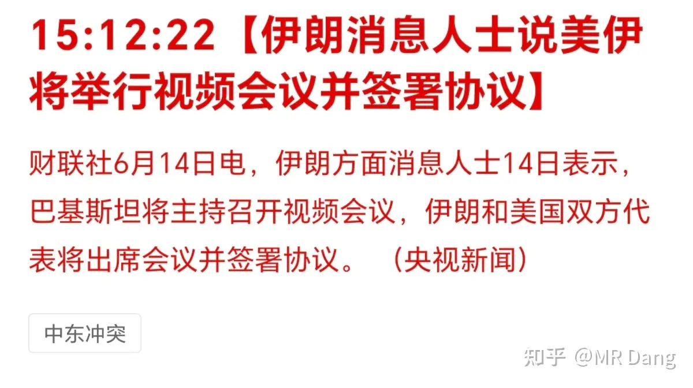

昨天下午爆出来要举行视频会并签署协议。

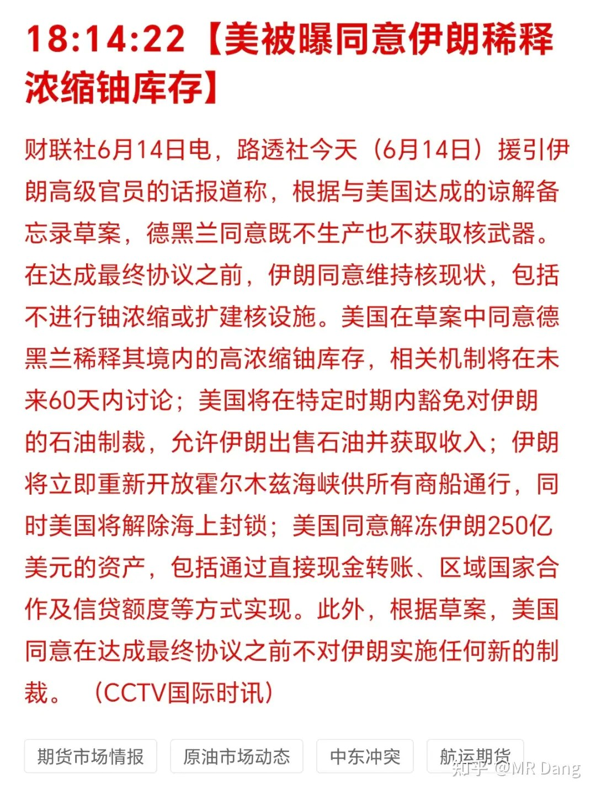

后续爆出一些草案内容，包含海峡开放，首批解冻250亿美元资产，稀释浓缩铀等条款。

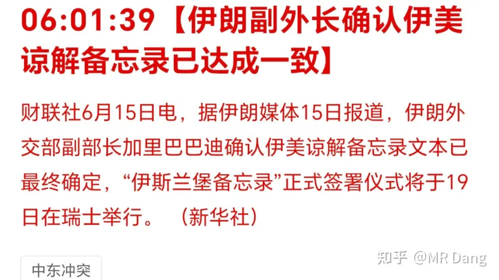

经过一系列波折，终于签了。

长鑫存储：

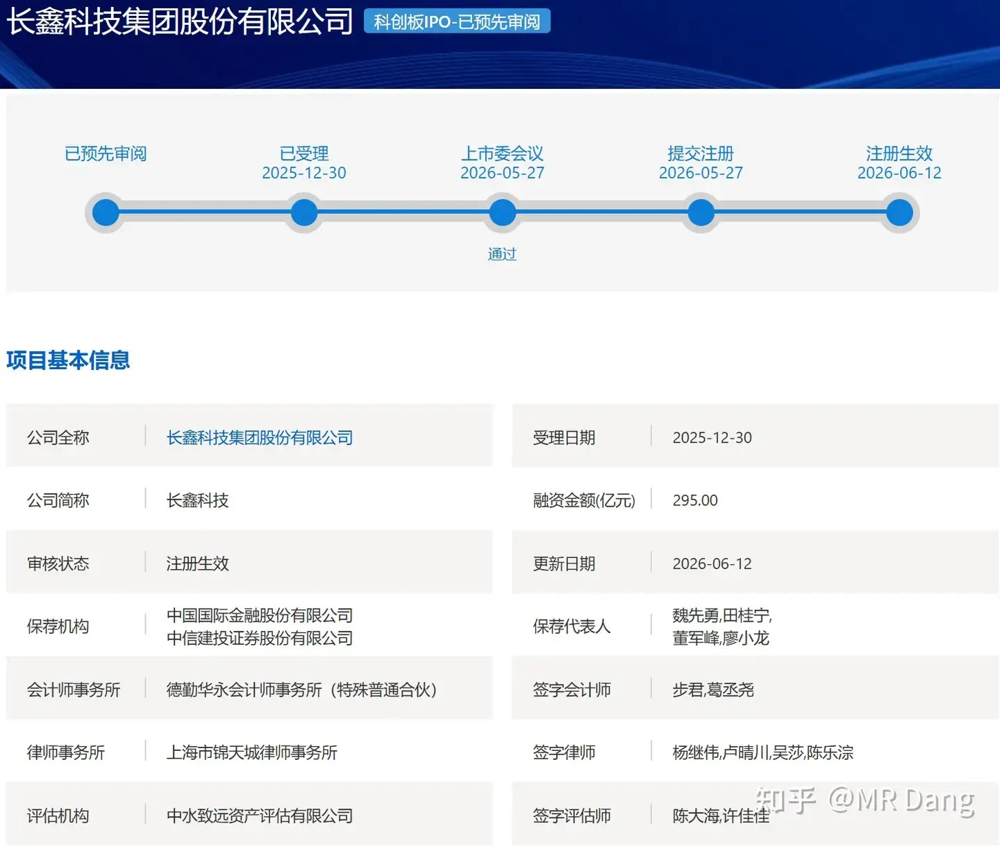

目前已经注册生效，速度快一点两星期内可以见面，慢一点也就三四个星期，算下来这个月是有希望的。

打新不可错过。

电容突破：

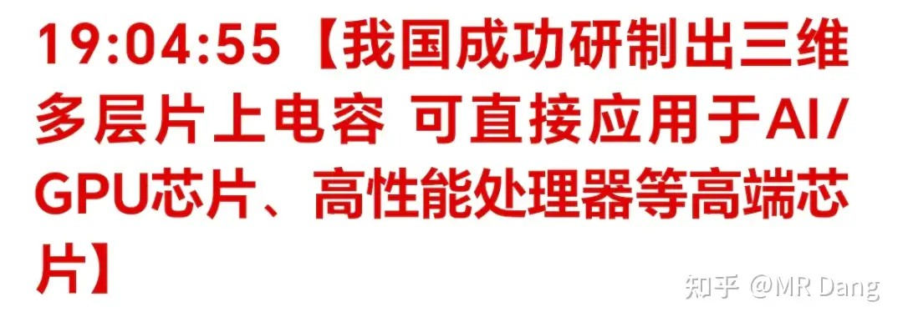

江城实验室研制出了三维电容，电容密度突破1000纳法，是普通多层堆叠MIM电容的二三十倍以上，比之前行业领先的碳化硅电容的300纳法也有很大突破。

可以直接用在AI/GPU芯片上。

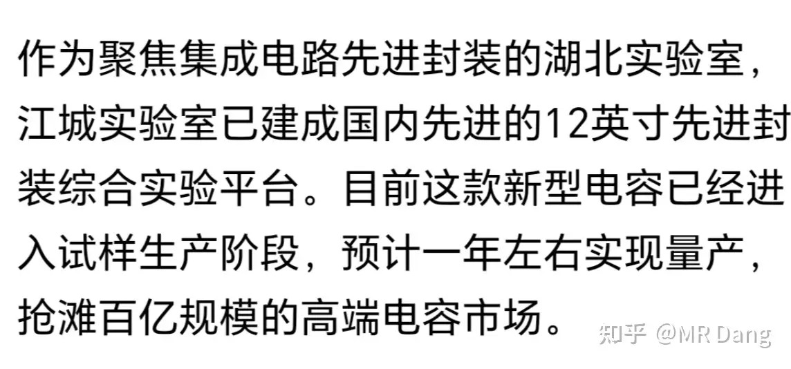

目前已经进入试样生产阶段，预计一年左右实现商用落地。

Anthropic：

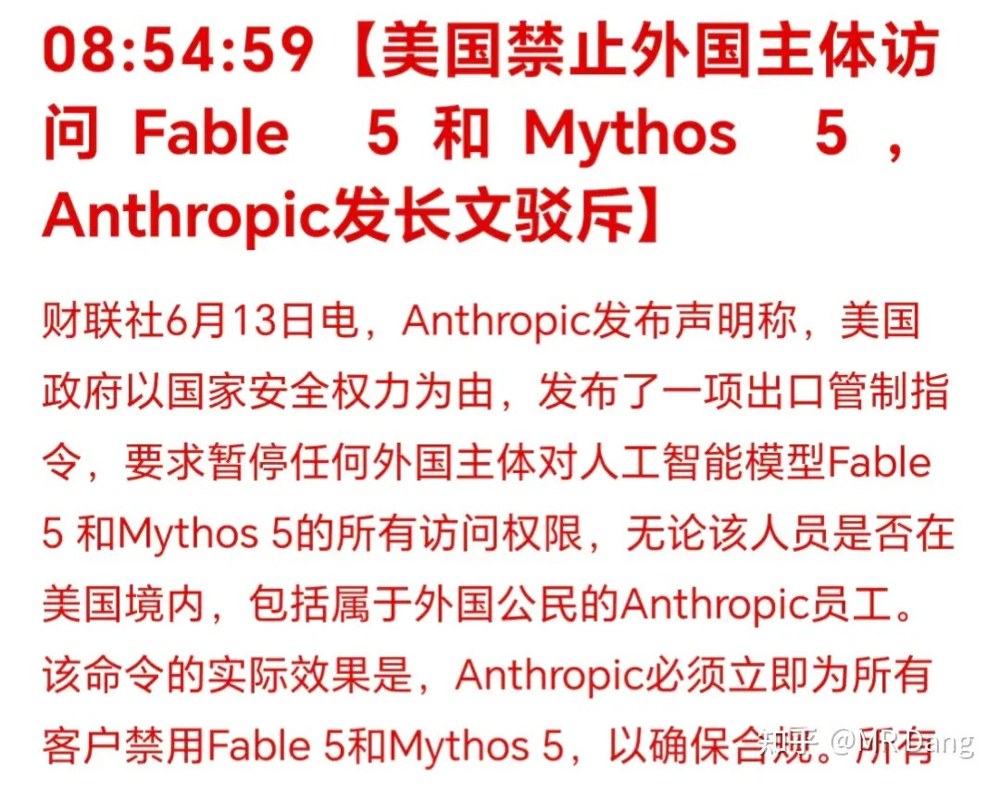

这家公司因为没上市，可能非码农对它还不了解。

但实际上这家公司已经是大模型领域的王者了，做出来的Fable 5生产力拉满，可用性非常高，当然也很贵。

这公司未来上市可能会是万亿美元级的巨无霸，从成立到现在也就五六年时间，可能会创造人类史上财富增长速度最快的奇迹。

正是因为生产力太强了，所以被西大禁止出口也是可以理解的。

我本来还想着用它做一个小程序，叫生产资料计算器，把持股截图丢给他，就能自动计算出来每小时生产多少商品出来，比如多少铜/铝/黄金之类的，再配合一些动动手指点击就可以收取的互动，感觉熊市的时候说不定能缓解一些焦虑。

制冷剂：

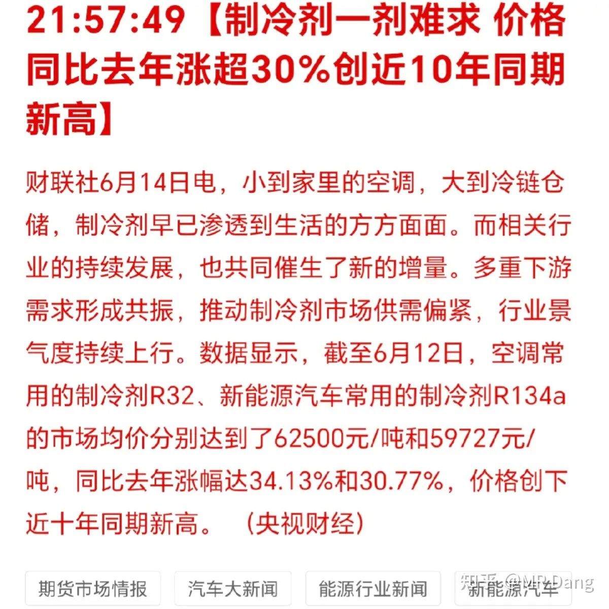

这个在圈里更新的大宗商品已经提过很多次了，现在主流媒体开始报道，但实际上不是什么新闻。

大宗商品：

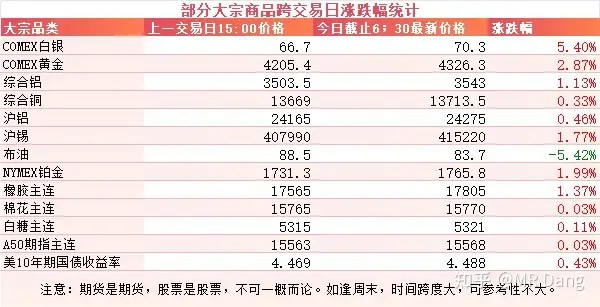

受消息面影响，原油大幅回调，跌了5个点，已经跌破85美元的关口。

有色整体走强，贵金属弹性更大，白银走强，涨了五个多点，工业金属表现也不错。

天然橡胶走强。

外围市场：

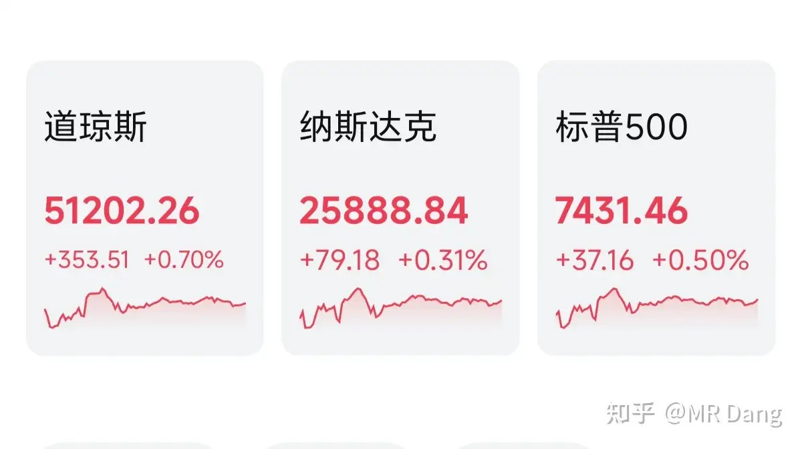

上周五美三大股指收红，道指领涨。

板块上科技表现一般，传统行业比较好一些，比如有色，银行之类的。

老马的space x 首秀涨了20%左右。

但是其他商业航天板块跌了接近10%，流动性被吸了不少。

上个交易日个人组合净值回血两个点，银行一个多点，资源近四个，消费三个点，电网微红。

没啥好说的，感谢大自然的馈赠吧。

本来以为是科技的独角秀，没想到是老登的翻身农奴把歌唱。

《公开募集证券投资基金主题投资风格管理指引》刚好也发布了，之前征求意见稿留了24个月过渡期，正式版现在是12个月过渡期，新增了风格库制度，以后公募基金就要在相应的风格库里选择标的进行投资。

本周前瞻：

1，本周只有四个交易日，周五端午放假。

2，今天公布用电数据

3，明天公布社零数据和工业增加值。

4，明天日本央行议息决议，可能加息到1%。

有个小细节是日本央行行长恰好住院了，这个“喜讯”可能交给副行长发布，副行长好像现在身体也有点不适。

日本上次1%以上的利率还是在30年前。

所以如果是00后的话，这次也算见证历史了。

5，周四是美联储议息决议。

基本上外界普遍认为不会加息或者降息，会继续保持3.75%，但是对沃什要说什么话感到比较好奇，包括点阵图。

沃什一直说不需要点阵图，就看他这次是真的不打算掏出点阵图还是说说而已。

一个喜欢保护韭菜的博主，希望大家少少踩坑，多多赚钱！！！

> [!comment]- 点击展开评论
>
> | 用户 | 时间 | 内容 |
> | :--- | :--- | :--- |
> | 机械之道 |  | 我还以为宏桥企稳了，没想到居然能红转绿，这是走出独立行情来了 |
> | 是摩卡卡卡 |  | 好久没看了 有人能告诉我d大电解铝还在吗 |
> | 雪夜 |  | D大，能不能再分析下铝王，没其他意思，实在看不懂不管什么利好，不管有色怎么反弹，它为什么就一路向下 |
> | 钱包鼓鼓 |  | 每日打卡第71天五月金融数据延续保守态势，社融增速放缓但少增幅度在收窄，房贷依然净偿还，票据融资暴增说明实体需求弱，最差时候可能过去但远没到好的时候美伊签署协议，原油跌破85美元跌5个点，有色整体走强白银涨5个多点，天然橡胶继续走强逼近两万景气线长鑫存储注册生效本月有望打新，三维电容突破1000纳法可直接用于AI芯片预计一年内商用公募基金风格库制度落地过渡期缩至12个月，以后公募不能随便漂移，利好低估值蓝筹和龙头本周四天交易日，明天日本央行可能加息到1%见证历史，周四美联储议息焦点在沃什表态和点阵图 |
> | 梦游 |  | dang哥，啤酒什么时候解套哇 |
> | &nbsp;&nbsp;&nbsp;&nbsp;Verbose |  | 下次世界杯 |
> | &nbsp;&nbsp;&nbsp;&nbsp;chamber |  | 怕是有点困难了 |
> | &nbsp;&nbsp;&nbsp;&nbsp;钻石底000 |  | 我也入了。 |
> | &nbsp;&nbsp;&nbsp;&nbsp;没心没肺的小废柴 |  | 哈哈哈哈 |
> | &nbsp;&nbsp;&nbsp;&nbsp;没心没肺的小废柴 |  | 我觉得涨一点就卖一点吧，短期看不到希望 |
> | 抽筋馒头 |  | 站在科技看宏桥，笑哈哈 |
> | zscYHF |  | 拯救铝大学生！！！ |
> | 一白先生 |  | D大指数已跌入极度恐慌 |
> | 小李在路上 |  | 铝什么时候能站起来 |
> | &nbsp;&nbsp;&nbsp;&nbsp;赵十一的同学 |  | 铝还不跑等啥呢 |
> | &nbsp;&nbsp;&nbsp;&nbsp;小李在路上 |  | 补仓后  仓位太大 跑不动。。。 |
> | &nbsp;&nbsp;&nbsp;&nbsp;戒有为 |  | 我也被深套了。。。 |
> | &nbsp;&nbsp;&nbsp;&nbsp;亏到不能呼吸 |  | 直接换有色ETF。现在ETF涨铝不一定涨，但是ETF跌，铝跌的更狠 |
> | 么么 |  | 谁能告诉我，棉花啥时候卖 |

---

*本文件从MR Dang知乎页面转载*

---

**作者**: MR Dang
**链接**: https://www.zhihu.com/question/2048500197261682126/answer/2049756986426800018
**来源**: 知乎

*著作权归作者所有。商业转载请联系作者获得授权，非商业转载请注明出处。*
