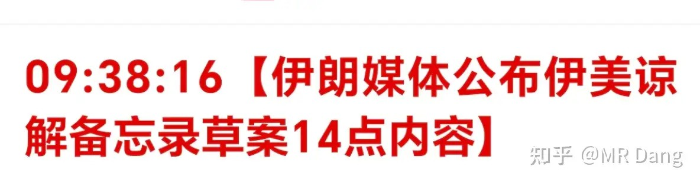
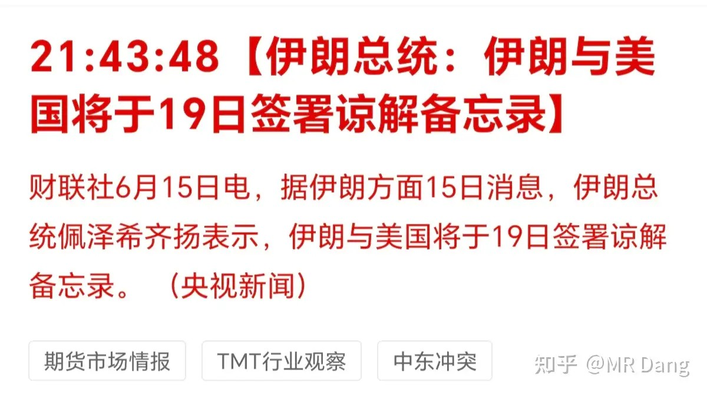
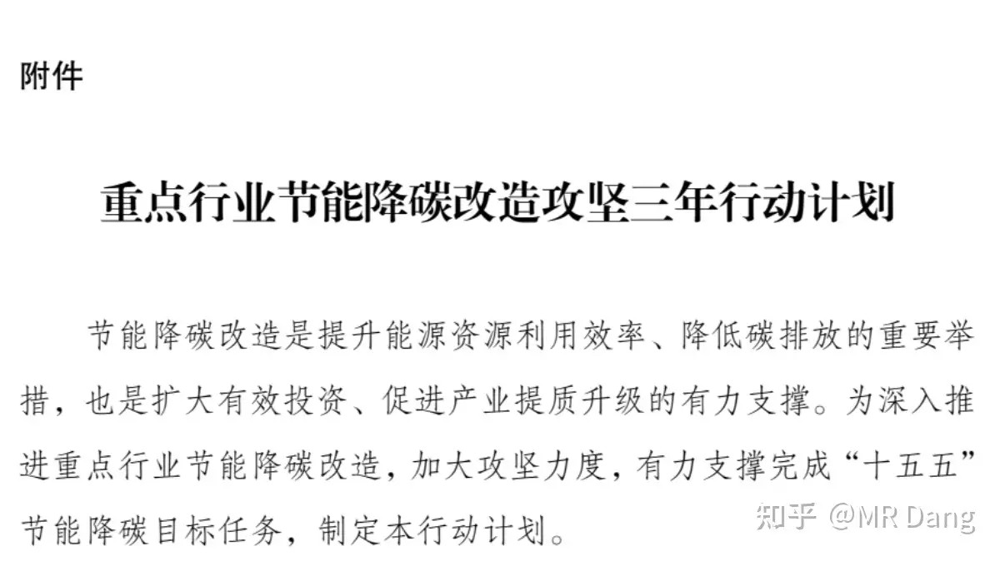
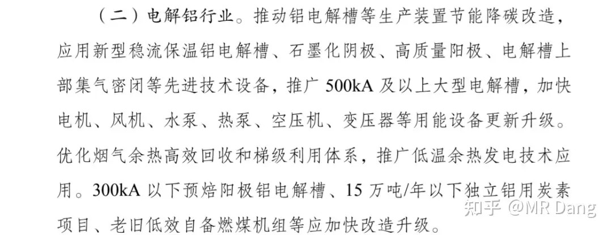
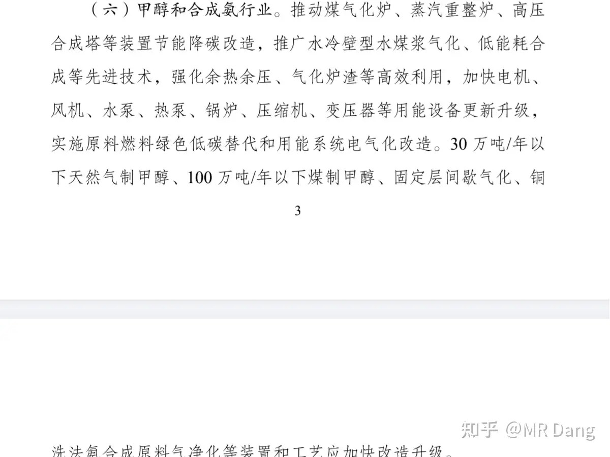
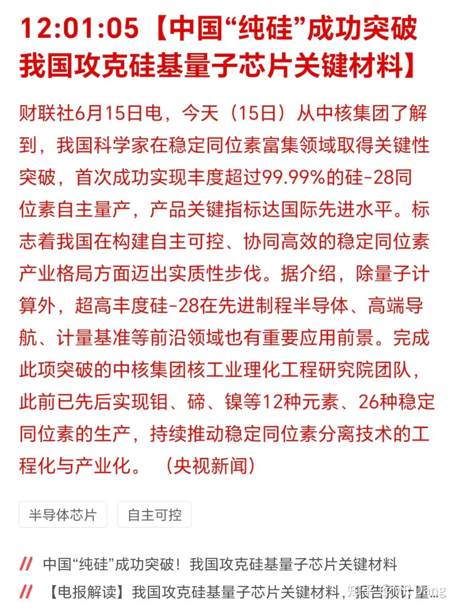
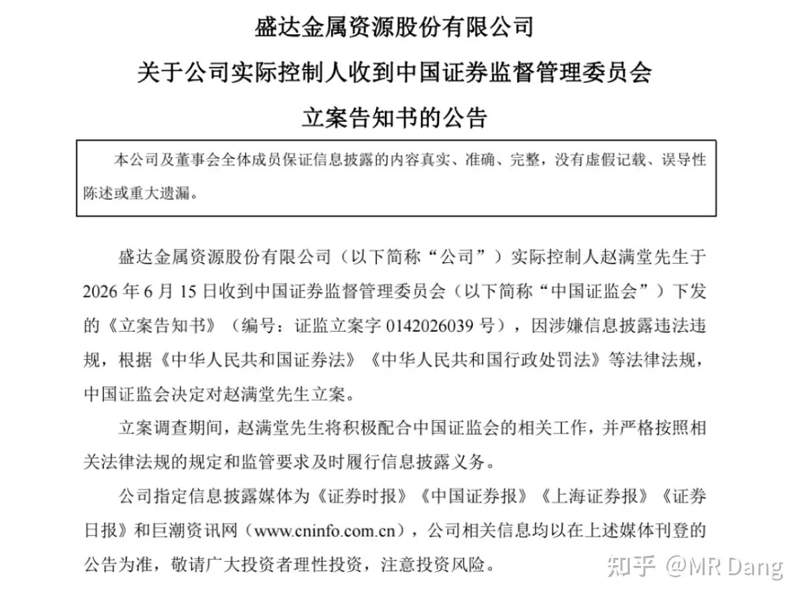
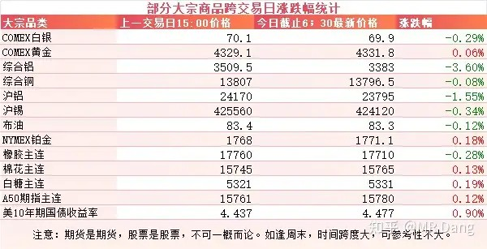
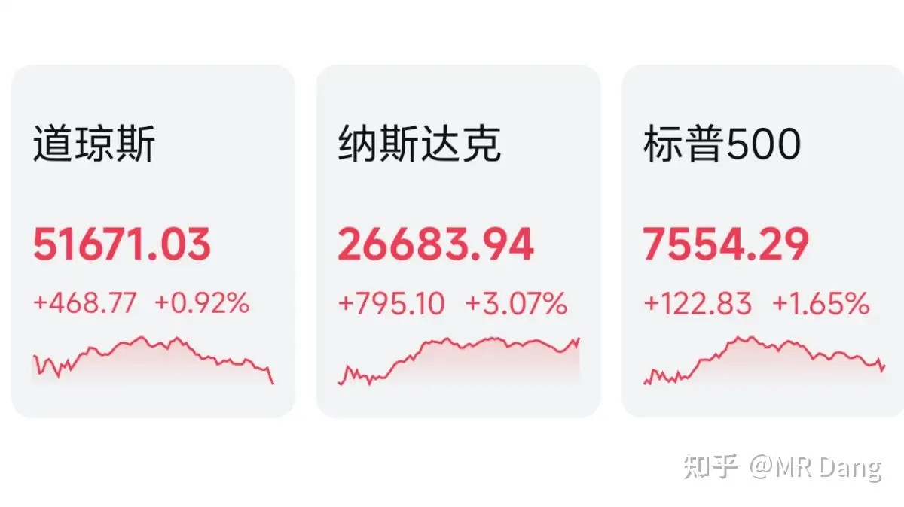

# 如何看待2026年6月16日A股行情？

---

**发布时间**: 2026-06-16 07:28  |  **原文链接**: https://www.zhihu.com/question/2049522250529891526/answer/2050117514504450633  |  **点赞数**: 242 人赞同

**作者信息**: MR Dang | 独立投资人，《价值投资功法》作者，小红圈同名，无其他小号。

---

## 正文内容

美伊签的合同细节曝光：

具体内容就不贴了，最重要的海峡问题，先免费开放60天，以后伊朗可以收取服务费。

从目前曝光的条款来说，还是对伊朗比较有利的。

签署时间已经得到双方确认。

未来的进展也许还会有反复，但是大的方向上应该算尘埃落定了，两边没有继续打下去的利益了。

降碳改造三年计划：

这是有关部门发布的一个文件，对相关9个行业做出了一些部署安排，这9个行业分别是钢铁、电解铝、水泥、平板玻璃、炼油、乙烯、合成氨、甲醇、煤电。

挑几个我关注的比较多的行业说说：

电解铝的标准是 300kA以下电解槽改造升级，目前头部企业主流电解槽都在400kA以上，基本不在改造升级的名单中，主要还是针对中小企业的一些政策。

煤制甲醇的标准是100万吨/年，基本上龙头企业都可以达标的。

其他行业基本上都是同理，定的标准不算高，头部龙头企业基本都能满足，中小企业的改造升级压力相对更大。

利好一些设备改造升级的行业。

对煤炭行业来说属于轻度利空，会减少煤炭需求。

对这9个行业来说，可能会进一步提高行业集中度，中小企业相对会有更大的资本支出压力。

有消息称硅产业取得新突破：

这个我也不懂，查了下资料，硅-28的特点是自旋几乎为0，几乎没什么磁干扰，在量子计算和先进制程半导体里有大用。

取得突破的单位是中核集团旗下实验室，中核集团旗下有9家市公司，A股五家，港股4家，这个实验室不在任何上市体系内。

研究成果通过哪家上市公司可以应用落地，是不太确定的一件事情。

某白银公司实控人被立案：

如果是国企，这类消息影响不太大，对民企来说就是比较坏的消息了。

白银股弹性比白银还大，这一轮没少跌，刚等到金银反弹，就碰到这倒霉事。

大宗商品：

有色整体有些许回调，伦铝跌幅较大，高盛发布了一篇看空铝的研报。

其他品种基本在正常波动范围内。

农产品表现尚可。

美10年期国债收益率有所反弹，不过依然距离4.55分水岭有一段距离。

外围市场：

美三大股指收红，纳指领涨，道指创新高。

板块上科技股强势，存储，Ai硬件，商业航天都表现强势，除了油气，医药不太行，其他板块都不错。

昨天个人组合净值红小半个点，银行绿大半个点，资源红三个半，电网红三个半，消费绿一个点。

科技吃肉，老登给科技擦皮鞋。

资源内部出现了分化，除了某个板块，其他板块还都不错。

消费没太支棱起来，又重回下水道了。

整体市场还是比较割裂的，像我这样没有科技的原始人，没有绿我都已经满意了，不敢奢望追上指数了。

一个喜欢保护韭菜的博主，希望大家少少踩坑，多多赚钱！！！

> [!comment]- 点击展开评论
>
> | 用户 | 时间 | 内容 |
> | :--- | :--- | :--- |
> | 茯苓饮 |  | 绿桥是真强，有色就铝跌，现在绿桥亏30+% |
> | 戴思琪 |  | 水平就这样了，还没我一个定投基金赚得多。 相信市场规律，红的就是对的 |
> | &nbsp;&nbsp;&nbsp;&nbsp;花生虾米酱 |  | 牛市让太多人觉得自己看清市场了 |
> | &nbsp;&nbsp;&nbsp;&nbsp;准然 |  | 所以绿桥坠入深渊是对的🥲 |
> | 秋雨夜书 |  | dang大，请问啤酒的逻辑还存在吗？消费好像一直没起来过，世界杯也带不动 |
> | &nbsp;&nbsp;&nbsp;&nbsp;白日流星 |  | 没逻辑，套利失败可以撤退了 |
> | &nbsp;&nbsp;&nbsp;&nbsp;没心没肺的小废柴 |  | 废了 |
> | &nbsp;&nbsp;&nbsp;&nbsp;丢丢丢丢丢 |  | 世界杯中国看的时间都是早上或者凌晨四五点，谁大早上喝啤酒 |
> | joly |  | 前段时间，扔掉铝，买入算力金属，躲过一场大面 |
> | &nbsp;&nbsp;&nbsp;&nbsp;joly |  | D大，大飞机终于好起来了。一直跌一直买，新人体验了一把左侧交易。很锻炼我，感谢D大 |
> | &nbsp;&nbsp;&nbsp;&nbsp;囚徒 |  | D大滴恩情还不完 |
> | &nbsp;&nbsp;&nbsp;&nbsp;joly |  | 当然啊，算力金属的恩情得还啊。你不会没买吧 |
> | 钱包鼓鼓 |  | 每日打卡第72天美伊合同细节曝光，海峡先免费开放60天后可收费降碳改造三年计划覆盖9个行业，标准不高头部企业能达标，中小企业改造压力大，行业集中度将进一步提高，利好设备改造，轻度利空煤炭。硅-28在量子计算和先进制程半导体有新突破，中核集团旗下实验室取得进展，但不在上市体系内，商业化落地路径不确定。白银公司实控人被立案，民企影响较大美股三大股指收红纳指领涨道指创新高，存储AI硬件商业航天强势，A股科技吃肉银行回调消费重回下水道，市场割裂明显。 |
> | Zmpqag |  | 铝，啤酒，😄 |
> | Believe |  | 啤酒呢，世界杯催化一毛没涨，一开赛梆梆跌，麻了 |
> | 天涯之夜 |  | 铝是不是完蛋了，中国铝业亏40% |
> | Mitsui |  | 绿王啤酒国光大惨林 |
> | 落渊 |  | 铝业又要扣钱了吗 |

---

*本文件从MR Dang知乎页面转载*

---

**作者**: MR Dang
**链接**: https://www.zhihu.com/question/2049522250529891526/answer/2050117514504450633
**来源**: 知乎

*著作权归作者所有。商业转载请联系作者获得授权，非商业转载请注明出处。*
