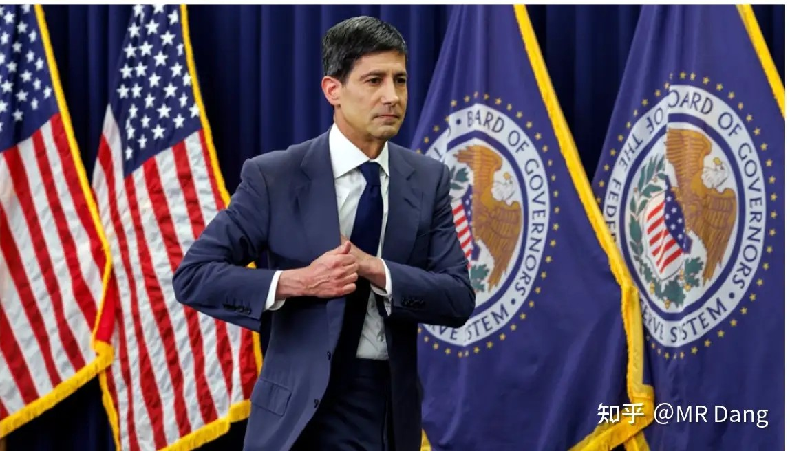
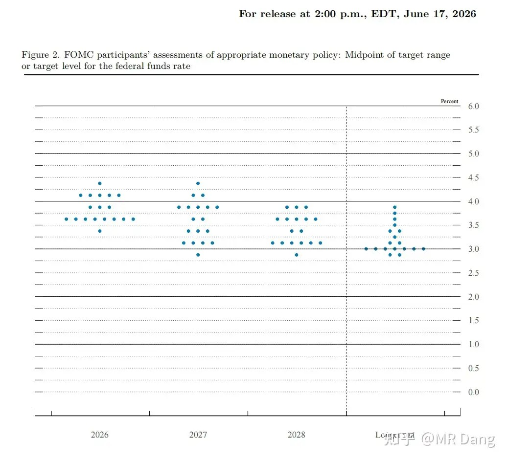
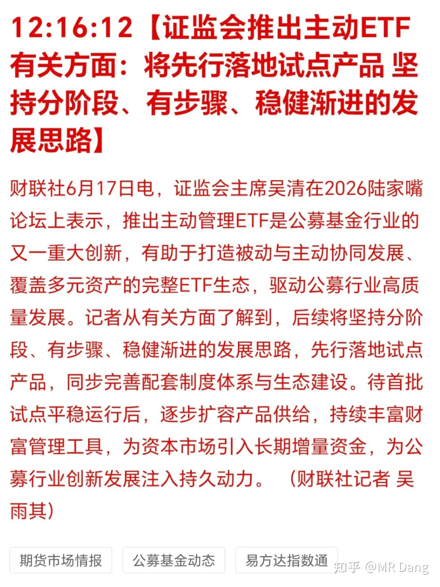
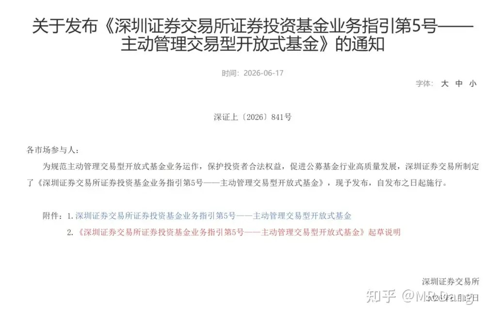
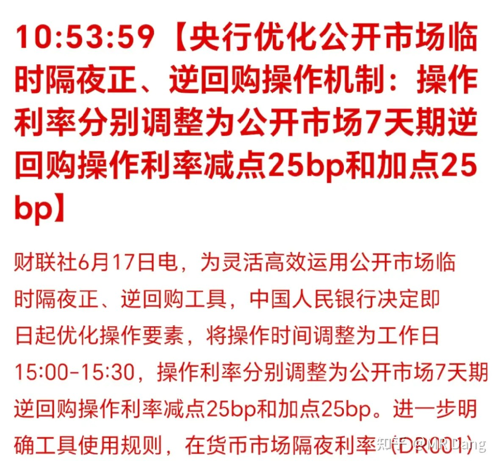
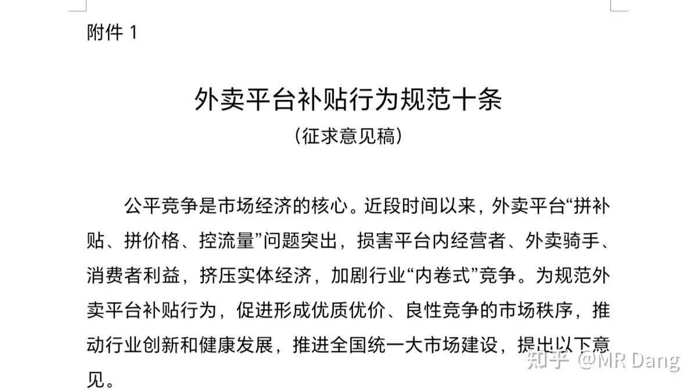
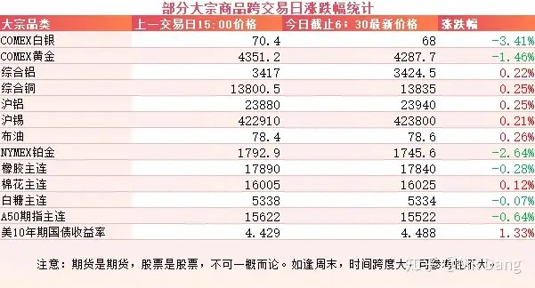
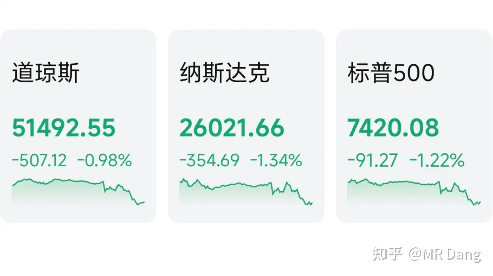

# 如何看待6月18日股市行情？

---

**发布时间**: 2026-06-18 07:30  |  **原文链接**: https://www.zhihu.com/question/2050162971658150928/answer/2050842802523844673  |  **点赞数**: 292 人赞同

**作者信息**: MR Dang | 独立投资人，《价值投资功法》作者，小红圈同名，无其他小号。

---

## 正文内容

头条只能是美联储：

沃什昨晚进行了首秀，利率维持不变符合预期，重要的是看他的表态。

他说放弃了前瞻性指引，然后甩出了一张点阵图：

本来要19个人画图的，但是实际上只有18个人画图，沃什没参与，他认为这图都是用铅笔画的，随时可以擦，没必要，沃什还暗示了可能到年底的时候会“审查”点阵图，不知道是不是取消的意思。

对今年的利率，18个人里，有一半也就是9个人支持加息，有8个人支持不变，还有一个支持降息。

支持加息的9个人里，有1个支持加息75基点相当于三次加息，5个支持加息50基点相当于两次加息，3个支持加息25基点相当于1次加息。

沃什同时重申了对2%通胀的追求。

整体偏鹰的一次发言，因为现在的通胀距离2%有点远。

黄金白银等贵金属直接跳水，美股也扭头向下。

只有叫错的名字，没有起错的外号，金银杀手名不虚传。

但是也有鸽的一面，之前沃什喊的是降息+缩表，现在看来，两件事都没落实，降息是没了，缩表目前进度也非常慢。

说了一堆新主张，最后执行起来基本就是按兵不动，美联储毕竟不是他一个人说了算。

有关部门准备推出主动ETF：

这个看名字是介于被动ETF和普通主动基金之间的一种产品。

和被动ETF相比，更考验基金经理的择时水平。

和普通主动基金相比，可能持仓更透明，另外可以让投资者也参与择时。

我个人对包括我在内的大多数投资者的择时水平持怀疑态度，所以主动ETF的长期平均收益率可能比不过被动ETF，到时候出了以后可以统计一下，感觉还蛮有意思的一个课题。

至于主动ETF的持仓风格，要求30支以上的个股即可，会是消费类的么？或者是地产类的？

还是科技类的？

好难猜啊，好难猜。

DR001:

这是央行对短端利率进行调整的手段。

DR007一般被视为短端利率的基准，这次的变化是让DR001，也就是隔夜利率，挂钩了DR007，进一步降低了金融机构管理的难度。

因为隔夜利率以前波动比较大，特别是季末月末资金紧张的时候，DR001的年化利率很夸张。

外卖行业：

有关部门发布外卖平台补贴行为规范十条的征求意见稿。

对外卖行业算是利好，对恒科也是。

至于为什么黄蓝马甲昨晚美股跳水，那也许有别的原因吧。

大宗商品：

受美联储放鹰影响，贵金属表现不佳，黄金白银有所回调。

美10年期国债收益率走强，不过还没过4.55分水岭。

A50期指走弱，似乎预示着今天大A开盘会有点压力。

外围市场：

美三大股指集体回调，纳指领跌。除了存储之类的个别板块，大部分都在回调。

昨天个人组合净值回撤半个点，银行绿半个，资源微绿，电网微红，消费绿两个。

资源里有色其实表现还行，就是化工类拖后腿了。

几大股指都是红的，1700多家上涨，另外3700多家待涨，市场中位数大概是跌了1.3%不到。

这是最近以来的常态了。

其实作为老登已经习惯看科技吃肉，现在买科技的都是胆大的，这钱该人家挣。

但是能不能商量下不要吊着老登打了。。。

感觉老登挨打已经成科技狂欢PLAY里的一环了。

昨天的内容可能不够正能量，所以好像过了一两个小时后不显示了。

一个喜欢保护韭菜的博主，希望大家少少踩坑，多多赚钱！！！

> [!comment]- 点击展开评论
>
> | 用户 | 时间 | 内容 |
> | :--- | :--- | :--- |
> | 贤哥 |  | 科技吃肉，老登挨打，科技挨打，老登也挨打 |
> | &nbsp;&nbsp;&nbsp;&nbsp;年年有余 |  | 有人买就有人卖，割肉的老登股接手的如果是外资呢，就怕是爆拉科技满世界买各国老登，加息没完成的收割，靠拉泡沫完成收割，收割完成就是泡沫破裂的时候！以上是我的阴谋论，不构成投资建议 |
> | 梦想家18号 |  | 完美踏空这轮AI牛市，买的国光跌成狗，卫生纸也跌成狗，还有绿桥，简直了 |
> | &nbsp;&nbsp;&nbsp;&nbsp;明心见性 |  | 纸我早走了，刚开始买还赚10个点，后面回调还亏了5个点，觉得短期没行情就走了 |
> | &nbsp;&nbsp;&nbsp;&nbsp;明心见性 |  | 绿桥也是，反弹亏几个点走的，现在这行情，除了科技，格局的风险大 |
> | &nbsp;&nbsp;&nbsp;&nbsp;一尔 |  | 我天天自动扣费，就没一天红的 |
> | &nbsp;&nbsp;&nbsp;&nbsp;MOMO |  | 我这星期换了科技，一星期直接回本了， |
> | 寒老湿 |  | Dang大今年还是正收益吗 |
> | &nbsp;&nbsp;&nbsp;&nbsp;北上大人 |  | 小红圈卖书赚上千万 肯定正收益啊 |
> | &nbsp;&nbsp;&nbsp;&nbsp;yyyy |  | 一语道破 |
> | &nbsp;&nbsp;&nbsp;&nbsp;吃土 |  | 现在不敢随便推了，只能放点新闻联播我看东财不是消息更准吗 |
> | &nbsp;&nbsp;&nbsp;&nbsp;上善若水行远自弥 |  | 实际上实盘都没有的家伙，每天盈亏完全不是对的，自己算算就知道 |
> | Benson |  | 评论区的别死扛了，科技没了老登更没了，还指望老登股？ |
> | &nbsp;&nbsp;&nbsp;&nbsp;养鹅下蛋 |  | 那更好了，老登跌到10%股息率我来捡筹码 |
> | 尼尔雅童 |  | 现在开盘就打开看一眼 然后白一眼 就不再看了 |
> | 凤曦 |  | 卖号了？ |
> | &nbsp;&nbsp;&nbsp;&nbsp;MR Dang |  | 都哪里听的 |
> | 穷则独Lu其身 |  | 黄果树大瀑布来了！ |
> | 钱包鼓鼓 |  | 每日打卡第74天沃什首秀放鹰，点阵图9人支持加息，但沃什本人没参与画图且暗示可能取消点阵图，降息和缩表承诺均未兑现，嘴鹰手鸽美联储放鹰导致贵金属跳水、美股回调、A50走弱，今天大A开盘有压力外卖补贴规范征求意见稿利好恒科，主动ETF概念值得关注但择时能力存疑 |
> | lion |  | 已经在设立新的科技ETF来接盘了 |
> | M刘 |  | 今天注定一碗大面 |
> | &nbsp;&nbsp;&nbsp;&nbsp;茯苓饮 |  | 这不是常规操作吗 |
> | &nbsp;&nbsp;&nbsp;&nbsp;北国神风 |  | 见闻色霸气，为何不避，不会是被套了吧 |
> | &nbsp;&nbsp;&nbsp;&nbsp;大鱼 |  | 明后三天不会了。 |

---

*本文件从MR Dang知乎页面转载*

---

**作者**: MR Dang
**链接**: https://www.zhihu.com/question/2050162971658150928/answer/2050842802523844673
**来源**: 知乎

*著作权归作者所有。商业转载请联系作者获得授权，非商业转载请注明出处。*
