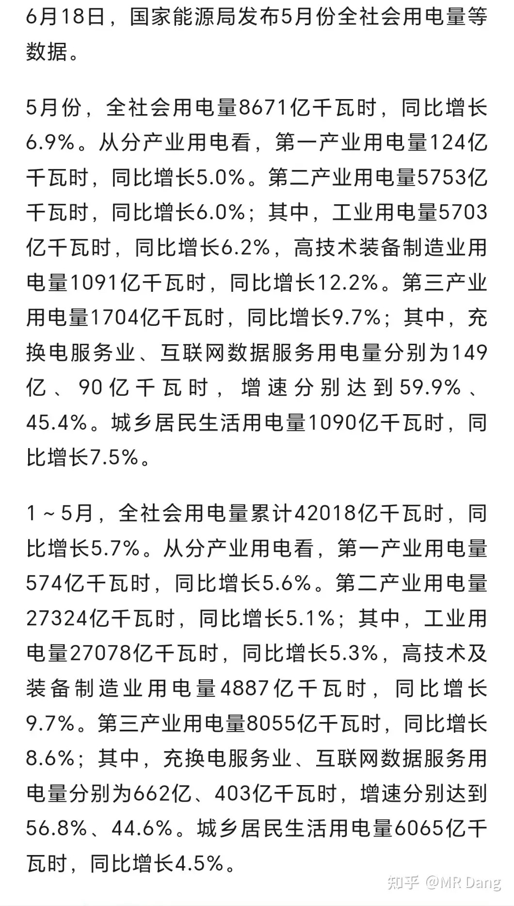
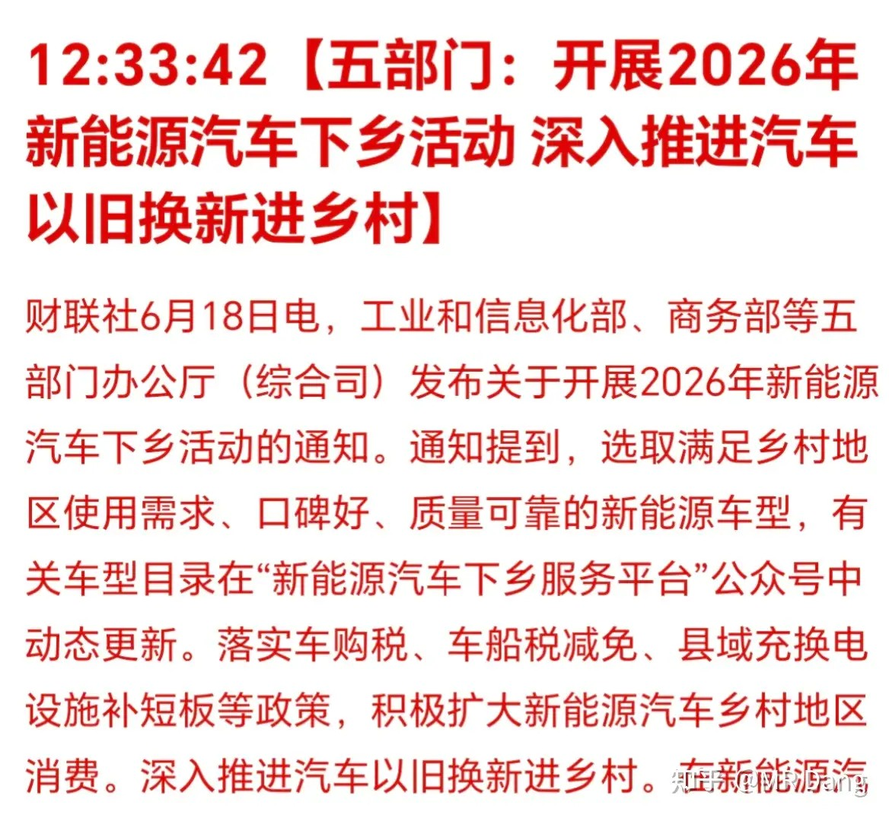
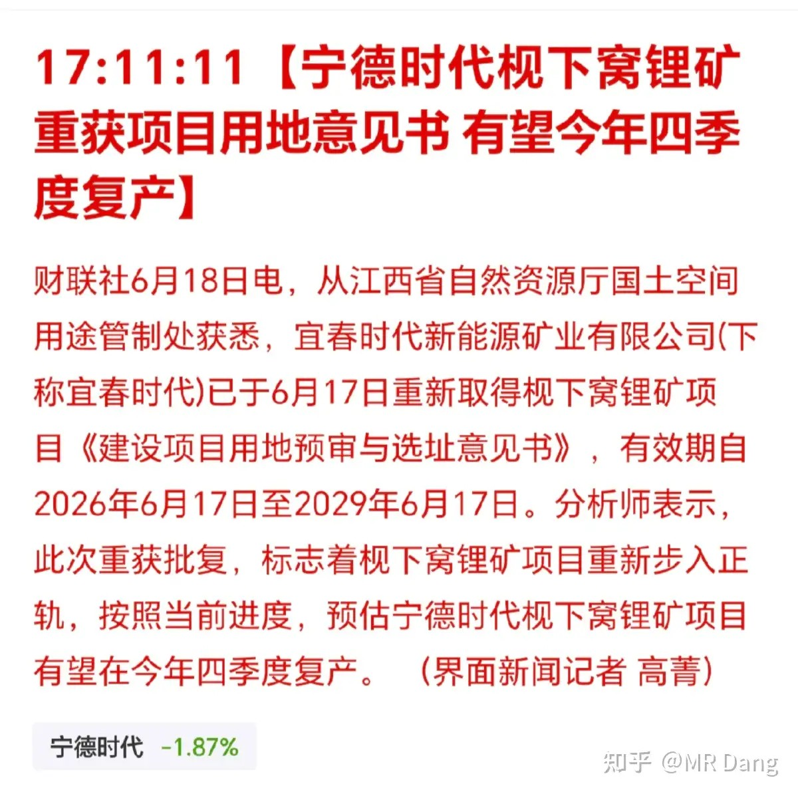
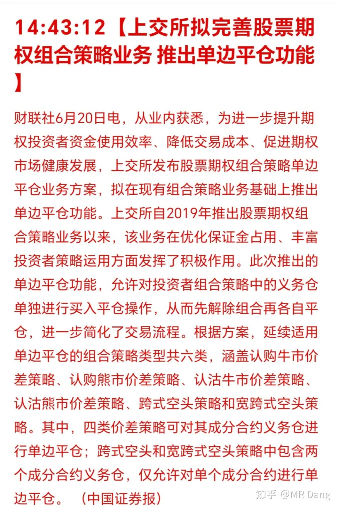
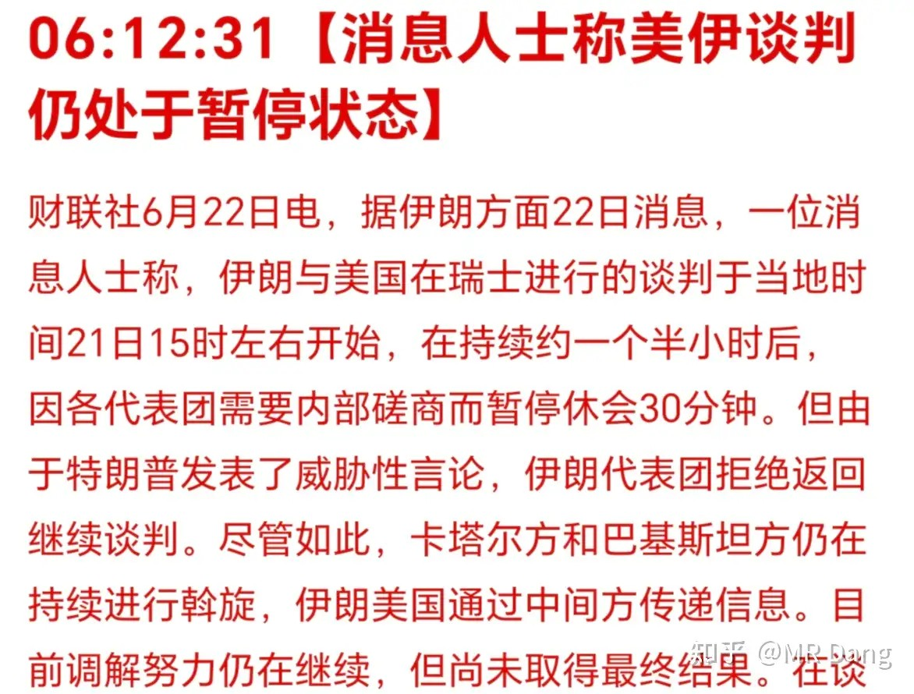
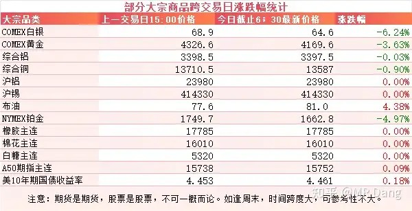
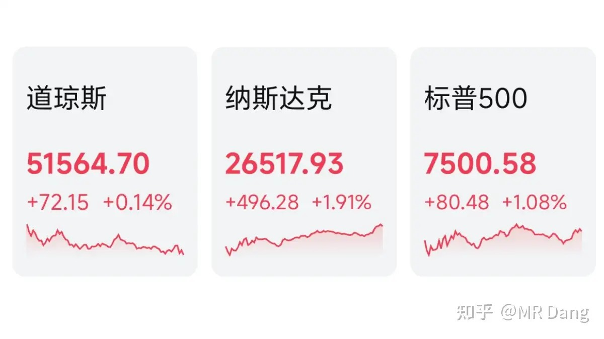

# 如何看待2026年6月22日A股行情？

---

**发布时间**: 2026-06-22 07:23  |  **原文链接**: https://www.zhihu.com/question/2050251057469699800/answer/2052290704890664258  |  **点赞数**: 253 人赞同

**作者信息**: MR Dang | 独立投资人，《价值投资功法》作者，小红圈同名，无其他小号。

---

## 正文内容

能源局发布了前五月的用电数据：

整体上五月份同比增速6.9%，比较超预期，比前五月5.7%的平均增速要快，五月有边际改善。

细分领域的话，还是充换电服务业增速最高，五月增速59.9%，前五月增速56.8%，这个行业继续维持高景气度。

新能源汽车下乡：

我看了下，有155款车型纳入名单目录，价格区间从3万到30万。

比较超预期的优惠就是取消补贴名额限制，无论买几辆车都有补贴。

emm，估计不会有太多的人因为这盘醋包顿饺子吧。

熟悉我的老读者应该知道我对电车这个行业一直比较谨慎，因为需求端要看消费，供应端又比较卷。

有消息称宁王的枧下窝锂矿预计今年四季度复产。

这个锂矿年产能大约在4.6万吨LCE，占全球锂产量的3%左右，对锂矿价格影响比较大。

因为也是挖一挖，停一停，所以堪称锂矿业的霍尔木兹海峡。

只要一有复产消息，锂价就会承压。

上交所拟推出单边平仓功能：

这个可能比较绕，但是这里有金融市场最有意思的玩法，所以容我慢慢道来。

首先这里讲的是期权，期权简单的说就是你买了一份权利，可以在特定的日期以特定的价格买卖标的。

大概有点像对赌一样，假设某只股票现在10块，我非常看好他，那我花两块钱买一份看涨期权，可以在一年后用11块的价格买入一股。

以后这股票无论涨到多少钱，我花11块就可以得到他，说明我非常看好他，这叫看涨期权，相反的就叫看跌期权。

那这次推出的单边平仓是什么意思？

这里又要进阶，叫期权组合。

在上面的例子里，两块钱的期权费还是太贵了。

我虽然看好这个股票，但是我觉得他顶天了就15块，再涨也涨不到哪里去，那我怎么办呢？

我就买入一份行权价11的看涨期权的时候，再卖出一份行权价15的看涨期权。

行权价15的看涨期权因为条件太严苛了，所以价格比较便宜，一份只有5毛钱，这是别人给我的钱。

相当于我先花两块买了份期权，再用5毛钱又卖了份期权，得到了一份行权价在11到15的看涨期权。

股价超过15和我无关，对冲掉了，自愿放弃这部分收益。

行权价11加一块五的期权费就是我的成本，大概是12.5元。

股价如果在12.5以下，我就亏了，不过最多亏期权费1块五，因为我可以不行权。

如果在12.5到15之间，那我就赚了，最多赚2.5。

超过15也只能赚这么多，因为我卖出了一份期权进行对冲。

这就叫期权组合，这个组合用专业的术语说叫牛市价差策略。

现在话题回到新闻里的单边平仓，以前像我这样的期权组合要平仓，要先把那个两块的期权平仓，再把那个五毛的期权平仓，非常复杂。

现在直接把这种期权组合当做是一个期权，视为一个一块五的期权进行平仓，可以提高交易效率，减少交易摩擦成本。

好吧，可能对普通投资者来说似乎没啥用，不过期权思维是在金融市场里很重要的一种思维。

后续报道该功能处于技术开发中，目前暂时没有推出计划。

美伊局势：

假期谈判有点波折，扭扭捏捏好不容易坐到一起谈了会儿，最后骂骂咧咧又走了。

目前处于暂停状态。

大宗商品：

受伊美局势影响，假期期间原油价格有所反弹，贵金属价格回落，金银价格大幅回调。

有色里工业金属相对来说较为坚挺。

外围市场：

老美上周五也休市了，不过周四夜盘三大股指都是红的，纳指领涨，科技走强。

上个交易日个人组合净值回撤两个多点，银行两个半多一些，电网红半个，资源绿两个多，消费绿两个多。

算得上挺疼的一天，市场风格依然极端，科技歌舞升平，老登血流成河。

银行保险这些传统大金融板块又成了血包。

红利整体表现不佳，保险板块重挫6个点登上热搜。

其实这和现在的整体风险偏好有关，科技的火热推动了很多投资者的风险偏好提升，市场的预期无风险收益率抬升，也会压制红利板块的估值。

本周前瞻：

1，今天公布LPR，已经一年多没有变过了，看看今天有没有超预期的东西。

2，周四公布西大周初请失业金人数。

3，美光要发布财报了，看是否能超出市场预期。

一个喜欢保护韭菜的博主，希望大家少少踩坑，多多赚钱！！！

> [!comment]- 点击展开评论
>
> | 用户 | 时间 | 内容 |
> | :--- | :--- | :--- |
> | 钱包鼓鼓 |  | 每日打卡第75天五月用电增速6.9%超预期，但充换电服务业增速59.9%宁王枧下窝锂矿预计Q4复产，4.6万吨LCE占全球3%，锂价短期承压新能源下乡取消补贴名额限制覆盖155款车型美伊谈判暂停推高原油但贵金属回调 |
> | 若星汉天空 |  | 看来D认为新能源下乡拉不动汽车消费，那么上游的铝，我都桥啊 |
> | &nbsp;&nbsp;&nbsp;&nbsp;MR Dang |  | 出口能好一些 |
> | 寒老湿 |  | 满仓价值、红利，已经绝望 |
> | &nbsp;&nbsp;&nbsp;&nbsp;increding | 22 小时前 | 红利后面有机会 |
> | 三哥数签签 | 16 小时前 | 亏了就反思没有独立判断轻信他人，问题是在此之前我都是自己判断的，判断的结果就是一堆狗屎。现在好歹有一套逻辑，推导过程对不对先不说，至少会推导了，而不是拍脑袋 |
> | momo7752 | 21 小时前 | dang佬今天内容没有锡 |
> | 墨魂 |  | 今天磷王咋回事 |
> | &nbsp;&nbsp;&nbsp;&nbsp;Cultivator 柳 | 16 小时前 | 我也是割了大肉 |
> | &nbsp;&nbsp;&nbsp;&nbsp;momo |  | 割在黎明前 |
> | 行路之时天魔降伏 |  | Duang！ |

---

*本文件从MR Dang知乎页面转载*

---

**作者**: MR Dang
**链接**: https://www.zhihu.com/question/2050251057469699800/answer/2052290704890664258
**来源**: 知乎

*著作权归作者所有。商业转载请联系作者获得授权，非商业转载请注明出处。*
