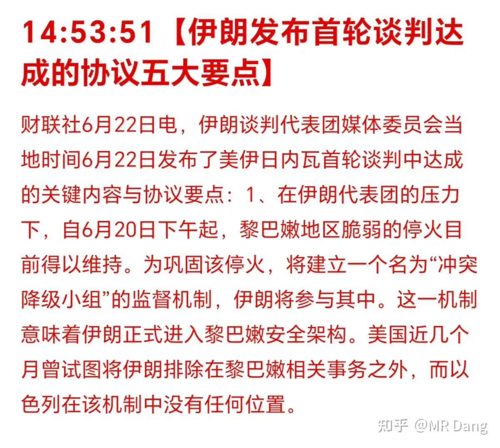
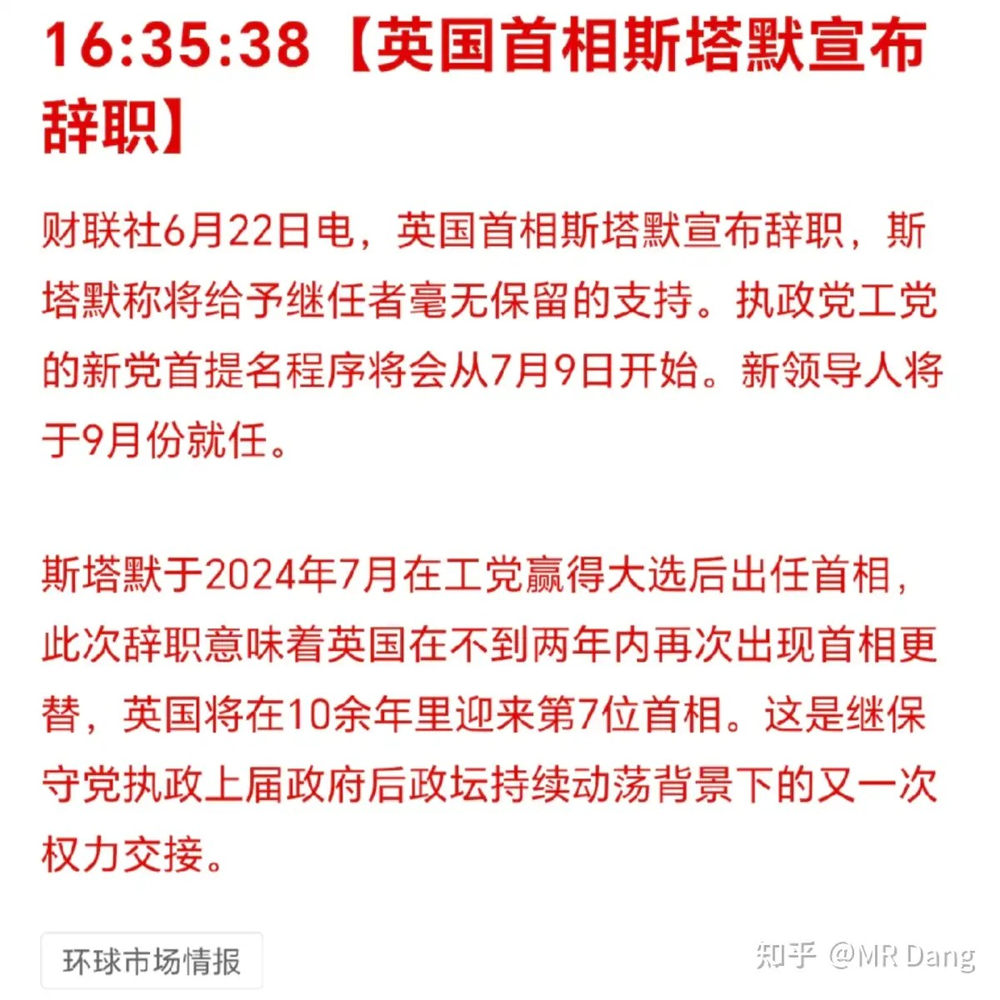
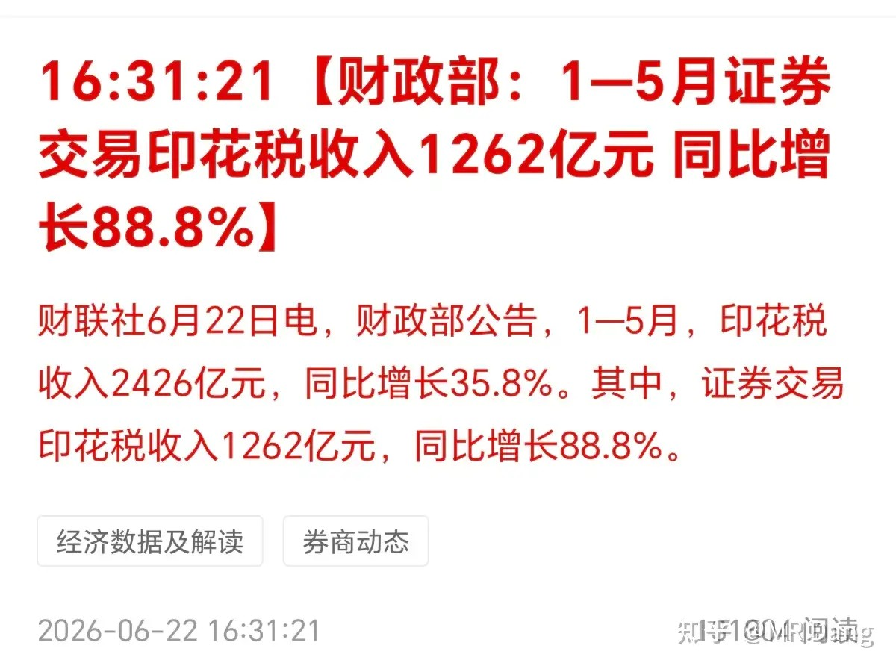
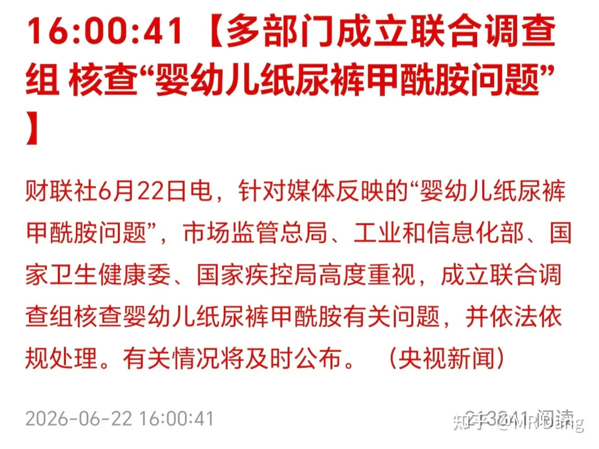
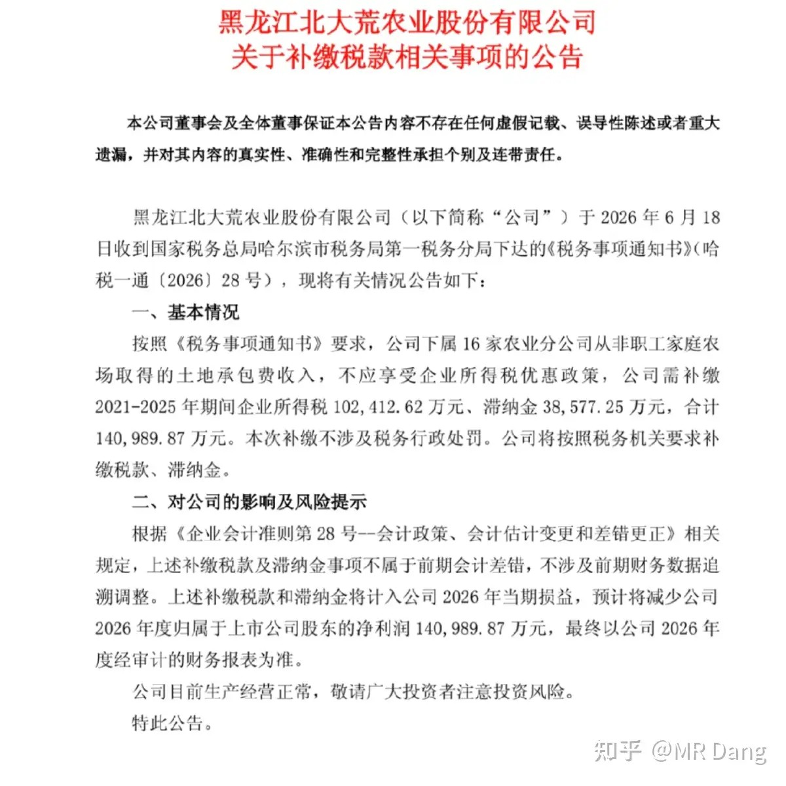
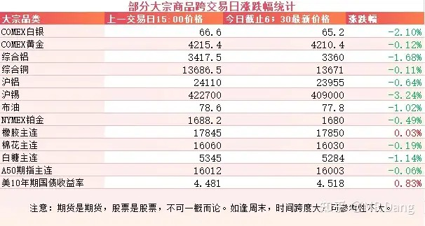
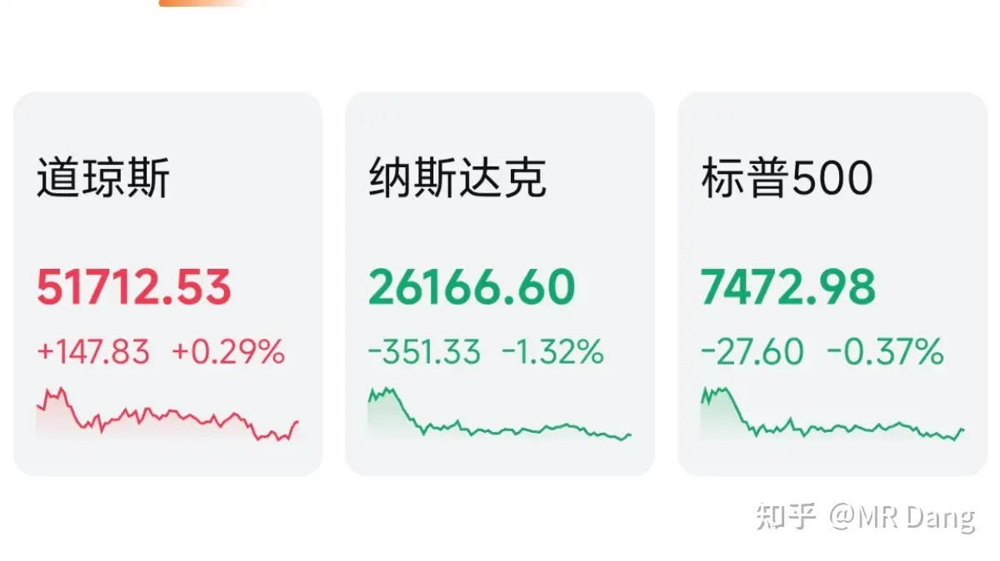
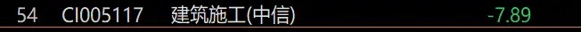
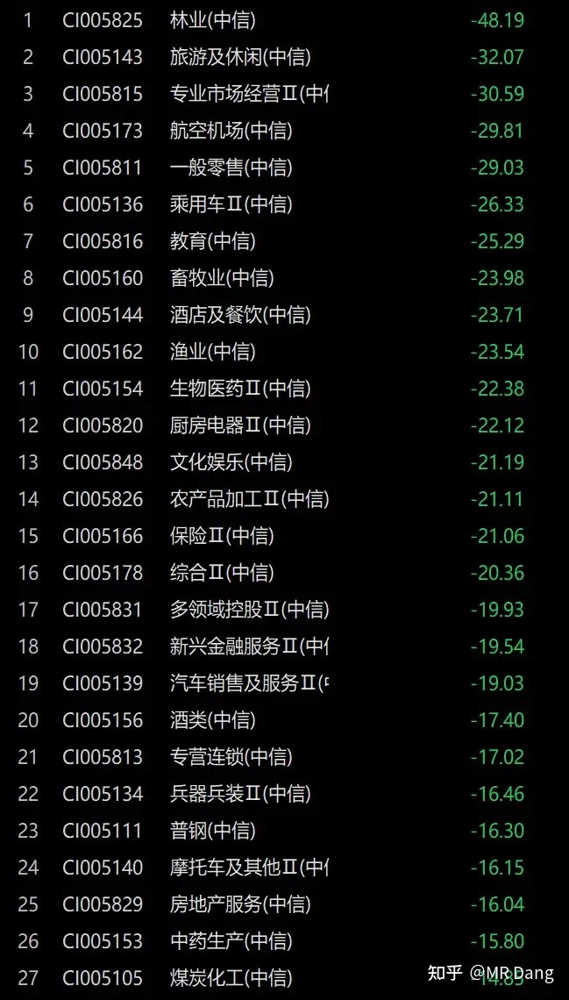

# 如何看待2026年6月23日a股行情？

---

**发布时间**: 2026-06-23 07:25  |  **原文链接**: https://www.zhihu.com/question/2052110306453803321/answer/2052653580121908294  |  **点赞数**: 188 人赞同

**作者信息**: MR Dang | 独立投资人，《价值投资功法》作者，小红圈同名，无其他小号。

---

## 正文内容

昨天的美伊局势又有了进展：

对太具体的条款没仔细看，不过一般谁发布的内容肯定对谁有利，只要没打起来，对资本市场就是好消息。

英国首相辞职：

对A股没啥影响，过。

券商：

证券印花税同比增长88.8%。

挺吉利一数字，四月份单月202亿，五月单月327亿，肉眼可见的环比增长，先射箭后画靶的话，也可以用来解释券商板块咸鱼翻身。

昨天收盘后看到媒体报道券商大涨原因：

买券商就是买科技。

尿布事件：

有知名记者爆出某些品牌纸尿裤甲酰胺含量超标后，事情发生多次反转，记者和厂商都很刚。

目前没有定论，等待联合调查的一锤定音。

从常识上来说，甲酰胺并不是尿布生产中需要主动添加的物质。

这些品牌的代工厂里有一家是A股上市公司，近些年股价可没少跌。

某农业公司发布公告，补税14亿：

这对小股东算是晴天霹雳了，一次补的税比一年净利润都多，直接一年半白干。

这种黑天鹅很难在事前避免，碰到只能算倒霉了。

大宗商品：

美债收益率走高，逼近4.55分水岭。

有色集体回调，农产品相对平稳，原油回调。

外围市场：

美三大股指涨跌不一，纳指领跌，道指上涨。

传统板块表现较好，科技分化，存储表现较好，其他不佳，商业航天也跌的不少，老马的space x绕了一圈又跌回来了。

昨天个人组合净值回血两个多，银行红一个半多一些，资源红五个，消费基本原地不动，电网红五个，自己的持仓里久违的又有几个涨停的东西。

刚好把假期前失去的阵地夺回来。

还是有点出人意料的，开盘前把吃面的碗筷都准备好了，结果端上来一盘饺子。

资本市场总是这样让人难以捉摸，节假日前还是被人唾弃的大金融，收假回来就成了小甜甜。

电网etf是我个人以前最推荐的etf，今年以来涨了大概有50%以上了，比不上科技，但是也不赖。

不过这会儿已经涨的有点多了，所以现在在买其实有点不划算的，风险较大。

在昨天大涨后，目前的行业情况，给大家盘一下。

首先为了方向性更细一些，这次没用申万行业的分类。

因为申万一级分类只有三十多个行业，没那么细，不好找方向。

这次用的是中信二级行业分类，一共107个行业。

截止到现在，今年以来，一共有75个行业下跌，32个行业上涨，大概是73开的一个状况。

行业中位数，也就是第54个行业，目前是年内跌了7.89%。

这是算上科技股的中位数水平，如果只拿老登的话，应该是达不到这个水准的。

如果想在跌的多的粪坑行业里找巧克力豆吃，那在这54个行业里再砍去一半，也就是跌幅前27的行业里筛选一遍，就得到下图：

这27个行业年内跌幅几乎都在15%以上了，跌的最多的林业近乎腰斩。

喜欢抄底的可以琢磨琢磨，不过抄底很难，因为底只有一个。

一个喜欢保护韭菜的博主，希望大家少少踩坑，多多赚钱！！！

> [!comment]- 点击展开评论
>
> | 用户 | 时间 | 内容 |
> | :--- | :--- | :--- |
> | 百忧解 | 19 分钟前 | 我宏桥30.7的成本，一直没操作，因为我相信价值的力量，早晚有一天会涨回来的 |
> | &nbsp;&nbsp;&nbsp;&nbsp;颗粒状 | 17 分钟前 | 吃股息十年回本 |
> | 秋实 | 2 小时前 | 希望老师今天不吃饺子吃大肉 |
> | 簌簌 | 5 小时前 | 万万没想到昨天实现了老登小登普红，加油啊老登！ |
> | &nbsp;&nbsp;&nbsp;&nbsp;不收钱发帖 | 51 分钟前 | 现在知道高兴的太早了吗 |
> | 卡夫卡卡 | 6 小时前 | 两边打卡 |
> | XXxX | 4 小时前 | 死于兵器兵装。。。 |

---

*本文件从MR Dang知乎页面转载*

---

**作者**: MR Dang
**链接**: https://www.zhihu.com/question/2052110306453803321/answer/2052653580121908294
**来源**: 知乎

*著作权归作者所有。商业转载请联系作者获得授权，非商业转载请注明出处。*
